The following tutorial will showcase how you could build an issue tracker
application with [Windmill](https://docs.windmill.dev) and
[Supabase](https://supabase.com/), without ever having to leave your browser.

<!--truncate-->

While running projects, you’ll quickly get lost if you don't keep an eye on the
pain points, so tracking and categorising issues is critical in any field. Let's
start creating your custom application with setting up a database.


## Supabase setup

Supabase is an [open-source](https://github.com/supabase/supabase) Backend as a
Service with a generous free tier, which means you don't need to setup payment
when you are just starting out.

It’s always a good idea to start with the database and come up with the shape of
the data you are going to use. So after creating an account and logging in to
Supabase, go ahead and create a project by clicking “New project” on the
Projects page. Name it `issue-tracker`, enter a password (we recommend using the
“Generate” button) and select the region closest to your users. You can leave
the pricing plan at free and click “Create new project”.

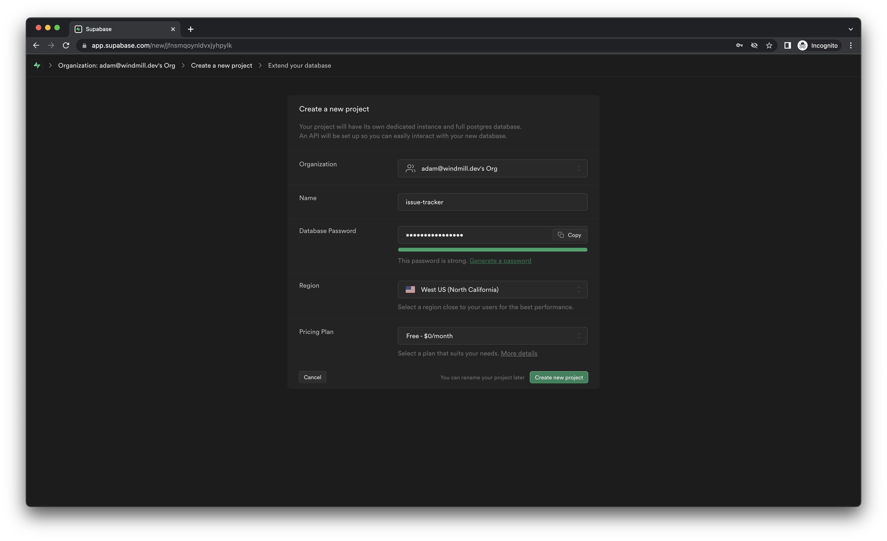

After your project is provisioned (it usually takes just a few minutes),
navigate to the SQL Editor page, click “New query” in to top-left corner and
paste in the following SQL query, which will create both `users` and `issues`
table:

```sql
-- Create tables
DROP TABLE IF EXISTS issues;
DROP TABLE IF EXISTS users;

CREATE TABLE users(
	id UUID NOT NULL DEFAULT uuid_generate_v4(),
	name TEXT DEFAULT NULL,
	roles TEXT[] DEFAULT NULL,
	PRIMARY KEY(id)
);
ALTER TABLE users ENABLE ROW LEVEL SECURITY;

CREATE TABLE issues(
	id UUID NOT NULL DEFAULT uuid_generate_v4(),
	created_at TIMESTAMPTZ DEFAULT (now() AT TIME ZONE 'utc'),
	created_by UUID NOT NULL,
	summary TEXT DEFAULT NULL,
	description TEXT DEFAULT NULL,
	severity TEXT DEFAULT NULL,
	status TEXT DEFAULT 'PENDING',
	assigned_to UUID DEFAULT NULL,
	PRIMARY KEY(id),
	CONSTRAINT fk_created_by
		FOREIGN KEY(created_by)
		REFERENCES users(id),
	CONSTRAINT fk_assigned_to
		FOREIGN KEY(assigned_to)
		REFERENCES users(id)
);
ALTER TABLE issues ENABLE ROW LEVEL SECURITY;
```

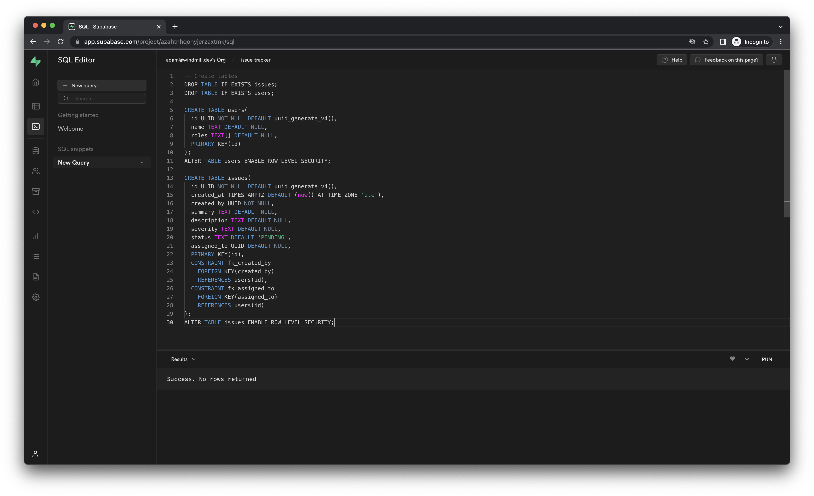

Now that the tables are ready to receive data, let's populate them by running
two more SQL queries. Click "New query" again in the top-left corner and paste
in the following code, which will add 8 people to the `users` table.

```sql
-- Insert users
INSERT INTO users(name, roles)
VALUES 
  ('Theresa Hurley', '{MANAGER}'),
  ('Taliyah Gardner', '{MANAGER}'),
  ('Ezekiel Ortega', '{MANAGER}'),
  ('Gia Keller', '{MANAGER}'),
  ('Jefferson Pratt', '{DEVELOPER}'),
  ('Carlo Flores', '{DEVELOPER}'),
  ('Arielle Shepherd', '{DEVELOPER}'),
  ('Caitlin Lucas', '{DEVELOPER}');
```

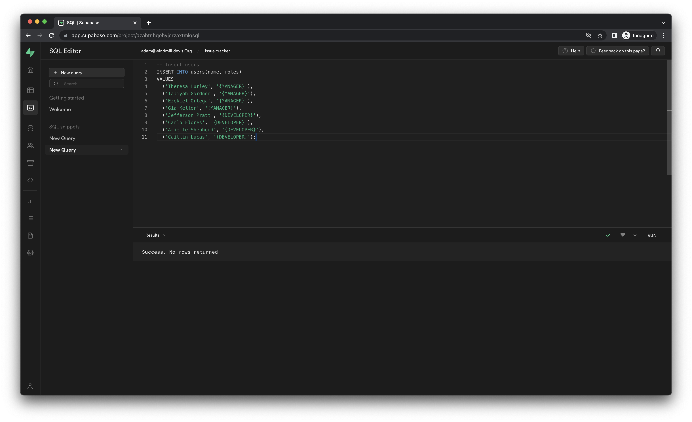

After populating the `users` table, click "New query" once more and run the next
one, which will insert 4 mock issues to the `issues` table.

:::caution

It is important to add the users first, because the following query will make
use of the data in that table.

:::

```sql
-- Insert issues
INSERT INTO issues(created_by, summary, description, severity, assigned_to)
VALUES 
  (
    (SELECT id FROM users ORDER BY RANDOM() LIMIT 1),
    'Update call-to-action button color',
    'The color should be light blue',
    'LOW',
    (SELECT id FROM users WHERE EXISTS (
      SELECT FROM unnest(roles) role WHERE role LIKE 'DEVELOPER'
    ) ORDER BY RANDOM() LIMIT 1)
  ),
  (
    (SELECT id FROM users ORDER BY RANDOM() LIMIT 1),
    'Check for SQL injections',
    'Make sure that SQL can not be injected with calls to the backend',
    'HIGH',
    (SELECT id FROM users WHERE EXISTS (
      SELECT FROM unnest(roles) role WHERE role LIKE 'DEVELOPER'
    ) ORDER BY RANDOM() LIMIT 1)
  ),
  (
    (SELECT id FROM users ORDER BY RANDOM() LIMIT 1),
    'Create search component',
    'A new component should be created to allow searching in the application',
    'MEDIUM',
    (SELECT id FROM users WHERE EXISTS (
      SELECT FROM unnest(roles) role WHERE role LIKE 'DEVELOPER'
    ) ORDER BY RANDOM() LIMIT 1)
  ),
  (
    (SELECT id FROM users ORDER BY RANDOM() LIMIT 1),
    'Fix CORS error',
    'A Cross Origin Resource Sharing error occurs when trying to load the "kitty.png" image',
    'HIGH',
    (SELECT id FROM users WHERE EXISTS (
      SELECT FROM unnest(roles) role WHERE role LIKE 'DEVELOPER'
    ) ORDER BY RANDOM() LIMIT 1)
  );
```

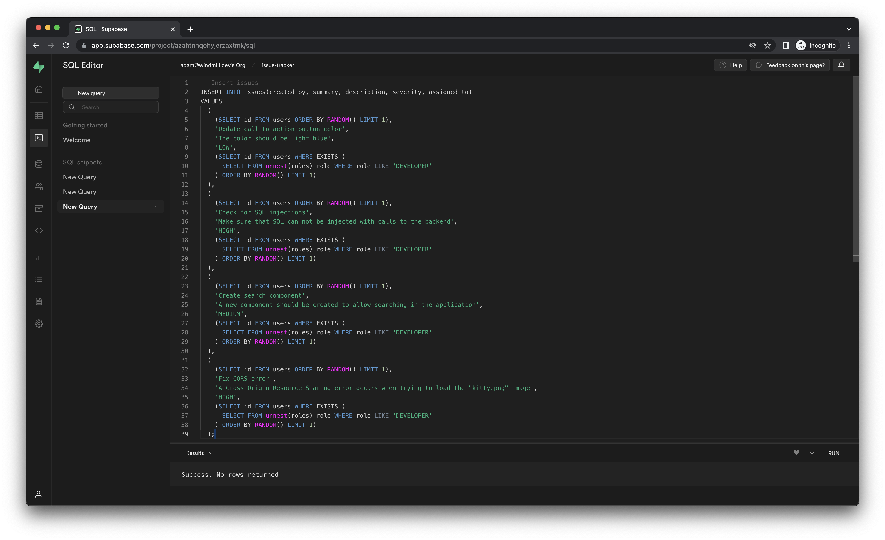

## Windmill setup

You can create resources that will allow you to reuse secrets like passwords and
tokens without exposing them. To create your Supabase resource, check out the
[How to Integrate Supabase with Windmill](/blog/setup-supabase-on-windmill)
tutorial - it takes only 2 minutes.

After you added your resource, navigate to the [Home](https://app.windmill.dev/)
page and create a new App in the top-right corner. You can enter an optional App
summary on the left side of the header, let’s use `Issue Tracker`. Click "Save"
on the other end of the top row, name your app `issue-tracker` and click "Create
app".

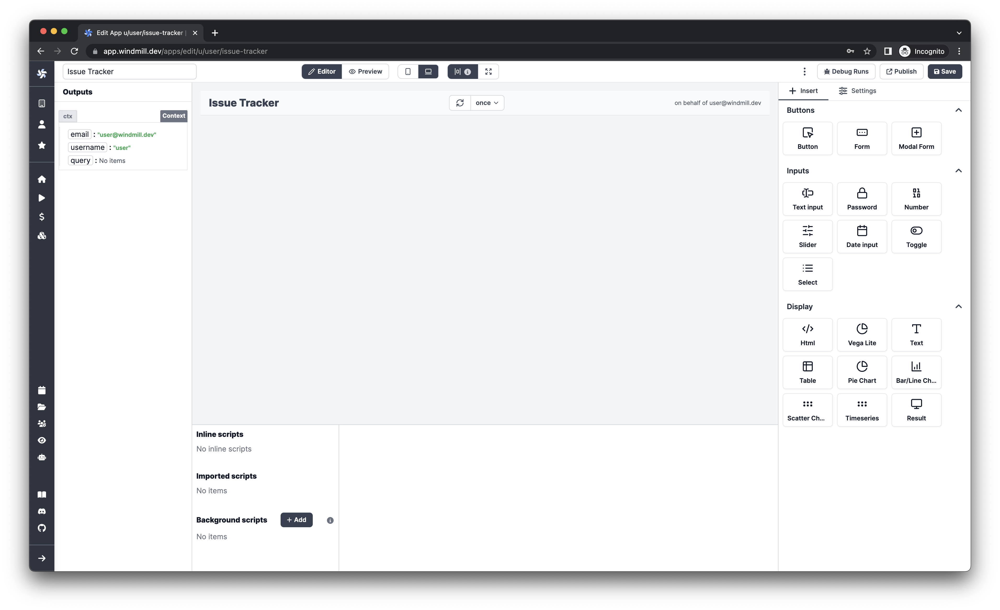

## Create the app

### Add a title

Insert a `Text` component and configure it as the followings:

1. Enter `Issues` as the input.
2. Select `Title` as the style.
3. Make the component take up the full width of the editor.

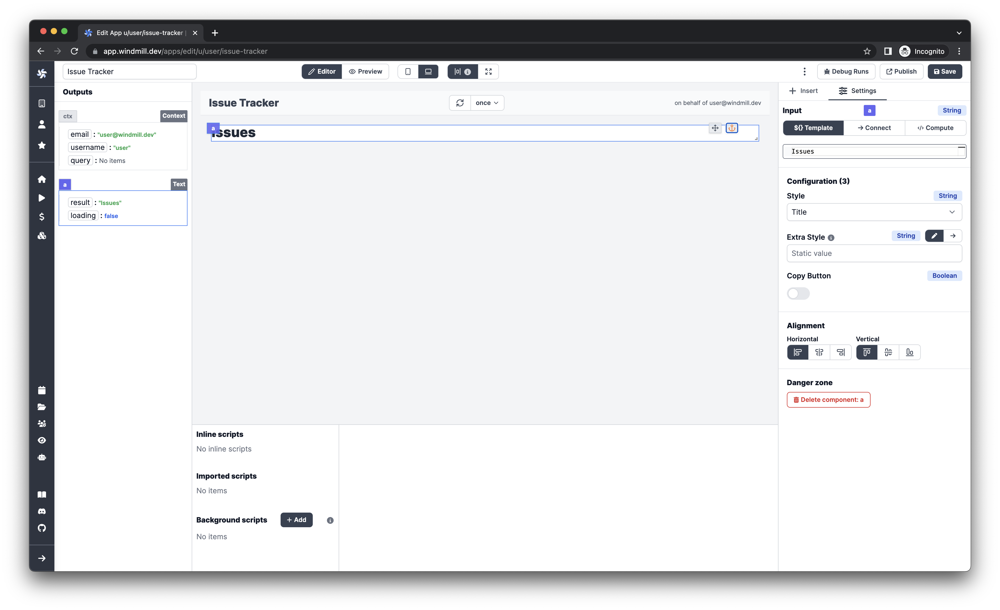

### Grab the data

We will use the array of issues in more than one component, so it would be a
good idea to query the data once and pass it to the individual components later.
This can be achieved by Background scripts.

1. Click `Add` next to the `Background scripts` label on the bottom left side.
2. Make sure the new script is selected and choose `Deno` as the language.
3. Name the script `Load Issues`.
4. Paste in the following code:

   ```tsx
   import { Resource } from "https://deno.land/x/windmill@v1.60.0/mod.ts";
   import { createClient } from "https://esm.sh/@supabase/supabase-js@2";

   export async function main(auth: Resource<"supabase">) {
     const client = createClient(auth.supabaseUrl, auth.supabaseKey);
     const result = await client.from("issues").select();
     return result.data;
   }
   ```

5. On the right `Settings` pane, you can configure what arguments the script
   will receive. Select the Supabase resource you added in the `Windmill setup`
   step for the `auth` input.

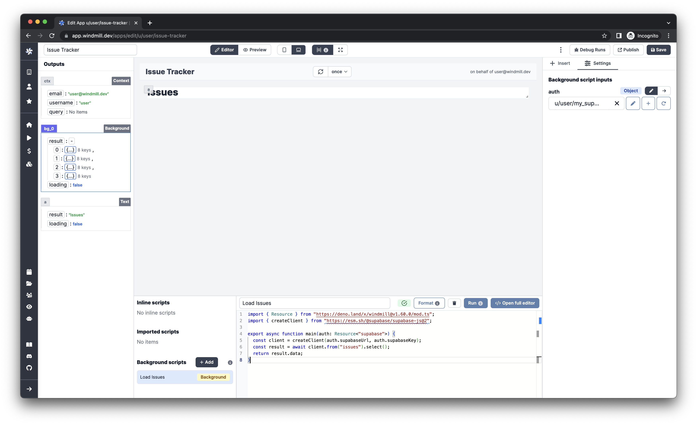

Create one more background script the same way as last time, but for the users
now - name it `Load Users`. The code should be the same, except that the client
should query from the `‘users’` table instead of `‘issues’`. Change this on line
6 of the script.

:::caution

Don’t forget to repeat the last step as well on the second background script to
make it work.

:::

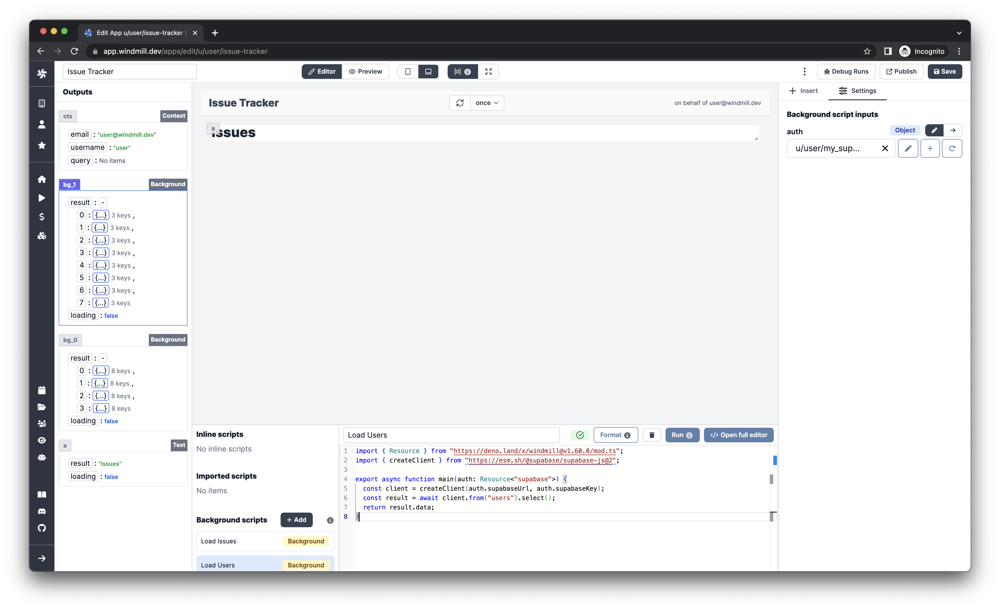

### Display the issues

Now we have the data ready and loaded, so let's insert a `Table` and configure
it:

1. Select `Compute` as the input type and click `Create an inline script`.
   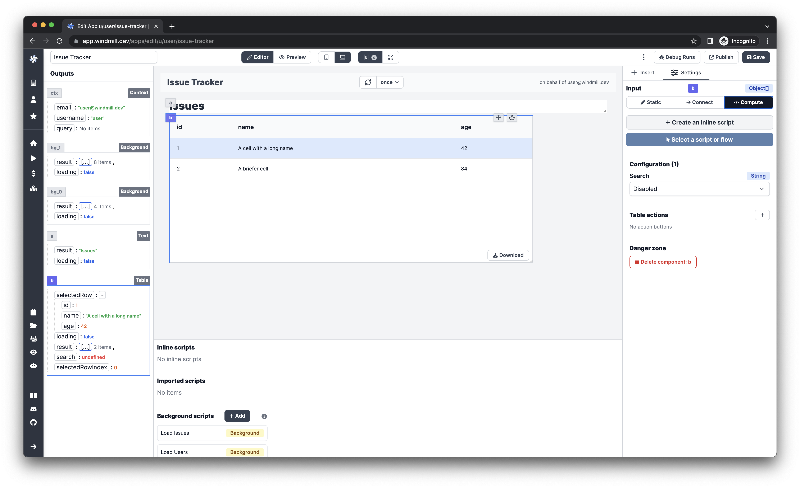
2. Choose `Deno` as language.
3. Name it `Shape Data`
4. Paste in the following code:

   ```tsx
   export async function main(issues: any[]) {
     return issues?.map((issue) => {
       return {
         id: issue.id,
         status: issue.status,
         severity: issue.severity,
         created_at: issue.created_at,
         summary: issue.summary,
         description: issue.description,
       };
     });
   }
   ```
   :::info

   The script is needed so the table will display only the relevant properties
   of the issues.

   :::

   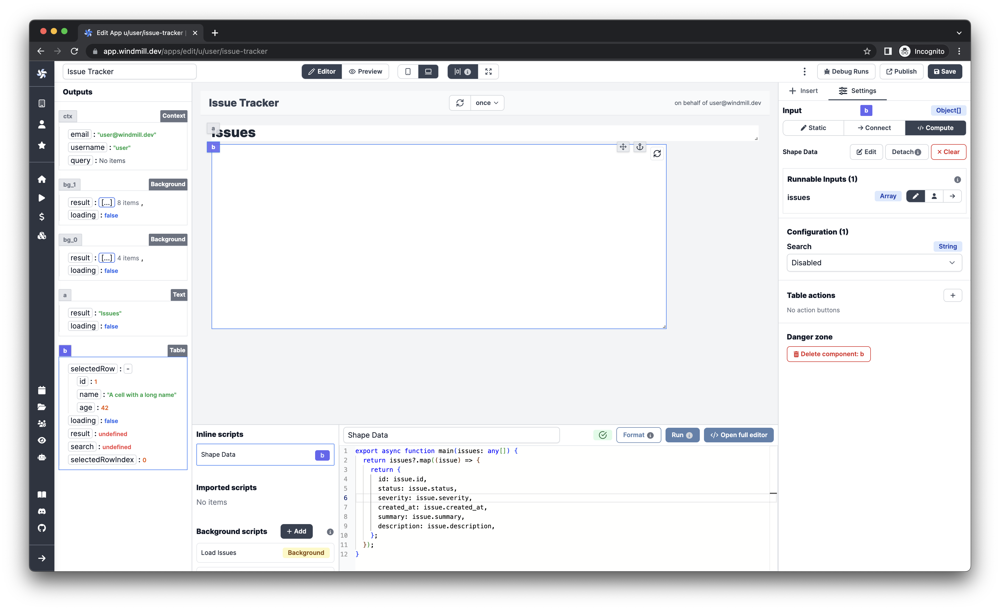

5. On the right pane under the `Settings` tab, select `Connect` as input type of
   the `issues` input. Now you can select the `result` field of the
   `Load Issues` background script you just created. To do this, locate the
   `Background` element on the left pane that has _4 items_ in the result
   property and click on `result`.
   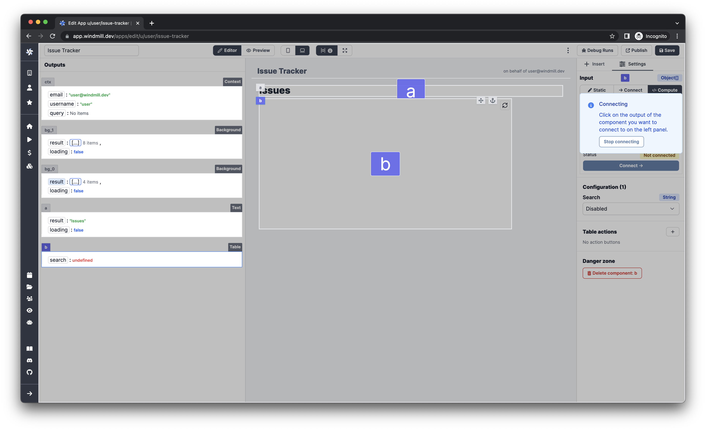

   :::info

   At this point the issues should be displayed in the table.

6. Finally, to enable searching in the data, select the table component, scroll
   down to `Configuration` in the `Settings` tab of the right pane and select
   `By Component` for the `Search` input.
   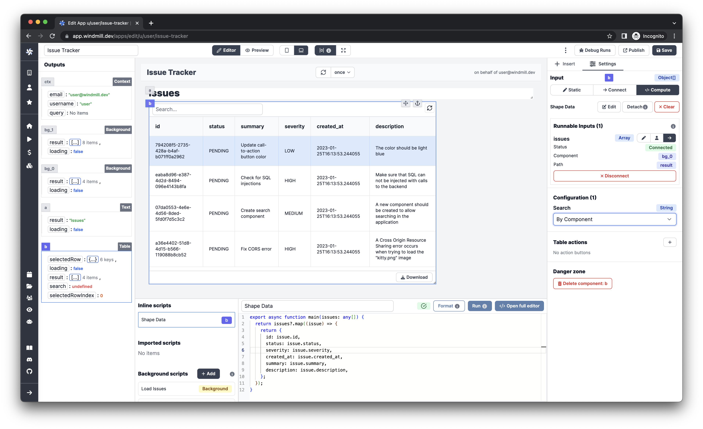

:::tip

Windmill auto saves your progress but if you are sceptical about it, now would
be a good time to click "Save" in the top right corner.

:::

### Add charts

It’s always nice to be able to quickly get a general overview of statistics, and
charts are really good at conveying data at a glance. Let’s display the number
of issues in each status and severity level on pie charts.

Before adding more components, try locking the existing ones in place by
hovering them in the editor and clicking the anchor in the top right corner.
This will prevent them from changing position while you drag around the charts.

:::tip

To prevent layout shifting, it's a good practice to lock every component in
place with the anchor button when you are done with positioning it - although
you'll still be able to move them manually.

:::

**Add a chart for the status**

1. Insert a `Pie Chart`.
2. Select `Compute` as the input type in the right pane.
   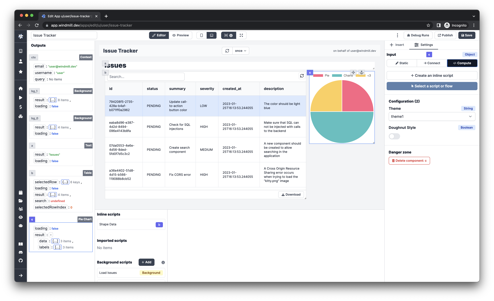
3. Click `Create an inline script`.
4. Choose `Deno` as the language.
5. Name the script `Get Status Chart Data`.
6. Paste in the following code:

   ```tsx
   export async function main(issues: any[]) {
     if (!issues) {
       return {
         labels: [],
         data: [],
       };
     }
     const values: Record<string, number> = {};
     issues.forEach(({ status }) => {
       if (!values[status]) {
         values[status] = 0;
       }
       values[status]++;
     });
     return {
       labels: Object.keys(values),
       data: Object.values(values),
     };
   }
   ```

   :::info

   As you can see, the pie chart takes the data in a specific shape. The input
   should be an object with 2 properties: `labels` and `data`, both of which
   hold arrays as values. The _label_ at position `[0]` corresponds to the
   _data_ at position `[0]`. In short, the TypeScript type of the return value
   should be the following:

   `{ labels: string[], data: number[] }`

7. Configure the `issues` input of the script on the right pane to be `Connect`
   type and then select the `result` value of the `background` script that is
   responsible for the querying of the issues.
   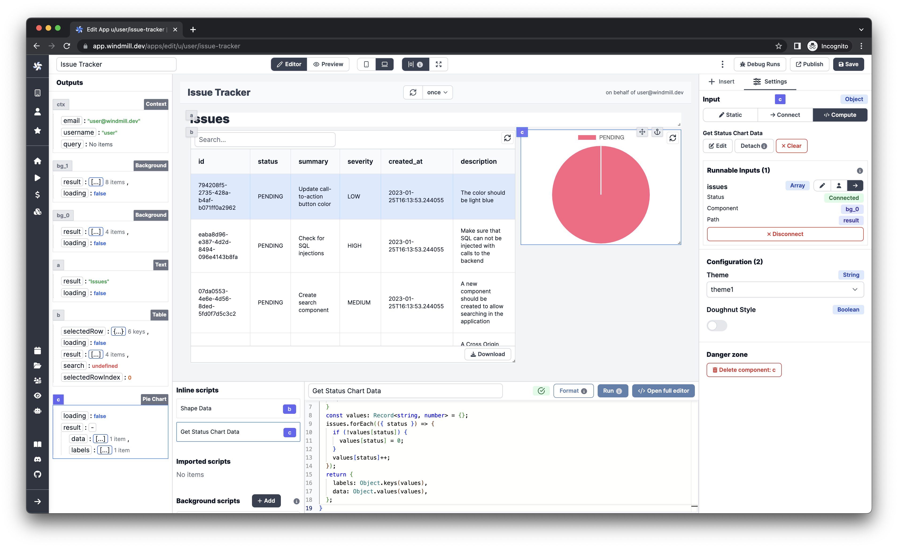

**Add a chart for the severity levels**

This one is going to be similar to the other chart, in fact the only difference
will be that the targeted field of the individual issues is going to be
`severity` instead of `status`. You can go ahead and repeat the first 4 steps of
the Status chart, then optionally name it `Get Severity Chart Data` and paste in
the following code:

```tsx
export async function main(issues: any[]) {
  if (!issues) {
    return {
      labels: [],
      data: [],
    };
  }
  const values: Record<string, number> = {};
  issues.forEach(({ severity }) => {
    if (!values[severity]) {
      values[severity] = 0;
    }
    values[severity]++;
  });
  return {
    labels: Object.keys(values),
    data: Object.values(values),
  };
}
```

Finally, connect the result value of the background script to the `issues`
argument of the script, just like in the last step of the other chart.

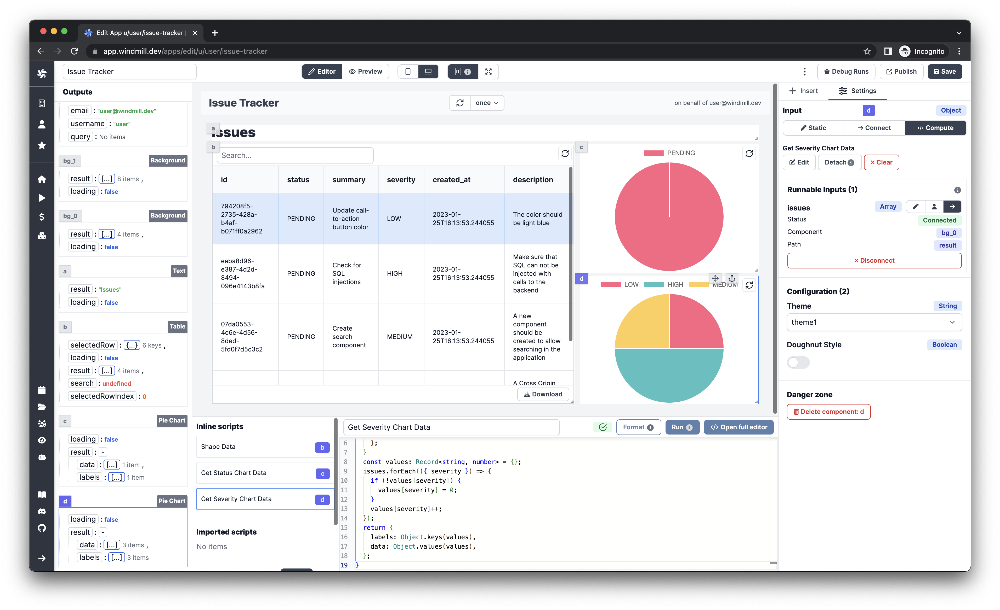

### Creating issues

There are multiple ways to add a form to a Windmill App but for now we’ll take
the route to create it manually with individual text and input components.
First, add a title for the form by inserting a `Text` component, set the input
value to `Create New Issue` and the style to `Subtitle`.

We are going to handle 6 properties of an issue: `summary`, `description`,
`created_by`, `status`, `severity` and `assigned_to`, so for each one we’ll have
an input field and a `Text` component. The `summary` and `description` fields
are going to use simple `Text input` components, the other four are going to be
handled by `Select` components.

#### Summary and Description fields

1. Insert a `Text` component and set the style attribute to `Label` and align it
   vertically on the bottom.
2. Insert a `Text input` component under the label text.

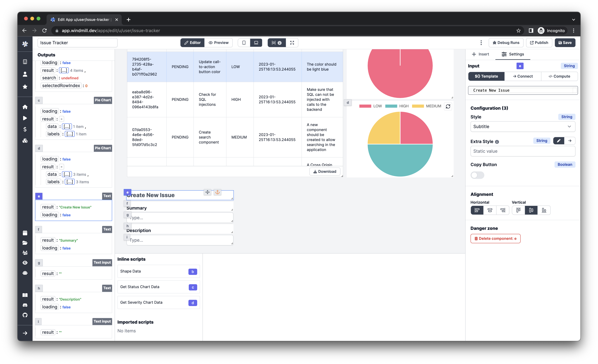

#### Created By and Assigned To fields

Since the `Select` components require input data to be in a certain shape, let's
create a `Background` script first to convert the `users` list. Add a new
`Background` script, select `Deno` as language and paste in the following code:

```tsx
export async function main(users: undefined | any[]) {
  if (!Array.isArray(users)) return [];
  return users.map(({ id, name }) => ({ value: id, label: name }));
}
```

Finally, connect the `users` argument to the result of the `Load Users`
background script. In essence, this will chain the two background scripts to
transgorm the data into the desired shape.

:::info

This script will return the users in the required shape by the `Select`
components. The TypeScript type looks like this:

`{ label: string, value: any }`

:::

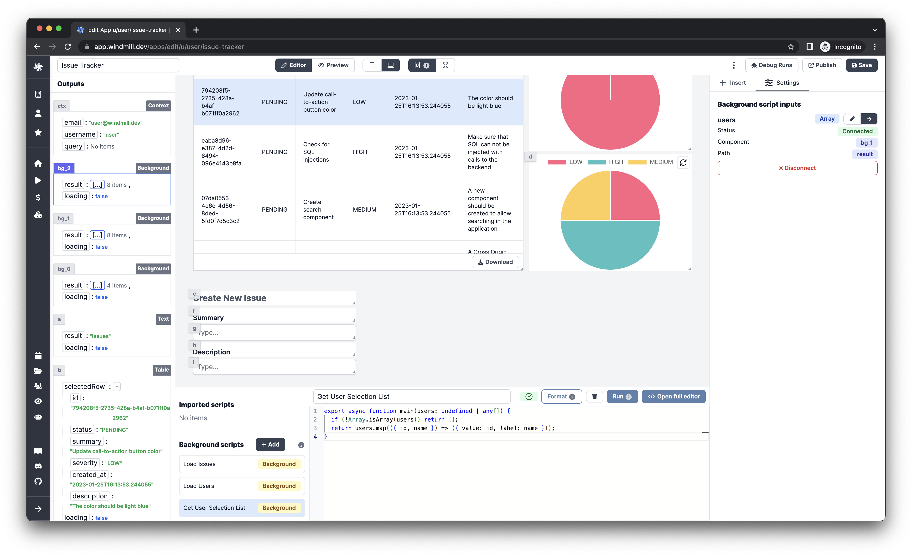

Now insert the components that will use the newly created `users` list.

1. Insert a `Text` component, set the style attribute to `Label` and align it
   vertically on the bottom.
2. Insert a `Select` component under the label text.
3. Connect the `items` configuration inputs to the result of the recently added
   `Get User Selection List` background script.

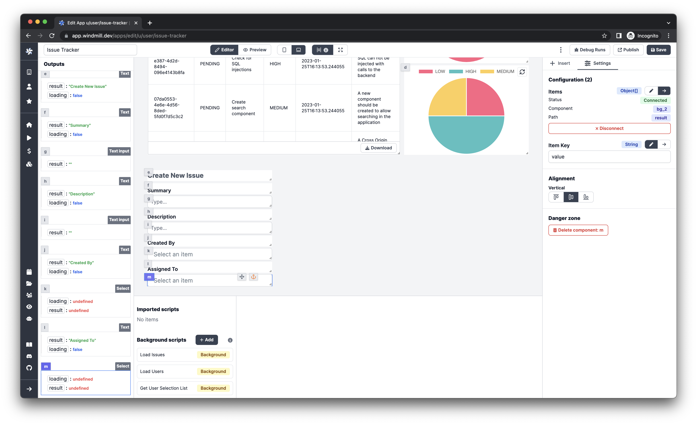

:::caution

Make sure that you selected the correct background script before proceeding to
the next steps.

:::

#### Status field

1. Insert a `Text` component and set the style attribute to `Label` and align it
   vertically on the bottom.
2. Insert a `Select` component under the label text.
3. Leave the `Items` argument on `Static` mode and have these 3 as inputs:

   ```tsx
   { "label": "PENDING" }
   ```

   ```tsx
   { "label": "WORKED ON" }
   ```

   ```tsx
   { "label": "FINISHED" }
   ```

4. Set the `Item Key` argument to `label`

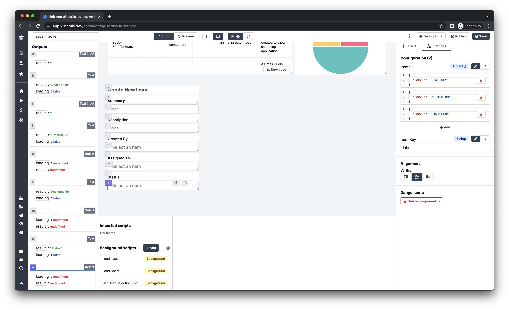

#### Severity field

1. Insert a `Text` component and set the style attribute to `Label` and align it
   vertically on the bottom.
2. Insert a `Select` component under the label text.
3. Leave the `Items` argument on `Static` mode and have these 3 as inputs:

   ```tsx
   { "label": "LOW" }
   ```

   ```tsx
   { "label": "MEDIUM" }
   ```

   ```tsx
   { "label": "HIGH" }
   ```

4. Set the `Item Key` argument to `label`

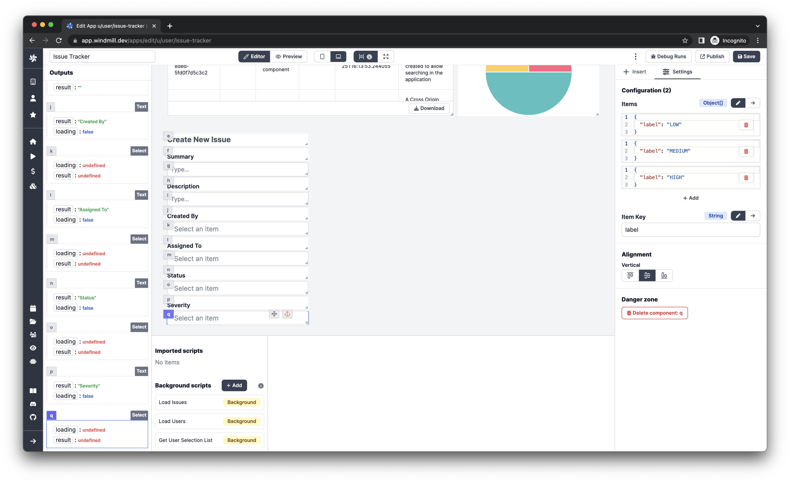

#### Submit button

Now that all the input fields are added and wired up, now the only thing left is
to insert a `Button` component, which collects all the values entered by the
user and sends them to the database.

1. Insert a `Button` component.
2. Set the `Label` to `Create Issue`.
3. Set the `Size` to `md`
4. Find the ID of the `Load Issues` background script and check `Recompute` on
   it in the `Recompute others` section.

   :::info

   This will result in reloading the issues every time a new one is added and
   therefore it will be added to the table as well.
5. Click `Create an inline script`, select `Deno` as language, name it
   `Create Issue` and paste in the following code:

   ```tsx
   import { Resource } from "https://deno.land/x/windmill@v1.60.0/mod.ts";
   import { createClient } from "https://esm.sh/@supabase/supabase-js@2";

   export async function main(
     auth: Resource<"supabase">,
     summary: string,
     description: string,
     created_by: string,
     assigned_to: string,
     status: string,
     severity: string,
   ) {
     const client = createClient(auth.supabaseUrl, auth.supabaseKey);
     return await client.from("issues").insert({
       summary,
       description,
       status,
       severity,
       created_by,
       assigned_to,
     });
   }
   ```

6. Select your Supabase resource for the `auth` argument of the script in the
   `Settings` pane on the right.
7. Connect all the other arguments with the `result` value of their
   corresponding inputs.

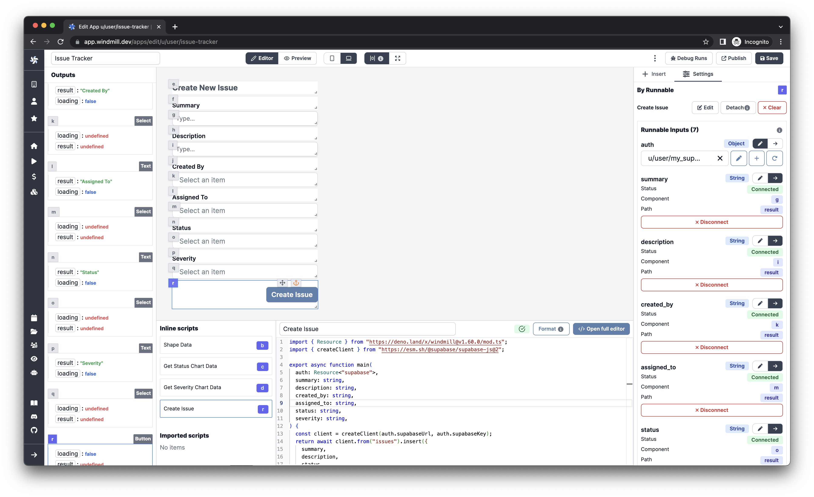

### Deleting issues

Table components can have actions which will be added to the end of each row in
the form of buttons. Select the `Table` component and follow the steps:

1. Under the "Settings" tab in the right pane, add an action from the
   `Table actions` section.
2. Click the newly added action.
3. Set the `Label` argument to `Delete`.
4. Set the `Color` argument to `red`.
5. Find the ID of the `Load Issues` background script and check `Recompute` on
   it in the `Recompute others` section.

   :::info

   Because of this, the `issues` data will be reloaded from the database every
   time an issue is deleted.
6. Click `Create an inline script`, select `Deno` as language, name it
   `Delete Issue` and paste in the following code:

   ```tsx
   import { Resource } from "https://deno.land/x/windmill@v1.60.0/mod.ts";
   import { createClient } from "https://esm.sh/@supabase/supabase-js@2";

   export async function main(auth: Resource<"supabase">, id: string) {
     const client = createClient(auth.supabaseUrl, auth.supabaseKey);
     return await client.from("issues").delete().filter("id", "eq", id);
   }
   ```

7. Select your Supabase resource for the `auth` argument of the script in the
   `Settings` pane on the right.
8. Select the `Column` input type for the `id` argument and enter `id` as the
   value.

   :::info

   This will result in the `id` argument being filled by the value of the `id`
   column from the row that the action button was clicked in.

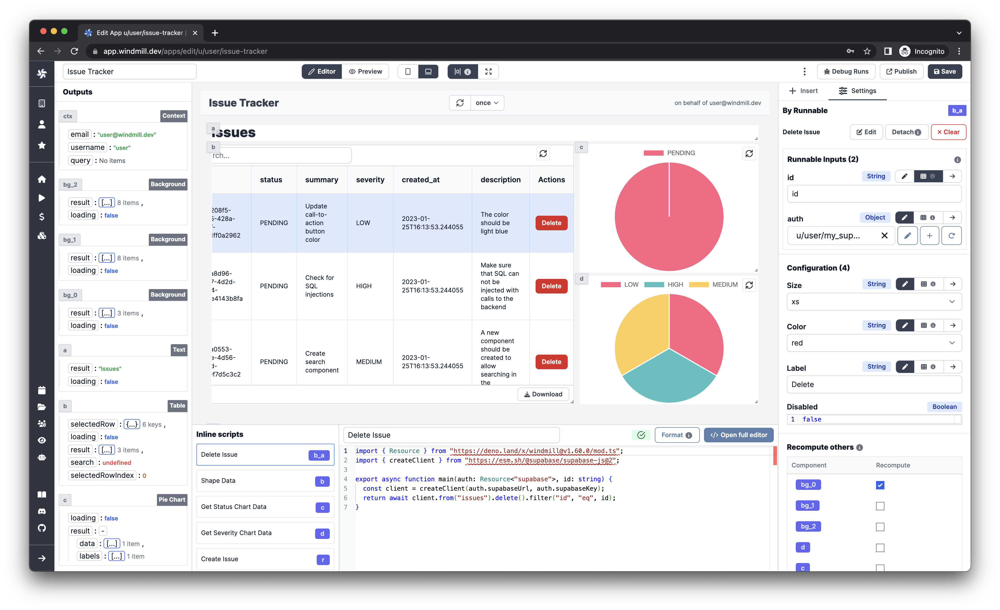

## Next steps

In a following article, which will be released in the coming days, we'll add
functionality to update issues, add more charts and configure the app to fit
mobile screens as well.
