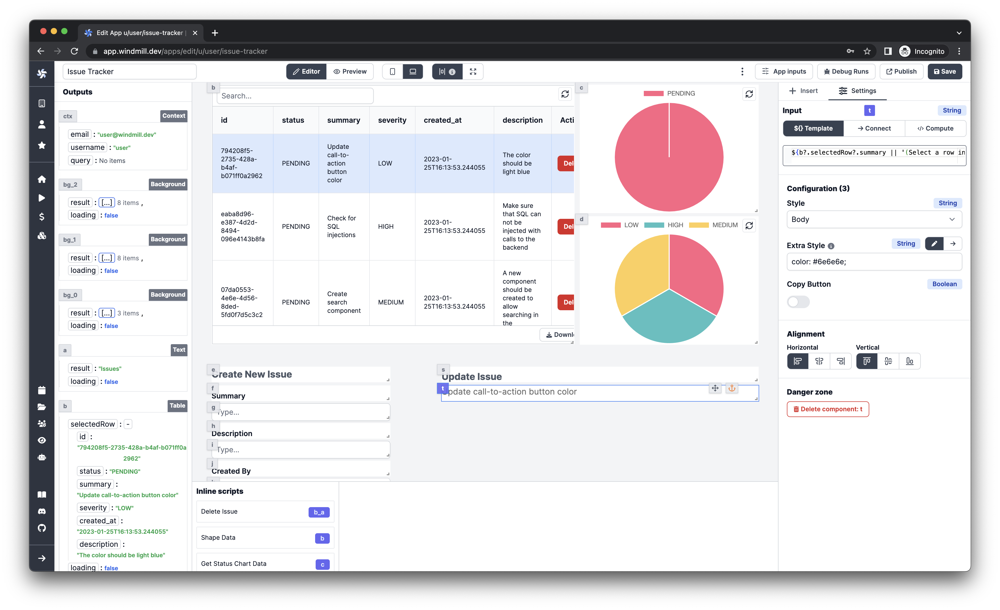
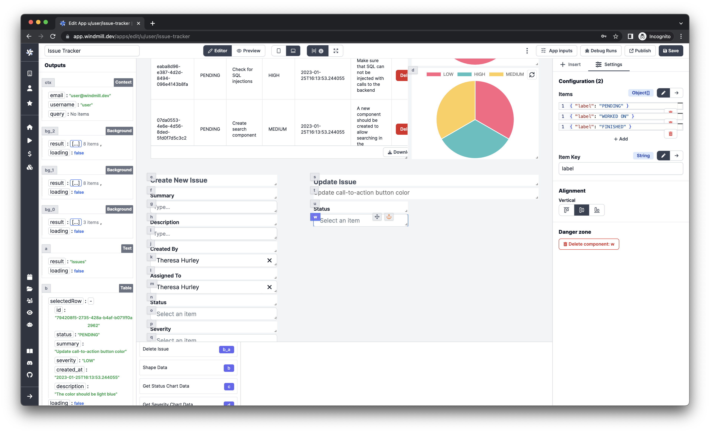
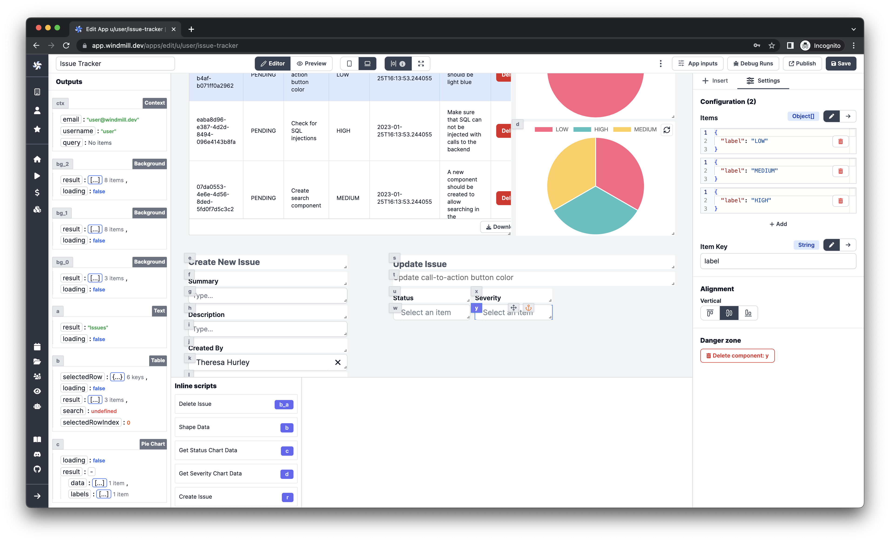
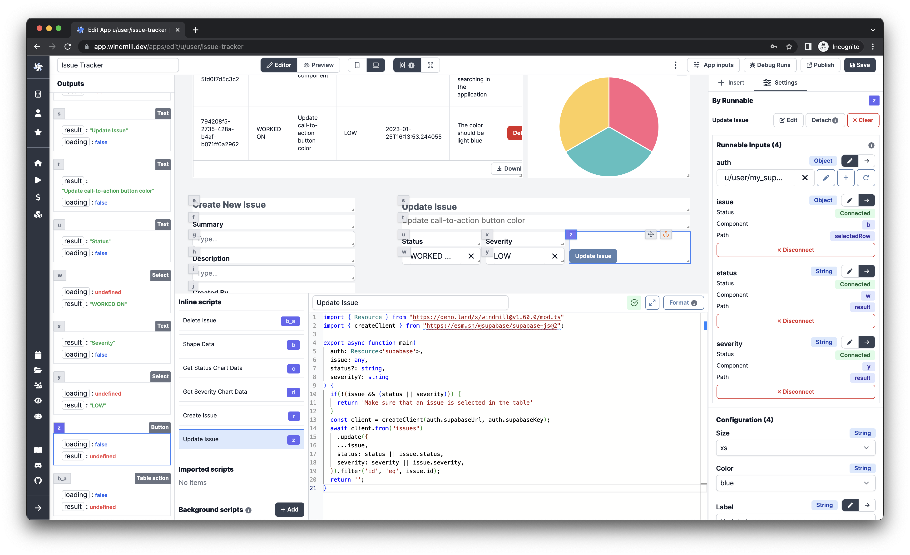
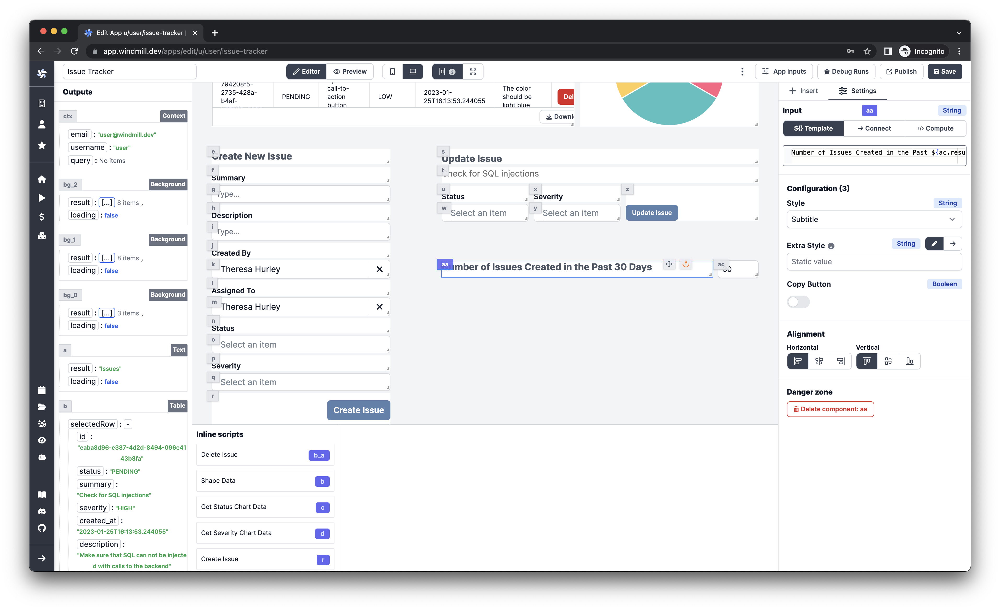
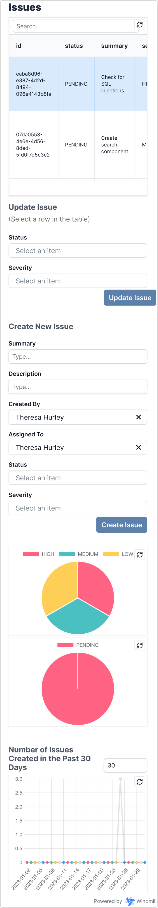

This article aims to further customize you existing Issue Tracker application
described in
["Create an Issue Tracker App with Supabase in 15 Minutes"](../2023-01-25-issue-tracker/index.md).

<!--truncate-->

:::info

This article is part of a series. If you haven't read the first part, you can
find it [here](../2023-01-25-issue-tracker/index.md).

:::


:::tip

Windmill has a community website called [Windmill Hub](https://hub.windmill.dev)
where - among other Scripts and Flows - you can find the
[full version of this App](https://hub.windmill.dev/apps/7/issue-tracker).

:::

## Where we left off

In the previous article, we created a basic Issue Tracker application with
Supabase. We uploaded a few issues, displayed them in a table and created
scripts to add new ones and delete them. There is only one part missing of the
[CRUD](https://developer.mozilla.org/en-US/docs/Glossary/CRUD) functionality -
updating the issues.

## Updating issues

For now, we are going to enable users to update only the `status` and the
`severity` properties of an issue but feel free to customize it your needs.
Let's start with adding titles for the update form:

1. Insert a `Text` component.
1. Enter `Update Issue` as the input.
1. Select `Subtitle` as the style.
1. Align it vertically on the bottom.
1. Insert below a second `Text` component.
1. Enter `${b?.selectedRow?.summary || '(Select a row in the table)'}` as the
   input.

   :::tip

   The `b` variable is a reference to the `Table` component. If you have a
   different ID for it, you need to change it accordingly.

   :::

1. Enter `color: #6e6e6e;` in the Extra Style argument.



Next, we need to add a `Select` component for the `status` property:

1. Insert a `Text` component.
1. Enter `Status` as the input.
1. Select `Label` as the style.
1. Align it vertically on the bottom.
1. Insert below a `Select` component.
1. Enter these 3 items in the Configuration:

   ```tsx
   { "label": "PENDING" }
   ```

   ```tsx
   { "label": "WORKED ON" }
   ```

   ```tsx
   { "label": "FINISHED" }
   ```

1. Set the Item Key argument to `label`.



Repeat the previous steps for the `severity` property as well but with the
following items:

```tsx
{ "label": "LOW" }
```

```tsx
{ "label": "MEDIUM" }
```

```tsx
{ "label": "HIGH" }
```



Finally, we need to add a `Button` component to submit the form:

1. Insert a `Button` component.
1. Enter `Update Issue` as the Label.
1. Align it to the bottom-left corner.
1. Find the ID of the `Load Issues` background runnable and check `Recompute` on
   it in the `Recompute others` section.
1. Click `Create an inline script`, select `Deno` as language, name it
   `Update Issue` and paste in the following code:

   ```ts
   import { createClient } from 'https://esm.sh/@supabase/supabase-js@2';

   type Supabase = {
   	supabaseUrl: string;
   	supabaseKey: string;
   };

   export async function main(auth: Supabase, issue: any, status?: string, severity?: string) {
   	if (!(issue && (status || severity))) {
   		return 'Make sure that an issue is selected in the table';
   	}
   	const client = createClient(auth.supabaseUrl, auth.supabaseKey);
   	await client
   		.from('issues')
   		.update({
   			...issue,
   			status: status || issue.status,
   			severity: severity || issue.severity
   		})
   		.filter('id', 'eq', issue.id);
   	return '';
   }
   ```

1. Select your Supabase resource for the `auth` argument of the script in the
   `Settings` pane on the right.
1. Select the `selectedRow` property of the `Table` component for the `issue`
   argument.
1. Select the `result` property of the corresponding `Select` component for the
   `status` and `severity` argument.



## More charts

Now that we have a fully functional issue tracker, let's add one more chart,
namely a line chart to display the number of issues in the past days. Let's
start with adding a `Number` input to control how many days we want to display:

1. Insert a `Number` component.
1. Enter `Days` as the Placeholder.
1. Enter `30` as the Default Value.

Next, create a title for the chart and use the value of the recently added
number input:

1. Insert a `Text` component.
1. Enter `Number of Issues Created in the Past ${ac.result || 30} Days` as the
   input.

   :::tip

   The `ac` variable is a reference to the previously added `Number` component.
   If you have a different ID for it, you need to change it accordingly.

   :::

1. Select `Subtitle` as the style.
1. Align it vertically on the bottom.



Lastly, add the actual chart component to display the data:

1. Insert a `Bar/Line Chart` component.
1. Toggle the Line attribute.
1. Click `Create an inline script`, select `Deno` as language, name it
   `Last Issues Chart Data` and paste in the following code:

   ```ts
   export async function main(issues: { created_at: string }[], days: number = 30) {
   	if (!issues?.length) {
   		return { data: [], labels: [] };
   	}
   	const dates = [...Array(days)]
   		.map((_, i) => {
   			const d = new Date();
   			d.setDate(d.getDate() - i);
   			return d.toISOString().split('T')[0];
   		})
   		.reverse();
   	const issueNumbers = dates.map((date) => {
   		return issues.filter(({ created_at }) => created_at.startsWith(date)).length;
   	});
   	return {
   		data: issueNumbers,
   		labels: dates
   	};
   }
   ```

1. Select the `result` property of the `Load Issues` background runnable for the
   `issues` argument.
1. Select the `result` property of the recently created `Number` component for
   the `days` argument.

## Responsive layout

Before finishing our app, the final step is to make the layout responsive. The
component layout can be configured in 2 views: `desktop` and `mobile`, which can
be toggled in the header row, next to the Editor-Preview mode switch. The
`desktop` view is used by default and is shown when the window width is greater
than 690px and the `mobile` view is shown when the width is less than or equal
to 690px. The views are saved separately, so moving the components around in one
of them will not affect the other. Let's switch to the `mobile` view and place
the components to resemble the following layout.


