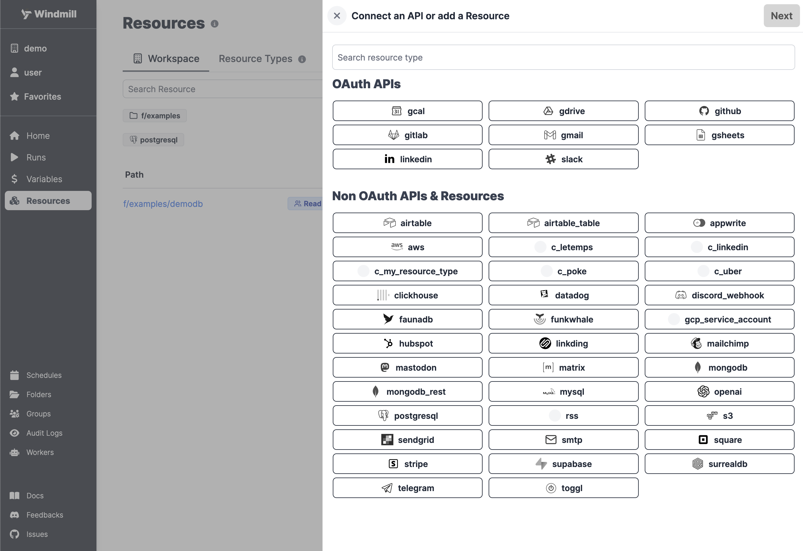

We will see how to connect your Windmill instance to an external PostgreSQL
service and then send queries to the database using Windmill Scripts.

<!--truncate-->


## Create Resource

Windmill provides integration with many different apps and services with the use
of [Resources][docs-resources]. Each Resource has a **Resources Type**, which
controls the shape of it. To be able to connect to a MongoDB instance, we'll
need to define a Resource with the `postgresql` Resource Type first.

:::tip

You can find a list of all the officially supported Resource Types on
[Windmill Hub][hub-resources].

:::

Head to the [Resources][wm-app-resources] page in the Windmill app, click on
"Add a resource/API" in the top right corner and select the `postgresql` type.



Fill out the form with the information of your PostgreSQL instance.

:::tip

For testing purposes, you can use the sample PostgreSQL Resource provided to
every user. It is available unde the path `f/examples/demodb`.

:::


## Create Script

Next, let's create a Script that will use the newly created Resource. Head on to
the [Home][wm-app-home] page and click on the "+Script" button. Name the Script
`my_postgres_script`, give it a summary, "Query a PostgreSQL Database" for
example, select "PostgreSQL" as the language and finally, click "Next".


We will use Postgres' parameterized queries with the template being written in
TypeScript. Paste the following code in the editor:

```typescript
import {
  pgSql,
  type Resource,
} from "https://deno.land/x/windmill@v1.62.0/mod.ts";

//PG parameterized statement. No SQL injection is possible.
export async function main(
  db: Resource<"postgresql"> = "$res:g/all/demodb",
  key: number,
  value: string,
) {
  const query = await pgSql(
    db,
  )`INSERT INTO demo VALUES (${key}, ${value}) RETURNING *;`;
  return query.rows;
}
```

:::info

This code should be the default one when you select **PostgreSQL** as the
language.

:::

Now try running the Script with the following arguments. You should see the
inserted values returned in the bottom right corner.

- **db** - select the Resource we created in the previous step
- **key** - `42`
- **value** - `Test value`

:::tip

You can find more Script examples related to PostgreSQL on
[Windmill Hub][hub-examples].

:::

Once you're done, click on "Save", which will save it to your workspace. You can
now use this Script in your [Flows][docs-flows], [Apps][docs-apps] or as
standalone.

<!-- Links -->

[wm-app-resources]: https://app.windmill.dev/resources
[wm-app-home]: https://app.windmill.dev
[hub-resources]: https://hub.windmill.dev/resources
[hub-examples]: https://hub.windmill.dev/integrations/postgresql
[docs-resources]: /docs/reference#resource
[docs-path]: /docs/reference#path
[docs-flows]: /docs/getting_started/flows_quickstart
[docs-apps]: /docs/getting_started/apps_quickstart
