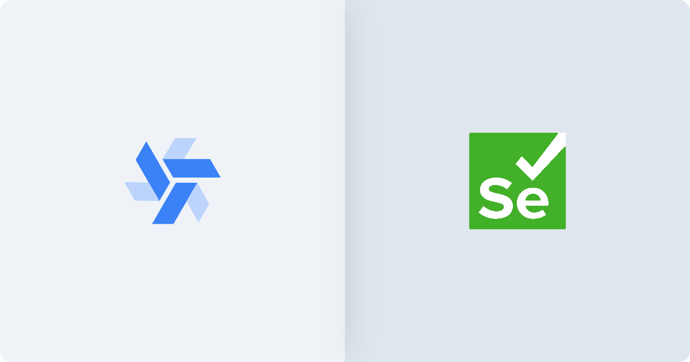
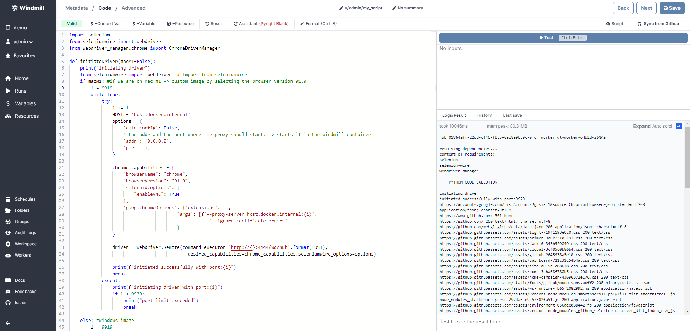
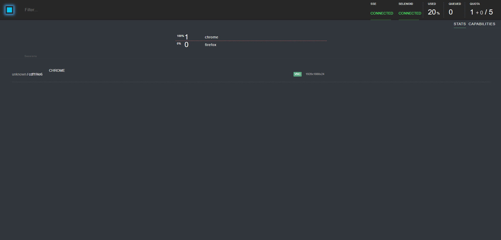
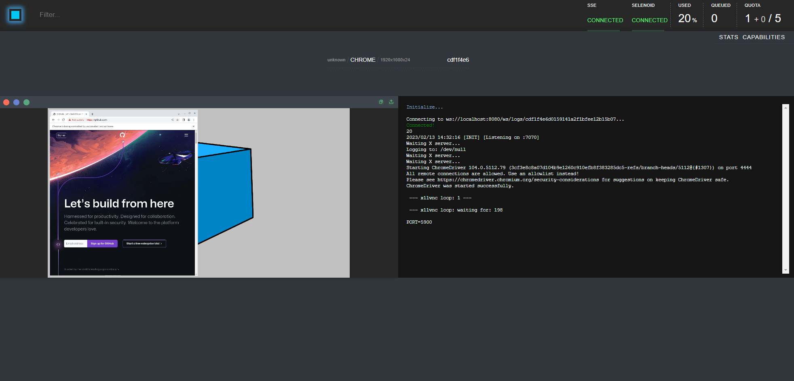

We will look at how to use Windmill and Selenoid, and Selenium Wire for the
ultimate web scraping setup. We will go over on how to install and configure
Selenoid and Windmill using `docker compose`. Seleniumwire is not necessarily
needed for webscraping but it allows for more advanced usecases.

<!--truncate-->

:::info

You will have to [self-host](/docs/advanced/self_host) Windmill and Selenoid for this method to work or
request a dedicated instance at contact@windmill.dev

:::



## Prerequisite

- Docker installed

## Step 1: Windmill configuration

Download the [docker-compose.yml][wm-docker-compose] file from the official
Windmill repository and make the following changes.

- Increase the number of workers. This is basically the number of scripts you
  can run at the same time. We will increase it to 10 workers.
- Increase the default timeout of the workers (default is set to 48 hours).
- Open a range of ports on the `windmill_server` containers so Windmill and
  Selenoid can communicate.<br/>
- Remove the `caddy` service
- Remove the `windmill_worker` service (we will be running the worker's inside
  the `windmill_server`)

It should look something like this:

```yml
version: '3.7'

services:

  db:
    image: postgres:14
    restart: unless-stopped
    volumes:
      - db_data:/var/lib/postgresql/data
    ports:
      - 5432:5432
      - 5433:5432
    environment:
      POSTGRES_PASSWORD: ${DB_PASSWORD}
      POSTGRES_DB: windmill
    healthcheck:
      test: [ "CMD-SHELL", "pg_isready -U postgres" ]
      interval: 10s
      timeout: 5s
      retries: 5

  windmill_server:
    image: ghcr.io/windmill-labs/windmill:main
    deploy:
      replicas: 1
    restart: unless-stopped
    ports:
      - "8000:8000"
      - "9920-9930:9920-9930" # <- added this; only 10 ports are opened; if you want to open more ports increase the 2nd number respectively
    environment:
      - DATABASE_URL=postgres://postgres:${DB_PASSWORD}@db/windmill?sslmode=disable
      - BASE_URL=http://${WM_BASE_URL}
      - RUST_LOG=info
      - NUM_WORKERS=10 # <- an increased number of workers is helpful when running a lot of scraping scripts in parallel
      - TIMEOUT=99999999 # <- add this; This is important: Scraping websites usually outlasts normal scripts. To prevent a timeout we should increase this value.
      - DISABLE_SERVER=false
      - METRICS_ADDR=false
    depends_on:
      db:
        condition: service_healthy

  lsp:
    image: ghcr.io/windmill-labs/windmill-lsp:latest
    restart: unless-stopped
    ports:
      - 3001:3001

volumes:
  db_data: null
```

Create an `.env` file in the same directory as the `docker-compose.yml` file and
add the following:

```bash
DB_PASSWORD=changeme
WM_BASE_URL=http://localhost
CADDY_REVERSE_PROXY=http://localhost
```

This is the PostgreSQL database password used by Windmill and the base URL of
Windmill.

## Step 2: Selenoid configuration

We will also use Docker to configue Selenoid.

- Create a new folder in the same directory and name it `config`
- In the `config` directory create two new empty folder's and name them `video`
  and `logs`
- In the `config` directory create a new file and name it `browsers.json`
- `browsers.json` contains the configurations for the browser you will later run
  your scripts on it should look something like this

```json
{
  "firefox": {
    "default": "104.0",
    "versions": {
      "104.0": {
        "image": "selenoid/firefox:104.0",
        "port": "4444",
        "path": "/wd/hub",
        "env": ["TZ=Europe/Berlin"]
      }
    }
  },
  "chrome": {
    "default": "104.0",
    "versions": {
      "104.0": {
        "image": "selenoid/chrome:104.0",
        "port": "4444",
        "path": "/",
        "env": ["TZ=Europe/Berlin"]
      }
    }
  }
}
```

:::info

You will have to pull the browser images you specified in the `browsers.json`
file yourself. If you want to run Selenium with Docker on an Apple Silicon chip
you need to pull custom images. Please follow
[this tutorial][selenium-tutorial].

Example image for Mac M1/M2 chips:
`dumbdumbych/selenium_vnc_chrome_arm64:91.0.b`

:::

```bash
docker pull selenoid/chrome:104.0
docker pull selenoid/vnc_chrome:104.0
docker pull selenoid/firefox:104.0
docker pull selenoid/vnc_firefox:104.0
```

Now go back to the `docker-compose.yml` file we created in the first setup and
add these two containers (`selenoid` and `selenoid-ui`). Don't forget to change
the path to your `config` directory path.

```yml
  selenoid:
    network_mode: bridge
    image: aerokube/selenoid:latest-release
    volumes:
      - "/path/to/config:/etc/selenoid" # <- change this
      - "/path/to/config/video:/opt/selenoid/video" # <- change this
      - "/path/to/config/logs:/opt/selenoid/logs" # <- change this
      - "/var/run/docker.sock:/var/run/docker.sock"
    environment:
      - OVERRIDE_VIDEO_OUTPUT_DIR=./config/video
    command: ["-conf", "/etc/selenoid/browsers.json", "-video-output-dir", "/opt/selenoid/video", "-log-output-dir", "/opt/selenoid/logs"]
    ports:
      - "4444:4444"

  selenoid-ui:
    image: "aerokube/selenoid-ui"
    network_mode: bridge
    restart: always
    links:
      - selenoid
    ports:
      - "8080:8080"
    command: ["--selenoid-uri", "http://selenoid:4444"]
```

Your `docker-compose.yml` should look like something like this:

```yml
version: '3.7'

services:

  db:
    image: postgres:14
    restart: unless-stopped
    volumes:
      - db_data:/var/lib/postgresql/data
    ports:
      - 5432:5432
      - 5433:5432
    environment:
      POSTGRES_PASSWORD: ${DB_PASSWORD}
      POSTGRES_DB: windmill
    healthcheck:
      test: [ "CMD-SHELL", "pg_isready -U postgres" ]
      interval: 10s
      timeout: 5s
      retries: 5

  windmill_server:
    image: ghcr.io/windmill-labs/windmill:main
    deploy:
      replicas: 1
    restart: unless-stopped
    ports:
      - "8000:8000"
      - "9920-9930:9920-9930" # <- added this; only 10 ports are opened; if you want to open more ports increase the 2nd number respectively
    environment:
      - DATABASE_URL=postgres://postgres:${DB_PASSWORD}@db/windmill?sslmode=disable
      - BASE_URL=${WM_BASE_URL}
      - RUST_LOG=info
      - NUM_WORKERS=10 # <- an increased number of workers is helpful when running a lot of scraping scripts in parallel
      - TIMEOUT=99999999 # <- add this; This is important: Scraping websites usually outlasts normal scripts. To prevent a timeout we should increase this value.
      - DISABLE_SERVER=false
      - METRICS_ADDR=false
    depends_on:
      db:
        condition: service_healthy

  lsp:
    image: ghcr.io/windmill-labs/windmill-lsp:latest
    restart: unless-stopped
    ports:
      - 3001:3001

  selenoid:
    network_mode: bridge
    image: aerokube/selenoid:latest-release
    volumes:
      - "/path/to/config:/etc/selenoid" # <- change this
      - "/path/to/config/video:/opt/selenoid/video" # <- change this
      - "/path/to/config/logs:/opt/selenoid/logs" # <- change this
      - "/var/run/docker.sock:/var/run/docker.sock"
    environment:
      - OVERRIDE_VIDEO_OUTPUT_DIR=./config/video
    command: ["-conf", "/etc/selenoid/browsers.json", "-video-output-dir", "/opt/selenoid/video", "-log-output-dir", "/opt/selenoid/logs"]
    ports:
      - "4444:4444"

  selenoid-ui:
    image: "aerokube/selenoid-ui"
    network_mode: bridge
    restart: always
    links:
      - selenoid
    ports:
      - "8080:8080"
    command: ["--selenoid-uri", "http://selenoid:4444"]

volumes:
  db_data: null
```

Final structure:

```
.
├── config/
│   ├── browsers.json
│   ├── video 
│   └── logs
├── .env
└── docker-compose.yml
```

## Usage

Now that the setup is done, you can start everything with
`docker compose up -d`. Navigate to Windmill on `localhost:8000` and sign in
with `admin@windmill.dev` and `changeme` as the password. Create a new python
script, paste in the following code and run it.

```python
import selenium
from seleniumwire import webdriver
from webdriver_manager.chrome import ChromeDriverManager

def initiateDriver(macM1=False):
    print("initiating driver")
    from seleniumwire import webdriver  # Import from seleniumwire
    if macM1: #if we are on mac m1 -> custom image by selecting the browser version 91.0
        i = 9919
        while True:
            try:
                i += 1
                HOST = 'host.docker.internal'
                options = {
                    'auto_config': False,
                    # the addr and the port where the proxy should start: -> starts it in the windmill container
                    'addr': '0.0.0.0',
                    'port': i,
                }

                chrome_capabilities = {
                    "browserName": "chrome",
                    "browserVersion": "91.0",
                    "selenoid:options": {
                        "enableVNC": True
                    },
                    'goog:chromeOptions': {'extensions': [],
                                        'args': [f'--proxy-server=host.docker.internal:{i}',
                                                    '--ignore-certificate-errors']
                                        }
                }

                driver = webdriver.Remote(command_executor='http://{}:4444/wd/hub'.format(HOST),
                                            desired_capabilities=chrome_capabilities,seleniumwire_options=options) 

                print(f"initiated successfully with port:{i}")
                break
            except:
                print(f"initiating driver with port:{i}")
                if i > 9930:
                    print("port limit exceeded")
                    break

    else: #windows image
        i = 9919
        while True:
            try:
                i += 1
                HOST = 'host.docker.internal'
                options = {
                    'auto_config': False,
                    # the addr and the port where the proxy should start: -> starts it in the windmill container
                    'addr': '0.0.0.0',
                    'port': i,
                }

                chrome_capabilities = {
                    "browserName": "chrome",
                    #"browserVersion": "91.0", #on Windows we can use the latest version by not specifying the version number
                    "selenoid:options": {
                        "enableVNC": True
                    },
                    'goog:chromeOptions': {'extensions': [],
                                        'args': [f'--proxy-server=host.docker.internal:{i}',
                                                    '--ignore-certificate-errors']
                                        }
                }

                driver = webdriver.Remote(command_executor='http://{}:4444/wd/hub'.format(HOST),
                                            desired_capabilities=chrome_capabilities,seleniumwire_options=options) 

                print(f"initiated successfully with port:{i}")
                break
            except:
                print(f"initiating driver with port:{i}")   
                if i > 9930:
                    print("port limit exceeded")
                    break

    return driver

def main():
  driver = initiateDriver(macM1=False)
  driver.get('https://www.github.com')

  # Test whether Seleniumwire is working
  for request in driver.requests:
      if request.response:
          print(
              request.url,
              request.response.status_code,
              request.response.headers['Content-Type']
          )
```

It should return this:



Go to `localhost:8080` (selenoid-ui) to see your script in action!





To run multiple scripts at once you will have to give a unique port to each
script. In the first step we opened the ports between `9920 - 9930` you can
increase them or decrease the range as you want but remember to increase /
decrease the workers number too.

:::info

This is a tutorial contributed by the Windmill Community members
[Krestoufer Toumas](https://github.com/Toumask) and
[Felix Becker](https://github.com/tfbecker).

:::

<!-- Links -->

[wm-docker-compose]: https://github.com/windmill-labs/windmill/blob/main/docker-compose.yml
[selenium-tutorial]: https://medium.com/@SergeyChechaev/build-selenoid-image-for-apple-silicon-m1-6dc6fc1a50c1
