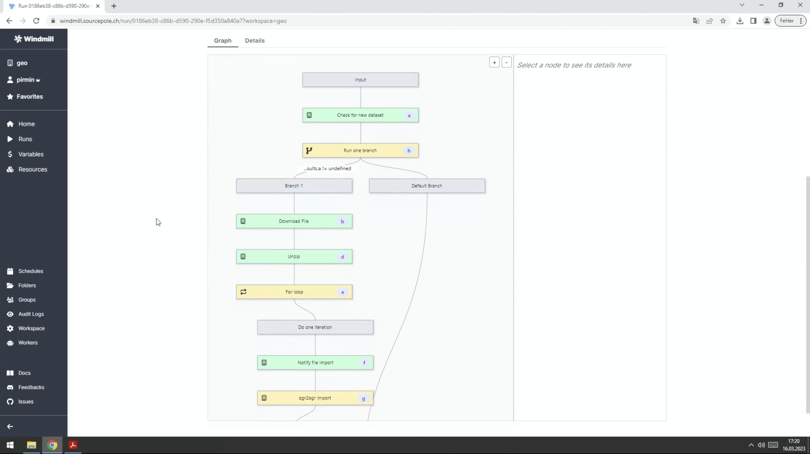
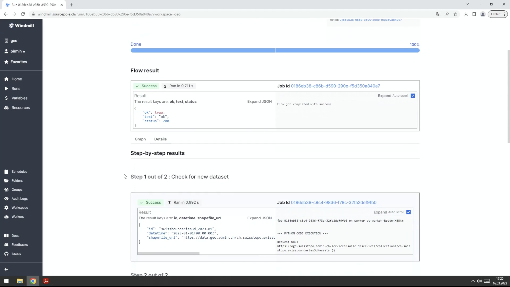

This is a testimonial written by [Pirmin Kalberer](https://github.com/pka), Managing Director at [Sourcepole](http://sourcepole.com/).

<!--truncate-->

 

## What before Windmill?

**[Sourcepole](http://sourcepole.com/)** is a software development company based in Switzerland. We develop customer-specific solutions in the field of geoinformatics based on open source software components.

Data science requires the manipulation of large amounts of data from multiple sources. Workflow engines are crucial as they provide the infrastructure to define, execute, and monitor a sequence of steps in a data manipulation process.

## How did Windmill help?

Windmill facilitates the creation of robust workflows by enabling seamless sequencing of steps and their outputs while automatically generating user-friendly interfaces.

We tried other solutions and found the configuration of parameters between steps was difficult, making it painful to create simple worflows.

In particular, we use Windmill for:
- **Scheduled ETL** of files from public repositories to PostgreSQL.
- Its **UIs** where users can simply upload their own data to publish it as a file ready for downloading.
- We are starting to have **workspaces dedicated to each customer** where they can use our workflows straightforwardly.

:::tip Examples

 

A workflow made by Sourcepole being executed:

 

The associated results:

:::

You can have more details on our use of worflow engines for geospatial data processing with this [video](https://pretalx.com/fossgis2023/talk/JAMMJ8/) (in German 🇩🇪) of my presentation at the 2023 Berlin FOSSGIS conference on free and open source software for geographic information systems.

## How to use Windmill?

You can **[self-host](https://docs.windmill.dev/docs/advanced/self_host/#deployment)** it using a docker compose up, our go with the **[cloud app](https://app.windmill.dev/user/login)**.