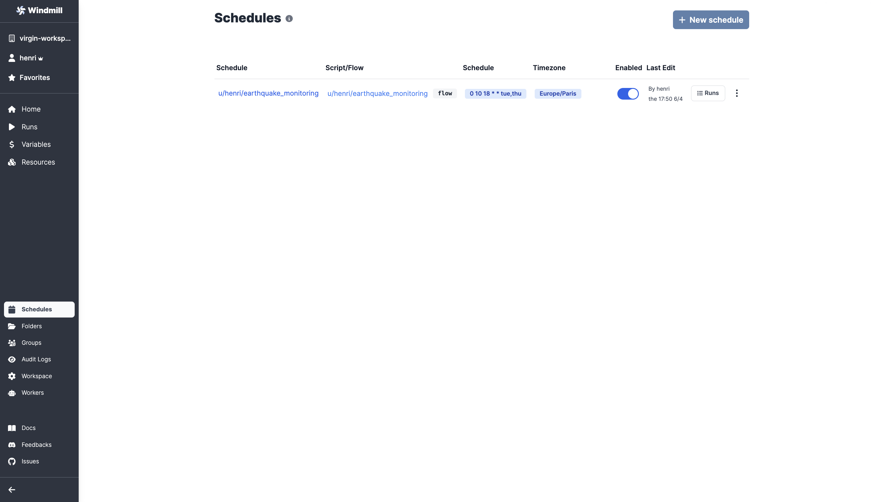
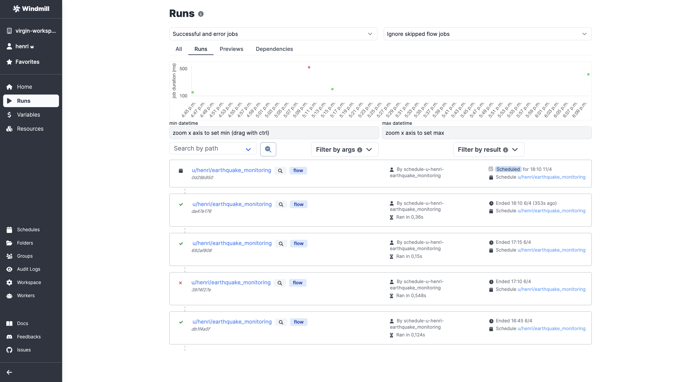
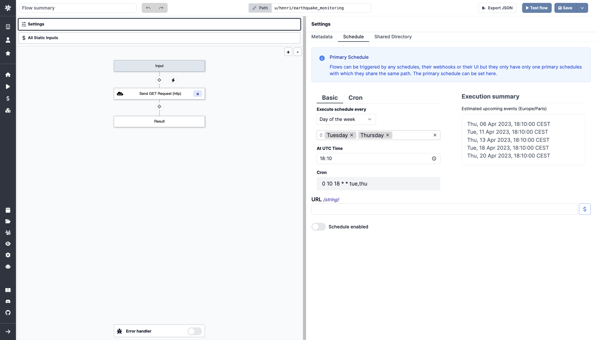
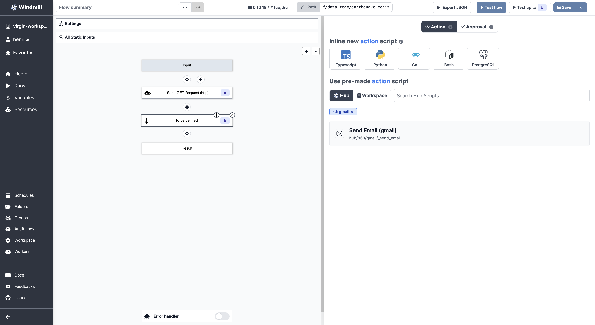

Windmill has the same set of features of cron, with an UI and control panels.

<!--truncate-->

<video
    className="border-2 rounded-xl object-cover w-full h-full"
    autoPlay
    loop
    controls
    id="main-video"
    src="/videos/schedule-cron-menu.mp4"
/>

 

Cron is a powerful and versatile tool that enables users to automate tasks by scheduling them to run at specific intervals or times. From automating routine system maintenance to sending periodic email reports, cron plays an indispensable role in streamlining processes and improving productivity for developers, system administrators, and even casual users.

However, as with any powerful tool, using cron comes with its own set of challenges and potential issues. Common problems associated with the use of cron include:
- **Runs History**: to maintain a record of script runs and log outputs through cron, you must manually incorporate that logic.
- **Error Handling**: in the event of a failed run, self-crafted logic is required for notifications (Slack, emails).
- **Manual Runs**: executing a cron job manually, outside of its schedule, proves difficult and can lead to inconsistencies due to potential environment differences.
- **No UI**: navigating cron jobs is challenging without a centralized hub, particularly for larger engineering teams. This comes with induced issues: 1. **Handling permissions** among users and editors and 2. **Server downtime**: when the server hosting the job experiences downtime, monitoring and alterting is problematic.

:::info A bit of Context: How Windmill Works

[Windmill](https://docs.windmill.dev/docs/intro) is an open-source developer platform and infra to build all internal tools through code, such as UIs and workflows based on simple scripts (TypeScript, Python, Go, Bash).

 

Managing scripts, flows and apps on Windmill works at the [workspace](https://docs.windmill.dev/docs/reference#workspace)-level. Admins invite authors and operators to the workspace where are hosted workflows. The first two can write and edit flows as well as managing permissions, executions etc.

 

Cron jobs are one of **many ways to [trigger workflows](https://docs.windmill.dev/docs/core_concepts/trigger_flows) in Windmill** (among [webhooks](https://docs.windmill.dev/docs/core_concepts/webhooks), [customized UIs](https://docs.windmill.dev/docs/getting_started/apps_quickstart), [Command Line Interface](https://docs.windmill.dev/docs/advanced/cli), [Slackbots](../2023-03-20-handler-slack-commands/index.md) etc.)

:::

## Configure Schedules for Each Task ([Script](https://docs.windmill.dev/docs/getting_started/scripts_quickstart/typescript),  [Workflows](https://docs.windmill.dev/docs/getting_started/flows_quickstart))

From your workspace, go to the dedidcated `Schedules` menu and pick `New Schedule`.

1. Configure the **schedule frequency** using cron syntax or the simplified builder.

2. Pick a **runnable** ([script](https://docs.windmill.dev/docs/getting_started/scripts_quickstart/typescript) or [flow](https://docs.windmill.dev/docs/getting_started/flows_quickstart)) from your workspace.

3. Fill the **arguments** that will be used for the automation. The arguments are the ones of the given script or flow. If you want your arguments to be dynamic, you might want to use a [workflow](https://docs.windmill.dev/docs/getting_started/flows_quickstart).

Click on `Schedule` button and you're good! The schedule will be automatically 'Enabled'. Toggle that off if needed.

:::tip Handle Several Schedules for the Same Workflow

The previous configuration can be replicated multiple times for the same workflow and therefore several schedules can work in parallel.

:::

If the Schedules menu allows you to control future executions of scripts and workflows, you can check all past and future runs from the `Runs` tab ...

... where you can get details on each run:

## Configure Schedules from Flow Editor

The same method can be done from the flow editor.

<video
    className="border-2 rounded-xl object-cover w-full h-full"
    autoPlay
    loop
    controls
    id="main-video"
    src="/videos/schedule-cron.mp4"
/>

 

From your workspace, pick the workflow you want to schedule.

Go to the `Schedule` menu ...

and either schedule in cron or in Basic mode that will automatically be translated in cron. Once it's done, you can see in next picture that the cron expression is now visible on the toolbar.

Fill the inputs, toggle the `Schedule Enabled`, save and you're all set!

## Control Permissions and Errors

### Be notified every time a scheduled workflow has been executed (or failed)

Add a simple step to your workflow to be informed on the execution of the scheduled flow.

In this example I chose to [receive an email](https://hub.windmill.dev/scripts/gmail/1291/-send-email-gmail), it could have been on [Slack](https://hub.windmill.dev/scripts/slack/1284/send-message-to-channel-slack), [Discord](https://hub.windmill.dev/scripts/discord/1292/send-message-to-channel-using-webhook-discord) or anything your imagination and API calls can create.

 

Configure the email.

 

And watch your mailbox.

 

Given how [flows](https://docs.windmill.dev/docs/getting_started/flows_quickstart) work on Windmill, it means that once the previous step has been successful, the Email step will trigger.

:::tip Error handler

If you want to handle failure and receive another message in that case, add an [Error Handler](https://docs.windmill.dev/docs/flows/flow_error_handler) to your workflow that will let you know if a failure happened at any step.

:::

### Manage permissions from the workflow

From the metadata menu, change the owner to a folder (group of people) to handle view and editing rights.

 

Voilà, all done! The process is very simple but it will allow you to schedule tasks with confidence and get an aggregated view on them.

Not only can you build scheduled jobs [from Windmill](https://docs.windmill.dev/docs/getting_started/how_to_use_windmill) but also you can import all your existing scripts - as Windmill supports TypeScript, Python, Go or Bash - [as did one of our esteemed users](../2023-03-06-stantt-use-case/index.md) for their own scheduled jobs.