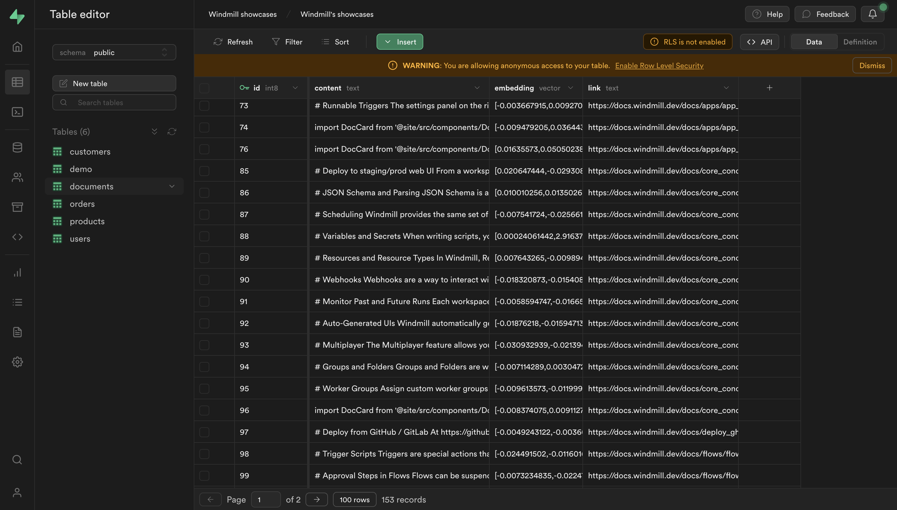
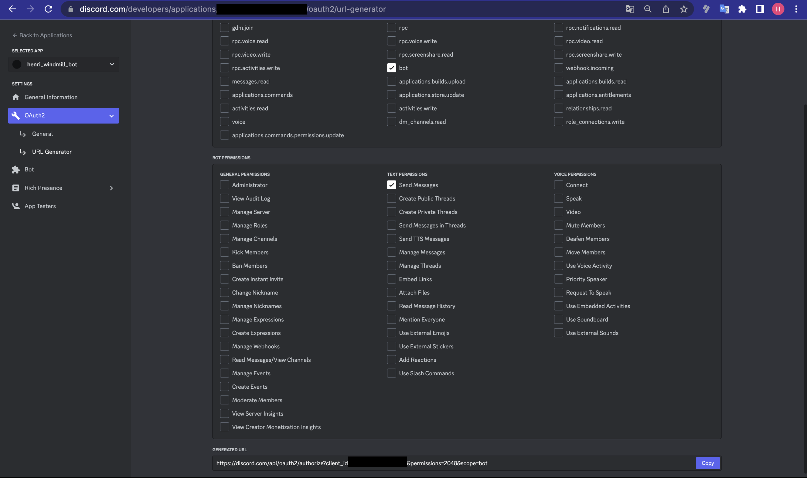
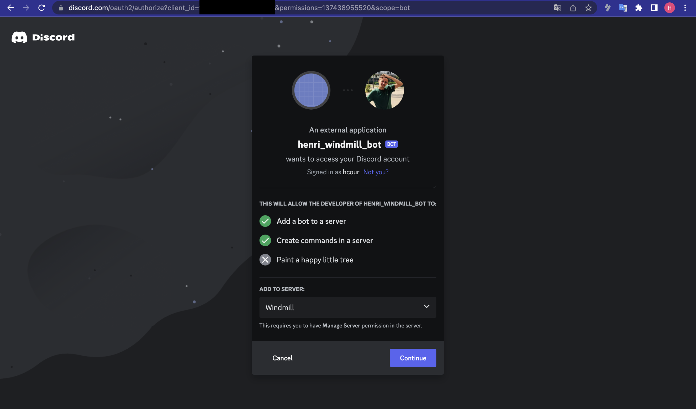

import DocCard from '@site/src/components/DocCard';

Empower your support team with a bot that answers questions about technical documentation using Windmill, OpenAI, and Supabase.

<!--truncate-->


<sup>
	<i>
		Midjourney prompt: a blog cover about a discord bot that answers questions about technical
		documentations, surrended by books --aspect 3:2
	</i>
</sup>

## Replace a SaaS

"Replace a SaaS" is a cheeky title for a blog series. We believe you don't always need a dedicated SaaS to solve a problem. You can often build your own minimal but tailored-to-your-needs solution on your own, and stop accumulating subscriptions.

Today, we will create a bot that answers questions about technical documentation leveraging Windmill, OpenAI, and Supabase, with an [approval step](/docs/flows/flow_approval).

## Demo

<video
	className="border-2 rounded-xl object-cover w-full h-full dark:border-gray-800"
	autoPlay
	loop
	controls
	src="/videos/demo-bot.mp4"
	alt="demo ai bot documentation"
/>

<br />

To directly setup your own bot on Windmill (Self-hosted or cloud) or rather watch a video tutorial of the actual set-up, you can skip the following sections and go directly to the [How to setup it yourself](#how-to-setup-it-yourself) section.

## Supabase

We will use [Supabase](https://supabase.com/) to store the embeddings, by taking inspiration from the [Storing OpenAI embeddings in Postgres with pgvector](https://supabase.com/blog/openai-embeddings-postgres-vector) tutorial.

:::info Summary of the Supabase article

The [pgvector extension](https://supabase.com/docs/guides/database/extensions/pgvector) in PostgreSQL enables the storage and querying of vector embeddings. Embeddings are representations of text or other information that capture relatedness or meaning. With pgvector, you can store embeddings in a PostgreSQL database and perform similarity searches using vector math operations. This opens up possibilities for powerful applications like semantic search and recommendation systems on large amounts of data.
:::

You'll need to follow the logic of the tutorial up to the point where you have created a table with the `pgvector` [extension](https://supabase.com/docs/guides/database/extensions/pgvector) enabled, and you have created the `match_documents` function.

The only difference is that we will store the link of the documentation page for each embedding to also provide the sources, meaning we'll add a `link` column. Here the 3 commands to run:

1. does not change:

```sql
   create extension vector;
```

2.

```sql
CREATE TABLE documents (
  id bigserial PRIMARY KEY,
  content text,
  link text,
  embedding vector(1536)
);
```

3.

```sql
create or replace function match_documents (
  query_embedding vector(1536),
  match_threshold float,
  match_count int
)
returns table (
  id bigint,
  content text,
  link text,
  similarity float
)
language sql stable
as $$
  select
    documents.id,
    documents.content,
    link varchar,
    1 - (documents.embedding <=> query_embedding) as similarity
  from documents
  where 1 - (documents.embedding <=> query_embedding) > match_threshold
  order by similarity desc
  limit match_count;
$$;
```

## Create a scheduled flow that ingests your data and creates embeddings

We need to ingest a data source, here the [Windmill documentation](/docs/intro). We can accomplish this by creating a [scheduled](/docs/core_concepts/scheduling) flow that periodically retrieves the documentation from the [Windmill repository](https://github.com/windmill-labs/windmilldocs) on GitHub, creates embeddings using [OpenAI](https://platform.openai.com/overview), and stores the embeddings in Supabase using [pgvector](https://github.com/pgvector/pgvector).

### Flow overview

:::info Workflows

A [workflow](/docs/flows/flow_editor) is a series of connected tasks, events, or processes that occur automatically to achieve a specific goal. These tasks are organized as a sequence of actions or steps: [scripts](/docs/getting_started/scripts_quickstart) in the case of Windmill.
:::


> _This flow is available on [Windmill Hub](https://hub.windmill.dev/flows/45/)_.

<br />

The flow is composed in the following way (each step's logic and code will be detailed further):

- [Scrape the Windmill documentation](#scraping-the-windmill-documentation) from GitHub using the [Oktokit](https://github.com/octokit/octokit.js/) API.

Then we use a [for-loop](/docs/flows/flow_loops) to iterate over the results and run the following step for each result:

1. [Create the embeddings](#create-the-embeddings) using OpenAI
2. [Store the embeddings](#store-the-embeddings-on-supabase) in Supabase using pgvector

Each iteration of the for-loop are indiviual jobs and can be run [in parallel](/docs/flows/flow_branches#branch-all), [retried](/docs/flows/retries) and [error handled](/docs/flows/flow_error_handler) independently.

From Windmill, pick `+ Flow`, and either import JSON from the [Hub](https://hub.windmill.dev/flows/45/) or start building manually.

### Scraping the Windmill documentation

We could have written the script that fetches from Github, but since it's generic task, there is already a community-contributed script that does exactly that on the [Windmill Hub](https://hub.windmill.dev/scripts/github/1568/).

Direclty from Windmill, we picked the script that fetches the content of a repository from Github and forked it.

We modified it to only extract content from markdown files. As we are using [Docusaurus](https://docusaurus.io/docs), we also need to transform the path of the file to get the correct URL.

<details><summary>Code: Extract content from Github (TypeScript)</summary><p>

```typescript
import { Octokit } from 'https://cdn.skypack.dev/@octokit/rest';

type FileContent = { content: string; link: string };

type Github = {
	token: string;
};

export async function main(
	gh_auth: Github,
	owner: string,
	repo: string,
	path?: string,
	ref?: string,
	result_format: 'github_object' | 'json' = 'github_object'
): Promise<FileContent[]> {
	const octokit = new Octokit({ auth: gh_auth.token });

	const response = await octokit.request(
		`GET /repos/{owner}/{repo}/contents/${path}${ref ? '?ref=' + ref : ''}`,
		{
			owner,
			repo,
			headers: {
				'X-GitHub-Api-Version': '2022-11-28',
				Accept: `application/${result_format === 'json' ? 'vnd.github+json' : 'vnd.github.object'}`
			}
		}
	);

	const entries = response.data.entries;

	const fileContents: FileContent[] = [];

	for (const entry of entries) {
		if (entry.type === 'file') {
			const isMarkdown = entry.name.endsWith('.md');
			const isMDX = entry.name.endsWith('.mdx');

			if (isMarkdown || isMDX) {
				const link = getDocusaurusPathFromGithub(entry.path);

				const contentResponse = await octokit.request('GET /repos/{owner}/{repo}/contents/{path}', {
					owner,
					repo,
					path: entry.path,
					headers: {
						'X-GitHub-Api-Version': '2022-11-28',
						Accept: 'application/vnd.github.v3.raw' // Request raw content of the file
					}
				});

				const content = contentResponse.data as string;

				fileContents.push({
					content,
					link
				});
			}
		} else if (entry.type === 'dir') {
			// Recursively process directories
			const dirContents = await main(gh_auth, owner, repo, entry.path, ref, result_format);
			fileContents.push(...dirContents);
		}
	}

	return fileContents;
}

function getDocusaurusPathFromGithub(githubUrl: string): string {
	const match = githubUrl.match(/docs\/(.+\.(md|mdx))/);
	if (match) {
		let filePath = match[1];
		filePath = filePath.replace(/\.(md|mdx)$/, '');

		// Split the path into segments
		let pathSegments = filePath.split('/');

		// Remove numbers and underscores from the beginning of each segment
		pathSegments = pathSegments.map((segment) => segment.replace(/^[0-9]*_/, ''));

		// Reconstruct the path
		filePath = pathSegments.join('/');

		return '/docs/' + filePath;
	}
	return githubUrl;
}
```

</p></details>

Notice that the script takes a special parameter `gh_auth` which is a Windmill resource that contains the [GitHub token](/docs/integrations/github).

<div class="grid grid-cols-2 gap-6 mb-4">
	<DocCard
		title="Resources"
		description="Create and manager your resources"
		href="/docs/core_concepts/resources_and_types"
	/>
</div>

### Create the embeddings

Using the [OpenAI API](https://platform.openai.com/docs/api-reference), we can create embeddings for each of the documents. Simirarly to the Github script, there is an other script on the Windmill Hub for it: [Create embedding](https://hub.windmill.dev/scripts/openai/1454/).

This script requires setting up an [OpenAI integration](/docs/integrations/openai).

### Store the embeddings on Supabase

Finally, we can store the embeddings in Supabase using the [pgvector](https://supabase.com/docs/guides/database/extensions/pgvector) extension.



> All embeddings are stored in a single Supabase table.

<br />

Supabase is easily [integrated to Windmill](/docs/integrations/supabase#through-supabase-api).

<details><summary>Code: Store the embeddings on Supabase</summary><p>

```typescript
import { refreshAndRetryIfExpired } from 'https://deno.land/x/windmill_helpers@v1.1.1/mod.ts';

type Supabase = {
	supabaseUrl: string;
	supabaseKey: string;
};

export async function main(
	auth: Supabase,
	embedding: any,
	document: string,
	link: string,
	token?: {
		access: string;
		refresh: string;
		expires_at?: number;
	}
) {
	return await refreshAndRetryIfExpired(auth, token, async (client) => {
		const query: any = await client.from('documents').insert({
			content: document,
			embedding,
			link
		});

		return query;
	});
}
```

</p></details>


> This is what our Flow looks like now.

### Schedule the flow

We can [schedule](/docs/core_concepts/scheduling) the flow to run every month.

1. Go the Settings
2. Click on the `Schedule` tab
3. Edit the Cron expression to run every month: `0 0 1 * *`
4. Enable the schedule

#### Learn more about Windmill features

<div class="grid grid-cols-2 gap-6 mb-4">
	<DocCard title="For loops" description="For loops documentation" href="/docs/flows/flow_loops" />
	<DocCard
		title="Schedule"
		description="Learn how you can schedule a flow"
		href="/docs/core_concepts/scheduling"
	/>
</div>

## Slack or Discord

Windmill uses [Discord](https://discord.com/invite/V7PM2YHsPB) for its community, but you can also build the same bot for [Slack](https://slack.com/). For Slack, see:

- [Create the Slack Answer flow](#create-the-slack-answer-flow)
- [Create the Slack Interaction endpoint](#create-the-slack-interaction-endpoint)

## Create an application on Discord Developer Portal

To get started, go to the [Discord Developer Portal](https://discord.com/developers/applications) and create a new application. Give your application a name and add a bot to it (there is not need to set specific Bot Permissions for this use case). This will provide you with the necessary credentials to interact with the Discord API.

From the `Bot` menu, you can `Reset token` and get a token to use in the [approval step](#create-the-approval-step-to-validate-the-answer-by-a-human).

## Add the bot to your server

- Go to the [Discord Developer Portal](https://discord.com/developers/applications).
- Pick your application.
- Choose `OAuth2` menu, then `URL Generator`.
- Enable `bot` and `Send Messages`.
- Copy the "Generated URL", paste it to your browser and pick the server to add it to.





Then from `Server Settings` - `Integrations` - `Bots and Apps` you can check if your command was successfully added.

## Configure your Discord Bot command

Once you have created your application and added the bot to your server, you can configure your Discord Bot command. This involves sending a command configuration to the Discord API. Refer to the [Discord API documentation](https://discord.com/developers/docs/interactions/slash-commands#registering-a-command) for detailed instructions on how to register a command for your bot.

You can also add the command executing [this script](https://hub.windmill.dev/scripts/discord/1603/).

## Create the Discord Answer flow

A template is available on the Windmill Hub: [Generate answer from embeddings with intermediate approval step](https://hub.windmill.dev/flows/46/).


This flow will generate the answer and send it back to Discord. It is composed of the following steps:

1. [Extract the question](#extract-the-question-from-the-discord-request) from the Discord request.
2. [Create the answer](#create-the-answer-using-the-question-the-embeddings-and-openai) using the question and the embeddings and OpenAI.
3. [Create an approval step](#create-the-approval-step-to-validate-the-answer-by-a-human) to validate the answer by a human.
4. If validated, [send the answer publicly](#send-the-answer-back-to-discord).

### Extract the question from the Discord request

Let's extract the question from the Discord request.

<details><summary>Code: Extract the question from the Discord request</summary><p>

```typescript
export async function main(interaction: any) {
	return interaction?.data?.options?.[0]?.value ?? 'No question asked';
}
```

</p></details>

### Create the answer using the question, the embeddings and OpenAI

To create the answer, we will follow the following steps:

1. Create the embeddings for the question.
2. Retrieve the documents from Supabase using the `match_documents` function.
3. Using a prompt, use GPT-4 or any other models to generate the answer given the question and the documents.
4. Return the answer.

The prompt is the following:

```
You are an AI assistant providing helpful advice. You are given the following extracted parts of a long document and a question. Provide a conversational answer based on the context provided.
If you can't find the answer in the context below, just say "Hmm, I'm not sure." Don't try to make up an answer.
If the question is not related to the context, politely respond that you are tuned to only answer questions that are related to the context.
Please note that images, figures, or any visual content will not be included in the provided context, so you must not try to include them in an answer.

Context sections  :
${contextText}
Question: """
${query}
"""
Answer as markdown (including related code snippets if available):
```

<details><summary>Code: Create the answer using the question and the embeddings and OpenAI</summary><p>

```typescript
import * as wmill from 'https://deno.land/x/windmill@v1.104.2/mod.ts';

import { refreshAndRetryIfExpired } from 'https://deno.land/x/windmill_helpers@v1.1.1/mod.ts';
import { Configuration, OpenAIApi } from 'npm:openai@3.2.1';
import { stripIndent } from 'https://esm.sh/common-tags@1.8.2';
import GPT3Tokenizer from 'https://esm.sh/gpt3-tokenizer@1.1.5';

export async function main(
	query: string,
	supabaseAuth: wmill.Resource<'supabase'>,
	openAiAuth: wmill.Resource<'openai'>,
	token?: {
		access: string;
		refresh: string;
		expires_at?: number;
	},
	maxToken: number = 5000
) {
	let answer = '';
	const links: string[] = [];

	await refreshAndRetryIfExpired(supabaseAuth, token, async (client) => {
		// OpenAI recommends replacing newlines with spaces for best results
		const input = query.replace(/\n/g, ' ');

		const configuration = new Configuration({
			apiKey: openAiAuth.api_key,
			organization: openAiAuth.organization_id
		});
		const openai = new OpenAIApi(configuration);

		// Generate a one-time embedding for the query itself
		const embeddingResponse = await openai.createEmbedding({
			model: 'text-embedding-ada-002',
			input
		});

		const [{ embedding }] = embeddingResponse.data.data;
		const { data: documents } = await client.rpc('match_documents', {
			query_embedding: embedding,
			match_threshold: 0.5, // Choose an appropriate threshold for your data
			match_count: 5 // Choose the number of matches
		});

		const tokenizer = new GPT3Tokenizer({ type: 'gpt3' });
		let tokenCount = 0;

		let contextText = '';

		for (let i = 0; i < documents.length; i++) {
			const document = documents[i];
			const content = document.content;

			const encoded = tokenizer.encode(content);
			tokenCount += encoded.text.length;

			if (tokenCount > maxToken) {
				contextText += `${content.trim().substring(0, maxToken)}\n---\n`;
				links.push(document.link);
				break;
			}

			contextText += `${content.trim()}\n---\n`;
			links.push(document.link);
		}

		const prompt = stripIndent`
		You are an AI assistant providing helpful advice. You are given the following extracted parts of a long document and a question. Provide a conversational answer based on the context provided.
    If you can't find the answer in the context below, just say "Sorry, I don't know" Don't try to make up an answer.
    Please note that images, figures, or any visual content will not be included in the provided context, so you must not try to include them in an answer.
    
    We will provide both the context and the question at the end.
    Answer as markdown (including related code snippets if available).

    Context:
    ${contextText}
    Question: """
    ${query}
    """
  `;

		try {
			const completionResponse = await openai.createChatCompletion({
				model: 'gpt-4',
				messages: [{ role: 'user', content: prompt }],
				max_tokens: 512, // Choose the max allowed tokens in completion
				temperature: 0 // Set to 0 for deterministic results
			});
			const {
				id,
				choices: [{ message }]
			} = completionResponse.data;

			answer = message?.content ?? '';
		} catch (e) {
			console.log(e);
		}
	});

	return { answer, links };
}
```

Depending on your OpenAI plan, you might need to change `model: 'gpt-4',` to `model: "gpt-3.5-turbo",`.

</p></details>

### Create the approval step to validate the answer by a human

We can leverage an [approval step](/docs/flows/flow_approval) to validate the answer by a human. Basically, the flow is suspended until we either approve or reject the answer.
Windmill exposes 3 endpoints:

- an URL to approve the answer
- an URL to reject the answer
- an URL of the approval page.

We can use Discord buttons to approve or reject the answer.

The `token` input is the token of your Discord bot. We see that in the [Create an application on Discord Developer Portal](#create-an-application-on-discord-developer-portal) section.

<details><summary>Code: Create the approval step to validate the answer by a human</summary><p>

```typescript
import * as wmill from 'https://deno.land/x/windmill@v1.85.0/mod.ts';
import { REST } from 'npm:@discordjs/rest@1.7.1';
import { API, ButtonStyle, MessageFlags } from 'npm:@discordjs/core@0.6.0';
import { ActionRowBuilder, ButtonBuilder } from 'npm:@discordjs/builders@1.6.3';

export async function main(
	question: string,
	answer: string,
	links: string[],
	token: string,
	interaction: any
) {
	const rest = new REST({ version: '10' }).setToken(token);
	const api = new API(rest);
	const { resume, cancel } = await wmill.getResumeUrls('Faton');

	const confirmButton = new ButtonBuilder()
		.setLabel('Confirm Message')
		.setURL(resume)
		.setStyle(ButtonStyle.Link);

	const row = new ActionRowBuilder<ButtonBuilder>().addComponents(confirmButton);

	await api.interactions.editReply(interaction.application_id, interaction.token, {
		content: `## ${question}\n\n${answer}\n## Sources:\n${links.map((l) => `${l}\n`).join('')}`,
		components: [row.toJSON()],
		flags: MessageFlags.Ephemeral
	});
}
```

</p></details>

#### Learn more about approval steps

<div class="grid grid-cols-2 gap-6 mb-4">
	<DocCard
		title="Approval step"
		description="Flows can be suspended until resumed or cancelled event(s) are received"
		href="/docs/flows/flow_approval"
	/>
</div>

### Send the answer back to Discord

Once approved, the flow will resume and the answer will be sent back to the user.

<details><summary>Code: Send the answer back to Discord</summary><p>

```typescript
import { REST } from 'npm:@discordjs/rest@1.7.1';
import { API } from 'npm:@discordjs/core@0.6.0';

type DiscordInteraction = {
	application_id: string;
	token: string;
};

export async function main(
	interaction: DiscordInteraction,
	question: string,
	answer: string,
	links: string[],
	token: string
) {
	const rest = new REST({
		version: '10'
	}).setToken(token);
	const api = new API(rest);

	await api.interactions.followUp(interaction.application_id, interaction.token, {
		content: `## ${question}\n\n${answer}\n## Sources:\n${links.map((l) => `${l}\n`).join('')}`
	});
}
```

</p></details>

## Create the Slack Answer flow

The Slack Answer flow is similar to the Discord Answer flow. The only difference is that we use Slack buttons instead of Discord buttons.

<details><summary>Code: Create the approval step to validate the answer by a human</summary><p>

```typescript
import { getResumeEndpoints, Resource } from 'https://deno.land/x/windmill@v1.85.0/mod.ts';
import { WebClient } from 'https://deno.land/x/slack_web_api@1.0.3/mod.ts';

export async function main(
	slack: Resource<'slack'>,
	channel: string,
	text = 'A flow is requesting an approval to be resumed'
) {
	const web = new WebClient(slack.token);

	const { cancel, resume } = await getResumeEndpoints(`channel-${channel}`);
	await web.chat.postMessage({
		channel,
		text: '',
		blocks: [
			{
				type: 'section',
				text: {
					type: 'mrkdwn',
					text: text
				}
			},
			{
				type: 'divider'
			},
			{
				type: 'actions',
				elements: [
					{
						type: 'button',
						style: 'danger',
						text: {
							type: 'plain_text',
							text: 'Cancel',
							emoji: true
						},
						url: cancel
					},
					{
						type: 'button',
						style: 'primary',
						text: {
							type: 'plain_text',
							text: 'Approve',
							emoji: true
						},
						url: resume
					}
				]
			}
		]
	});
}
```

</p></details>

Finally we can send the answer back to Slack using this script from the Hub: [Send a message to a channel](https://hub.windmill.dev/scripts/slack/1284/send-message-to-channel-slack).

## Create the Discord Interaction endpoint

Every Windmill script or flow exposes a [webhook endpoint](/docs/core_concepts/webhooks) that can be used to trigger it.

We can create a new flow that will be triggered as the Discord Interaction endpoint.

Discord will give as flow inputs the following parameters:

- `x_signature_ed25519`: the `X-Signature-Ed25519` header from the Discord request.
- `x_signature_timestamp`: the `X-Signature-Timestamp` header from the Discord request.
- `raw_string`: the stringified interaction payload from the Discord request.

### Verifying the Discord request and Defer

A template is available on the Windmill Hub: [Verify the Discord Request, Defer and trigger a flow](https://hub.windmill.dev/flows/44/verify-the-discord-request%2C-defer-and-trigger-a-flow).

<details><summary>Code: Verify the Discord Request and Defer (script part of the flow)</summary><p>

```typescript
import { REST } from 'npm:@discordjs/rest@1.7.1';
import { API, MessageFlags } from 'npm:@discordjs/core@0.6.0';
import { JobService, type Resource } from 'https://deno.land/x/windmill@v1.108.0/mod.ts';

import {
	InteractionResponseType,
	InteractionType,
	verifyKey
} from 'npm:discord-interactions@3.4.0';

type DiscordInteraction = {
	id: string;
	token: string;
	type: InteractionType;
};

export async function main(
	x_signature_ed25519: string,
	x_signature_timestamp: string,
	raw_string: string,
	token: string,
	discord_config: Resource<'discord_bot_configuration'>,
	workspace: string,
	path: string
) {
	const rest = new REST({ version: '10' }).setToken(token);
	const api = new API(rest);
	const interaction: DiscordInteraction = JSON.parse(raw_string);

	// We'll need the http request body as a string and the two headers to verify the request signature
	// https://discord.com/developers/docs/interactions/receiving-and-responding#security-and-authorization
	const isVerified = verifyKey(
		raw_string,
		x_signature_ed25519,
		x_signature_timestamp,
		discord_config.public_key
	);

	if (!isVerified) {
		throw new Error('The request signature is not valid');
	}

	// If we get a PING, we need to respond with a PONG
	const type = interaction.type as InteractionType;
	if (type === InteractionType.PING) {
		return { type: InteractionResponseType.PONG };
	}

	await JobService.runFlowByPath({
		workspace,
		path,
		requestBody: {
			interaction
		}
	});

	await api.interactions.defer(interaction.id, interaction.token, {
		flags: MessageFlags.Ephemeral
	});
}
```

</p></details>

With the following inputs:

- `path`: the [path](/docs/reference#path) of the [Discord answer flow](#create-the-discord-answer-flow).
- `workspace`: the Windmill [workspace](/docs/reference#workspace) of the Discord answer flow.
- `token`: your [webhook-specific token](/docs/core_concepts/webhooks#webhook-specific-tokens).
- `discord_config`:

After verifying the request, we can defer the request to Discord using the `api.interactions.defer` method.
Now we can run the `discordAnswerFlowPath` flow that will generate the answer and send it back to Discord.

### Building the URL for the Discord Interaction endpoint

Let's create the URL for the Discord Interaction endpoint.

1. Go into the Webhooks section of the "[Verify the Discord Request, Defer and trigger a flow](#verifying-the-discord-request-and-defer)" flow's `Detail` page.
2. Copy the `Result/Sync` webhook URL.
3. Create a [webhook-specific token](/docs/core_concepts/webhooks#webhook-specific-tokens).


Windmill supports a special query parameter `?include_header=<header1>,<header2>` that can be used to pipe headers from the request to the script or flow parameters.

Discord mandates that we verify the request before responding to it, so we need to include the `X-Signature-Ed25519` and `X-Signature-Timestamp` headers in the request to verfiy the Discord request. We also added the `raw` query parameter to get the raw stringified body.

The URL should look like this:

```
{Result/Sync URL}?include_header=X-Signature-Ed25519,X-Signature-Timestamp&raw=true&token={Webhook-specific token}
```

Copy and paste this URL into the Discord Interaction endpoint.


## Create the Slack Interaction endpoint

For Slack, we will use the Slack web client to send ephemeral messages to the user while the bot is thinking.
We receive the following parameters from Slack:

- `text`: The text of the message
- `channel_id`: The channel ID
- `user_id`: The user ID

<details><summary>Code: Create the Slack endpoint</summary><p>

```typescript
import { Resource } from 'https://deno.land/x/windmill@v1.108.0/mod.ts';
import { JobService } from 'https://deno.land/x/windmill@v1.104.2/mod.ts';
import { WebClient } from 'https://deno.land/x/slack_web_api@1.0.3/mod.ts';

export async function main(
	text: string,
	slack: Resource<'slack'>,
	channel_id: string,
	user_id: string,
	workspace: string,
	path: string
) {
	const client = new WebClient(slack.token);

	await client.chat.postEphemeral({
		text: 'Bot is thinking...',
		channel: channel_id,
		user: user_id
	});

	await JobService.runFlowByPath({
		workspace,
		path,
		requestBody: {
			text,
			channel_id
		}
	});
}
```

</p></details>

## Conclusion

This is an example that with the right tools, you can quickly build a solution thait is tailored to your needs and hence can be better than a fully-featured, but generic solution.

If you have any questions or need further assistance, don't hesitate to reach out to the Windmill community on the [Windmill Discord Server](https://discord.com/invite/V7PM2YHsPB). Happy bot building!

## How to setup it yourself

### Summary

1. Create the Supabase database.
2. Fork the `Extract and embed documentation for semantic search` flow from the Hub and configure it with your credentials.
3. Run it once to generate the embeddings, and configure it to run on a schedule.
4. Create a Discord bot.
5. Fork the `Generate answer from embeddings with intermediate approval step` flow from the Hub and configure it with your credentials.
6. Fork the `Verify the Discord Request, Defer and trigger a flow` flow from the Hub and configure it with your credentials.
7. Get the webhook URL to trigger the flow, configure it and copy it to the Discord Interactions configuration.

### Video Tutorial

<video
	className="border-2 rounded-xl object-cover w-full h-full dark:border-gray-800"
	autoPlay
	controls
	src="/videos/discord_bot_tutorial.mp4"
	alt="container component"
/>

### Links

- Supabase's [Storing OpenAI embeddings in Postgres with pgvector](https://supabase.com/blog/openai-embeddings-postgres-vector) tutorial.

- [Discord Developer Portal](https://discord.com/developers/applications).

- [Extract and embed documentation for semantic search](https://hub.windmill.dev/flows/45/extract-and-embed-documentation-for-semantic-search).

- [Create the Discord Answer flow](https://hub.windmill.dev/flows/46/generate-answer-from-embeddings-with-intermediate-approval-step).

- [Verify the Discord Request, Defer and trigger a flow](https://hub.windmill.dev/flows/44/verify-the-discord-request%2C-defer-and-trigger-a-flow).
