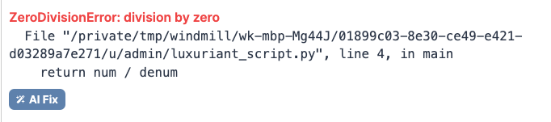
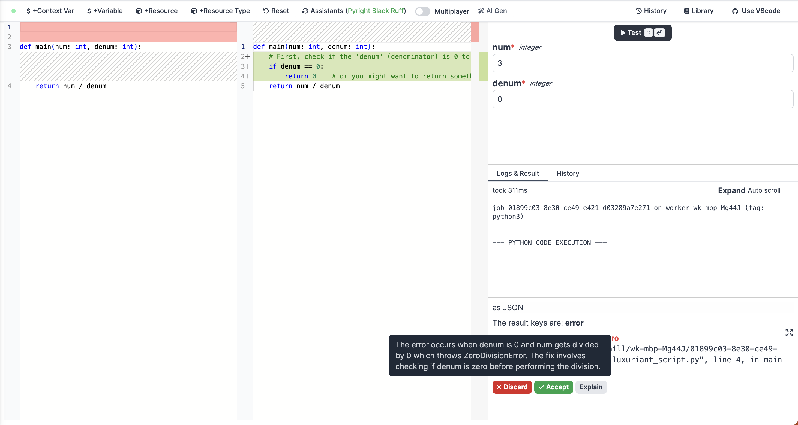

In recent weeks, we've been working on an AI-powered assistant for Windmill.
This feature allows users to create scripts from scratch or make code adjustments with ease using simple prompts.
If any errors occur in your script, the AI can help fix them while providing explanations for its solutions.
Moreover, the AI is well-versed in Windmill's specific concepts, such as resources and parameters, making it very helpful.

We are very excited about this feature and we couldn't wait to share with you the process behind its creation.
Our goal is to inspire others to develop their own AI-powered tools for their products.
Thanks to OpenAI, implementing this feature is fairly straightforward.

:::tip
If you want to try it out, enable the feature as instructed in the [documentation](https://docs.windmill.dev).
You will need an API key from OpenAI with access to the GPT-4 model.
:::

## GPT-4 and OpenAI API

This feature is powered by the GPT-4 model from OpenAI, their latest language model known for achieving unprecedented performance.
Its capabilities extend not only to generating text but also to coding tasks, making it highly suitable for our use case.
The GPT-4 model excels at following instructions and supports larger context, accommodating up to 32K tokens.

To interact with the GPT-4 model, we utilize the OpenAI Node API v4 library, currently in beta.
You can explore all our code on GitHub [here](https://github.com/windmill-labs/windmill/blob/main/frontend/src/lib/components/codeGen/lib.ts).
Additionally, we have implemented a backend service in Rust to proxy the user's request and add the OpenAI API key without revealing it in the frontend.
You can find the relevant code [here](https://github.com/windmill-labs/windmill/blob/main/backend/windmill-api/src/openai.rs).

## Prompting for code generation

We engage with GPT-4 through OpenAI's chat completion API, enabling us to transmit messages – user or system-related – and receive responses from the model accordingly.
System messages are utilized to convey general instructions to the model, guiding it on how to respond appropriately. On the other hand, user messages are employed to provide specific instructions from the user.

In our system message, we specifically instruct it to generate code and present the output in a code block.
Below is our system prompt:

````
You write code as queried by the user. Only output code. Wrap the code like that:

```language
{code}
```

Put explanations directly in the code as comments.
````

To extract and display the code exclusively, we employ regular expressions on the response data.
We utilize the same system message for all the different languages supported by Windmill.

The user messages play a dual role, encompassing both the user-provided instructions and contextual information. This context includes details like the programming language and desired structure, among other specifics.

Below is the initial segment of the user message template for Python:

```
Write a function in python called "main". The function should {description}. Specify the parameter types. Do not call the main function.
```

The {description} placeholder gets replaced by the user's instructions.
To ensure compatibility with Windmill's execution process, we explicitly state that the provided code should contain a function called "main."
Additionally, we request GPT-4 to specify parameters alongside their corresponding data types.
This information allows Windmill to parse the parameters accurately and present them in the script execution form.

## Handling resource types

Windmill incorporates resource types, which serve as blueprints defining the structure of resources that can be utilized as parameters in scripts.
For instance, a resource type may represent connection credentials to a Github account.
Our objective is to empower the AI to generate code that leverages these resource types effectively.
For instance, if the user requests a script that returns the number of stars of a Github repository, the AI should be capable of generating code that seamlessly utilizes the specified resource.

To achieve this, we include the resource types within the user message, providing clear instructions on how to employ them.
Below is the updated template with sample resource types:

```
Write a function in python called "main". The function should {description}. Specify the parameter types. Do not call the main function.
You have access to the following resource types, if you need them, you have to define the TypedDict exactly as specified (class name has to be IN LOWERCASE) and add them as parameters:

class github(TypedDict):
    token: str

class supabase(TypedDict):
    key: str
    url: str

class ...

...
Only use the ones you need. If the TypedDict name conflicts with the imported object, rename the imported object NOT THE TYPE.
```

Based on our observations, we made some additional enhancements to the user message template.
Specifically, we encountered instances where GPT-4 would include numerous resource types in the generated code, even if they were not required.
To mitigate this, we've included supplementary instructions to guide the AI in using only the necessary resource types in the code.
Furthermore, GPT-4 occasionally introduced renaming conflicts when importing libraries with the same name as the resource type.
To prevent such conflicts, we've added further instructions on how to handle naming conventions appropriately.

Watch our AI generate a Python script to retrieve the number of stars for a GitHub repository in this demo video:

<video
	className="border-2 rounded-xl object-cover w-full h-full dark:border-gray-800"
	autoPlay
	loop
	controls
	src="/videos/ai_python_demo.mp4"
	alt="AI demo python"
/>
<sup>
	<i>Generation time has been reduced to enhance the viewing experience</i>
</sup>

Windmill offers support for a wide range of languages, with some languages like TypeScript and Go sharing similar prompting styles as python.
However, languages like SQL and Bash necessitated distinct instructions.
For those, we provided explicit explanations on how to declare parameters and incorporate them into queries to ensure accurate code generation.

Below is the template for Postgres SQL:

```
Write SQL code for PostgreSQL that should {description}. Arguments can be obtained directly in the statement with `$1::{type}`, `$2::{type}`, etc...
Name the parameters by adding comments before the command like that: `-- $1 name1` or `-- $2 name = default` (one per row, do not include the type)
```

You can find the templates for all languages and runtimes [here](https://github.com/windmill-labs/windmill/blob/main/frontend/src/lib/components/codeGen/prompts/gen.yaml).

## Database schemas

Taking database scripts to the next level, we aimed to equip the AI with the ability to generate code utilizing the database schema intelligently.
For instance, when you inquire about the most sold product each month on an ecommerce website, the AI should be able to formulate a query with the appropriate tables and columns automatically.
To achieve this, we integrate schema querying from the selected database, and we include it as part of the user message, along with clear instructions on how to utilize it.
Below is the updated template, accompanied by an example schema:

```
Write SQL code for PostgreSQL that should {description}. Arguments can be obtained directly in the statement with `$1::{type}`, `$2::{type}`, etc...
Name the parameters by adding comments before the command like that: `-- $1 name1` or `-- $2 name = default` (one per row, do not include the type)
Here's the database schema, each column is in the format [name, type, required, default?]:
{
  "public": {
    "users": [
      ["id", "integer", true],
      ["name", "text", true],
      ["email", "text", true],
      ["created_at", "timestamp", true, "now()"],
      ["updated_at", "timestamp", true, "now()"]
    ],
    "products": [
      ["id", "integer", true],
      ["name", "text", true],
      ["price", "integer", true],
      ["created_at", "timestamp", true, "now()"],
      ["updated_at", "timestamp", true, "now()"]
    ],
    "orders": [
      ["id", "integer", true],
      ["user_id", "integer", true],
      ["product_id", "integer", true],
      ["created_at", "timestamp", true, "now()"],
      ["updated_at", "timestamp", true, "now()"]
    ]
  }
}
```

Watch our AI generate a SQL script to retrieve the email of the user who executed the most jobs on a Windmill instance in this demo video:

<video
	className="border-2 rounded-xl object-cover w-full h-full dark:border-gray-800"
	autoPlay
	loop
	controls
	src="/videos/ai_postgres_demo.mp4"
	alt="AI demo PostgreSQL"
/>

<sup>
	<i>Generation time has been reduced to enhance the viewing experience</i>
</sup>

## Code editing and bug fixing

In addition to its capabilities in text generation prompts, we were keen on harnessing GPT-4's potential for code editing and bug fixing.

The process for code editing is quite similar, with the exception that we include the selected code lines as part of the user message.
We continue to utilize the same system message to guide the AI effectively.

````
Here's my python3 code:
```python
{code}
```

Additional information: We have to export a "main" function and specify the parameter types but do not call it.
You have access to the following resource types, if you need them, you have to define the TypedDict exactly as specified (class name has to be IN LOWERCASE) and add them as parameters: {resourceTypes}
Only use the ones you need. If the TypedDict name conflicts with the imported object, rename the imported object NOT THE TYPE.
My instructions: {description}
````

For bug fixing, we pass the complete code and the error message, but no user instructions.

````
Here's my python3 code:
```python
{code}
```
Additional information: We have to export a "main" function and specify the parameter types but do not call it.
You have access to the following resource types, if you need them, you have to define the TypedDict exactly as specified (class name has to be IN LOWERCASE) and add them as parameters: {resourceTypes}
Only use the ones you need. If the TypedDict name conflicts with the imported object, rename the imported object NOT THE TYPE.
I get the following error: {error}
Fix my code.
````

Moreover, we rely on a distinct system message, as we also wanted an explanation of the error.
We explicitly instruct GPT-4 to include an explanation in a specific format which we then extract using regular expressions.

````
You fix the code shared by the user. Only output code. Wrap the code like that:
```language
{code}
```
Explain the error and the fix in the following format:
explanation: "Here's the explanation"
Also put the explanations in the code as comments.
````

## UI

To ensure a user-friendly experience with our AI assistant, we incorporated a straightforward "AI Gen" button within the existing script builder interface.
Clicking this button opens a popover with a text input, where users can conveniently enter their instructions.
If users have selected code prior to clicking the button, we pass it as part of the message, enabling code editing prompts for further convenience.

For code fixing, we introduced a dedicated "AI Fix" button placed next to the error message, making it easily accessible.



Additionally, we included an "Explain" button that, upon hovering, displays an explanation of the fix for better understanding.



To showcase changes effectively, we utilize [Moncao's diff editor](https://microsoft.github.io/monaco-editor/playground.html?source=v0.39.0#example-creating-the-diffeditor-hello-diff-world), which allows users to review and accept or reject modifications seamlessly.

## Next steps

Thank you for taking the time to explore how we built our AI assistant.
We hope you found it enlightening and now have a clearer vision on how to build your own AI assistant for your product using GPT-4.
If you have any questions or ideas you'd like to discuss, please don't hesitate to reach out to us.

At Windmill, we are delighted with the positive outcomes thus far.
As part of our commitment to continuous improvement, we will keep refining the prompts to enhance their performance.
Additionally, we're excited to explore new possibilities for implementing GPT-4 within Windmill, such as incorporating it into the flow and app builders.
Your feedback is of great value to us, and we welcome any suggestions or thoughts on how to further enhance our assistant.
