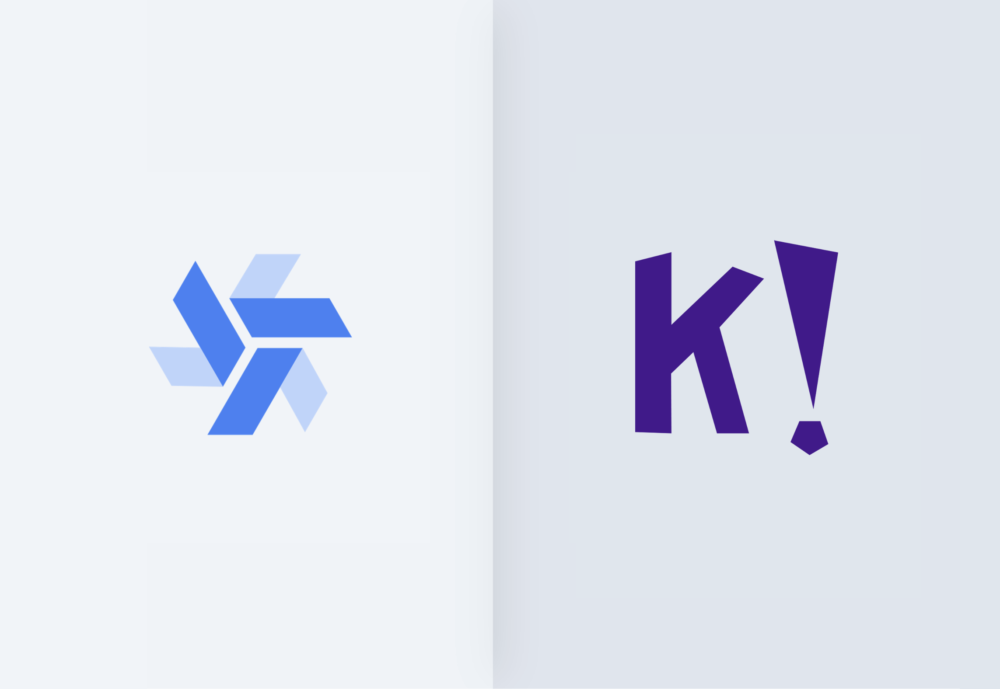

This is a testimonial written by [Sindre Svendby](https://github.com/pka), Software Engineer at [Kahoot](https://kahoot.com/).

<!--truncate-->

 

I have been a software engineer at [Motimate](https://www.motimateapp.com/) for the last 5 years. We are based in Oslo, Norway and we are now part of [Kahoot](https://kahoot.com/). While the brand Kahoot traditionnaly focuses on B2C, we target Enterprise clients.

I started using Windmill at the beginning of the year. It is now used through internal tools managed by several of our departments. We are progressively expanding its adoption to more departments to better address their needs for internal tooling.

## Choosing Windmill for Flexibility

My team was limited technically by the tech stack we used. Some tools as [Stripe Billing](https://stripe.com/en-fr/billing) are most useful if you proceed exactly as they want users to act. Others, as <a href="https://zapier.com/" rel="nofollow">Zapier</a> are easy to master but they are designed for marketing teams and will get frustrating to customize use cases and to have the code in git / version control systems.

Since we had our own use cases, we needed a flexible solution to create our internal tools.

At first, I turned to Windmill for workflows, as a replacement for Zapier. Windmill made significant improvements in our automations. I then discovered the [app builder](/docs/apps/app_editor), which is the opportunity for our operational teams to interact autonomously with our numerous integrations ([Stripe](https://hub.windmill.dev/integrations/stripe), [HubSpot](https://hub.windmill.dev/integrations/hubspot)).

Examples of what we have built with Windmill include:
- Billing: We integrated Stripe into an app, replacing Stripe Billing for use cases it is not able to support.
- Customer success: as our CS team used [Zendesk](https://www.zendesk.com/), we leveraged Windmil for translating, fetching, and insering articles into Zendesk using [OpenAI](https://hub.windmill.dev/integrations/openai) for new languages ([I shared this flow](https://hub.windmill.dev/flows/47/insert-zendesk-articles-into-supabase-with-openaiembedings) on WindmillHub).
  
Currently, we employ 9 apps, 20 flows, and 63 scripts in our daily operations. They all serve as the foundation for essential tasks, allowing users to independently manage their activities according to their specific needs.

## Planning to expand Windmill to more use cases and to less technical users

Looking ahead, our plan is to extend Windmill to more use cases.

While I manage the back-office for now, we aim to involve more team members (less technical ones) to build customized internal tools autonomously.

## Use case: App for ...

/Example of app/