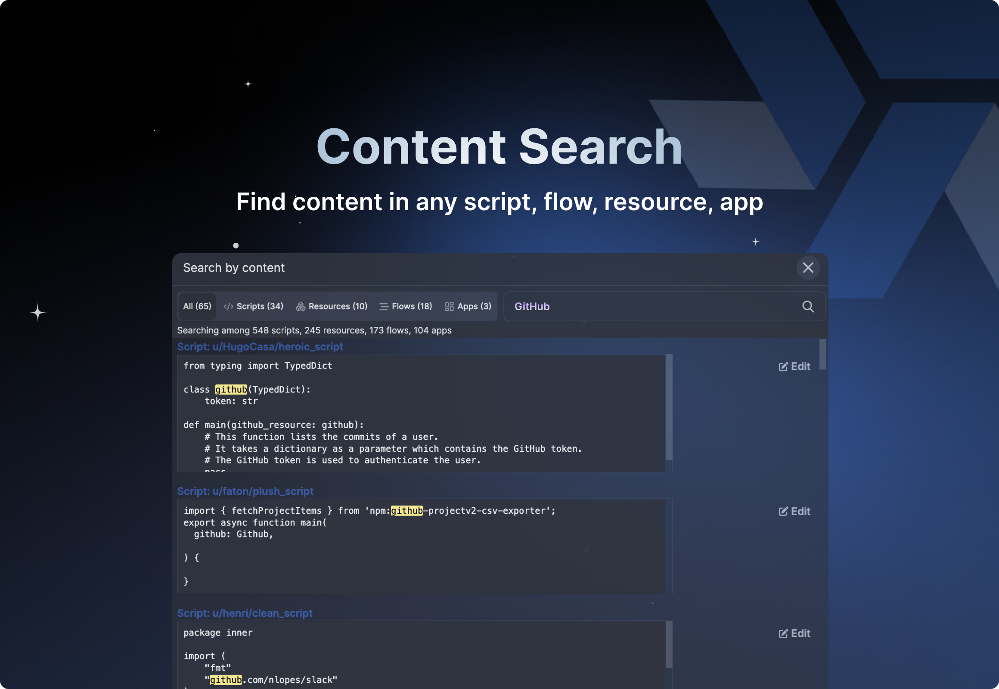

import DocCard from '@site/src/components/DocCard';

# Launch Week Day X: Content Search

 

 

We are excited to announce content search in Windmill. Much like [GitHub's code search](https://github.com/features/code-search), search for text in all scripts, flows, apps, or resources in the workspace.

Navigate, search, and delve into the code of your entire team, gaining greater visibility and control!

## How it works

From your workspace home page, click on "Content" and write the string you're looking for.
Windmill will return all matching content from scripts, flows, apps and resources, with specific tab for each.

All items are return with their [path](/docs/core_concepts/roles_and_permissions#path) and an Edit button leading to the specific item's editor.

<video
    className="border-2 rounded-xl object-cover w-full h-full dark:border-gray-800"
    autoPlay
    controls
    id="main-video"
    src="/videos/content_search.mp4"
/>

## Learn more

	<DocCard
		color="orange"
		title="Content Search"
		description="Documentation on content search."
		href="/docs/core_concepts/content_search"
	/>

