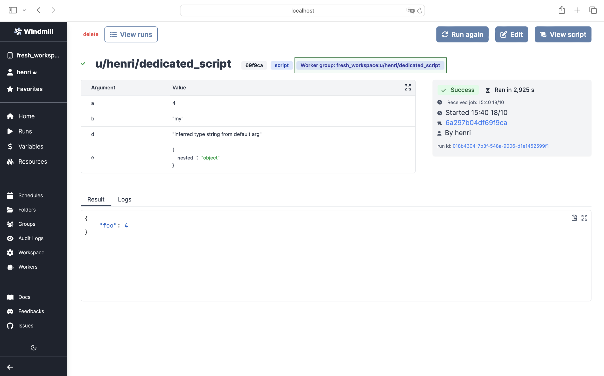

import DocCard from '@site/src/components/DocCard';

# Launch Week Day X: Dedicated Workers

 

Execute jobs targeting a script much faster than normal workers.

## Workers in Windmill

[Workers](/docs/core_concepts/worker_groups) serve as the backbone of Windmill. They are autonomous processes that run one script at a time using the full machines resources available to them.

To put it simply, workers are responsible for executing code in Windmill. Depending on the requirements, you can easily scale the number of workers horizontally without incurring extra overhead. A single Windmill worker is capable of handling up to 26 million tasks a month, with each task taking roughly 100ms.

Typically, workers fetch [jobs](/docs/core_concepts/jobs) from the job queue based on their `scheduled_for` datetime, provided it's in the past. Once a worker retrieves a job, it immediately changes its status to "running", processes it, streams its logs, and upon completion, archives it in the database as a "finished job". Both the final outcome and the logs are preserved indefinitely.

This simple process allows one to reliably count on a small number of workers for very different jobs.
However, there is a **latency between each task** since the worker must perform a clean-up and a cold start between each execution.
This latency amounts to a few milliseconds, which can be crucial in the execution of certain priority jobs:

## Dedicated Workers

Dedicated workers allow you to reverse the situation for chosen workers and scripts.
[Dedicated Workers](/docs/core_concepts/dedicated_workers) are workers that are dedicated to a particular script.
They are able to execute any job that target this script much faster than normal workers at the expense of being capable to only execute that one script.
They are **as fast as running the same logic in a forloop**, but keep the benefit of showing separate jobs per execution:

For now it only works with [bun scripts](/docs/getting_started/scripts_quickstart/typescript) that have been pre-deployed.

## How to do it

From Windmill UI's Workers page:

1. Assign one [worker group](/docs/core_concepts/worker_groups) to execute that script:

The worker group will restart (assuming the pods/restart are set to restart automatically) and will now wait for step 2. below to happen:

2. Toggle the "Dedicated Workers" option for that script in the [script Settings](/docs/script_editor/settings):

The [run](/docs/core_concepts/monitor_past_and_future_runs) will have a Worker Group Tag assigned to it. [Worker Group Tags](/docs/core_concepts/worker_groups) allow to assign custom worker groups to scripts and flows in Windmill for efficient execution on different machines with varying specifications:

## Learn more

	<DocCard
    	title="Workers and Worker Groups"
    	description="Worker Groups allow users to run scripts and flows on different machines with varying specifications."
    	href="/docs/core_concepts/worker_groups"
    />
	  <DocCard
		title="Worker Groups Management UI"
		description="On Enterpris Edition, worker groups can be managed through Windmill UI."
		href="/docs/misc/worker_group_management_ui"
	/>
	<DocCard
		title="Dedicated Workers / High Throughput"
		description="Dedicated Workers are workers that are dedicated to a particular script."
		href="/docs/core_concepts/dedicated_workers"
	/>
	<DocCard
		title="Init Scripts"
		description="Init Scripts are executed at the beginning when the worker starts."
		href="/docs/advanced/preinstall_binaries#init-scripts"
	/>

