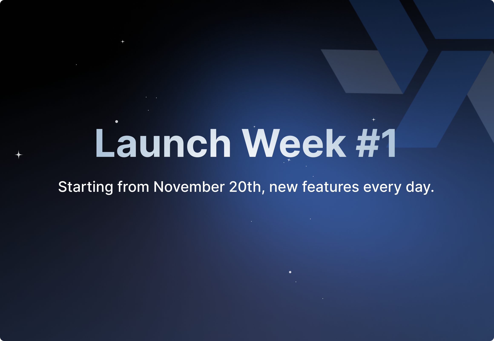

# Launch Week #1

Welcome to Windmill's first Launch Week!

During the week of November 20, 2023, every day we will announce features that make Windmill even more reliable, faster, and easier to use.

A summary will be updated progressively on this page.

## Day 1 - Flow Builder Copilot

THUMBNAIL

The very first feature of this launch week is Windmill AI for flows. This enables the creation of flows-as-code from prompt.
Interdependencies between each step are automatically managed.

It aims to save time for all users by returning a usable version of the flow in seconds, while leaving room for customization as each step is in the form of code.
For less technical users, it's an opportunity to use Windmill while avoiding back-and-forth with Chat-GPT.

- Blog post
- Docs - [Windmill AI for Scripts](/docs/core_concepts/ai_generation#windmill-ai-for-scripts)
- Docs - [Windmill AI for Flows](/docs/core_concepts/ai_generation#windmill-ai-for-flows)
- Docs - [Windmill AI Code Completion](/docs/core_concepts/ai_generation#windmill-ai-code-completion)

<iframe
	style={{ aspectRatio: '16/9' }}
	src="https://www.youtube.com/embed/y-pV6CShdZA?vq=hd1080"
	title="YouTube video player"
	frameBorder="0"
	allow="accelerometer; autoplay; clipboard-write; encrypted-media; gyroscope; picture-in-picture; web-share"
	allowFullScreen
	className="border-2 rounded-xl object-cover w-full dark:border-gray-800"
></iframe>

 

LIEN

## Day 1 - VS Code Extension

THUMBNAIL

Second annoucement of the day is the Windmill [VS Code extension](https://marketplace.visualstudio.com/items?itemName=windmill-labs.windmill).
It allows writing scripts and flows from your code editor with the traditional Windmill UI preview, and to synchronize everything with your workspace.

It's an efficient way to interact with Windmill locally and to integrate it in a CICD flow.

- Blog post
- Docs - [Windmill VS Code Extension](/docs/cli_local_dev/vscode-extension)
- Docs - [Local Development](/docs/advanced/local_development)
- Docs - [Windmill CLI](/docs/advanced/cli)

<iframe
	style={{ aspectRatio: '16/9' }}
	src="https://www.youtube.com/embed/aSOF6AzyDr8?vq=hd1080"
	title="YouTube video player"
	frameBorder="0"
	allow="accelerometer; autoplay; clipboard-write; encrypted-media; gyroscope; picture-in-picture; web-share"
	allowFullScreen
	className="border-2 rounded-xl object-cover w-full dark:border-gray-800"
></iframe>

 

LIEN

## Subscribe to follow our latest announcements

The first announcement will be sent to all our users, you can unsubscribe at any time.

If you want to follow our announcements, <a href="https://app.windmill.dev/" rel="nofollow">sign up to Windmill Cloud</a> or to our mailing list below:

<iframe src="https://cdn.forms-content.sg-form.com/7c42148e-8396-11ee-ba6a-4e3b45e8beb1" width="600px" height="400px"></iframe>