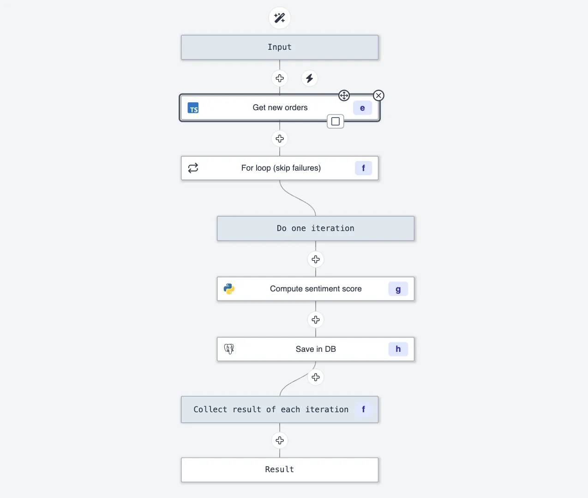
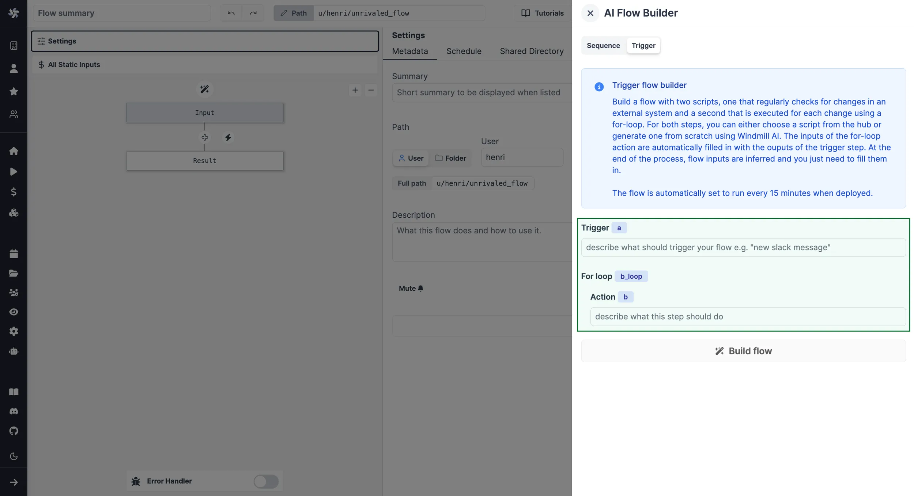
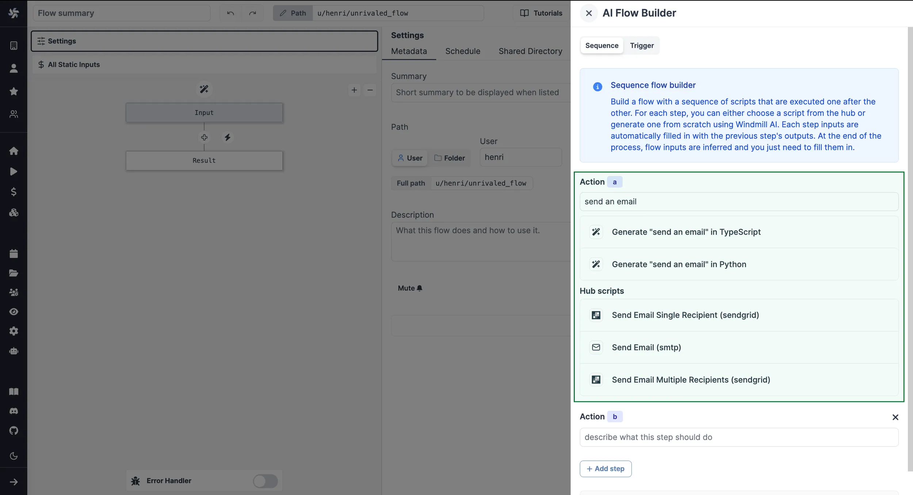

import DocCard from '@site/src/components/DocCard';

# Launch Week Day 1 - Flow Builder Copilot

<video
	className="border-2 rounded-lg object-cover w-full h-full dark:border-gray-800"
	autoPlay
	loop
	src="/videos/ai_flows.mp4"
/>

<br />

Welcome to the first day of the first launch week of Windmill. To follow all the announcements made this week, please go to the [Launch Week #1](../2023-11-15-launch-week-1/index.mdx) page.

We're excited to release a new Windmill AI feature: a copilot for the [flow builder](/docs/flows/flow_editor).
By simply describing your desired workflow in plain English or selecting scripts from [Windmill Hub](https://hub.windmill.dev/), the copilot effortlessly generates each step and connects them automatically.

Here's a quick demo of what the AI flow builder can do:

<iframe
	style={{ aspectRatio: '16/9' }}
	src="https://www.youtube.com/embed/y-pV6CShdZA?vq=hd1080"
	title="YouTube video player"
	frameBorder="0"
	allow="accelerometer; autoplay; clipboard-write; encrypted-media; gyroscope; picture-in-picture; web-share"
	allowFullScreen
	className="border-2 rounded-lg object-cover w-full dark:border-gray-800"
></iframe>

<br />

At the same time, we're also releasing a new feature for the [script editor](/docs/script_editor), a code completion copilot
which prompts you with suggestions based on the code you're writing. This completes our already existing
copilot which allows you to generate, edit and fix your scripts, learn more here:

<div className="grid grid-cols-2 gap-6 mb-4">
	<DocCard
		title="Windmill AI for Scripts"
		description="Have AI complete code on Windmill."
		href="/docs/core_concepts/ai_generation#windmill-ai-for-script"
	/>
</div>

Have a look:

<video
	className="border-2 rounded-lg object-cover w-full h-full dark:border-gray-800"
	controls
	src="/videos/code_autopilot.mp4"
/>

<br />

:::tip
To enable Windmill AI, you simply have to setup an OpenAI API key in your workspace settings. There is also a toggle to enable or disable code completion. More info in the [docs](/docs/core_concepts/ai_generation).
:::

These features complement Windmill AI for Scripts, which lets you generate whole scripts using prompts and fix your errors automatically:

<div className="grid grid-cols-2 gap-6 mb-4">
	<DocCard
		title="Windmill AI for Scripts"
		description="Generate Windmill-specific code from simple text"
		href="/docs/core_concepts/ai_generation#code-generation"
	/>
</div>

We are using [GPT-4-turbo (1106-preview version)](https://platform.openai.com/docs/models/gpt-4-and-gpt-4-turbo) for the AI Flow Builder and have changed Windmill AI for Scripts to use it too, as it is faster, three times cheaper and more up-to-date with libraries than GPT-4. We observed similar results to those obtained with GPT-4 in our tests, but we will continue to monitor the quality of the generations.

## What are Windmill Flows?

Workflows are graphs ([DAG](https://en.wikipedia.org/wiki/Directed_acyclic_graph)) that represent the dependencies between steps.
The goal of an orchestrator or workflow engine is to execute the steps on different workers that respect that graph's dependencies, and pass the required data defined in the steps' inputs while applying parallelism when possible.
In Windmill, each step is code with a main function in TypeScript, Python, Go, PHP, Bash or raw queries to databases.

The primitives supported by Windmill workflows are:

- sequence
- branch based on conditions
- branch to all subbranches
- For Loops
- approval/waiting for event steps
- sub flows

You can see below an example of a simple workflow with a [for-loop](/docs/flows/flow_loops):



:::info Workflow engine vs Analytics engine
All the examples above focus on small api integrations but data pipeline that would usually be run on dedicated analytics engine are a great fit for Windmill when combined with s3, and dataframe/olap libraries such as polars or duckdb.
Indeed, thanks to these integrations and Windmill's lack of boilerplate, Windmill offers state-of-the-art performances for data processing at scale while keeping complexity low.

<br />

Furthermore, and since Windmill simply orchestrates code using well known code libraries, the AI Copilot is capable to generate full, expert written data pipeline as well.

<br />

We will have much more to share in the next coming days.
:::

## Why add a flow builder copilot?

Workflows can be quite complex and tedious to create, therefore we decided to build an AI copilot to help users create workflows faster and easier.
However, asking GPT-4-turbo to generate a complete workflow is too hard of a problem: it is too difficult to control and would most of the time deviate from the user's intent.

A good compromise is to first have users give a structured prompt that mirrors the layout of the workflow graph:



Then, the AI assistant takes care of building the workflow, one step at a time.
It generates the code based on the given prompt and workflow context, and more importantly, it establishes the data connections between the steps.
At the end of each step, the user can review and edit each step as desired.

And if they're not happy with their instructions, they can always edit the instructions and regenerate the step or even the whole flow:

<video
	className="border-2 rounded-lg object-cover w-full h-full dark:border-gray-800"
	controls
	src="/videos/ai_flow_regenerate.mp4"
/>

<br />

Therefore, users get the best of both worlds: most of the boilerplate and tedious aspects of workflows are accelerated by AI, but they stay in full control of the creation process.

Sometimes, generating a step's script from scratch is not necessary as there could be a script in the [Hub](https://hub.windmill.dev/) that already does what the user wants, so we intelligently suggest them based on the user's instructions:



And if they want even more control, they can ask to generate only one step anywhere in the flow graph:

<video
	className="border-2 rounded-lg object-cover w-full h-full dark:border-gray-800"
	controls
	src="/videos/ai_flow_onestep.mp4"
/>

## How did we build it?

:::info
This section is a bit more technical and describes how you too can become an AI startup<sup>TM</sup>. It is the continuation of our previous blog post about [how we added an AI copilot to our script editor](/blog/windmill-ai) which you can read first for more context.
:::

### AI Flow Builder

#### Generating a step from scratch

We use a prompt very similar to the one in Windmill AI for Scripts to generate the steps' code.
However, we also wanted to make sure that the generated script would match the previous step output.
Therefore, we indicate that the previous output will be passed as `prev_output` and we pass the previous step's script so that it can infer the output's type.

Here's our prompt template:

````
I'm building a workflow which is a sequence of script steps. Write a script in {codeLang} which should {description}.
It should take a parameter called "prev_output" which contains the output of the previous script.
Infer the type of "prev_output" from the previous\'s step code: ```{codeLang}\n{prevCode}\n```
Return the script's output.

<contextual_information>
...some contextual information (check the previous blog post or the code for more details)...
</contextual_information>
````

Knowing that the previous step's output is expected as `prev_output` allows us to fill in the step's inputs automatically.

#### Integrating Hub scripts

When selecting a Windmill Hub script instead of generating a step from scratch, we do not know what input should receive the output of the previous step, therefore we ask GPT-4-turbo to fill in the step's inputs based on the previous step's code and the selected script's inputs.
Here's the template we use:

````
I'm building a workflow which is a sequence of script steps.
My current step code has the following inputs: {inputs}.
Determine what to pass as inputs. You can only use the following:
- `flow_input` (javascript object): general inputs that are passed to the workflow,
	you can assume any object properties.
- `results.{prevId}` (javascript object): previous output is the output of the previous step.
	Infer its type from the previous step code: ```{codeLang}\n{prevCode}\n```

Reply in the following format:
input_name: expr
````

We parse the AI's response using a Regex expression: `/([a-zA-Z_0-9]+): (.+)/g` which matches a valid input name followed by an expression containing any characters, separated by a colon and space.
We're then able to create and fill in the step's inputs.

#### Trigger flows and for-loops

When building a trigger flow (a scheduled script which checks for new items and a for-loop executing an action for each new item), we use a slightly different prompt for the first step to better guide the generation:

```
I'm building a workflow which is a sequence of script steps.
Write the first script in {codeLang} which should check for {description} and return an array.
To maintain state across runs, you can use "const {state_name}: {state_type} = await getState()"
and "await setState(value: any)" which you have to import like this: import { getState, setState } from "windmill-client@1"

<contextual_information>
...some contextual information (check the previous blog post or the code for more details)...
</contextual_information>
```

The prompt for the for-loop action is the same as for a normal step. We simply wrap it in a for-loop module and adapt the step's input to take only one element at a time.
You can learn more about triggers [here](/docs/flows/flow_trigger) and for-loops [here](/docs/flows/flow_loops).

You can find all our prompts [in our codebase](https://github.com/windmill-labs/windmill/blob/main/frontend/src/lib/components/copilot/flow.ts)

### Code completion

We were quite happy with our existing script copilot which helps you generate, edit and fix your scripts, but as developers ourselves we realized that the most useful and time saving feature was code completion.
We thought that it would be too slow or too expensive, but after some testing and optimization, we realized that it was actually quite fast, cheap (thanks to GPT-3.5-turbo) and powerful.
You can learn more about it below.

For code completion, we use GPT-3.5-turbo instead of GPT-4-turbo as it is good enough for this use case but much faster and cheaper.
When enabled, we send the whole code and specify where it should fill in the code. Here's our prompt template:

````
complete the following code:
```{language}
{before}<completion></completion>{after}
```
````

We replace `{before}` and `{after}` with the code before and after the user's cursor position.

We also pass a system prompt (aka global instructions):

```
You are a code completion assistant, return the code that should go
inside the <completion></completion> tags.
If you add a line break, take into account the indentation of the code.
You can also not return anything if you think the code is already complete.
```

It's quite basic but it works well enough.
To make sure that GPT-3.5 returns answers in the correct format, we pass a small example example along with each request,
In the future, we plan on passing more context to generate better suggestions.

A request is sent only in certain cases, for example when the user types a space or parenthesis.
We implement some debouncing to avoid sending too many requests and cancel the previous request if a new one is sent before the previous one is finished.
We leverage monaco editor's [inline completions api](https://microsoft.github.io/monaco-editor/docs.html#functions/languages.registerInlineCompletionsProvider.html) to display the suggestions the same way as Github copilot in VS Code.

You can find all our code for code completion [here](https://github.com/windmill-labs/windmill/blob/main/frontend/src/lib/components/copilot/completion.ts) and [here](https://github.com/windmill-labs/windmill/blob/2d9878647be60288a6d2d8b0c72af84464eefd9c/frontend/src/lib/components/Editor.svelte#L364).

## Learn More

This is just the first day of the launch week! To learn more about the launch week, you can visit our [dedicated page](../2023-11-15-launch-week-1/index.mdx) or subscribe via our [newsletter sign up form](https://cdn.forms-content.sg-form.com/7c42148e-8396-11ee-ba6a-4e3b45e8beb1).

To learn more about Windmill AI, please refer to our documentation:

<div className="grid grid-cols-2 gap-6 mb-4">
	<DocCard
		title="Windmill AI"
		description="Have AI complete code on Windmill."
		href="/docs/core_concepts/ai_generation"
	/>
</div>
