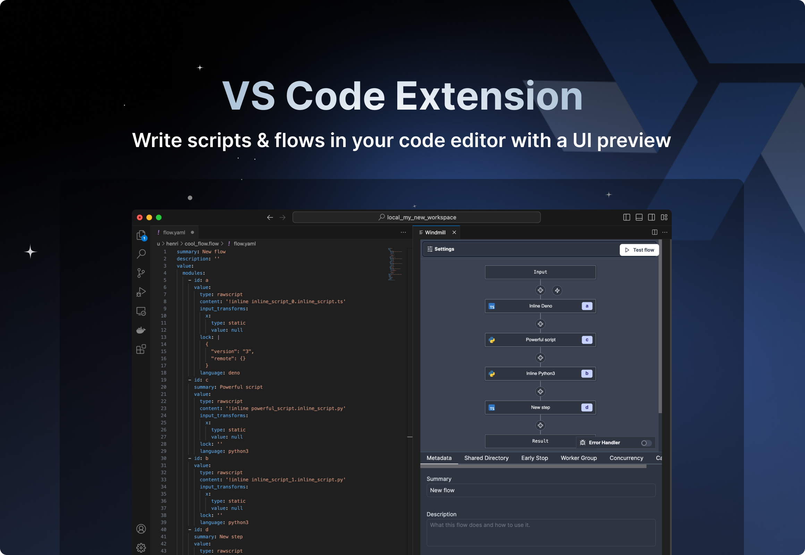
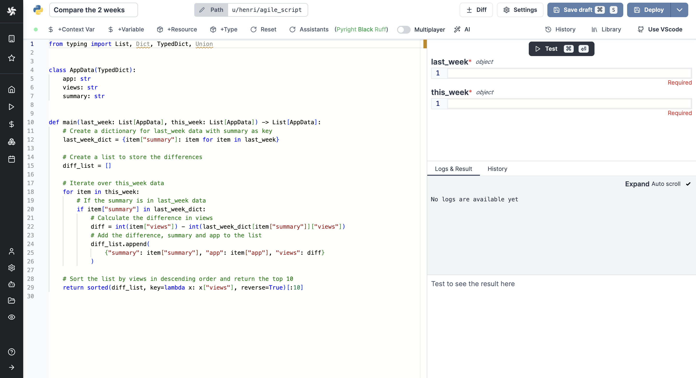
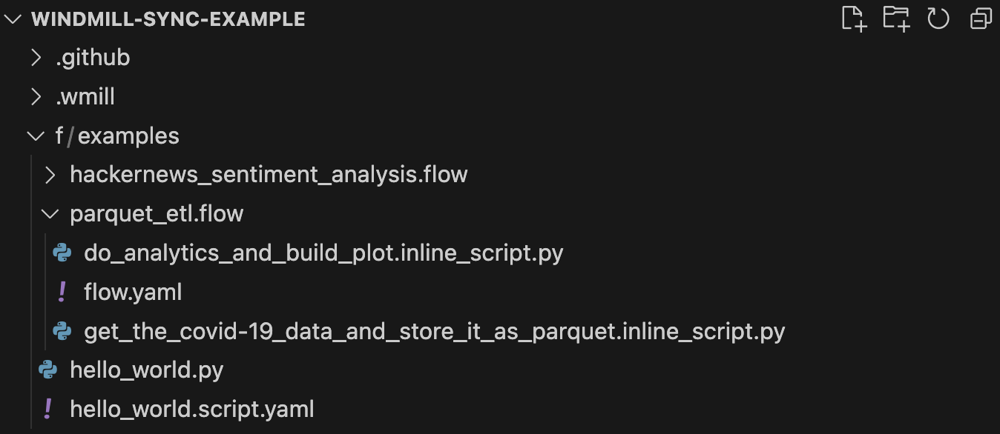

import DocCard from '@site/src/components/DocCard';

# Launch Week Day 1: VSCode Extension

Welcome to the first day of the first launch week of Windmill. To follow all the announcements made this week, please go to the [Launch Week #1](../2023-11-15-launch-week-1/index.mdx) page.

Introducing the new Windmill [VS Code extension](https://marketplace.visualstudio.com/items?itemName=windmill-labs.windmill) to build scripts and flows in the comfort of your VS Code Editor, while leveraging Windmill UIs for test & flows edition.

<iframe
	style={{ aspectRatio: '16/9' }}
	src="https://www.youtube.com/embed/aSOF6AzyDr8?vq=hd1080"
	title="YouTube video player"
	frameBorder="0"
	allow="accelerometer; autoplay; clipboard-write; encrypted-media; gyroscope; picture-in-picture; web-share"
	allowFullScreen
	className="border-2 rounded-xl object-cover w-full dark:border-gray-800"
></iframe>

## Why a VS Code Extension

Windmill has its own IDE for creating [scripts](/docs/script_editor) and [flows](/docs/flows/flow_editor) from the Windmill application (cloud or [self-hosted](/docs/advanced/self_host)).

> Example of Windmill's own IDE for building scripts.

 

The Windmill UI allows you to edit direcly the deployed scripts & flows, which is great for maintenance and quick prototyping.

However in many production settings it is more common to version everything from git and to that end we have a [CLI](/docs/advanced/cli) to sync a workspace to a local directory and the inverse operation (deploy local directory to a workspace).
With this new extension, you can now efficiently edit scripts & flows directly from there.

## How It Works

1. First of all, have your workspace synced locally with [Windmill CLI](/docs/advanced/cli).

> [Example repo](https://github.com/windmill-labs/windmill-sync-example) opened in VS Code. We see 2 flows and 1 script, the flows are their own folders, each step in a flow is a seperate file in their respective language. Scripts have their metadata in a seperate file.

 

With [wmill sync pull](/docs/advanced/cli/sync#pulling-1) and [wmill sync push](/docs/advanced/cli/sync#pushing-1) you can synchronize your remote workspace to a local directory which you would version with GitHub / GitLab.

2. Install the [extension](https://marketplace.visualstudio.com/items?itemName=windmill-labs.windmill).

3. Enter your Windmill remote URL and [token](/docs/core_concepts/webhooks#user-token), so the extension can execute scripts and flows on your workspace.

4. From any script file, use `> Windmill: Run preview in the current editor` or Ctrl+Enter and Shift+Enter to generate the UI preview (provided that the script meets the [few rules](/docs/core_concepts/json_schema_and_parsing#json-schema-in-windmill) required by Windmill).

The extension will split your screen and display a panel. That panel will update automatically based on the edited document on the left.
- When editing a script (or a flow step), you see the script [preview UI](/docs/core_concepts/auto_generated_uis) with the [auto-inference of the parameters](/docs/core_concepts/json_schema_and_parsing).
- When editing a flow YAML, you it contains the flow builder and the flow [test UI](/docs/core_concepts/auto_generated_uis).

In particular:

### Test scripts, flows and flows steps from VS Code

<video
  className="border-2 rounded-xl object-cover w-full h-full dark:border-gray-800"
  autoPlay
  loop
  src="/videos/vs_code_tour.mp4"
/>

### Editing the YAML definition of a flow instantly updates the rendered graph

<video
  className="border-2 rounded-xl object-cover w-full h-full dark:border-gray-800"
  autoPlay
  loop
  src="/videos/ui_to_yaml.mp4"
/>

### Editing the flow from the UI immediately modifies the YAML definition

<video
  className="border-2 rounded-xl object-cover w-full h-full dark:border-gray-800"
  autoPlay
  loop
  src="/videos/yaml_to_ui.mp4"
/>

 

	<DocCard
		title="Command-Line Interface - Sync"
		description="Sync with a Windmill workspace from Windmill CLI."
		href="/docs/advanced/cli/sync"
	/>

## Learn More

This is just the first day of the launch week! To learn more about the launch week, you can visit our [dedicated page](../2023-11-15-launch-week-1/index.mdx) or subscribe via our [newsletter sign up form](https://cdn.forms-content.sg-form.com/7c42148e-8396-11ee-ba6a-4e3b45e8beb1).

To learn more about the VS Code extension, please refer to our documentation:

	<DocCard
		title="VS Code Extension"
		description="You can also use VS Code with the extension to run scripts & flows on the remote."
		href="/docs/cli_local_dev/vscode-extension"
	/>

