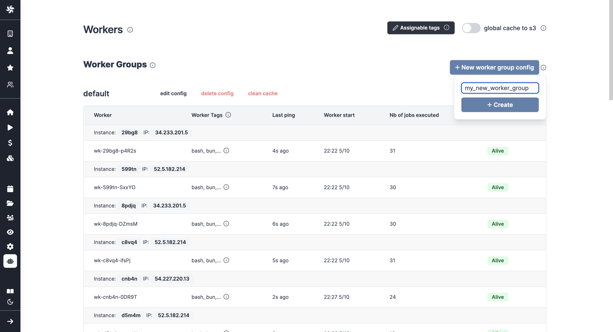
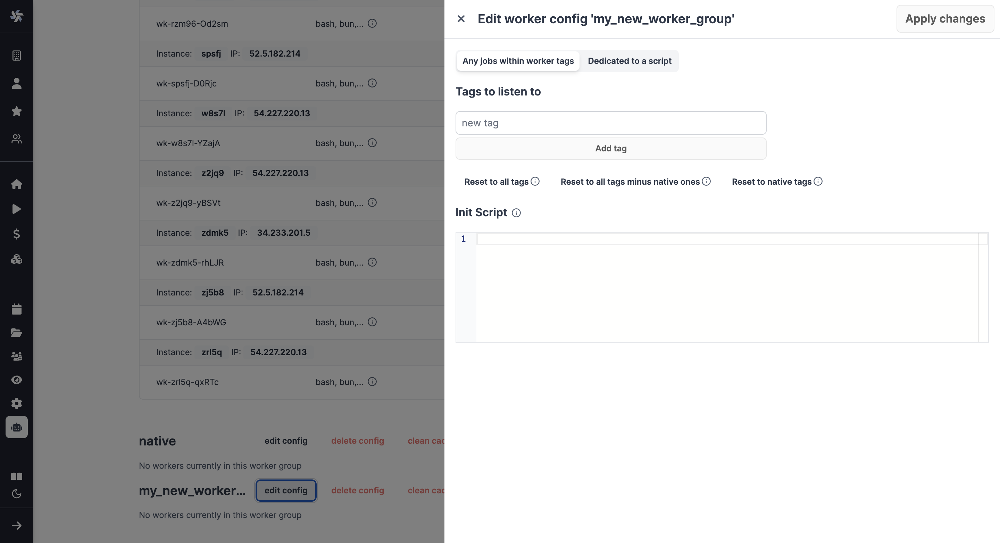

import DocCard from '@site/src/components/DocCard';

# Launch Week Day 2 - Worker Groups Configuration

 

Welcome to the second day of Windmill's first launch week. To follow all the announcements made this week, please go to the [Launch Week #1](https://www.windmill.dev/blog/launch-week-1) page.

Today we are unveiling features related to workers.
[Workers](/docs/core_concepts/worker_groups) are the foundation of Windmill. They are autonomous processes that run one script at a time using the entire cpu and memory available to them.

We are proud to announce:
1. Worker groups to share configurations to your workers, especially to allocate the execution of certain scripts or flows according to their priority (this article).
2. Why we are the fastest self-hostable workflow engine (other release).

## Why setting Worker Groups Configuration?

In Windmill, workers pull [jobs](/docs/core_concepts/jobs) from the queue of jobs in the order of their `scheduled_for` datetime as long as it is in the past.
As soon as a worker pulls a job, it atomically sets its state to "running", runs it, streams its logs then once it is finished,
the final result and logs are stored for as long as the retention period allows. Logs are optionally stored to s3.

In other words, workers run the jobs. The number of workers can be horizontally scaled up or down depending on needs without any overhead.
Each worker on Windmill can run up to 26 millions jobs a month, where each job lasts approximatively 100ms.

By default, every worker is the same and interchangeable.
However, there are often needs to assign jobs to a specific worker pool, and to configure this worker pool to behave specifically.
To that end, we introduce the concept of "worker groups".

Examples of configurations include:
- [Give tags to workers](#give-tags-to-worker-groups) to assign specific jobs to them.
- [Set an init script](#set-an-init-script) that will run at the start of the workers (e.g. to pre-install binaries).
- [Dedicate your worker to a specific script or flow](#dedicate-your-worker-to-a-specific-script-or-flow), for high throughput.

### Give tags to worker groups

[Giving tags to workers](/docs/core_concepts/worker_groups#how-to-assign-worker-tags-to-a-worker-group) will change their behavior to only listen to those same tags in the job queue to be executed.
On the script side, you have to assign those tags which will be posted to the jobs and directly assigned to the worker groups corresponding to the tag.

 

	<DocCard
    	title="Worker Groups and Tags"
    	description="Worker Groups allow users to run scripts and flows on different machines with varying specifications."
    	href="/docs/core_concepts/worker_groups"
    />

### Set an init script

[Setting an init script](/docs/advanced/preinstall_binaries#init-scripts) to a worker group configuration will automatically trigger a Bash script whenever the workers are started.
This approach offers added convenience to pre-install binaries or set initial configurations without the need to modify the base image.

 

	<DocCard
		title="Init Scripts"
		description="Init Scripts are executed at the beginning when the worker starts."
		href="/docs/advanced/preinstall_binaries#init-scripts"
	/>

### Dedicate your worker to a specific script or flow

[Dedicated Workers](/docs/core_concepts/dedicated_workers) are workers (groups) that are dedicated to a particular script.
They are able to execute any job that target this script much faster than normal workers at the expense of being capable to only execute that one script.
They are as fast as running the same logic in a forloop, but keep the benefit of showing separate jobs per execution.

 

	<DocCard
		title="Dedicated Workers / High Throughput"
		description="Dedicated Workers are workers that are dedicated to a particular script."
		href="/docs/core_concepts/dedicated_workers"
	/>

## How to do it

In a [self-hosted](/docs/advanced/self_host) instance, worker groups are created from your `docker-compose.yml` by simply passing the worker group as the env variable `WORKER_GROUP=worker_group_name`.
It is as simple as that and means that workers can be scaled horizontally.

The configuration of worker groups is done from the Windmill UI's [Workers page](/docs/core_concepts/worker_groups), pick "New worker group config" and just write the name of your worker group.

You can then configure it directly from the UI.

<iframe
    style={{ aspectRatio: '16/9' }}
    src="https://www.youtube.com/embed/LbjgWKFQWJc?vq=hd1080"
    title="YouTube video player"
    frameBorder="0"
    allow="accelerometer; autoplay; clipboard-write; encrypted-media; gyroscope; picture-in-picture; web-share"
    allowFullScreen
    className="border-2 rounded-xl object-cover w-full dark:border-gray-800"
></iframe>

## Learn more

	<DocCard
    	title="Workers and Worker Groups"
    	description="Worker Groups allow users to run scripts and flows on different machines with varying specifications."
    	href="/docs/core_concepts/worker_groups"
    />
	  <DocCard
		title="Worker Groups Management UI"
		description="On Enterpris Edition, worker groups can be managed through Windmill UI."
		href="/docs/misc/worker_group_management_ui"
	/>
	<DocCard
		title="Dedicated Workers / High Throughput"
		description="Dedicated Workers are workers that are dedicated to a particular script."
		href="/docs/core_concepts/dedicated_workers"
	/>
	<DocCard
		title="Init Scripts"
		description="Init Scripts are executed at the beginning when the worker starts."
		href="/docs/advanced/preinstall_binaries#init-scripts"
	/>

