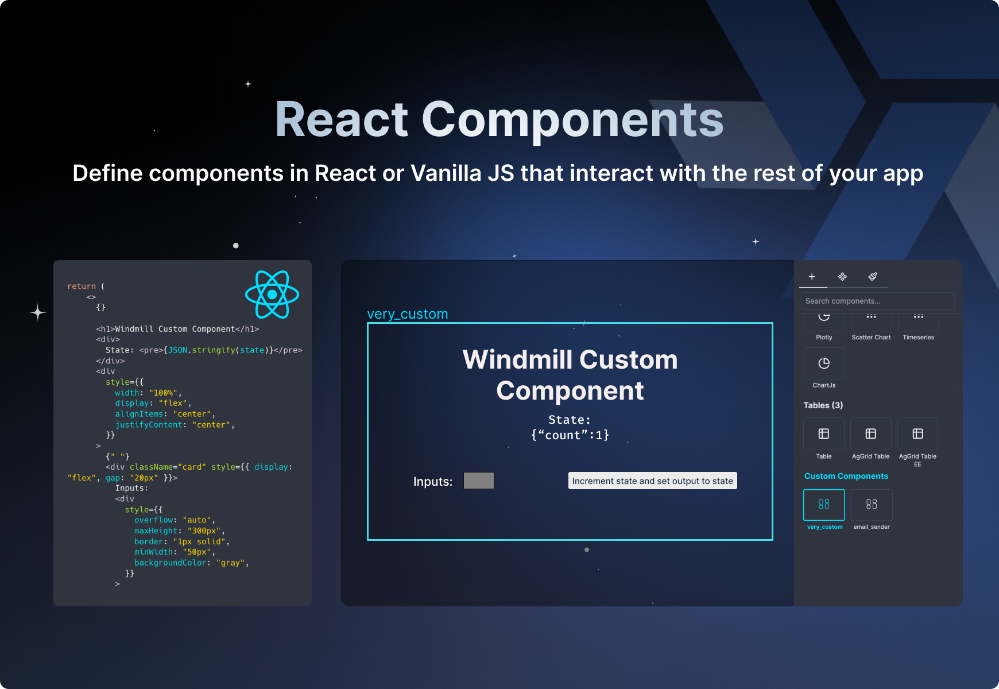

import DocCard from '@site/src/components/DocCard';

# Launch Week Day 4 - Custom React Components



Day 4 of our Launch Week is dedicated to the [App Editor](/docs/apps/app_editor). The app editor is a low-code builder to create custom User Interfaces with components linked to runnables (scripts & flows).

Windmill already provides over [sixty components](/docs/apps/app_configuration_settings/app_component_library) for its users, accessible with a simple drag-and-drop. For more control and standardization with your existing stack, you might want to import your own Apps in React.

:::info React

If you're looking for a way to:
- Import whole react apps to Windmill, see [React App Import](/docs/react_vue_svelte_apps/react).
- Integrate Windmill applications into React-based project, see [Windmill React SDK](/docs/misc/react_sdk).

:::

Once imported to a Windmill app, custom React components will be able to interact with the rest of the app.

There are 3 main benefits of using your own components:
1. Reusing react components you've already written in other codebases.
2. Controlling fully the component including theming, inputs and outputs allowing for more complex components and interactions.
3. Embeding very complex components such as code editor so you are never limited by the built-in components.

## How to import react components to the App Editor

<iframe
	style={{ aspectRatio: '16/9' }}
	src="https://www.youtube.com/embed/LO83BKAe6zg?vq=hd1080"
	title="YouTube video player"
	frameBorder="0"
	allow="accelerometer; autoplay; clipboard-write; encrypted-media; gyroscope; picture-in-picture; web-share"
	allowFullScreen
	className="border-2 rounded-xl object-cover w-full dark:border-gray-800"
></iframe>

<br/>

1. Clone the [template project](https://github.com/windmill-labs/windmill-custom-component-template).
2. Install the dependencies:

```bash
npm install
```

3. Start the development server:

```bash
npm run dev
```

4. Open your browser to see the live result.

5. Start editing the `src/Component.tsx` file to start building your component.

6. Edit COMPONENT_NAME in `vite.config.ts` to match your component name. It will
   be useful later.

7. Build the iife using:

```bash
npm run build
```

8. Upload the `dist/cc.iife.js` to Windmill and name the component as it has been named in `vite.config.ts`.


## Learn more

To learn more about the launch week, you can visit our [dedicated page](../2023-11-15-launch-week-1/index.mdx) or subscribe via our [newsletter sign up form](https://cdn.forms-content.sg-form.com/7c42148e-8396-11ee-ba6a-4e3b45e8beb1).

For more details on React Components, see:

<div class="grid grid-cols-2 gap-2 my-4">
	<DocCard
		color="orange"
		title="Import Custom React Components"
		description="Define components in React or Vanilla JS that interact with the rest of your app."
		href="/docs/apps/react_components"
	/>
	<DocCard
		color="orange"
		title="React App Import"
		description="Import your own React app in Windmill App Editor."
		href="/docs/react_vue_svelte_apps/react"
	/>
	<DocCard
		color="orange"
		title="Windmill React SDK"
		description="The Windmill React SDK provides a suite of tools and components to integrate Windmill applications into React-based projects."
		href="/docs/misc/react_sdk"
	/>
</div>