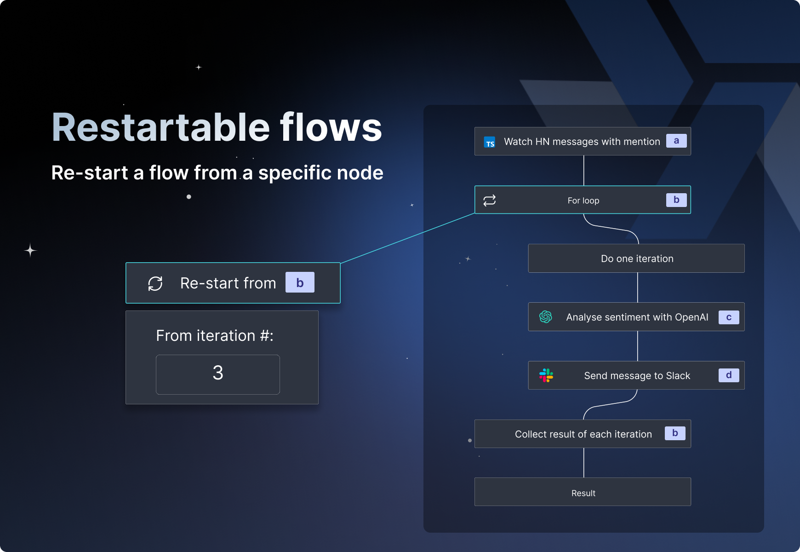

import DocCard from '@site/src/components/DocCard';

# Launch Week Day 5 - Restartable Flows

 

 

Last day of our launch week today (we know it's sad). Before saying goodbye, we want to tell you about features that will help you in your ETL, with restartable flows (this article) and S3 integration for data pipelines (link to the blog).

The principle is simple: once the flow is executed (whether in test or deployed), you have the possibility to restart it from any node (step, iteration of a for loop, or branch).

For testing, it's great because you can restart from a specific node without recomputing the flow.

For prod, it's great because you can skip the already completed part of the flow avoiding duplicate actions (in particular, ensure data integrity).

This feature is part of the logic of the different ways to iterate over a flow ([testing the entire flow](/docs/flows/test_flows#test-flow), [only one step](/docs/flows/test_flows#test-this-step), or [up to a certain step](/docs/flows/test_flows#test-up-to-step)).

## How to restart a flow from a given node

<iframe
	style={{ aspectRatio: '16/9' }}
	src="https://www.youtube.com/embed/5_NRFmUxfW0?vq=hd1440"
	title="YouTube video player"
	frameBorder="0"
	allow="accelerometer; autoplay; clipboard-write; encrypted-media; gyroscope; picture-in-picture; web-share"
	allowFullScreen
	className="border-2 rounded-xl object-cover w-full dark:border-gray-800"
></iframe>

 

In the [flow preview page](/docs/core_concepts/instant_preview), just select a top level node and a "Re-start from X" button will appear at the top, next to "Test flow".

## Learn more

To learn more about the launch week, you can visit our [dedicated page](../2023-11-15-launch-week-1/index.mdx) or subscribe via our [newsletter sign up form](https://cdn.forms-content.sg-form.com/7c42148e-8396-11ee-ba6a-4e3b45e8beb1).

For more details on instant preview & testing, see:

	<DocCard
    	title="Instant Preview & Testing"
    	description="Windmill allows users to see and test what they are building directly from the editor, even before deployment."
    	href="/docs/core_concepts/instant_preview"
    />

