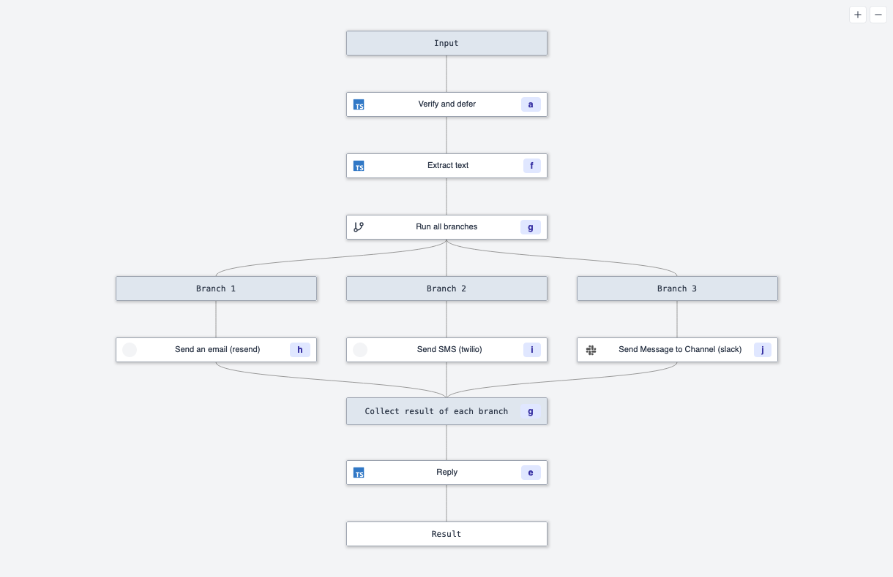

import DocCard from '@site/src/components/DocCard';

For developers working with Discord bots, Windmill's new [Early Return](/docs/flows/early_return) feature is a practical solution to a common challenge: ensuring your bot responds quickly to commands, especially when dealing with complex workflows.

### The Challenge with Discord Bots

[Discord requires bots to respond to commands within 3 seconds](https://discordjs.guide/message-components/interactions.html#responding-to-component-interactions), which can be limiting when your bot needs to execute multiple steps.

### Early Return

Windmill recently introduced a new feature called [Early Return](/docs/flows/early_return), which allows a [flow](/docs/flows/flow_editor) to return at a given step synchronously, while the rest of the flow continues to execute asynchronously.

<DocCard
	title="Early Return"
	description="Learn how to use Early Return to build a Discord bot."
	href="/docs/flows/early_return"
/>

### How early return helps

#### Immediate Response

When a Discord command triggers a Windmill workflow, the flow quickly processes the first step and returns a response to Discord.

#### Background Workflow Continuation

The rest of the workflow is then handled asynchronously, allowing your flow to complete more complex tasks without being constrained by the initial response time.

### Example

For example, let's say you want to build a bot that broadcasts a message to other services like Slack, Email, and SMS. You can use Windmill to build a workflow that sends the message to each service in parallel, and then returns a response to Discord once the messages have been sent.

<!-- @Faton add video example here -->

We've recently updated our blog post on the knowledge-based bot to include the implementation of the new Early Return feature. You can read about the update [here](/blog/knowledge-base-discord-bot)!