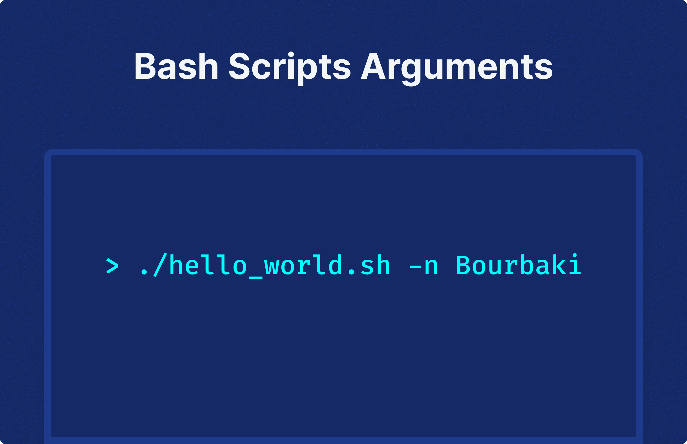

# Bash Script Arguments



[Bash](https://en.wikipedia.org/wiki/Bash_(Unix_shell)) scripts have long been a trusted companion for developers. They are the preferred choice for software installation, system automation, and report generation.{/* truncate */} The best part? They can operate directly on numerous systems without any special tools. However, as your scripts become more intricate, you'll need to start incorporating user input to enable the script to function in various ways. This is where arguments come into play.

In this tutorial, we'll delve into the different methods of passing arguments into your bash scripts, managing those arguments, and enhancing your scripts using some readily available tools.

## The Purpose of Bash Scripts

Bash scripts are a method to automate a sequence of commands. They are frequently used for:

1. **Automated file processing**: Bash scripts excel at handling tasks like converting files from one format to another, merging files from various sources, or extracting specific information from files. They are particularly adept with text-based files.
2. **System information queries**: Bash scripts are invaluable for fetching details about the system they operate on. They are often used to check current memory usage, determine available files and ports on the system, and more.
3. **Universal scripting language**: Bash scripts provide a universal platform to run scripts from any programming language, allowing them to be executed through the shell regardless of the language used to write them.

## The Trio of Bash Script Arguments

There are three primary methods to utilize bash script arguments: positional, iterative, and through flags.

### Positional Arguments

Positional arguments are up to nine data points that a bash script can access once it's invoked. With positional arguments, every value that needs to be passed into the script must be entered into the command line following the script's name. For example, if we possess a script named `hello_world.sh` and we want the script to reply with a specific individual's name, we might invoke our script like this:

```bash
./hello_world.sh Ruben
```

Bash interprets "Ruben" as the first argument due to the space between the script's name and "Ruben". Now that "Ruben" is an argument, it can be accessed as a variable within the script.

Bash provides the variables `$0` through `$9` for positional arguments. `$0` is always the name of the script being executed, which is useful to refer to any aspect of the script within the script itself. However, since "Ruben" is the first argument, it is accessible under variable `$1`.

```bash
#!/bin/bash
echo "Hello, $1."
```

Executing this script gives us:

```bash
> ./hello_world.sh Ruben

Hello, Ruben.
```

### Looping Through Multiple Arguments

When you have more than 9 arguments or you want the script to be more adaptable, looping can be a useful tool. Let's see how you could modify your "Hello World" script to greet several people.

```bash
#!/bin/bash

for var in "$@"
do
    echo "Hello, $var."
done
```

Now every name passed as an argument will get some personal greeting.

```bash
> ./hello_world.sh Ruben Faton Henri Hugo

Hello, Ruben.
Hello, Faton.
Hello, Henri.
Hello, Hugo.
```

### Flags

Positional arguments are straightforward and easy to use, but they require users to remember the sequence of arguments to be passed and are restricted to 9 each time you invoke your script. If you begin to encounter these limitations, flags are another alternative.

A flag consists of a distinct character preceded by a dash, typically signifying a particular aspect of the data it denotes. For instance, you could use `-n` as a flag for our name argument.

```bash
#!/bin/bash
while getopts n: flag

do
        case "${flag}" in
                n) name=${OPTARG}
                         ;;
                *) echo "Invalid option: -$flag" ;;
        esac
done

echo "Hello, $name."
```

Running the revised script with the newly-introduced flag results in:

```bash
> ./hello_world.sh -n Ruben

Hello, Ruben.
```

Flags introduce a more structured way for users to engage with your script. However, it's crucial to clearly present all available flags to users and implement robust error-handling to address any incorrect usage of these flags.

## Documenting Script Arguments

It's usual to include the documentation within the script itself, accessible either through a specific flag or displayed automatically when flags are used incorrectly.

### Adding a Help Flag

A practical approach to offer this documentation is to incorporate a help flag, like `-h`, which users can employ to retrieve detailed information on how to use the different flags when running your script.

```bash
help() {
techo "usage: ./hello_world.sh [-n <name>][-h]"
}
```

### Handling Incorrect Option Calls with Help Text

We've defined a `help()` function. Additionally, we can make this information available to users who might not request it directly but use the script incorrectly. This function can provide users with detailed explanations on the correct usage of flags in our script.

```bash
#!/bin/bash

greet() {
techo "Hello, $1."
}

help() {
techo "usage: ./hello_world.sh [-n <name>][-h]"
}

while getopts n:h flag

do
        case "${flag}" in
                n) greet "$OPTARG";;
                h) help ;;
                *) echo "Invalid option: -$flag." && help ;;
        esac
done
```

## Windmill: Supercharge your Shell Scripts

Bash script arguments greatly enhance the flexibility of your scripts by accommodating diverse user inputs. By enabling users to provide various pieces of information, which in turn alter the script's output, your scripts become applicable in a wider range of situations.

For [Bash scripts in Windmill](/docs/getting_started/scripts_quickstart/bash#code), arguments are passed in a straightforward manner — similar to how you would in any Bash script. Here’s a quick overview of how arguments can be structured within your scripts:

1. **Passing Arguments to Bash Scripts**: Arguments are passed to scripts in the order they are provided. For example, the first argument is accessible within the script as `$1`, the second as `$2`, and so forth. This allows you to tailor the behavior of your scripts based on the inputs provided at runtime.

2. **Default Values for Arguments**: Windmill also supports setting default values for arguments in Bash scripts. This is done using the typical Bash syntax for default values: `${2:-default_value}`. This means if the second argument isn't provided, it defaults to `default_value`.

3. **Example of Bash Script with Arguments**:

    ```bash
    #!/bin/bash
    msg="$1"
    dflt="${2:-default value}"
    echo "Hello $msg"
    ```

4. **Use Case**: You could use arguments to customize the behavior of your scripts based on user input, environment conditions, or other scripts. This makes your Windmill scripts more reusable and adaptable to different scenarios.

5. **Output Handling**: The last line of stdout is considered the return value, which can be particularly useful if the script is used in a Windmill workflow or application, where you might want to pass the result on.

<video
	className="border-2 rounded-lg object-cover w-full h-full dark:border-gray-800"
	controls
	id="bash_quickstart"
	src="/videos/bash_quickstart.mp4"
/>

<br/>

Windmill is an open-source developer platform and workflow engine to build internal tools. It helps you transform scripts into auto-generated UIs, APIs and cron jobs. Windmill also supports coding in TypeScript, Python, Go, PHP, Bash, C#, SQL and Rust, or any Docker image.

To explore Windmill and make your shell scripts user-friendly for your team, even those unfamiliar with the command line, refer to the [documentation](https://www.windmill.dev/docs/).