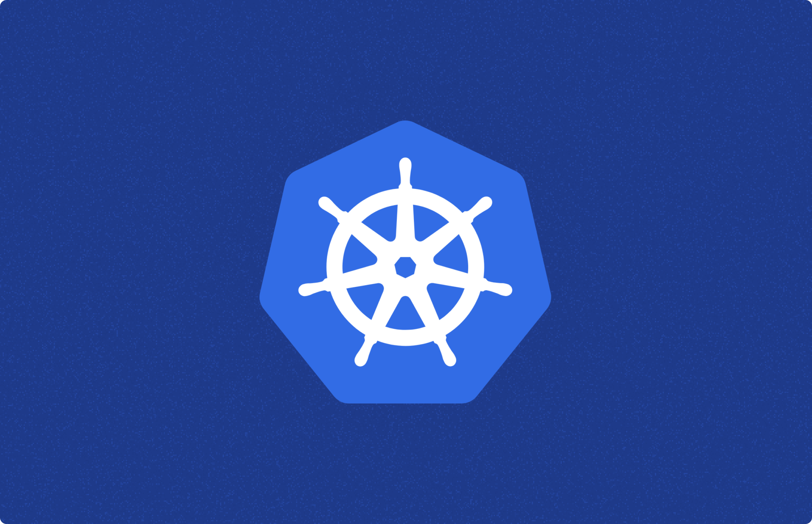

# Restarting a Kubernetes Pod with Kubectl



In the [Kubernetes](https://kubernetes.io/) world, the smallest API object we deal with is the [pod](https://kubernetes.io/docs/concepts/workloads/pods/). Think of it as the basic building block of Kubernetes. A pod represents a running application process within a cluster and contains one or more containers along with shared resources like storage and network. 

The status of a pod provides a snapshot of its current lifecycle stage. There are five stages in total. But what happens when something goes awry with your pod? Perhaps a bug causes an unexpected termination. In such cases, you'll need to restart your Kubernetes pod. This guide will show you how to do just that using [kubectl](https://kubernetes.io/docs/reference/kubectl/).

## Why Would You Need to Restart a Pod?

There are several reasons why you might need to restart your pods:

- Your pod terminated unexpectedly due to an out-of-memory error.
- You're modifying resource specifications.
- You're dealing with persistent volumes.

## How to Restart Kubernetes Pods Using Kubectl

In Docker, you can use `docker restart {container_id}` to restart a container. However, Kubernetes doesn't have a similar restart command. In other words, `kubectl restart {podname}` doesn't exist.

But don't worry, there are several ways to restart a Kubernetes pod using kubectl, even without a YAML file. Let's explore these options.

## Option 1: kubectl scale

If you don't have a YAML file, you can quickly scale the number of replicas to zero using the `kubectl scale` command:

```
kubectl scale deployment shop --replicas=0 -n service
kubectl get pods -n service
```

The Deployment object isn't a direct pod object, but a ReplicaSet object, which includes the number of replicas and the pod template.

To restart the pod, set the number of replicas to at least one:

```
kubectl scale deployment shop --replicas=2 -n service
```

And voila! Your Kubernetes pods have successfully restarted.

## Option 2: kubectl rollout restart

While the first method is quick, the simplest way to restart Kubernetes pods is using the `rollout restart` command. This command kills one pod at a time, relying on the ReplicaSet to scale up new pods. It's the ideal approach because your application won't be affected or go down.

To roll out a restart, use the following command:

```
kubectl rollout restart deployment <deployment_name> -n <namespace>
```

## Option 3: kubectl delete pod

Kubernetes is a declarative API, so the pod API object will contradict the expected one after deleting it. It will automatically recreate the pod to keep it consistent with the expected one. However, if the ReplicaSet manages many pod objects, deleting them manually one by one can be a hassle. You can use the following command to delete the ReplicaSet:

```
kubectl delete replicaset <name> -n <namespace>
```

## Option 4: kubectl get pod

Use the following command:

```
kubectl get pod <pod_name> -n <namespace> -o yaml | kubectl replace --force -f -
```

This command gets the YAML statement of currently running pods and pipes the output to `kubectl replace`, achieving a restart.

## Wrapping Up

In this guide, we've introduced you to Kubernetes pods and why you might need to restart them. Generally, the most recommended way to ensure no application downtime is to use `kubectl rollout restart deployment <deployment_name> -n <namespace>`. 

Windmill is an [open-source](https://github.com/windmill-labs/windmill) developer platform and workflow engine to build internal tools. It can turn scripts into auto-generated UIs, APIs, and cron jobs. It supports coding in TypeScript, Python, Go, PHP, Bash, SQL, or any Docker image. You can [self-host](/docs/advanced/self_host) Windmill within your own environment.

Windmill runs on Kubernetes and [workers](/docs/core_concepts/worker_groups) can be easily scaled up and down to meet performance needs.

The Helm chart can be found on [GitHub](https://github.com/windmill-labs/windmill-helm-charts).