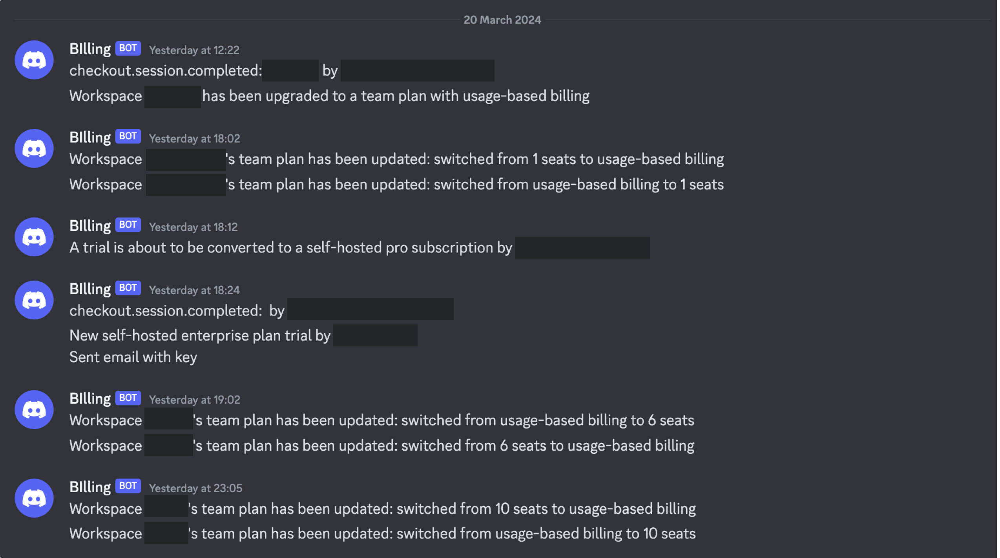
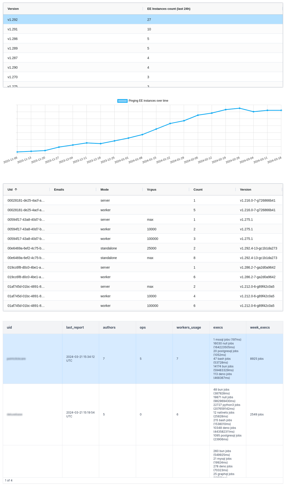
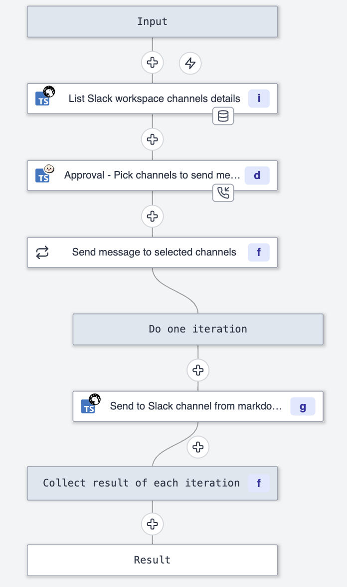
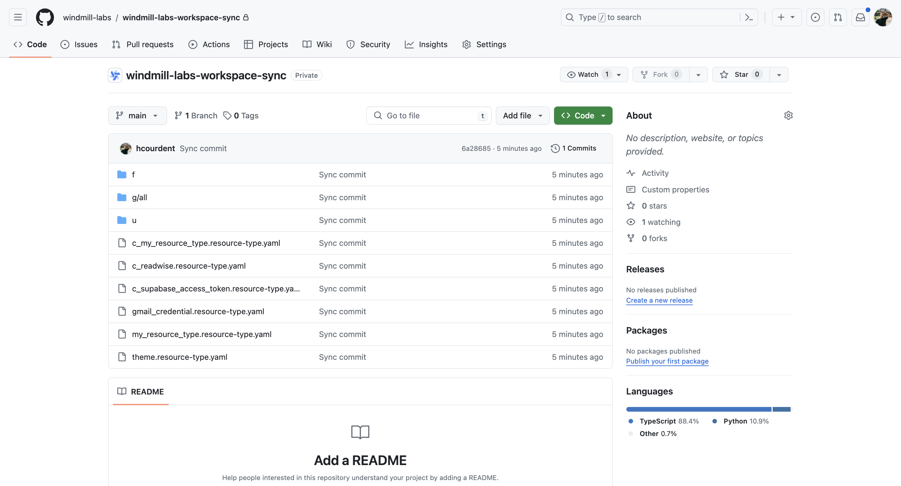
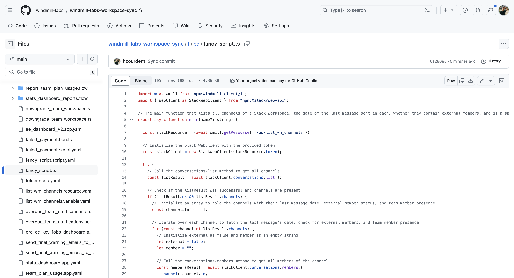

# How Windmill uses Windmill

The good thing of being a devtool company is that your developers use their own tools on a daily basis (it would be more complicated to get them motivated with accounting software).

To showcase some examples of what can be done with Windmill, here are a few use cases of Windmill by the Windmill team (knowing that we are always surprised by how much further our clients go than us on our own product).

## Stripe bots

[Stripe](https://stripe.com/) is a powerful tool and trusted by thousands of customers. But it must be said that sometimes we don't understand why some simple things are so complicated to do from Stripe without having to resort to tricks.

We try to build a self-serve product with [transparent pricing](/pricing) and very [clear steps for upgrading](/docs/misc/plans_details). We have created several automations on Stripe to automatically generate an Enterprise Edition license key upon each subscription, send it by email to the customer, and inform our dedicated channels on Discord. We are also informed when a trial is converted or when it churns (in theory only, of course). We have similar automations for the Team plans on the Cloud, adjusting workspaces based on Stripe subscription status. Additionally, a [schedule](/docs/core_concepts/scheduling) is used to report Team plan usage to Stripe.

## Schedule app report usage platform

For [Enterprise Self-Hosted](/pricing) users, Windmill employs lightweight telemetry to automatically track and report the usage of vCPUs and seats of the subscription. We only count the vCPUs reported by the workers as being used (limits can be set in the docker-compose to avoid being overcharged).

From there, we can centralize all of this in a dashboard with several pieces of information (versions in use, number of executions, workers usage).

This dashboard is sent to our team daily on a [schedule](/docs/core_concepts/scheduling) thanks to the [App Report](/docs/apps/schedule_reports) feature, which sends the PDF or PNG of a given app according to a configured frequency.

## Approval flow to send shared messages to Slack and Discord

We use [Slack](https://slack.com/) to communicate with our clients and partners, and [Discord to interact with our community](https://discord.com/invite/V7PM2YHsPB) and some clients as well.

For certain common announcements (e.g., changelog), we cannot afford to send the same message to all channels. But at the same time, manually sending each message to all channels is tedious and risks getting things mixed up.

We created a flow to:

1. List all the channels on the Slack workspace (we made the script cooler by checking for each channel if it contains members from outside the company (based on the email domain) and the date of the last message sent). The script can be found on [Windmill Hub](https://hub.windmill.dev/scripts/slack/7124/list-slack-channels%2C-last-message-date%2C-and-whether-it-contains-external-members-slack#approved).
2. Through an [approval step](/docs/flows/flow_approval), return all the channels and let the user choose which channels to send the message to.
3. Send the message to each selected channel.

The whole flow can be found on [Windmill Hub](https://hub.windmill.dev/flows/53/list-slack-channels-and-send-shared-message-to-selected-channels).

It takes as input:

- A [Slack resource](/docs/integrations/slack) that contains the token to read and write to Slack.
- The message to be sent (it will be converted in the last step from markdown to markdown compatible with Slack).
- "Internal Channels Only," a boolean that, if true, will make the workflow return only channels without external members.
- "Exclude those partners?" an array of strings that allows having certain channels by default that will not be suggested (and avoid blunders).
- "Max date last message sent," if you want to filter only the most recent messages

A very [similar flow is used for Discord](https://hub.windmill.dev/flows/54/list-discord-channels-and-send-shared-message-in-thread), the only difference is that it splits the message to [create a thread of several messages](https://hub.windmill.dev/scripts/discord/7123/create-discord-thread-and-send-messages-discord#approved) (due to the darn character limit on Discord).

## Git Sync

Like any team, we can make mistakes, and like most developers, we are used to GitHub for version control.

That's why our internal workspace at Windmill is synced with a GitHub repository using the [Git Sync](/docs/advanced/git_sync) feature.

In this way, each new deployment in our workspace is automatically committed to our GitHub. For the most critical scripts, we have set up a git workflow so that scripts deployed on our staging workspace [create a Pull Request on GitHub before being deployed on the production workspace](/docs/advanced/deploy_gh_gl).