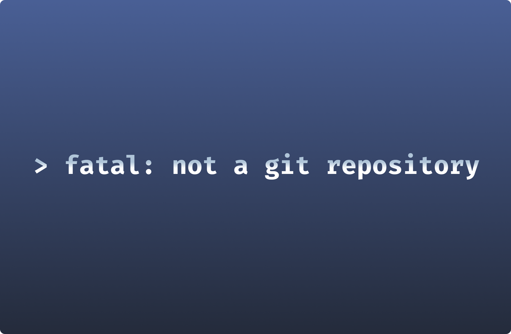

# Resolving the "Fatal: Not a Git Repository" Error



Let's be honest. It's a situation familiar to everyone. You're cruising along with your Git workflow, feeling like an expert, and suddenly - BAM! An error message pops up, looking as though it's in a foreign language. But don't fret. You're not alone. This guide will help you tackle one of the most common Git errors:

```
fatal: not a git repository (or any of the parent directories): .git
```
Let's break this down, shall we?

## What's this error all about?

If you're new to Git, the terms 'repository' and '.git' might sound like techno-babble. A repository (or 'repo' for the cool kids) is simply a directory where Git stores all the important details about your project's history. When you create a Git repository, Git sets up a .git folder in your project directory to hold this history. 

When you try to run a Git command, it first checks for this .git folder to get the lowdown on your project. If it can't find this info, you get the error message above. 

Also, Git checks the parent directories of your current directory for the .git folder. This is why you see the "(or any of the parent directories)" part of the error message. This feature lets you move to child directories in a Git-tracked project and still use Git commands. 

## Initial Troubleshooting Steps

In essence, the "fatal: not a git repository" error means that Git isn't tracking your current working directory. If you're facing this error, here are two things you should check:

1. Did you mistype the path to the repo?
2. Was the repo properly created?

If you've already checked these and you're still stuck, skip to the "Advanced Troubleshooting" section below.

### Checking Your Current Directory

First things first, check if you've correctly navigated to or referenced the path to the repo. To do this, navigate to the repo:
```
cd <directory_name>
```
Next, check if a .git directory exists in it. Note that the .git repository is hidden by default in file managers like Explorer or Finder. You can use the `ls -al` command to list all files and folders in your current directory, including hidden ones like the .git directory (for Windows, use `dir /a`).

If the .git repository doesn't exist in your working directory, make sure you didn't initialize it in a different one instead. If not, move on to the next step.

### Verifying Repository Initialization

If you're sure you're in the right working directory but the .git directory doesn't exist, something might have gone wrong when you tried to create the repo. You can fix this in two ways:

1. Initialize the repo by running `git init`
2. Clone an existing repo with `git clone <url>` and then navigate into it with `cd <repo_name>`

Don't forget the last step. When you clone a repo, Git creates a new child directory in your current working directory for your project, so you need to navigate into it.

## Detailed Troubleshooting Methods

If the basic troubleshooting steps didn't solve the problem, you might have an issue with the HEAD file. This file contains a single line indicating your current branch. 

A branch is a version of your repository that you can use to test changes to your project. Every repository has a main branch that acts as your source of truth. When you create a new branch, Git updates the HEAD file to indicate your current working branch.

Sometimes, the HEAD file can get corrupted, which can also trigger the "fatal: not a git repository (or any of the parent directories): .git" error. To check the HEAD file, use the `cat .git/HEAD` command to print the contents.

If it doesn't contain the current branch you're working on, you'll have to update the file. You can do this with the following command:
```
echo 'ref: refs/heads/<branch_name>' > .git/HEAD
```
## Final Thought

Encountering the "fatal: not a git repository" error doesn't have to be a hair-pulling experience. Just remember that Git is trying to tell you that your current working directory isn't being tracked. Follow the steps outlined in this guide and you should be back on track in no time.

Windmill has its how git workflow system for version control called [Git Sync](/docs/advanced/git_sync). This enables automatic committing and pushing of scripts, flows, and apps to the repository upon each deployment. This integration is crucial for version control and for ensuring that changes made within the Windmill IDE are reflected in your Git repository, thus supporting a smooth development workflow.

To start building your first scripts, workflows and UIs, [sign up for a free account](https://app.windmill.dev/user/login) or [self-host Windmill](/docs/advanced/self_host).