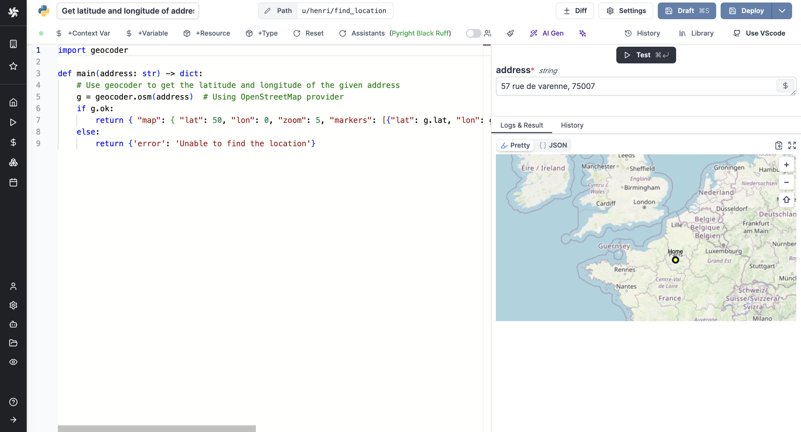

# 10 Useful Python Scripts


Developers often rely on an assortment of [Python](https://www.python.org/) scripts to manage and integrate different components of their projects. These scripts serve as essential tools, linking various processes within a project's architecture. While scripts usually aren't overly complicated, managing them can become a repetitive and time-consuming task.

{/* truncate */}

To make things easier, consider automating your scripts. This approach eliminates the need for you to manually run scripts. Instead, you can schedule them to run automatically at certain times or when specific things happen. This not only saves you time but also helps reduce the hassle of repetitive tasks.

In this blog post, we will explore ten Python scripts that stand out due to their versatility, user-friendliness, and their ability to decrease your daily workload. These scripts vary from simple to moderately challenging and are primarily focused on manipulating text and managing files. We will delve into each script’s specific applications and libraries, providing a clear guide on how to integrate them effectively into your operations.

## Use Windmill to create, run and monitor Python Scripts

Windmill is an open-source developer platform and workflow engine designed to build comprehensive internal tools (endpoints, workflows, UIs). It supports coding in TypeScript, Python, Go, PHP, Bash, C#, SQL and Rust, or any Docker image, alongside intuitive low-code builders, including:

- An [execution runtime](/docs/script_editor) for scalable, low-latency function execution across a worker fleet.
- An [orchestrator](/docs/flows/flow_editor) for assembling these functions into efficient, low-latency flows, using either a low-code builder or YAML.
- An [app builder](/docs/apps/app_editor) for creating data-centric dashboards, utilizing low-code or JS frameworks like React.

To run Python scripts in Windmill, you first need access to Windmill (free on our [Cloud App](https://app.windmill.dev/user/login), free and unlimited [self-hosting](/docs/advanced/self_host)) then just click on `+ Script`. It can also be done on local development with [Windmill CLI](/docs/advanced/cli/script#creating-a-new-script).

<video
	className="border-2 rounded-lg object-cover w-full h-full dark:border-gray-800"
	autoPlay
	controls
	id="Add Python script"
	src="/videos/python_quickstart.mp4"
/>

<br/>

A Python script in Windmill consists of two parts: the code and the settings that include metadata and configurations. The code must have at least a main function. Once the Python environment is set up, you can proceed to write your script.

Windmill automatically manages [dependencies](/docs/advanced/imports) for you. When you import libraries in your Python script, Windmill parses these imports upon saving the script and automatically generates a list of dependencies. It then spawns a dependency job to associate these PyPI packages with a lockfile, ensuring that the same version of the script is always executed with the same versions of its dependencies.

Here is a simple example of a Python script in Windmill that performs sentiment analysis:

```python
import nltk
from nltk.sentiment import SentimentIntensityAnalyzer
nltk.download("vader_lexicon")

def main(text: str = "Wow, NLTK is really powerful!"):
    return SentimentIntensityAnalyzer().polarity_scores(text)
```

Once your Python script is deployed in Windmill, it can be utilized in various ways:

1. **Run and Schedule**: Scripts can be run as standalone tasks or [scheduled](/docs/core_concepts/scheduling) to execute at specified intervals. This is useful for automating tasks such as data collection, processing, and reporting.
   
2. **Chained in flows**: Scripts can be chained together with other scripts to create complex [workflows](/docs/flows/flow_editor). This allows you to build sophisticated automation sequences that can handle tasks spanning multiple operational domains.
   
3. **Integrated into Apps**: Deployed scripts can be integrated into user interfaces created with Windmill's [App Builder](/docs/apps/app_editor). This enables the development of interactive applications that leverage the backend logic contained within your scripts.

## Python Scripts

Let's start exploring the Python scripts that could make you the coolest person in the office.

### Generate random passwords

There are numerous applications for generating strong, random passwords, including onboarding new users, facilitating password reset procedures, and updating passwords during credential rotation. A simple, dependency-free Python script can automate this process efficiently:

```py
import string
import random

def main(length: int) -> str:
    # Define the characters that can be used in the password
    characters = string.ascii_letters + string.digits + string.punctuation

    # Generate a random password of the specified length
    password = "".join(random.choice(characters) for i in range(length))

    return password
```

<div className="flex flex-row gap-2">
    <a
      type="button"
      tag="no_follow"
      href="https://app.windmill.dev/scripts/add?hub=hub%2F8763%2Fwindmill%2FGenerate%20random%20password%20of%20specified%20length"
      target="_blank"
      className="flex items-center gap-2 rounded-md bg-[#4285F4] px-4 py-2 text-sm font-semibold text-white shadow-sm hover:bg-blue-600 hover:text-white focus-visible:outline focus-visible:outline-2 focus-visible:outline-offset-2 focus-visible:outline-indigo-600"
    >
      <span className="text-white">Try this script on Windmill</span>
    </a>
    <a
      type="button"
      href="https://hub.windmill.dev/scripts/windmill/7163/generate-random-password-of-specified-length-windmill"
      target="_blank"
      className="flex items-center gap-2 rounded-md bg-blue-50 px-4 py-2 text-sm font-semibold text-gray-900 hover:text-gray-900 hover:bg-blue-100 focus-visible:outline focus-visible:outline-2 focus-visible:outline-offset-2"
    >
      See on Hub
    </a>
</div>


### Get content from Wikipedia

[Wikipedia](https://www.wikipedia.org/) offers an excellent broad overview of numerous topics. This information can be utilized to enhance transactional emails, monitor updates in specific articles, or develop training materials and reports. Fortunately, gathering this information is straightforward using the [Wikipedia package](https://pypi.org/project/wikipedia/) for Python.

You can output an array of pages matching the search term with wikipedia.search

```py
import wikipedia

def main():
    search_pages = wikipedia.search("windmill")
    
    return(search_pages)
```

If you already have a particular page in mind from which you want to extract content, you can do so directly:

```py
import wikipedia

def main(page: str = "Nicolas Bourbaki"):
    page_content = wikipedia.page(page).content
    return(page_content)
```

<div className="flex flex-row gap-2">
    <a
      type="button"
      tag="no_follow"
      href="https://app.windmill.dev/scripts/add?hub=hub%2F8769%2Fwindmill%2FFetch%20Wikipedia%20page%20content"
      target="_blank"
      className="flex items-center gap-2 rounded-md bg-[#4285F4] px-4 py-2 text-sm font-semibold text-white shadow-sm hover:bg-blue-600 hover:text-white focus-visible:outline focus-visible:outline-2 focus-visible:outline-offset-2 focus-visible:outline-indigo-600"
    >
      <span className="text-white">Try this script on Windmill</span>
    </a>
    <a
      type="button"
      href="https://hub.windmill.dev/scripts/windmill/7168/fetch-wikipedia-page-content-windmill"
      target="_blank"
      className="flex items-center gap-2 rounded-md bg-blue-50 px-4 py-2 text-sm font-semibold text-gray-900 hover:text-gray-900 hover:bg-blue-100 focus-visible:outline focus-visible:outline-2 focus-visible:outline-offset-2"
    >
      See on Hub
    </a>
</div>

### Get location from addresses

Finding addresses through programming proves useful in delivery logistics or for pinpointing key spots.

The [geocoder](https://geocoder.readthedocs.io/) library can return a latitude and longitude from an address.

Then, these details can be used by Windmill (via the [Rich Display](/docs/core_concepts/rich_display_rendering) feature in scripts and flows, or via the [map](/docs/apps/app_configuration_settings/map) component of the App editor) to display a map with one or more visible markers.



```py
import geocoder

def main(address: str) -> dict:
    # Use geocoder to get the latitude and longitude of the given address
    g = geocoder.osm(address)  # Using OpenStreetMap provider
    if g.ok:
        return { "map": { "lat": 40, "lon": 0, "zoom": 3, "markers": [{"lat": g.lat, "lon": g.lng, "title": "Home", "radius": 5, "color": "yellow", "strokeWidth": 3, "strokeColor": "Black"}]}}
    else:
        return {'error': 'Unable to find the location'}
```

<div className="flex flex-row gap-2">
    <a
      type="button"
      tag="no_follow"
      href="https://app.windmill.dev/scripts/add?hub=hub%2F8766%2Fwindmill%2FGet%20latitude%20and%20longitude%20of%20address"
      target="_blank"
      className="flex items-center gap-2 rounded-md bg-[#4285F4] px-4 py-2 text-sm font-semibold text-white shadow-sm hover:bg-blue-600 hover:text-white focus-visible:outline focus-visible:outline-2 focus-visible:outline-offset-2 focus-visible:outline-indigo-600"
    >
      <span className="text-white">Try this script on Windmill</span>
    </a>
    <a
      type="button"
      href="https://hub.windmill.dev/scripts/windmill/7166/get-latitude-and-longitude-of-address-windmill"
      target="_blank"
      className="flex items-center gap-2 rounded-md bg-blue-50 px-4 py-2 text-sm font-semibold text-gray-900 hover:text-gray-900 hover:bg-blue-100 focus-visible:outline focus-visible:outline-2 focus-visible:outline-offset-2"
    >
      See on Hub
    </a>
</div>

### Find patterns from regular expressions

Gathering data from unstructured sources can often be quite laborious. Python simplifies this with its capability for precise pattern matching through regular expressions. This functionality is useful for sorting text in a data-processing sequence or for identifying particular keywords or patterns (phone numbers, mail addresses, credit card numbers) within content submitted by users. The standard library for regular expressions in Python is named [re](https://docs.python.org/3/library/re.html). Once you master the syntax of regular expressions, you can automate nearly any script that requires pattern matching.

```py
import re
from typing import List


def main(
    text: str = "Example of text with several numbers formats \n Los Pollos Hermanos \n 8500 Pan American Fwy NE, \n Albuquerque, NM 87113, USA \n 505-503-4455 \n 234-455-9493 ") -> List[str]:
    phoneRegex = re.compile(
        r"""(
        (\d{3}|\(\d{3}\))?                 # area code
        (\s|-|\.)?                             # separator
        (\d{3})                               # first 3 digits
        (\s|-|\.)                               # separator
        (\d{4})                               # last 4 digits
        (\s*(ext|x|ext.)\s*(\d{2,5}))?    # extension
        )""",
        re.VERBOSE,
    )

    matches = []
    for numbers in phoneRegex.findall(text):
        matches.append(numbers[0])

    return matches
```

<div className="flex flex-row gap-2">
    <a
      type="button"
      tag="no_follow"
      href="https://app.windmill.dev/scripts/add?hub=hub%2F8768%2Fwindmill%2FExtract%20phone%20numbers%20from%20text"
      target="_blank"
      className="flex items-center gap-2 rounded-md bg-[#4285F4] px-4 py-2 text-sm font-semibold text-white shadow-sm hover:bg-blue-600 hover:text-white focus-visible:outline focus-visible:outline-2 focus-visible:outline-offset-2 focus-visible:outline-indigo-600"
    >
      <span className="text-white">Try this script on Windmill</span>
    </a>
    <a
      type="button"
      href="https://hub.windmill.dev/scripts/windmill/7165/extract-phone-numbers-from-text-windmill"
      target="_blank"
      className="flex items-center gap-2 rounded-md bg-blue-50 px-4 py-2 text-sm font-semibold text-gray-900 hover:text-gray-900 hover:bg-blue-100 focus-visible:outline focus-visible:outline-2 focus-visible:outline-offset-2"
    >
      See on Hub
    </a>
</div>

### SEO analysis

Performing a thorough SEO (Search Engine Optimization) analysis on a website is crucial for understanding its potential visibility in search engine results. Python, with its powerful libraries, offers a streamlined approach to automate the extraction and analysis of SEO-related data from websites. This can significantly enhance strategies for web presence optimization. Below is a Python script that leverages tools like [Beautiful Soup](https://pypi.org/project/beautifulsoup4/) to provide a comprehensive SEO analysis of a given website.

```py
import requests
from bs4 import BeautifulSoup
from collections import Counter
import re

def main(url: str) -> dict:
    """
    Perform advanced SEO analysis on the given website URL using Beautiful Soup.

    Parameters:
    - url (str): The URL of the website to analyze.

    Returns:
    - dict: A dictionary containing advanced SEO analysis results including title length,
      number of headings, presence of meta description, meta tags, text-to-HTML ratio,
      canonical link, keyword density, mobile friendliness, and link health.
    """
    try:
        # Send a GET request to the URL
        response = requests.get(url)
        # Parse the HTML content of the page
        soup = BeautifulSoup(response.text, "html.parser")

        # SEO analysis
        seo_analysis = {}

        # Get the title of the page and its length
        title = soup.find("title").text if soup.find("title") else "No title found"
        seo_analysis["title"] = title
        seo_analysis["title_length"] = len(title)

        # Count the number of headings (h1, h2, h3, h4, h5, h6)
        headings = {f"h{i}": len(soup.find_all(f"h{i}")) for i in range(1, 7)}
        seo_analysis["headings_count"] = headings

        # Check for meta description
        meta_description = soup.find("meta", attrs={"name": "description"})
        seo_analysis["meta_description"] = (
            meta_description["content"]
            if meta_description
            else "No meta description found"
        )

        # Additional meta tags
        meta_robots = soup.find('meta', attrs={'name': 'robots'})
        seo_analysis['meta_robots'] = meta_robots['content'] if meta_robots else 'No robots meta tag'

        # Canonical link
        canonical_link = soup.find('link', rel='canonical')
        seo_analysis['canonical_link'] = canonical_link['href'] if canonical_link else 'No canonical link'

        # Text to HTML Ratio
        text_length = len(soup.get_text())
        html_length = len(response.text)
        seo_analysis['text_to_html_ratio'] = text_length / html_length if html_length > 0 else 0

        # Keyword Density (Example: assuming 'example_keyword' is the keyword)
        words = re.findall(r'\w+', soup.get_text().lower())
        word_count = Counter(words)
        total_words = sum(word_count.values())
        focus_keyword = 'example_keyword'
        keyword_density = word_count[focus_keyword] / total_words if focus_keyword in word_count and total_words > 0 else 0
        seo_analysis['keyword_density'] = keyword_density

        # Mobile Friendliness
        seo_analysis['mobile_friendly'] = 'yes' if 'viewport' in (meta_description["content"].lower() if meta_description else '') else 'no'

        # Link Analysis
        links = soup.find_all('a', href=True)
        seo_analysis['total_links'] = len(links)
        seo_analysis['nofollow_links'] = sum(1 for link in links if 'nofollow' in link.get('rel', []))
        seo_analysis['external_links'] = sum(1 for link in links if link['href'].startswith('http'))
        seo_analysis['internal_links'] = seo_analysis['total_links'] - seo_analysis['external_links']

        return seo_analysis
    except Exception as e:
        return {"error": str(e)}
```
<div className="flex flex-row gap-2">
    <a
      type="button"
      tag="no_follow"
      href="https://app.windmill.dev/scripts/add?hub=hub%2F8761%2Fscraping%2FPerform%20advanced%20SEO%20analysis%20on%20website%20URL"
      target="_blank"
      className="flex items-center gap-2 rounded-md bg-[#4285F4] px-4 py-2 text-sm font-semibold text-white shadow-sm hover:bg-blue-600 hover:text-white focus-visible:outline focus-visible:outline-2 focus-visible:outline-offset-2 focus-visible:outline-indigo-600"
    >
      <span className="text-white">Try this script on Windmill</span>
    </a>
    <a
      type="button"
      href="https://hub.windmill.dev/scripts/scraping/7161/perform-advanced-seo-analysis-on-website-url-scraping"
      target="_blank"
      className="flex items-center gap-2 rounded-md bg-blue-50 px-4 py-2 text-sm font-semibold text-gray-900 hover:text-gray-900 hover:bg-blue-100 focus-visible:outline focus-visible:outline-2 focus-visible:outline-offset-2"
    >
      See on Hub
    </a>
</div>

### Extract text from a PDF

Extracting text from PDF documents is a common requirement across various applications such as content digitization, data processing, and document management. Python, with its rich ecosystem of libraries, offers a straightforward method to accomplish this. Below is a Python script that utilizes the [PyPDF2](https://pypi.org/project/PyPDF2/) library to extract text from a PDF and return it as a .txt file.

In Windmill scripts, [file inputs must be typed](/docs/core_concepts/json_schema_and_parsing#script-parameters-to-json-schema) with `bytes`, and they will automatically be converted into a [base64 encoded string](https://en.wikipedia.org/wiki/Base64). Similarly, results that are intended to be [directly downloadable](/docs/core_concepts/rich_display_rendering) are handled as base64 encoded strings. This functionality facilitates the seamless integration and manipulation of file data within the Windmill scripting environment.

```py
import io
import base64
from PyPDF2 import PdfReader

def main(pdf: bytes) -> dict:
    # Create a PdfReader instance
    reader = PdfReader(io.BytesIO(pdf))
    
    # Initialize an empty string to collect all the text
    full_text = ""
    
    # Iterate through all the pages and extract text
    for page in reader.pages:
        page_text = page.extract_text()
        if page_text:
            full_text += page_text + "\n"  # Add a newline character to separate pages
    
    # Encode the full text to a byte stream
    encoded_text = base64.b64encode(full_text.encode('utf-8')).decode('utf-8')
    
    # Return the file content and filename in the desired format
    return {
        "file": {
            "content": encoded_text,
            "filename": "content.txt"
        }
    }
```

<div className="flex flex-row gap-2">
    <a
      type="button"
      tag="no_follow"
      href="https://app.windmill.dev/scripts/add?hub=hub%2F7164%2Fwindmill%2FExtract%20text%20from%20PDF%20and%20return%20it%20as%20TXT%20file"
      target="_blank"
      className="flex items-center gap-2 rounded-md bg-[#4285F4] px-4 py-2 text-sm font-semibold text-white shadow-sm hover:bg-blue-600 hover:text-white focus-visible:outline focus-visible:outline-2 focus-visible:outline-offset-2 focus-visible:outline-indigo-600"
    >
      <span className="text-white">Try this script on Windmill</span>
    </a>
    <a
      type="button"
      href="https://hub.windmill.dev/scripts/windmill/7164/extract-text-from-pdf-and-return-it-as-txt-file-windmill"
      target="_blank"
      className="flex items-center gap-2 rounded-md bg-blue-50 px-4 py-2 text-sm font-semibold text-gray-900 hover:text-gray-900 hover:bg-blue-100 focus-visible:outline focus-visible:outline-2 focus-visible:outline-offset-2"
    >
      See on Hub
    </a>
</div>

### Convert a CSV to an Excel file

Converting data from CSV format to Excel is a common task that facilitates easier data analysis and presentation, especially in environments that primarily utilize spreadsheet tools. Below is a Python script that efficiently performs this conversion using the [pandas](https://pandas.pydata.org/) library for handling data and [openpyxl](https://openpyxl.readthedocs.io/en/stable/) to generate the Excel file.

As explained [earlier](#extract-text-from-a-pdf), files in Windmill are handled as base64 encoded strings.

```py
import base64
from io import BytesIO
import pandas as pd
from io import StringIO
import openpyxl

def main(csv_bytes: bytes) -> str:
    # Convert bytes to string
    csv_string = csv_bytes.decode('utf-8')
    
    # Use StringIO to convert string to a file-like object for reading into DataFrame
    csv_file = StringIO(csv_string)
    
    # Read CSV data into DataFrame
    df = pd.read_csv(csv_file)
    
    # Convert DataFrame to Excel and save to a BytesIO object
    excel_buffer = BytesIO()
    df.to_excel(excel_buffer, index=False)
    excel_buffer.seek(0)  # Rewind the buffer to the beginning
    
    # Encode the Excel file into a base64 string
    base64_excel = base64.b64encode(excel_buffer.read()).decode('utf-8')

    return { "file": { "content": base64_excel, "filename": "data.xlsx" } }
```

<div className="flex flex-row gap-2">
    <a
      type="button"
      tag="no_follow"
      href="https://app.windmill.dev/scripts/add?hub=hub%2F7167%2Fwindmill%2FConvert%20CSV%20file%20to%20Excel"
      target="_blank"
      className="flex items-center gap-2 rounded-md bg-[#4285F4] px-4 py-2 text-sm font-semibold text-white shadow-sm hover:bg-blue-600 hover:text-white focus-visible:outline focus-visible:outline-2 focus-visible:outline-offset-2 focus-visible:outline-indigo-600"
    >
      <span className="text-white">Try this script on Windmill</span>
    </a>
    <a
      type="button"
      href="https://hub.windmill.dev/scripts/windmill/7167/convert-csv-file-to-excel-windmill"
      target="_blank"
      className="flex items-center gap-2 rounded-md bg-blue-50 px-4 py-2 text-sm font-semibold text-gray-900 hover:text-gray-900 hover:bg-blue-100 focus-visible:outline focus-visible:outline-2 focus-visible:outline-offset-2"
    >
      See on Hub
    </a>
</div>

### Convert images to JPEG

Converting images to JPEG format is a common requirement in various digital applications to standardize the image format for compatibility or compression purposes. Below is a Python script that efficiently performs this conversion using the PIL ([Pillow](https://pypi.org/project/pillow/)) library, which is a powerful tool for image processing in Python.

As with previous examples, files in Windmill are [handled as base64 encoded strings](/docs/core_concepts/json_schema_and_parsing#script-parameters-to-json-schema). This script demonstrates how to decode a base64 encoded image, convert it to a JPEG format, and then re-encode it back to base64 for easy transmission or storage.

```py
import base64
from PIL import Image, UnidentifiedImageError
import io


# Define the main function with the specified parameter types
def main(image_base64: str):
    try:
        # Decode the base64 encoded image
        image_data = base64.b64decode(image_base64)

        # Convert the binary data to an image
        image = Image.open(io.BytesIO(image_data))

        # Convert the image to JPEG format
        # Note: We use BytesIO to handle the conversion in memory
        with io.BytesIO() as output:
            image.convert("RGB").save(output, format="JPEG")
            jpeg_data = output.getvalue()

        # Encode the JPEG image to base64
        jpeg_base64 = base64.b64encode(jpeg_data).decode("utf-8")

        # Return the base64 encoded JPEG image

        return { "render_all": [ { "file": { "content": jpeg_base64, "filename": "image.jpg" } }, { "jpeg": jpeg_base64 } ]}

    except UnidentifiedImageError:
        # Handle the case where the image cannot be identified
        return "Error: The provided data does not represent a valid image."
```

<div className="flex flex-row gap-2">
    <a
      type="button"
      tag="no_follow"
      href="https://app.windmill.dev/scripts/add?hub=hub%2F7169%2Fwindmill%2FConverts%20an%20image%20to%20JPEG"
      target="_blank"
      className="flex items-center gap-2 rounded-md bg-[#4285F4] px-4 py-2 text-sm font-semibold text-white shadow-sm hover:bg-blue-600 hover:text-white focus-visible:outline focus-visible:outline-2 focus-visible:outline-offset-2 focus-visible:outline-indigo-600"
    >
      <span className="text-white">Try this script on Windmill</span>
    </a>
    <a
      type="button"
      href="https://hub.windmill.dev/scripts/windmill/7169/converts-an-image-to-jpeg-windmill"
      target="_blank"
      className="flex items-center gap-2 rounded-md bg-blue-50 px-4 py-2 text-sm font-semibold text-gray-900 hover:text-gray-900 hover:bg-blue-100 focus-visible:outline focus-visible:outline-2 focus-visible:outline-offset-2"
    >
      See on Hub
    </a>
</div>

### Compress images

Image compression plays a crucial role in managing online resources, improving website loading times, and minimizing storage demands. Presented below is a Python script that demonstrates the process of compressing images with the PIL ([Pillow](https://pypi.org/project/pillow/)) library. The script effectively compresses images while preserving their quality, making it suitable for digital optimization.

Following the approach of earlier examples, files within Windmill are [managed as base64 encoded strings](/docs/core_concepts/json_schema_and_parsing#script-parameters-to-json-schema). This script illustrates how to decode a base64 encoded image, apply the Pillow library's optimize feature to compress it, and then re-encode it to base64, streamlining both storage and transmission.

This script offers a practical solution for compressing images in a way that balances file size reduction with quality retention, suitable for both web and storage applications.

```py
import base64
from PIL import Image, UnidentifiedImageError
import io

def main(image_base64: str):
    try:
        # Decode the base64 encoded image
        image_data = base64.b64decode(image_base64)

        # Convert the binary data to an image
        image = Image.open(io.BytesIO(image_data))

        # Compress the image
    
        # The "optimize" flag can be used to reduce the file size without losing any quality.
        with io.BytesIO() as output:
            image.save(
                output, format="PNG", optimize=True
            )  # Using optimize flag for PNG compression
            compressed_data = output.getvalue()

        # Encode the compressed image to base64
        compressed_base64 = base64.b64encode(compressed_data).decode("utf-8")

        # Return the base64 encoded compressed image
        return {
                    "file": {
                        "content": compressed_base64,
                        "filename": "compressed_image.png",
                    }
                }

    except UnidentifiedImageError:
        # Handle the case where the image cannot be identified
        return "Error: The provided data does not represent a valid image."
```

<div className="flex flex-row gap-2">
    <a
      type="button"
      tag="no_follow"
      href="https://app.windmill.dev/scripts/add?hub=hub%2F7170%2Fwindmill%2FCompress%20image"
      target="_blank"
      className="flex items-center gap-2 rounded-md bg-[#4285F4] px-4 py-2 text-sm font-semibold text-white shadow-sm hover:bg-blue-600 hover:text-white focus-visible:outline focus-visible:outline-2 focus-visible:outline-offset-2 focus-visible:outline-indigo-600"
    >
      <span className="text-white">Try this script on Windmill</span>
    </a>
    <a
      type="button"
      href="https://hub.windmill.dev/scripts/windmill/7170/compress-image-windmill"
      target="_blank"
      className="flex items-center gap-2 rounded-md bg-blue-50 px-4 py-2 text-sm font-semibold text-gray-900 hover:text-gray-900 hover:bg-blue-100 focus-visible:outline focus-visible:outline-2 focus-visible:outline-offset-2"
    >
      See on Hub
    </a>
</div>

### Time Series Prediction

Time series prediction is a crucial task in various sectors such as finance, healthcare, and weather forecasting, where predicting future values based on past data can be highly beneficial. The script showcased below utilizes a [Recurrent Neural Network](https://stanford.edu/~shervine/teaching/cs-230/cheatsheet-recurrent-neural-networks) (RNN) model to predict future data points in a time series. This method leverages the [torch](https://pypi.org/project/torch/) library, specifically designed for deep learning applications, to build and train a simple yet effective RNN.

The process involves training the RNN on historical time series data to predict future values. The model consists of layers designed to maintain a memory of past data points, which helps in making accurate predictions about future events. The script configures the RNN with parameters such as input size, hidden layer size, output size, and the number of layers, which can all be adjusted depending on the complexity of the task and the amount of available data.

Training involves repeatedly feeding the network with data points and adjusting the model weights to minimize prediction errors, using loss functions and optimization techniques typical in machine learning tasks. After training, the model can predict future values from the time series, potentially providing insightful forecasts that aid in decision-making.

This script not only illustrates the application of neural networks in predicting time series but also highlights the adaptability of Python for machine learning tasks, enabling rapid prototyping and deployment of models in a production environment. This example is especially useful for those looking to delve into predictive analytics using deep learning.

```py
# Import necessary libraries
import torch
import torch.nn as nn
from typing import List


# Define a simple RNN model for time series prediction
class RNNModel(nn.Module):
    def __init__(
        self, input_size: int, hidden_size: int, output_size: int, num_layers: int
    ):
        super(RNNModel, self).__init__()
        self.hidden_size = hidden_size
        self.num_layers = num_layers
        self.rnn = nn.RNN(input_size, hidden_size, num_layers, batch_first=True)
        self.fc = nn.Linear(hidden_size, output_size)

    def forward(self, x):
        # Initialize hidden and cell states
        h0 = torch.zeros(self.num_layers, x.size(0), self.hidden_size)
        # Forward propagate RNN
        out, _ = self.rnn(x, h0)
        # Pass the output of the last time step to the classifier
        out = self.fc(out[:, -1, :])
        return out


def main(
    data: List[float], num_epochs: int = 100, learning_rate: float = 0.01
) -> List[float]:
    """
    Perform time series prediction using an RNN model.

    Parameters:
    - data: List[float], the time series data for training.
    - num_epochs: int, the number of epochs to train the model.
    - learning_rate: float, the learning rate for the optimizer.

    Returns:
    - predictions: List[float], the predicted values for the time series.
    """
    # Convert data to PyTorch tensors
    data_normalized = torch.FloatTensor(data).view(-1)
    # Define the model
    input_size = 1
    hidden_size = 64
    output_size = 1
    num_layers = 1
    model = RNNModel(input_size, hidden_size, output_size, num_layers)
    # Loss and optimizer
    criterion = nn.MSELoss()
    optimizer = torch.optim.Adam(model.parameters(), lr=learning_rate)

    # Train the model
    for epoch in range(num_epochs):
        for i in range(len(data_normalized) - 1):
            # Prepare data
            sequence = data_normalized[i : i + 1].view(-1, 1, 1)
            target = data_normalized[i + 1].view(-1)
            # Forward pass
            output = model(sequence)
            loss = criterion(output.view(-1), target)
            # Backward and optimize
            optimizer.zero_grad()
            loss.backward()
            optimizer.step()

        if (epoch + 1) % 10 == 0:
            print(f"Epoch [{epoch+1}/{num_epochs}], Loss: {loss.item():.4f}")

    # Predict (Here we use the last part of the data as a simple example)
    test_data = data_normalized[-1:].view(-1, 1, 1)
    with torch.no_grad():
        predictions = model(test_data).view(-1).tolist()

    return predictions
```

<div className="flex flex-row gap-2">
    <a
      type="button"
      tag="no_follow"
      href="https://app.windmill.dev/scripts/add?hub=hub%2F8762%2Fprediction%2FTrain%20RNN%20for%20time%20series%20prediction"
      target="_blank"
      className="flex items-center gap-2 rounded-md bg-[#4285F4] px-4 py-2 text-sm font-semibold text-white shadow-sm hover:bg-blue-600 hover:text-white focus-visible:outline focus-visible:outline-2 focus-visible:outline-offset-2 focus-visible:outline-indigo-600"
    >
      <span className="text-white">Try this script on Windmill</span>
    </a>
    <a
      type="button"
      href="https://hub.windmill.dev/scripts/prediction/7162/train-rnn-for-time-series-prediction-prediction"
      target="_blank"
      className="flex items-center gap-2 rounded-md bg-blue-50 px-4 py-2 text-sm font-semibold text-gray-900 hover:text-gray-900 hover:bg-blue-100 focus-visible:outline focus-visible:outline-2 focus-visible:outline-offset-2"
    >
      See on Hub
    </a>
</div>

## Start Building Now

In this article, we have highlighted ten straightforward Python scripts that are designed to streamline a variety of manual tasks. These scripts were chosen not only for their straightforwardness and practicality but also for the significant impact they offer relative to their simplicity.

[Windmill](https://www.windmill.dev/) enables you to manage and execute your scripts with unmatched ease and security. With Windmill, you're equipped to effortlessly manage and deploy scripts written in a wide variety of languages including Python, TypeScript, Go, PHP, Bash, and SQL, as well as compose intricate multi-step [workflows](/docs/flows/flow_editor).
You can [schedule](/docs/core_concepts/scheduling) and get [webhooks](/docs/core_concepts/webhooks) for scripts and flows and give them custom UIs in [Apps](/docs/apps/app_editor).
Windmill's local and cloud execution options empower you to utilize your development environment for crafting and testing scripts before they go live.