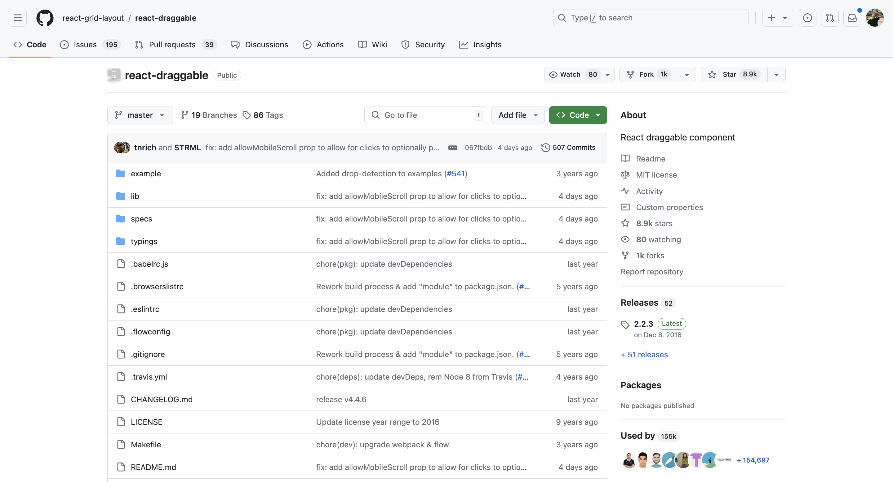
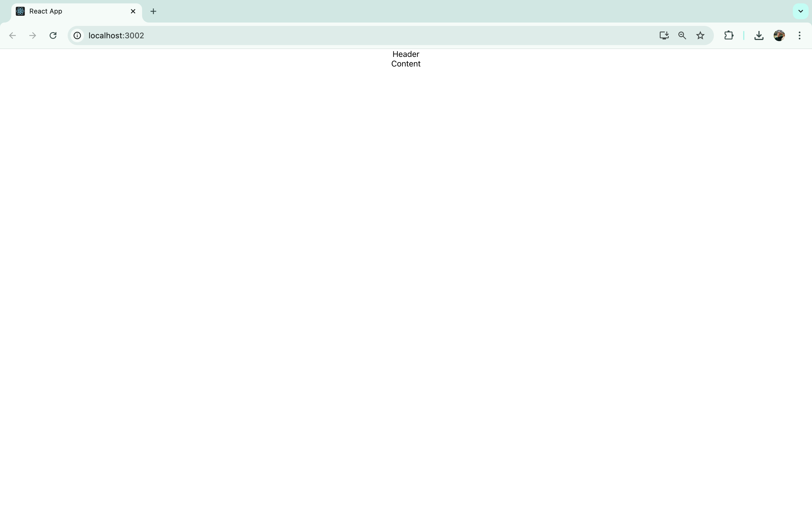
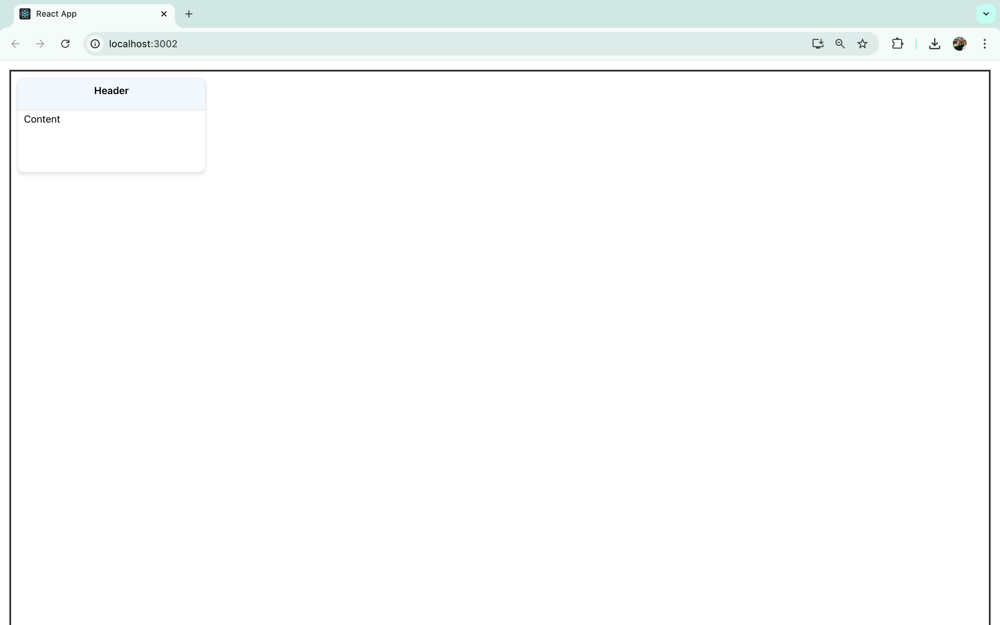
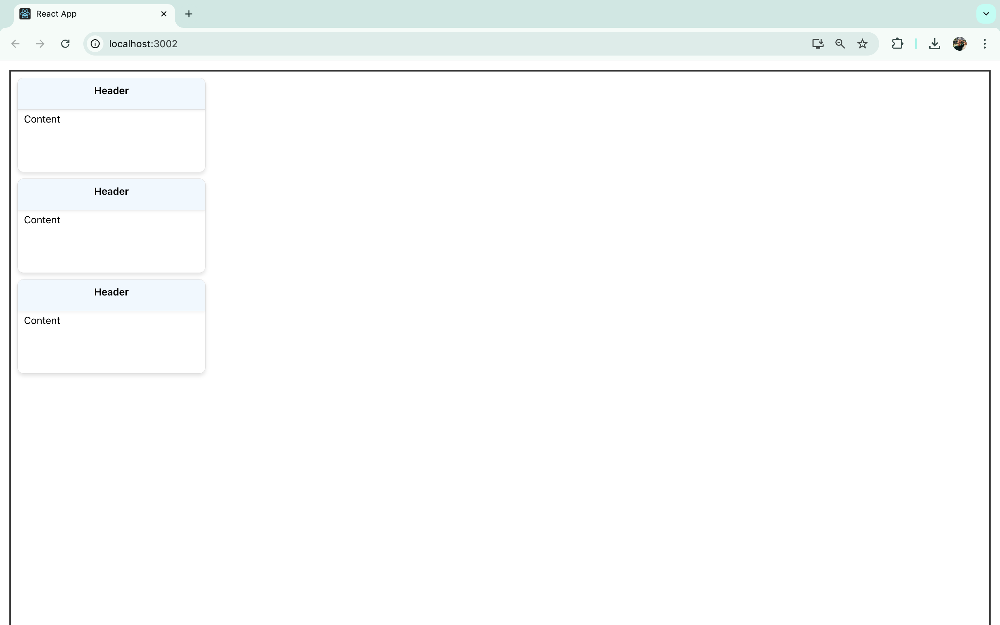
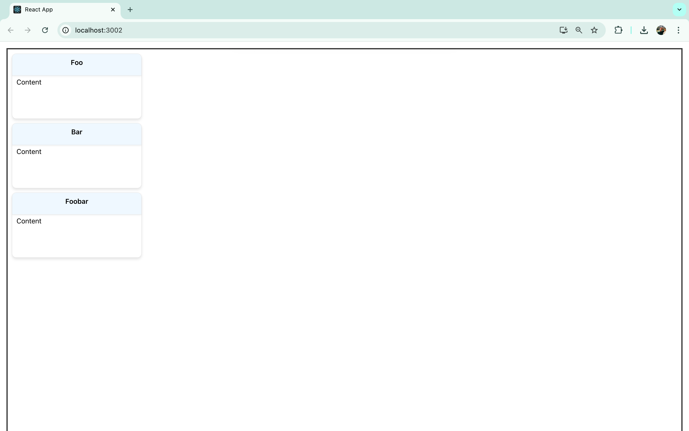
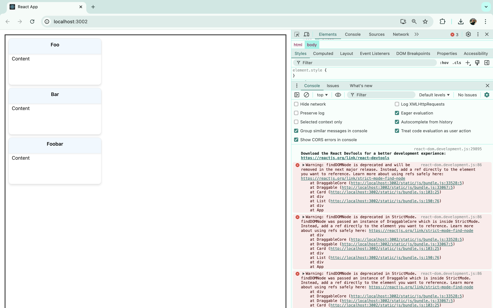
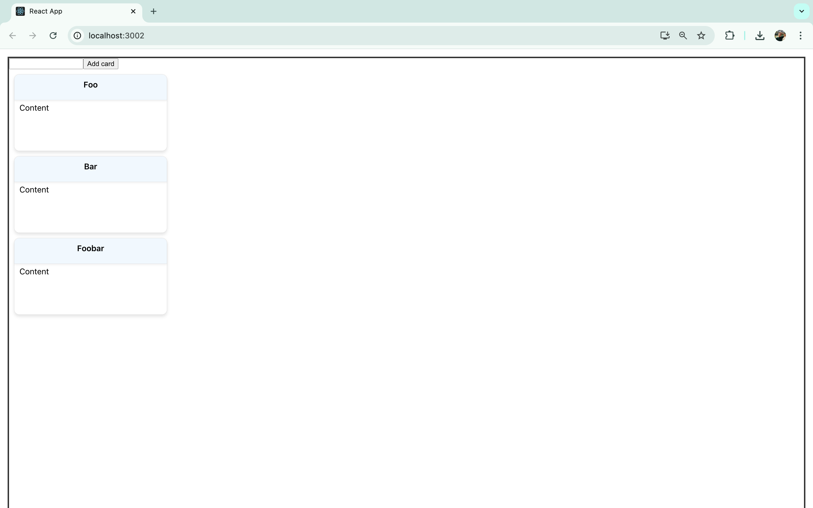
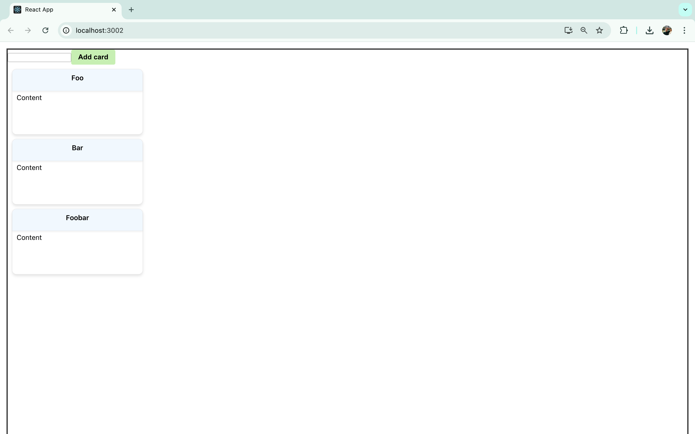
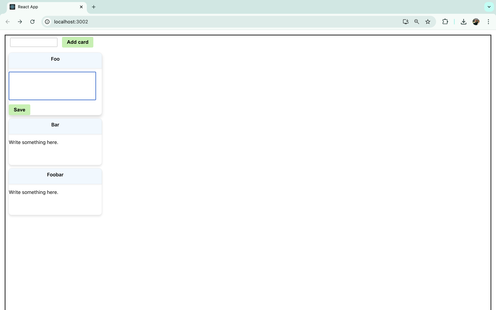

import DocCard from '@site/src/components/DocCard';

# Implementing the React Draggable Component

Drag-and-drop features are helpful in contemporary user interface design, enabling users to perform actions such as repositioning list items, manipulating objects in a design tool, uploading files, or organizing various elements. While HTML supports this capability through its [Drag and Drop API](https://developer.mozilla.org/en-US/docs/Web/API/HTML_Drag_and_Drop_API), the API can be cumbersome and challenging to use. As a result, numerous libraries have been created to simplify the process, avoiding the need for direct interaction with the HTML Drag and Drop API.

{/* truncate */}

This guide will cover a library known as React Draggable, exploring the usage of its draggable components.

:::note Not in Windmill

Please note that this is a general tutorial that does not cover any aspect of the product hosting this article: [Windmill](/). To see how Windmill offers an alternative to your React applications, refer to the [last section](#build-custom-uis-with-windmill).

:::

## Introduction to React Draggable

Several libraries are available for creating draggable components in [React](https://react.dev/), including [`react-draggable`](https://github.com/react-grid-layout/react-draggable).



React Draggable offers a straightforward and customizable approach to building components that handle their own draggable state. It encapsulates a React component within a `<Draggable>` wrapper. This allows customization of component behavior through specific props. For instance, the `axis` prop can restrict movement to just the horizontal or vertical plane, while the `bounds` prop can confine the draggable area within specified limits.

The `react-draggable` library is particularly beneficial for those looking to swiftly add draggable elements to their React applications without dealing with the complexities of the HTML Drag and Drop API. Although it may not offer the same level of flexibility as [React DnD](https://react-dnd.github.io/react-dnd/about), its simplicity makes it ideal for less complex applications.

## Tutorial - Creating a List of Cards with React Draggable

We will use a simple application that lists cards, which can be moved via drag-and-drop, along with a button to add new cards.

To get some help, you can visit this [example repository](https://github.com/hcourdent/react_draggable_demo/tree/main) on GitHub.

### Setting Up the Application and Integrating React Draggable

Begin by setting up the application using [Create React App](https://create-react-app.dev/). To initiate this, execute the following command in your terminal:

```bash
npx create-react-app draggable-tuto
cd draggable-tuto
```

This command generates a new React application named `draggable-tuto` and then navigates into the newly created directory.

Following that, install the React Draggable library via [npm](https://www.npmjs.com/) and initiate the development server:

```bash
npm install react-draggable
npm start
```


### Developing the Components and Structuring Them

Navigate to the `src` directory and create a new folder titled `components`. Within this folder, create two files: `Card.jsx` and `List.jsx`. The `<Card>` components will act as movable index cards featuring a customizable header and a text box for jotting down notes. The `<List>` component will function as the encompassing container for the `<Card>` components. Initially, insert basic placeholder code into each file.

For `Card.jsx`, input the following:

```js
const Card = () => {
  return (
    <div className="card">
      <div className="header">Header</div>
      <div className="content">Content</div>
    </div>
  )
}

export default Card;
```

This snippet crafts a basic `<Card>` component with designated areas for a header and textual content. Initially, use placeholder text for these sections.

Then, for `List.jsx`, enter the following:

```js
import Card from './Card';

const List = () => {
  return (
    <div className="list">
      <Card />
    </div>
  )
}

export default List;
```

This code imports the newly created `<Card>` component and outputs a `<div>` containing a single `<Card>`. Additional cards will be incorporated later, but the immediate goal is to ensure all components are being correctly imported and displayed.

Lastly, within the `App.js` file, remove the code segment found within the outermost `<div>` and replace it with a single `<List>` component. Remember to import the `<List>` component from the `components` folder:

```js
import List from './components/List';
import './App.css';

function App() {
  return (
    <div className="App">
      <List />
    </div>
  );
}

export default App;
```



### Styling

To enhance the visual clarity of the components, you can introduce some [CSS](https://developer.mozilla.org/en-US/docs/Web/CSS) styling. Clear out the existing contents of `App.css`, and apply styles to the list, card, header, and content classes as follows:

```css
.App {
  padding: 15px;
}

.list {
  height: 100vh;
  border: 3px solid #333;
}

.card {
  margin: 10px;
  border: 1px solid #e0e0e0;
  border-radius: 10px;
  width: 300px;
  min-height: 150px;
  box-shadow: 0 4px 6px rgba(0, 0, 0, 0.1);
  background-color: #ffffff;
}

.card:hover {
  transform: translateY(-5px);
  box-shadow: 0 6px 10px rgba(0, 0, 0, 0.15);
}

.header {
  border-bottom: 1px solid #e0e0e0;
  border-radius: 10px 10px 0 0;
  padding: 10px 15px;
  background-color: #f0f8ff;
  text-align: center;
  font-weight: 600;
  min-height: 30px;
  box-shadow: 0 2px 4px rgba(0, 0, 0, 0.05);
  cursor: pointer;
}

.content {
  padding: 5px 10px;
}
```

Applying these styles will visually transform the app to appear in the following manner:



### Add cards to the list

We'll use the [`useState`](https://react.dev/reference/react/useState) hook from React to establish a state variable that will hold an array of card data.

Begin by importing `useState` from React and setting up a state variable using array destructuring.

```js
import { useState } from 'react';
```

Initially, we'll populate this state with placeholder data for card titles, but later on, we'll add the capability to include new cards with user-defined titles.

In your `List.jsx`, insert the following code before the `return` statement:

```js
const [cards, setCards] = useState([{title: "Foo", id: 0}, {title: "Bar", id: 1}, {title: "Foobar", id: 3}]);
```

This code snippet defines `cards` as the state variable containing the card data and `setCards` as the function to update this state, initializing it with an array of mock card objects.

Replace the singular `<Card>` instance with the `map` function to convert each item in the `cards` array into `<Card>` components as shown below:

```js
{cards.map((card) => <Card title={card.title} key={card.id} />)}
```

This approach generates a `<Card>` for each entry in the `cards` array, assigning the `title` and `id` from each object as props to the corresponding `<Card>`.

Upon viewing the updated app in the browser, it will look something like this:



Although the `title` of each card is passed as a prop to the `<Card>` components, it isn't yet displayed because the `Card.jsx` still uses static content.

To include the titles on the cards, modify `Card.jsx` as follows:

```js
const Card = (props) => {
  return (
    <div className="card">
      <div className="header">{props.title}</div>
      <div className="content">Content</div>
    </div>
  )
}

export default Card;
```

Ensure to pass the `props` to the `<Card>` function.

With this change, each card's header should now correctly display its `title`:



Before working on the `content` section of each `<Card>`, we will introduce draggability to the cards.

### Make each card `<Draggable>`

Currently, the cards we've created are static and cannot be moved around. To enable drag-and-drop capabilities, we can easily integrate `react-draggable`.

Start by importing the `<Draggable>` component into `Card.jsx` as shown below:

```js
import Draggable from 'react-draggable';
```

Next, encase the primary `<div>` of the `<Card>` component within a `<Draggable>` wrapper. After this adjustment, the `<Card>` component will appear as follows:

```js
import Draggable from 'react-draggable';

const Card = (props) => {
  return (
    <Draggable>
      <div className="card">
        <div className="header">{props.title}</div>
        <div className="content">Content</div>
      </div>
    </Draggable>
  )
}
export default Card;
```

Upon revisiting the app, you'll notice that it is now possible to freely drag and drop the cards across the screen.

<video
	className="border-2 rounded-lg object-cover w-full h-full dark:border-gray-800"
	controls
	src="/videos/drag_components.mp4"
/>

### Resolving the `findDOMNode` warning

While the drag-and-drop functionality is now active, checking the console reveals an warning:

```
Warning: findDOMNode is deprecated in StrictMode. findDOMNode was passed an instance of Draggable which is inside StrictMode. Instead, add a ref directly to the element you want to reference.
```


This warning arises because React Draggable employs the deprecated `findDOMNode` method, and Create React App operates in strict mode by default. According to the error message, this issue can be resolved by attaching a `ref` directly to the targeted element.

To address this, modify `Card.jsx` in the following manner:

```js
import Draggable from 'react-draggable';
import { useRef } from 'react';

const Card = (props) => {

  const nodeRef = useRef(null);

  return (
    <Draggable nodeRef={nodeRef}>
      <div ref={nodeRef} className="card">
        <div className="header">{props.title}</div>
        <div className="content">Content</div>
      </div>
    </Draggable>
  )
}

export default Card;
```

After making these changes, refresh the page and revisit the console. The warning should have been eliminated.

### Have the user add cards

Now, we can add some more interactivity to the app by creating the capability to add new cards. To do this, we'll create a form in the UI to add a new card and a state variable to store that new card. Then, we'll create a function that takes the contents of that variable and adds it to the existing list of cards.

First, add a simple form to `List.jsx`. The form contains a text box where the user can type a name for a new card, along with a button to add the new card:

```js
<div className="add-card-form">
  <input type="text" /><button>Add card</button>
</div>
```



To improve the form's appearance, we can add some more styles in `App.css`:

```css
button {
  background-color: #bdf0ad;
  padding: 8px 16px;
  border: none;
  border-radius: 4px;
  cursor: pointer;
  font-size: 1em;
  font-weight: bold;
  transition: background-color 0.2s, box-shadow 0.2s;
}

button:hover {
  background-color: #b3e3a5;
}

.new-card-input {
  margin: 8px 15px;
  padding: 5px;
```



This form has no functionality yet, but we'll hook it up so that typing in the text box sets the new card variable, and pushing the button adds that new card to the list.

In the `<List>` component, create a new state variable to store the contents of the text field as the user types before they're added to the `cards` array as a new card:

```js
const [newCard, setNewCard] = useState('');
```

As you can see in the above code, the initial value of `newCard` is just an empty string.

Next, in the `<List>` component, create a function that updates the `cards` array to include this new card. This function will be called when the "New Card" button is pressed. It will take the contents of the `newCard` variable to add to the end of the `cards` array:

```js
const addCard = () => {
   const tempArr = [...cards];
    const card = {title: newCard, id: cards.length};
    tempArr.push(card);
    setCards(tempArr);
    setNewCard('');
  }
```

This function uses the spread operator to create a copy of the `cards` array and stores it in a temporary variable called `tempArr`. It then creates a new card object using the value of `newCard` (which will be a title chosen by the user) and an ID. Then, it pushes that card object to the temporary array, sets `cards` to that array, and clears the value of `newCard`.

Finally, we need to connect the form so that when the user types in the text field and presses the "Add Card" button, their card is added to the `cards` array. This change in the array will trigger a re-render and add their new card to the UI. To do this, make the following additions to the form in `List.jsx`:

```js
<div className="add-card-form">
  <input type="text" value={newCard} className="new-card-input" onChange={(e) => setNewCard(e.target.value)}/><button onClick={addCard}>Add card</button>
</div>
```

This code sets the value of the text field as the value of the `newCard` variable. As the user types, that value is changed using the `setNewCard` function. Then, when the button is clicked, the `addCard` function is called.

We can now add new cards and drag them around to reorder them.

<video
	className="border-2 rounded-lg object-cover w-full h-full dark:border-gray-800"
	controls
	src="/videos/new_card.mp4"
/>

### Making the cards editable

We will now allow the text within the draggable cards to be editable. For this, conditional rendering will be used to toggle between a text box for editing and a `<p>` element that displays the entered text. We'll utilize the `useState` hook once more to manage the text input by the user.

Let's implement these enhancements in `Card.jsx`.

Start by importing `useState` from React. Assuming `useRef` has already been imported, your import statement will now include `useState`:

```js
import { useState, useRef } from 'react';
```

Next, establish two state variables with `useState`:

```js
const [text, setText] = useState('Write something here.');
const [isEditing, setIsEditing] = useState(false);
```

One variable will capture and update the text input by the user, while the other will hold a Boolean indicating if the user is currently editing the text.

To enable text editing, allow users to click on the `<p>` element within the card. After making changes, they can confirm their edits by clicking a "Save" button.

Make the following modifications in the `<div>` tagged with the `content` class to replace the placeholder text:

```js
{isEditing ? <div><textarea className="text-input" value={text} onChange={(e) => 
setText(e.target.value)} onDoubleClick={() => setText('')} /><button onClick={() => 
setIsEditing(false)}>Save</button></div> : <p onClick={() => setIsEditing(true)}>{text}</p>}
```

This segment utilizes a ternary operator to check the state of `isEditing`. If true, it displays a `<div>` with a `<textarea>` where user inputs directly update the `text` variable. Double-clicking on the `<textarea>` clears its contents.

This `<div>` also includes a button that, when clicked, sets `isEditing` back to false, signifying the end of the editing process.

When `isEditing` is false, a `<p>` displays the stored `text`, and clicking this `<p>` reactivates the editing mode.

To further refine the interface, add styles to the `<textarea>` in `App.css`:

```css
.text-input {
  padding: 5px;
  margin: 11px 0;
  font-size: 1em;
  width: 270px;
  min-height: 80px;
  resize: none;
}
```

Here is how the editable card looks in action:



### Adding a Drag Handle to the Cards

Given that interacting with a specific section of the card now activates the text editing mode, it would be practical to introduce a "handle" for dragging to avoid unintended text edits. This enhancement is straightforward with React Draggable.

Modify the `<Draggable>` component in the following manner:

```js
<Draggable nodeRef={nodeRef} handle=".header">
```

This adjustment restricts the drag functionality to only the `<div>` labeled with the class name `header`:

<video
	className="border-2 rounded-lg object-cover w-full h-full dark:border-gray-800"
	controls
	src="/videos/drag_header.mp4"
/>

## Build custom UIs with Windmill

This completes our guide on using React Draggable components.

For teams looking to create apps, Windmill's App editor offers a compelling alternative to developing custom apps in React. React requires coding from scratch, managing complexities like states, routes, and API integrations manually.

In contrast, Windmill simplifies these aspects, with a [low-code App builder](/docs/apps/app_editor) designed to create custom User Interfaces by combining drag-and-drop functionality with code. It allows users to quickly assemble user interfaces for internal tools and dashboards with [+60 components](/docs/apps/app_configuration_settings/app_component_library) to which you can add style and link to scripts and flows.  Additionally, it supports the integration of [custom React components](/docs/apps/react_components) and even entire [React apps](/docs/react_vue_svelte_apps/react), providing flexibility for more advanced development needs.

It enables faster development with less overhead, making it a practical choice for projects where quick deployment and ease of maintenance are priorities.

<iframe
	style={{ aspectRatio: '16/9' }}
	src="https://www.youtube.com/embed/lxqdncP8XR4"
	title="App editor Tutorial"
	frameBorder="0"
	allow="accelerometer; autoplay; clipboard-write; encrypted-media; gyroscope; picture-in-picture; web-share"
	allowFullScreen
	className="border-2 rounded-lg object-cover w-full dark:border-gray-800"
></iframe>

<br/>

<div className="grid grid-cols-2 gap-6 mb-4">
	<DocCard
		title="App editor"
		description="Detailed section on Windmill's App editor."
		href="/docs/apps/app_editor"
	/>
</div>