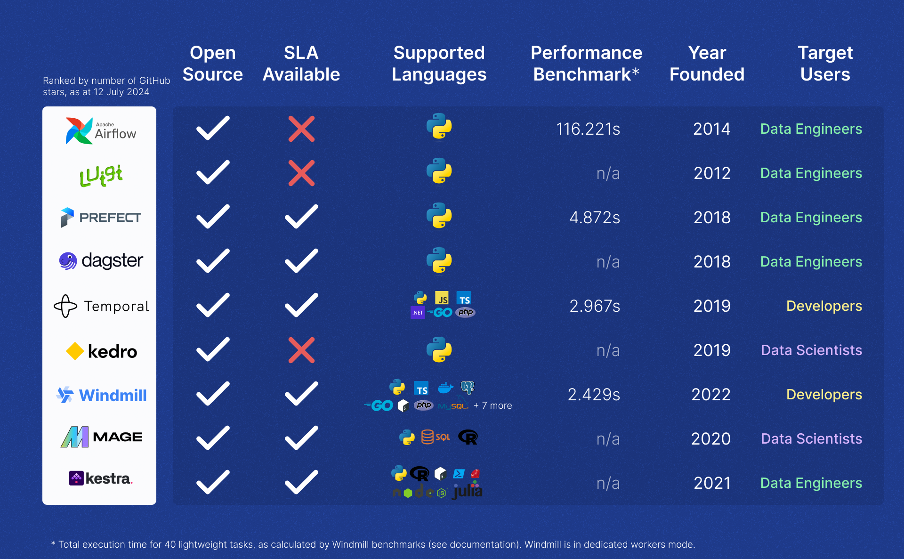
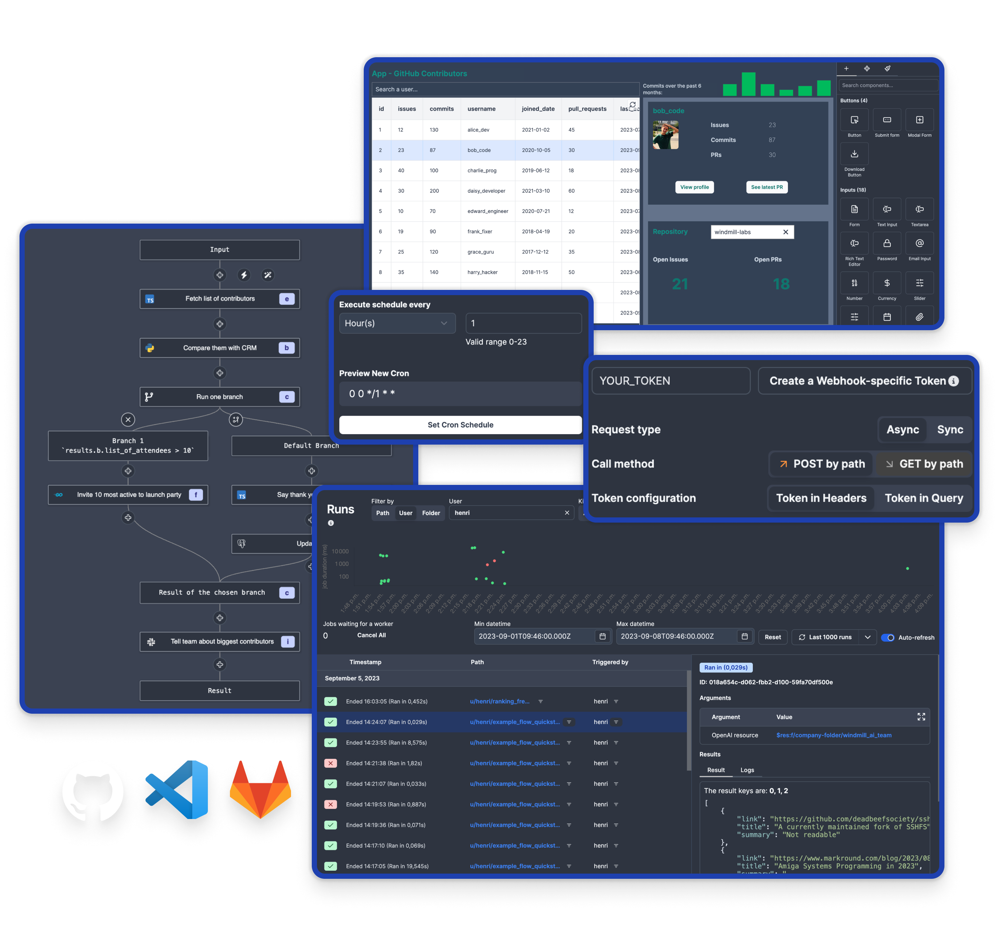

import Tabs from '@theme/Tabs';
import TabItem from '@theme/TabItem';

# How to run background jobs

Background jobs, also known as background tasks, are processes that run independently of the main application flow, allowing systems to perform work without interrupting the user experience. These jobs operate [asynchronously](https://developer.mozilla.org/en-US/docs/Learn/JavaScript/Asynchronous/Introducing), meaning they handle tasks in the background while the primary application remains responsive. Common uses of background jobs include processing large datasets, sending emails, generating reports, handling file uploads, and managing scheduled tasks like database backups or system maintenance.

By offloading these time-consuming operations to background processes, developers can improve application performance and user satisfaction by ensuring that the primary application remains fast and responsive.


Running background jobs in a software application can be approached in various ways, depending on the programming language, the environment in which the application is running, and the specific requirements of the task. This article explores common methods and tools used across different programming languages and environments.

For each of the 5 solutions mentioned, you will find a paragraph entitled `How to run background jobs with...` which takes the example of a data processing background job.

## Using Built-in Language Features

Many programming languages come with built-in tools and libraries that make it easy to manage background jobs. They allow offloading tasks from the main execution thread, improving the responsiveness of the application without requiring external dependencies.

### Python

In Python, developers can choose between several built-in options depending on the nature of the task. For simpler tasks, the [`threading`](https://realpython.com/intro-to-python-threading/) or [`multiprocessing`](https://docs.python.org/3/library/multiprocessing.html) modules can be used to run jobs concurrently.

For tasks that require asynchronous execution, Python’s [`asyncio`](https://docs.python.org/3/library/asyncio.html) library provides a robust framework for managing background tasks efficiently.

Here are examples of how you can run background tasks in Python using the approaches mentioned above:

<Tabs className="unique-tabs">

<TabItem value="threading" label="threading module" attributes={{className: "text-xs p-4 !mt-0 !ml-0"}}>

```py
import threading
import time

def background_task():
    print("Background task started")
    time.sleep(5)
    print("Background task finished")

# Create a thread and run the background task
thread = threading.Thread(target=background_task)
thread.start()

print("Main thread continues to run...")

# Wait for the background task to complete
thread.join()
print("Main thread finished")
```

</TabItem>

<TabItem value="multiprocessing" label="multiprocessing module" attributes={{className: "text-xs p-4 !mt-0 !ml-0"}}>

```py
import multiprocessing
import time

def background_task():
    print("Background task started")
    time.sleep(5)
    print("Background task finished")

# Create a process and run the background task
process = multiprocessing.Process(target=background_task)
process.start()

print("Main process continues to run...")

# Wait for the background task to complete
process.join()
print("Main process finished")
```

</TabItem>

<TabItem value="asyncio" label="asyncio library" attributes={{className: "text-xs p-4 !mt-0 !ml-0"}}>

```python
import asyncio

async def background_task():
    print("Background task started")
    await asyncio.sleep(5)
    print("Background task finished")

async def main():
    print("Main function running...")
    # Run the background task
    await background_task()
    print("Main function finished")

# Run the asyncio event loop
asyncio.run(main())
```

</TabItem>
</Tabs>


> Multithreading in Python ([source](https://www.geeksforgeeks.org/multithreading-python-set-1/))

### JavaScript

[Node.js](https://nodejs.org/en) is designed with non-blocking, [event-driven architecture](https://dev.to/learn-to-earn/event-driven-architecture-in-nodejs-1o98) in mind, making it ideal for handling background tasks. The [`child_process`](https://nodejs.org/api/child_process.html) module can be used to spawn new processes, allowing heavy tasks to run separately from the main event loop.

In the example below, the exec function allows you to run a shell command in a separate process, making it suitable for executing commands or scripts without blocking the main event loop. The output of the command can be captured via callbacks:

```js
const { exec } = require('child_process');

// Run a background task using the exec function
exec('node -e "console.log(\'Background task started\'); setTimeout(() => { console.log(\'Background task finished\'); }, 5000);"', 
  (error, stdout, stderr) => {
    if (error) {
        console.error(`Error: ${error.message}`);
        return;
    }
    if (stderr) {
        console.error(`Stderr: ${stderr}`);
        return;
    }
    console.log(`Stdout: ${stdout}`);
});

console.log("Main thread continues to run...");
```

<iframe
    style={{ aspectRatio: '16/9' }}
    src="https://www.youtube.com/embed/C1v4MXGhpcM"
    title="YouTube video player"
    frameBorder="0"
    allow="accelerometer; autoplay; clipboard-write; encrypted-media; gyroscope; picture-in-picture; web-share"
    allowFullScreen
    className="border-2 rounded-lg object-cover w-full dark:border-gray-800"
></iframe>

<br/>

Alternatively, [`worker_threads`](https://nodejs.org/api/worker_threads.html) offer a way to run tasks in parallel without blocking the main thread, ensuring that the application remains responsive.

It is ideal for CPU-intensive operations where you want to offload work to a separate thread without affecting the performance of the main thread.
Communication between the main thread and worker threads happens through messages:

```js
const { Worker, isMainThread, parentPort } = require('worker_threads');

if (isMainThread) {
    // This code is executed in the main thread

    console.log("Main thread running...");

    // Create a new worker thread
    const worker = new Worker(__filename);

    // Listen for messages from the worker
    worker.on('message', message => {
        console.log(message);
    });

    // Listen for errors
    worker.on('error', error => {
        console.error(`Worker error: ${error}`);
    });

    // Listen for exit event
    worker.on('exit', code => {
        console.log(`Worker exited with code ${code}`);
    });

    console.log("Main thread continues to run...");

} else {
    // This code is executed in the worker thread

    // Simulate a background task
    console.log("Background task started");
    setTimeout(() => {
        console.log("Background task finished");
        parentPort.postMessage("Background task completed!");
    }, 5000);
}

```

### Java

Java has a well-established threading model that developers can utilize to run background jobs. The language’s built-in [`Thread`](https://www.w3schools.com/java/java_threads.asp) class provides a straightforward way to manage concurrent execution.

By overriding the `run` method, you define the code that should execute in the background. You can start the thread using the `start()` method and control its execution with methods like `join()`:

```js
public class BackgroundTask implements Runnable {
    @Override
    public void run() {
        System.out.println("Background task started");
        try {
            Thread.sleep(5000); // Simulate a long-running task
        } catch (InterruptedException e) {
            System.out.println("Background task interrupted");
        }
        System.out.println("Background task finished");
    }

    public static void main(String[] args) {
        Thread thread = new Thread(new BackgroundTask());
        thread.start(); // Start the background task

        System.out.println("Main thread continues to run...");

        try {
            thread.join(); // Wait for the background task to complete
        } catch (InterruptedException e) {
            System.out.println("Main thread interrupted");
        }

        System.out.println("Main thread finished");
    }
}
```

For more complex scenarios, the [`ExecutorService`](https://www.baeldung.com/java-executor-service-tutorial) can be used to manage a pool of threads, making it easier to handle multiple background tasks simultaneously while controlling resource allocation.

`ExecutorService` is part of Java's [`java.util.concurrent`](https://docs.oracle.com/javase/8/docs/api/java/util/concurrent/package-summary.html) package, which provides a higher-level API for managing background tasks. `ExecutorService` can be used to create a thread pool, manage task execution, and handle shutdown procedures. It’s particularly useful when you need to manage multiple tasks or want more control over thread management:

```js
import java.util.concurrent.ExecutorService;
import java.util.concurrent.Executors;

public class BackgroundTaskExecutor {
    public static void main(String[] args) {
        ExecutorService executor = Executors.newSingleThreadExecutor(); // Create an executor with a single thread

        executor.submit(() -> {
            System.out.println("Background task started");
            try {
                Thread.sleep(5000); // Simulate a long-running task
            } catch (InterruptedException e) {
                System.out.println("Background task interrupted");
            }
            System.out.println("Background task finished");
        });

        System.out.println("Main thread continues to run...");

        executor.shutdown(); // Initiate an orderly shutdown in which previously submitted tasks are executed, but no new tasks will be accepted

        try {
            if (!executor.awaitTermination(10, java.util.concurrent.TimeUnit.SECONDS)) {
                executor.shutdownNow(); // Force shutdown if tasks take too long
            }
        } catch (InterruptedException e) {
            executor.shutdownNow();
        }

        System.out.println("Main thread finished");
    }
}
```

:::tip How to run background jobs with built-in language features
For data processing using built-in language features, you could use [Python](#python)'s multiprocessing module to run the processing task in parallel across multiple cores. In our example, this would allow the data processing job to utilize more CPU resources, speeding up the computation without blocking the main application.
:::

## Dedicated Background Job Libraries

For more complex applications, built-in language features may not be sufficient to handle the demands of background processing, especially when it comes to task queuing, scheduling, and monitoring. In these cases, dedicated background job libraries provide a more powerful and scalable solution. Let's explore some popular options across different programming languages.

### Python

In Python, several powerful libraries are available for managing background jobs, offering robust features such as task queuing, scheduling, and monitoring.

#### Celery

[Celery](https://docs.celeryq.dev/en/stable/getting-started/introduction.html) is one of the most popular distributed task queue libraries in Python. It supports multiple message brokers (like [RabbitMQ, Redis](https://aws.amazon.com/compare/the-difference-between-rabbitmq-and-redis/)) and provides features like [task retries](https://docs.celeryq.dev/en/stable/userguide/tasks.html#retrying), [scheduling](https://docs.celeryq.dev/en/stable/userguide/periodic-tasks.html), and [monitoring](https://docs.celeryq.dev/en/stable/userguide/monitoring.html). Celery is highly scalable ([distributed architecture](https://patrick.cloke.us/posts/2023/09/15/celery-architecture-breakdown/), [concurrency](https://docs.celeryq.dev/en/stable/userguide/workers.html#concurrency)) and is suitable for applications that need to handle a high volume of background tasks.


> Celery Architecture ([source](https://patrick.cloke.us/posts/2023/09/15/celery-architecture-breakdown/))
<br/>

```python
from celery import Celery

app = Celery('tasks', broker='redis://localhost:6379/0')

@app.task
def background_task(x, y):
    return x + y

# To call the task
result = background_task.delay(10, 20)
print(result.get())  # This will print 30 after the task completes
```

#### RQ (Redis Queue)

[RQ](https://python-rq.org/) is a simple yet powerful open source library that uses [Redis](https://github.com/redis/redis) to manage job queues. It’s easy to set up and is ideal for applications that require background jobs without the overhead of a more complex solution like Celery.

Redis manages job queues using its in-memory [lists](https://redis.io/glossary/lists-in-redis/), where jobs are added and retrieved in a first-in, first-out ([FIFO](https://redis.io/glossary/redis-queue/)) order. Its atomic operations ensure reliable concurrent processing, while persistence options keep queues durable even during server crashes.

You can get more details on RQ's [repository](https://github.com/rq/rq).

```python
from rq import Queue
from redis import Redis
from time import sleep

def background_task(x, y):
    sleep(5)
    return x + y

redis_conn = Redis()
q = Queue(connection=redis_conn)

# Enqueue the task
job = q.enqueue(background_task, 10, 20)

# Wait for the result
print(job.result)  # None until the task is finished
```

### Ruby

Ruby developers have access to several mature and reliable libraries for handling background jobs, particularly within [Rails](https://rubyonrails.org/) applications.

#### Sidekiq

[Sidekiq](https://github.com/sidekiq/sidekiq) is one of the most widely used background job processors in the Ruby community, known for its [efficiency and reliability](https://dansvetlov.me/sidekiq-internals/). It uses Redis as a job queue and supports features like [retries](https://github.com/sidekiq/sidekiq/wiki/Error-Handling), [scheduling](https://rubygems.org/gems/sidekiq-scheduler/versions/5.0.3?locale=en), and monitoring.

```ruby
class BackgroundJob
  include Sidekiq::Worker

  def perform(x, y)
    sleep(5)
    puts x + y
  end
end

# To enqueue the job
BackgroundJob.perform_async(10, 20)
```


#### Resque

[Resque](https://github.com/resque/resque) is another popular background job library that uses Redis for job queue management. It processes tasks by forking a new process for each job, which helps in managing memory efficiently. Resque is easy to scale and supports [plugins](https://github.com/resque/resque/wiki/plugins) for retries, failures, and job prioritization.


```ruby
class BackgroundJob
  @queue = :default

  def self.perform(x, y)
    sleep(5)
    puts x + y
  end
end

# To enqueue the job
Resque.enqueue(BackgroundJob, 10, 20)
```

### PHP

For PHP applications, there are several libraries and frameworks that provide robust support for background job processing.

#### Gearman

[Gearman](https://www.php.net/manual/en/book.gearman.php) is a distributed job system that allows you to perform tasks in parallel across multiple machines. It is language-agnostic and can be used with PHP to manage background tasks efficiently.


> How Gearman works ([source](https://gearman.org/))

<br/>

```php
// Worker script
$worker = new GearmanWorker();
$worker->addServer();
$worker->addFunction("background_task", function($job) {
    $workload = json_decode($job->workload(), true);
    sleep(5);
    return $workload['x'] + $workload['y'];
});
$worker->work();

// Client script
$client = new GearmanClient();
$client->addServer();
$result = $client->doBackground("background_task", json_encode(['x' => 10, 'y' => 20]));
```

#### Laravel Queues

[Laravel](https://laravel.com/), one of the most popular PHP frameworks, has built-in support for background jobs through its [queue system](https://laravel.com/docs/11.x/queues). Laravel Queues supports a variety of backends, including Redis, Beanstalkd, and Amazon SQS, making it versatile and easy to integrate.

```php
// Job class
namespace App\Jobs;

use Illuminate\Bus\Queueable;
use Illuminate\Contracts\Queue\ShouldQueue;
use Illuminate\Foundation\Bus\Dispatchable;

class BackgroundJob implements ShouldQueue
{
    use Dispatchable, Queueable;

    protected $x, $y;

    public function __construct($x, $y)
    {
        $this->x = $x;
        $this->y = $y;
    }

    public function handle()
    {
        sleep(5);
        echo $this->x + $this->y;
    }
}

// To dispatch the job
BackgroundJob::dispatch(10, 20);
```

:::tip How to run background jobs with dedicated background job libraries
With dedicated background job libraries like [Celery](#celery) in Python, you would enqueue the data processing task into a task queue, where worker processes consume and execute the task asynchronously.
:::

## Using Operating System Features

Most operating systems provide built-in features for scheduling and automating background tasks. These features are especially useful for running periodic tasks, such as backups, system maintenance, or script execution.

### Cron Jobs

On [Unix-like systems](https://www.geeksforgeeks.org/introduction-to-unix-system/), including Linux and macOS, cron jobs are a powerful and flexible way to schedule tasks. The cron daemon runs in the background and executes commands or scripts at specified intervals, as defined in the crontab (cron table) file. You can schedule tasks to run at fixed times, dates, or intervals, making cron ideal for repetitive tasks like daily backups or weekly report generation.

To set up a cron job, you [edit the crontab file](/blog/edit-crontabs) using the `crontab -e` command. The file's [format](/blog/edit-crontabs#crontab-format) allows you to specify the minute, hour, day of the month, month, and day of the week when the command should run. Here’s an example of a cron job that runs a backup script every day at midnight:

```
0 0 * * * /path/to/backup_script.sh
```

If you're looking for a way to trigger jobs on a regular basis, Windmill lets you [schedule](/docs/core_concepts/scheduling) any script or flow with CRON syntax and a syntax helper.

### Windows Task Scheduler

For Windows users, the [Task Scheduler](https://learn.microsoft.com/en-us/windows/win32/taskschd/task-scheduler-start-page) is a built-in tool that provides similar functionality to cron jobs. It allows you to schedule tasks, such as [running a script](https://sqlbackupandftp.com/blog/how-to-schedule-a-script-via-windows-task-scheduler/) or launching an application, at specific times or in response to specific events (like system startup). Windows Task Scheduler is highly configurable, offering options to trigger tasks based on time, system events, or even [when a specific user logs in](https://www.tenforums.com/tutorials/173596-how-create-task-run-app-script-logon-windows-10-a.html).

To create a new task in Windows Task Scheduler, you open the Task Scheduler interface, choose "Create Basic Task" and follow the wizard to set your task’s triggers, actions, and conditions. For example, to run a maintenance script every Sunday at 3 AM, you would set the trigger to "Weekly" specify Sunday, and set the time to 03:00. The action would be to "Start a program" where you specify the path to your script.

Using Task Scheduler is straightforward, and its graphical interface makes it accessible even for those who prefer not to work directly with command-line tools. This makes it a powerful tool for automating routine tasks on Windows systems.


> Windows Task Scheduler ([source](https://www.windowscentral.com/how-create-automated-task-using-task-scheduler-windows-10))

<br/>

:::tip How to run background jobs with operating system features
Using operating system features like cron jobs, you would schedule a script that runs the data processing task at regular intervals (e.g., nightly or hourly). The cron job would trigger the script automatically, allowing the data processing to occur without manual intervention.
:::

## Cloud Services

As applications move to the cloud, leveraging [cloud-native](https://aws.amazon.com/what-is/cloud-native/) services for background processing has become increasingly popular. These services offer scalable, cost-effective solutions that eliminate the need for managing underlying infrastructure, allowing developers to focus on building and deploying their applications.

### AWS Lambda, Google Cloud Functions, Azure Functions

Serverless computing services like [AWS Lambda](https://aws.amazon.com/lambda/), [Google Cloud Functions](https://cloud.google.com/functions), and [Azure Functions](https://learn.microsoft.com/en-us/azure/azure-functions/functions-overview?pivots=programming-language-csharp) allow you to run code in [response to events](https://cloud.google.com/functions/docs/writing/write-event-driven-functions) without provisioning or managing servers. These services automatically scale with the demand, executing your functions only when needed, which can significantly reduce costs for intermittent or unpredictable workloads.

With these services, you can trigger background tasks in response to various events, such as HTTP requests, database changes, or message queue updates. For example, an image upload to an S3 bucket can [automatically trigger an AWS Lambda function](https://docs.aws.amazon.com/lambda/latest/dg/with-s3-example.html) to process the image, such as generating thumbnails or applying filters, all without any manual intervention or server management.

The key advantage of using serverless functions for background jobs is the simplicity and efficiency they offer. Developers can deploy small, self-contained pieces of code that respond to specific triggers, ensuring that tasks are handled in the background without impacting the performance of the main application.


> Google Cloud Functions - Integration with third-party services and APIs ([source](https://cloud.google.com/functions/docs/concepts/events-triggers))

<br/>

To get started with AWS Lambda, Google Cloud Functions, or Azure Functions, you'll first need to set up an account with the respective cloud provider — [AWS](https://aws.amazon.com/), [Google Cloud](https://cloud.google.com/), or [Microsoft Azure](https://azure.microsoft.com/en-us). Each platform offers a free tier, allowing you to experiment with serverless functions at no cost, up to a certain usage limit.

However, despite the scalability and ease of use that serverless functions like AWS Lambda, Google Cloud Functions, and Azure Functions offer, they come with certain limitations when managing background jobs. For instance, scheduling tasks for later execution is not straightforward and often requires additional services like [CloudWatch](https://aws.amazon.com/cloudwatch/) or [Task Queues](https://cloud.google.com/appengine/docs/legacy/standard/python/taskqueue). Additionally, retrieving results from these functions only works effectively in synchronous operations, which limits their utility for asynchronous background processing. The logic of these functions is also typically designed to support web server environments, making it challenging to use them for more complex background job workflows.

These services are inherently designed for ephemeral, short-lived tasks. While they are excellent for handling quick, event-driven processes, they may not be ideal for long-running or resource-intensive jobs. Moreover, there can be latency issues, known as "[cold starts](https://mikhail.io/serverless/coldstarts/big3/)," where the first request to a function after a period of inactivity takes longer to execute.

A common workaround is to combine AWS Lambda with [AWS SQS](#aws-sqs-google-cloud-pubsub) to queue tasks and manage them asynchronously. However, this approach still inherits the weaknesses of Lambda, such as limited control over execution duration and cold start latency, making it necessary to carefully consider whether serverless functions are the right tool for your background job needs.

### AWS SQS, Google Cloud Pub/Sub

Message queue services like [AWS SQS](https://aws.amazon.com/sqs/) (Simple Queue Service) and [Google Cloud Pub/Sub](https://cloud.google.com/pubsub) enable developers to decouple heavy-duty tasks from the main application flow. These services allow you to queue messages asynchronously, which can then be processed independently by worker applications or services.

For example, in a web application, you might use AWS SQS to queue user requests for generating PDF reports. A separate background worker can then process these requests one by one, generating the reports and notifying users when they are ready. This approach prevents long-running tasks from slowing down the main application, improving overall performance and user experience.

<iframe
    style={{ aspectRatio: '16/9' }}
    src="https://www.youtube.com/embed/BMesgClPbBU"
    title="YouTube video player"
    frameBorder="0"
    allow="accelerometer; autoplay; clipboard-write; encrypted-media; gyroscope; picture-in-picture; web-share"
    allowFullScreen
    className="border-2 rounded-lg object-cover w-full dark:border-gray-800"
></iframe>

<br/>

Similarly, Google Cloud Pub/Sub is ideal for building event-driven systems where messages published to a topic are delivered to one or more subscribers. This allows for scalable and flexible processing of background tasks, such as updating search indexes, sending notifications, or processing data streams.


> Overview of the Sub/Pub service ([source](https://cloud.google.com/pubsub/docs/overview))

<br/>

Message queue services like AWS SQS and Google Cloud Pub/Sub might be preferable over serverless functions like AWS Lambda, Google Cloud Functions, and Azure Functions in scenarios where task decoupling, durability, and reliability are crucial. These messaging services allow you to handle a large volume of tasks asynchronously, ensuring that tasks are processed without overwhelming your backend. They offer better control over task execution order, retry mechanisms, and error handling, providing assurance that no messages are lost even if a consumer fails.

In summary, these services allow for managing job queues (like [Celery](#celery) or [RQ](#rq-redis-queue)). Unlike Celery, which not only handles task queues but also manages the worker processes and provides tools for monitoring and observing tasks, SQS and Pub/Sub focus solely on the queuing aspect. This means you’ll need to set up and manage your own worker processes separately. At last, none of these services address the observability problem, which involves visualizing when and by what these jobs were triggered, as well as their status and alerts in case of failure.

:::tip How to run background jobs with cloud services
Leveraging cloud services like [AWS Lambda](#aws-lambda-google-cloud-functions-azure-functions), you could write a serverless function that processes the data when triggered by an event (e.g. an S3 file upload). Alternatively, with AWS SQS, you could queue data processing tasks and have them consumed by worker instances running on EC2 or AWS Fargate, ensuring scalable and on-demand processing.
:::

## Job Orchestration Platforms

Job orchestration platforms like [Apache Airflow](https://github.com/apache/airflow), [Prefect](https://github.com/PrefectHQ/prefect), [Dagster](https://github.com/dagster-io/dagster) and [Windmill](https://github.com/windmill-labs/windmill) are designed to manage complex workflows involving multiple interdependent tasks. These platforms allow developers to define workflows programmatically, often using [Directed Acyclic Graphs](https://www.geeksforgeeks.org/introduction-to-directed-acyclic-graph/) (DAGs), where tasks are executed in a specified order with dependencies managed automatically. This is particularly useful in data engineering and other fields where tasks like ETL processes need to be carefully coordinated.

The main advantage of these platforms is their ability to handle complex task scheduling, retries, and error handling, with robust monitoring and alerting features. Prefect and Dagster, for example, focus on user-friendliness and seamless integration with modern data tools, while Airflow is known for its extensive community. If you are interested see our [comparison](/blog/airflow-alternatives) workflow engines and [performance benchmark](/docs/misc/benchmarks/competitors).


> Comparative table on Job Orchestration platforms ([source](https://www.windmill.dev/blog/airflow-alternatives))

<br/>

Job orchestrators are particularly excellent for monitoring your tasks. Additionally, most of them are open source, which allows you to try them out for free, with no limits and without any commercial obligations. When available, paid plans typically offer enhanced performance or further simplify task and permission management (see Windmill [Pricing](/pricing)).

Alternatively, [Amazon Elastic Container Service](https://aws.amazon.com/ecs/) (ECS) can be used for orchestrating containerized background jobs, offering flexibility for teams already using Docker containers. While ECS is not as feature-rich in terms of managing task dependencies, it integrates well with other AWS services.

### Durable Execution Engines: Temporal, Inngest

[Temporal](https://github.com/temporalio) and [Inngest](https://github.com/inngest/inngest) are durable execution engines. A [durable execution](https://temporal.io/blog/building-reliable-distributed-systems-in-node-js-part-2) engine ensures the reliable and fault-tolerant execution of long-running workflows by persisting their state, allowing them to resume after failures. It orchestrates complex tasks across distributed systems, handling retries, compensations, and progress tracking automatically. This enables to build resilient, scalable systems without manually managing state or recovery from failures. However, a durable execution engine is NOT a [workflow engine](#job-orchestration-platforms) which is a higher level of abstraction that runs ... workflows, or more specifically Direct Acyclic Graphs where each node is ran as a step. Windmill is built on top of a durable execution engine - its own - and durable execution engines are excellent ways of building your own custom workflow engines. If you have constraints and specific needs such as embedding that logic deep in your own product, then indeed, using those as building blocks for building your own workflow engine is a great idea.

If on the other hand you need a workflow engine, then you might end up reinventing the wheel by using those to rebuild your own version of a workflow engine.

### Windmill

Windmill is an [open source](https://github.com/windmill-labs/windmill) workflow engine and developer platform. It is designed to build comprehensive internal tools (endpoints, workflows, UIs).
In Windmill, each script can be triggered manually, in a flow or in reaction to events, in particular webhooks and schedules (using [cron](#cron-jobs) syntax). Schedules can be set [via API](https://app.windmill.dev/openapi.html#model/newschedule).

Scripts can be run asynchronously and flows can even [return early](/docs/flows/early_return) a result for sync endpoints while the rest of the flow is still running. This is particularly useful for long-running tasks that don't require immediate results.

Windmill has been designed to be the easiest platform to deploy end-to-end. It can be [self-hosted](/docs/advanced/self_host) in minutes. As for scalability, Windmill uses a [worker system](/docs/core_concepts/worker_groups) to fetch and execute jobs from a queue, ensuring efficient distribution and execution of all jobs. Workers can be scaled horizontally to handle a large volume of tasks. You can allocate specific workers to handle specific jobs, making Windmill the [fastest self-hostable open source workflow engine](/blog/launch-week-1/fastest-workflow-engine).

All jobs are [monitored](/docs/core_concepts/monitor_past_and_future_runs) and [logged](https://www.windmill.dev/docs/core_concepts/audit_logs). With a robust [permission model](/docs/core_concepts/roles_and_permissions) for job execution, background jobs are run with appropriate access levels and security constraints.



> Windmill product ([source](/))

<br/>

Note that in the context of Windmill's [App editor](/docs/apps/app_editor), there are specific "[background runnables](/docs/apps/app-runnable-panel#background-runnables)" which are scripts executed in the background on the server. These can be triggered on app refresh or when their [input](/docs/apps/connecting_components) changes, providing a flexible way to run background tasks in response to various events.

Windmill is extremely reliable, it is used for critical jobs by our customers and has never failed. Windmill takes care of all possible [errors](/docs/core_concepts/error_handling) (retry, error handler, recovery handler) and recovers from any failure: if the infrastructure on which the worker is installed suddenly crashes at any time (e.g. power loss), the flow can start again from the last step that was completed (idempotency within steps need to be implemeneted in the logic itelf of your steps).

[Windmill](#windmill) is not just a workflow engine but an end-to-end developer platform with observability, high-scale capabilities, worker managements, ability to be fully air-gapped baked in.

:::tip How to run background jobs with Windmill
With Windmill, you have multiple options for running the example data processing task. First, you can leverage [built-in language features](#using-built-in-language-features) and [background job libraries](#dedicated-background-job-libraries) for [supported languages](/docs/getting_started/scripts_quickstart) like Python or TypeScript, directly within Windmill’s environment.
<br/>
Alternatively, you can create a script that runs the data processing task and [schedule](/docs/core_concepts/scheduling) it to execute at specific intervals.
<br/>
Windmill also allows you to create a flow that runs the data processing task within a specific [branch](/docs/flows/flow_branches) (and run it in parallel with a branchall), and trigger the flow manually or automatically in response to an event, such as a webhook.
<br/>
These jobs can then be [monitored](/docs/core_concepts/monitor_past_and_future_runs), providing clear visibility into task execution and performance.
:::

## Conclusion

Running background jobs is a critical aspect of building efficient and responsive applications, and the choice of solution depends largely on the complexity of the tasks and the environment in which your application operates. For simpler tasks, [using built-in language features](#using-built-in-language-features) like Python’s threading or JavaScript’s worker threads can be sufficient, offering straightforward and lightweight solutions. As the need for more robust task management grows, [dedicated background job libraries](#dedicated-background-job-libraries) such as Celery in Python or Sidekiq in Ruby provide advanced features like task scheduling and retries.

For tasks that need to be scheduled or automated at the operating system level, [using operating system features](#using-operating-system-features) like cron jobs on Unix-like systems or Windows Task Scheduler is a reliable and well-established approach. When scaling to cloud environments, [cloud services](#cloud-services) such as AWS Lambda or Google Cloud Functions offer serverless solutions that automatically manage infrastructure, while [job orchestration platforms](#job-orchestration-platforms) like Apache Airflow or Prefect are ideal for managing complex workflows involving multiple interdependent tasks with robust monitoring and alerting features.

At Windmill, we believe we’ve built the most comprehensive platform for running background jobs. With a strong focus on performance and reliability, Windmill can be easily scaled and ensures robust error management and clear monitoring of your runs.
