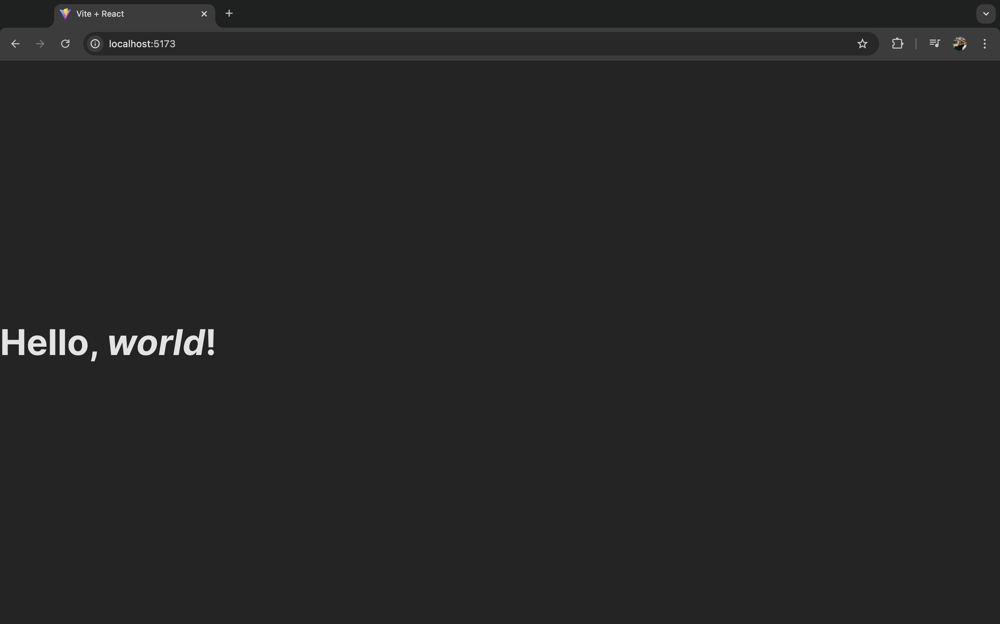
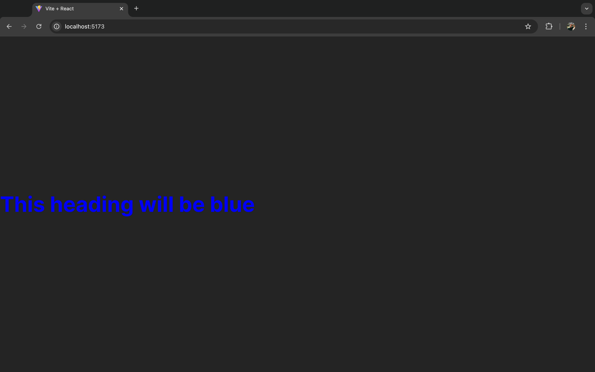
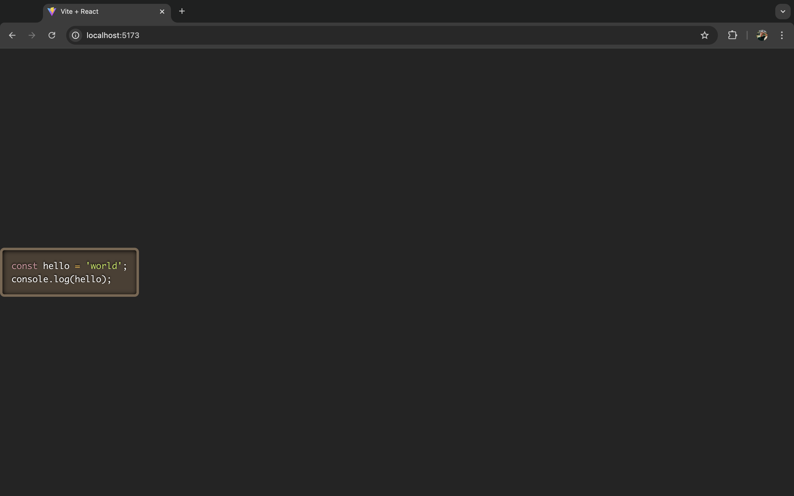

import DocCard from '@site/src/components/DocCard';

# Mastering Markdown in React

Markdown is the minimalist's dream for text formatting—no fancy editors or HTML acrobatics needed. Just a few symbols like asterisks for bold or hashes for headings, and you're off to the races. It's the go-to for bloggers and devs alike, perfect for whipping up websites, blogs, docs, and more. This article [itself](https://github.com/windmill-labs/windmilldocs/tree/main/blog) is written in Markdown.

{/* truncate */}

Born for the web, Markdown is the darling of platforms like GitHub, Stack Overflow, and Reddit. In this guide, we'll explore how to use Markdown in [React](https://react.dev/) applications using the [react-markdown](https://github.com/remarkjs/react-markdown) package.

:::note Not in Windmill
Please note that this is a general tutorial that does not cover any aspect of the product hosting this article: [Windmill](/). To see how Windmill offers alternatives for your React applications, refer to the [last section](#build-custom-uis-with-windmill).
:::

## Markdown basics

Let's dive into the essentials of Markdown syntax:

### Headings

To create headings, use number signs (#). The more signs, the smaller the heading:

```markdown
# Big Boss Heading
## Slightly Smaller Boss
### Middle Management
#### Team Lead
##### Senior Dev
###### Junior Dev
```

This will be rendered as:

<h1>Big Boss Heading</h1>
<h2>Slightly Smaller Boss</h2>
<h3>Middle Management</h3>
<h4>Team Lead</h4>
<h5>Senior Dev</h5>
<h6>Junior Dev</h6>

Remember to include a space between the hash and your text.

### Lists

Markdown supports both ordered and unordered lists:

**Ordered Lists:**
```markdown
1. Banana
2. Kiwi
```

This will be rendered as:

1. Banana
2. Kiwi

**Unordered Lists:**
```markdown
- Banana
- Kiwi

* Banana
* Kiwi

+ Banana
+ Kiwi
```

This will be rendered as:

- Banana
- Kiwi

* Banana
* Kiwi

+ Banana
+ Kiwi

### Links

Create links using square brackets for text and parentheses for the URL:

```markdown
[Windmill](https://www.windmill.dev/)
```

This will be rendered as:

[Windmill](https://www.windmill.dev/)

### Images

Add images with an exclamation mark, alt text in brackets, and the path in parentheses:

```markdown

```

This will be rendered as:


### Typography

Style text using asterisks:

```markdown
**Bold move**
*Italic flair*
```

This will be rendered as:

**Bold move**
*Italic flair*

## Understanding react-markdown

The [react-markdown](https://github.com/remarkjs/react-markdown) package transforms Markdown into React components that render as HTML in your app. Unlike other libraries that use `dangerouslySetInnerHTML`, react-markdown creates a syntax tree for a virtual DOM, making it both safer and more efficient.

### Installation

First, ensure you have Node.js installed, then create a new React project:

```bash
npx create-react-app markdown-app
cd markdown-app
npm install react-markdown
```

### Basic implementation

Here's a simple example of using react-markdown:

```js
import React from 'react'
import ReactMarkdown from 'react-markdown'

export default function App() {
  return (
    <div>
      <ReactMarkdown>
        # Hello, *world*!
      </ReactMarkdown>
    </div>
  )
}
```



## Advanced features

### Custom components

You can customize how specific Markdown elements are rendered using the `components` prop:

```js
import React from 'react'
import ReactMarkdown from 'react-markdown'

const CustomH1 = ({node, ...props}) => (
  <h1 style={{color: 'blue'}} {...props} />
)

export default function App() {
  return (
    <div>
      <ReactMarkdown
        components={{
          h1: CustomH1
        }}
      >
        # This heading will be blue
      </ReactMarkdown>
    </div>
  )
}
```



### Plugins and extensions

React Markdown supports various plugins through the unified ecosystem. Here's how to add syntax highlighting with `react-syntax-highlighter`:

```bash
npm install react-syntax-highlighter
```

Implementation example:

```js
import React from 'react'
import ReactMarkdown from 'react-markdown'
import {Prism as SyntaxHighlighter} from 'react-syntax-highlighter'
import {dark} from 'react-syntax-highlighter/dist/esm/styles/prism'

export default function App() {
  const markdown = `\`\`\`javascript
const hello = 'world';
console.log(hello);
\`\`\``

  return (
    <ReactMarkdown
      components={{
        code({node, inline, className, children, ...props}) {
          const match = /language-(\w+)/.exec(className || '')
          return !inline && match ? (
            <SyntaxHighlighter
              style={dark}
              language={match[1]}
              PreTag="div"
              {...props}
            >
              {String(children).replace(/\n$/, '')}
            </SyntaxHighlighter>
          ) : (
            <code className={className} {...props}>
              {children}
            </code>
          )
        }
      }}
    >
      {markdown}
    </ReactMarkdown>
  )
}
```



### Handling images and links

You can customize how images and links are rendered:

```js
import React from 'react'
import ReactMarkdown from 'react-markdown'

export default function App() {
  return (
    <ReactMarkdown
      components={{
        img: ({node, ...props}) => (
          <div style={{ textAlign: 'center', margin: '20px 0' }}>
             e.target.style.transform = 'scale(1.05)'}
              onMouseOut={(e) => e.target.style.transform = 'scale(1)'}
              loading="lazy"
              onError={(e) => {
                e.target.src = 'fallback-image-url.jpg'
                e.target.alt = 'Failed to load image'
              }}
            />
          </div>
        ),
        a: ({node, children, href, ...props}) => (
          <a
            href={href}
            target="_blank"
            rel="noopener noreferrer"
            style={{
              color: '#0066cc',
              textDecoration: 'none',
              borderBottom: '1px solid transparent',
              transition: 'border-bottom-color 0.2s',
            }}
            onMouseOver={(e) => e.target.style.borderBottomColor = '#0066cc'}
            onMouseOut={(e) => e.target.style.borderBottomColor = 'transparent'}
            onClick={() => console.log(`Link clicked: ${href}`)}
            {...props}
          >
            {children} ↗️
          </a>
        )
      }}
    >
      # Handling images and links
      
      
      
      [Visit Windmill](https://www.windmill.dev/)
    </ReactMarkdown>
  )
}
```

<video
	className="border-2 rounded-lg object-cover w-full h-full dark:border-gray-800"
	controls
	src="/videos/handling_images_and_links.mp4"
/>

## Build custom UIs with Windmill

This completes our guide on using React Markdown in your applications.

For teams looking to create content-rich applications, Windmill's App editor offers a compelling alternative to developing custom apps in React. While React requires coding Markdown implementations from scratch and managing complexities like component styling and rendering, Windmill simplifies these aspects.

The [low-code App builder](/docs/apps/app_editor) is designed to create custom User Interfaces by combining drag-and-drop functionality with code. It comes with [+60 components](/docs/apps/app_configuration_settings/app_component_library) that you can style and link to scripts and flows. We even have a ... [Markdown](/docs/apps/app_configuration_settings/markdown) component. Additionally, it supports the integration of [custom React components](/docs/apps/react_components) and even entire [React apps](/docs/react_vue_svelte_apps/react), providing flexibility for more advanced development needs.

This enables faster development with less overhead, making it a practical choice for projects where quick deployment and ease of maintenance are priorities.

<iframe
  style={{ aspectRatio: '16/9' }}
  src="https://www.youtube.com/embed/lxqdncP8XR4"
  title="App editor Tutorial"
  frameBorder="0"
  allow="accelerometer; autoplay; clipboard-write; encrypted-media; gyroscope; picture-in-picture; web-share"
  allowFullScreen
  className="border-2 rounded-lg object-cover w-full dark:border-gray-800"
></iframe>

<br/>

<div className="grid grid-cols-2 gap-6 mb-4">
  <DocCard
    title="App editor"
    description="Detailed section on Windmill's App editor."
    href="/docs/apps/app_editor"
  />
</div>