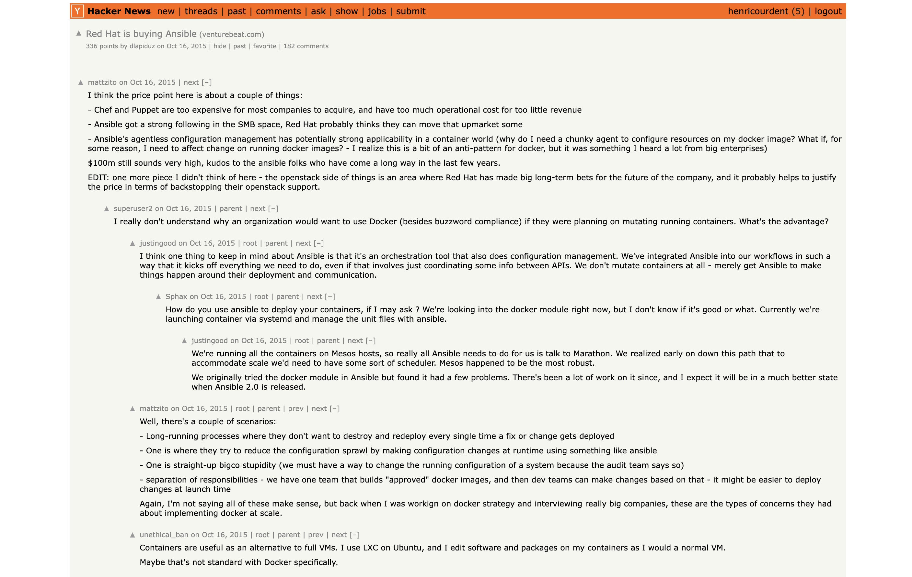
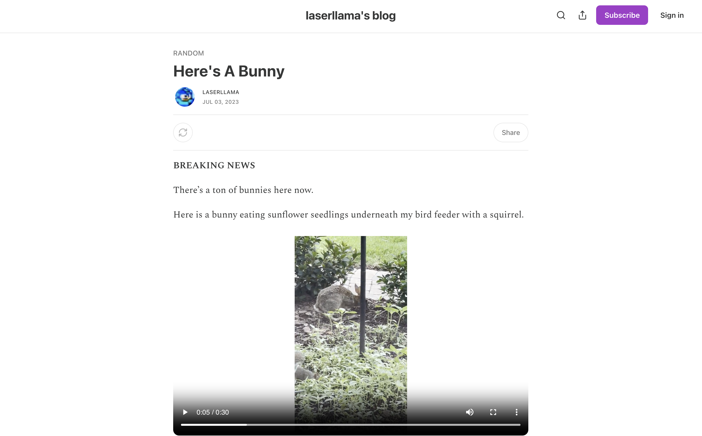
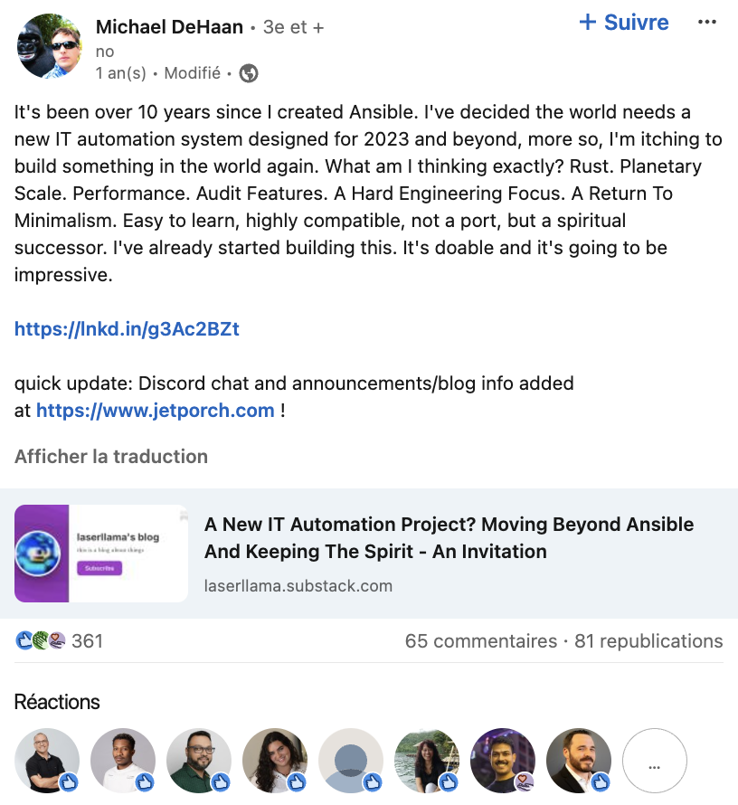

import DocCard from '@site/src/components/DocCard';
import {
	SiAnsible,
} from 'react-icons/si';

# What is Ansible? A brief history

[Ansible](https://github.com/ansible/ansible) is an open-source automation tool that helps system administrators and DevOps teams manage servers, deploy applications, and orchestrate complex IT tasks through simple, human-readable code. Created in [2012](#the-founding-of-ansible), it quickly gained popularity by eliminating common automation headaches: no agents needed to be installed, no complex master-slave setup required, and tasks could be written in straightforward YAML files rather than complicated programming languages.

Before Ansible, managing hundreds of servers meant either writing complex shell scripts or dealing with heavyweight configuration management tools that required significant setup. This article traces Ansible's journey from a solution to these everyday headaches to becoming one of the most widely-used automation tools in modern DevOps.

At its core, Ansible is an open-source automation tool that handles configuration management, application deployment, and task automation. What sets it apart is its simplicity: it uses [SSH](https://docs.ansible.com/ansible/latest/collections/ansible/builtin/ssh_connection.html) for connectivity, requires no agents on managed nodes, and employs YAML for defining automation tasks.

## Chapter 1: The genesis of Ansible

### The IT landscape before Ansible
Before Ansible emerged, we were stuck with limited options. Tools like [Puppet](https://www.puppet.com/) and [Chef](https://www.chef.io/) were powerful but came with significant overhead:
- They required agents on every managed node
- Had steep learning curves with their DSLs (Domain Specific Languages)
- Needed complex master-slave architectures
- Required significant bootstrap configuration

For many teams, this meant either sticking with manual processes or investing heavily in training and infrastructure setup before seeing any benefits.

### The founding of Ansible
In [2012](https://github.com/ansible/ansible/commit/f31421576b00f0b167cdbe61217c31c21a41ac02), [Michael DeHaan](https://www.linkedin.com/in/michaeldehaan/), who previously worked on tools like [Cobbler](https://cobbler.github.io/) at Red Hat, created Ansible with a radical approach: what if we could have powerful automation without all the complexity? DeHaan founded Ansible, Inc. with a clear vision of making automation accessible to everyone, not just specialized teams.

<iframe
	style={{ aspectRatio: '16/9' }}
	src="https://www.youtube.com/embed/jje38YBGVt4"
	title="Michael DeHaan on Ansible, back in 2014"
	frameBorder="0"
	allow="accelerometer; autoplay; clipboard-write; encrypted-media; gyroscope; picture-in-picture; web-share"
	allowFullScreen
	className="border-2 rounded-lg object-cover w-full dark:border-gray-800"
></iframe>

 

> YouTube video of Michael DeHaan on Ansible, back in 2014

 

What really resonated with developers and sysadmins was Ansible's core philosophy:
- **Agentless Architecture**: Using existing SSH infrastructure meant no new security concerns
- **YAML-Based**: Writing automation in YAML made it readable even for non-programmers
- **Push-Based Model**: Instead of agents polling for changes, control nodes push changes when needed
- **Idempotency**: Running the same playbook multiple times produces the same result

This approach was revolutionary because it aligned with Unix philosophy: do one thing well, make it simple, and make it work with other tools.

> Ansible's [first commit](https://github.com/ansible/ansible/commit/f31421576b00f0b167cdbe61217c31c21a41ac02) by [mpdehaan](https://github.com/mpdehaan)

## Chapter 2: Ansible's rise to prominence

### Early reception and adoption
When Ansible was first released, the response from the community was [overwhelmingly positive](https://mindshards.com/posts/a-better-chef-ansible/). The tool's simplicity and effectiveness resonated strongly with users. Unlike its competitors, Ansible didn't require a steep learning curve or complex infrastructure changes. This accessibility led to rapid adoption, especially among teams looking for a straightforward solution to automate their workflows.

Ansible's agentless architecture and use of SSH were game-changers. While tools like Puppet and Chef were powerful, they required agents and complex configurations. Ansible's approach was different: it was lightweight, easy to set up, and didn't require additional software on managed nodes. This made it particularly appealing to teams that needed to scale quickly without the overhead of managing additional infrastructure.

### Key milestones in development
- **The Release of [Ansible 1.1](https://releases.ansible.com/ansible/) (2013)**.
- **Introduction of major features**: Over time, Ansible introduced [Playbooks](https://docs.ansible.com/ansible/latest/playbook_guide/playbooks_intro.html), [roles](https://docs.ansible.com/ansible/latest/playbook_guide/playbooks_reuse_roles.html), and [modules](https://www.redhat.com/en/topics/automation/what-is-an-ansible-module), which significantly enhanced its functionality. Playbooks allowed users to define complex automation tasks in a simple, readable format, while roles and modules provided reusable components that streamlined automation processes.

### The Open Source Community
Ansible's success can be largely attributed to its vibrant open-source community. [Contributors](https://github.com/ansible/ansible/graphs/contributors) from around the world played a crucial role in shaping the tool, expanding its capabilities, and integrating it with other technologies. The community-driven development model ensured that Ansible remained relevant and adaptable to the ever-changing needs of IT automation.

> Ansible's [commits over time](https://github.com/ansible/ansible/graphs/contributors)

### Expansion of modules and integrations
The growth of Ansible's module library was a testament to its flexibility and extensibility. With modules for managing everything from [cloud infrastructure](https://docs.ansible.com/ansible/2.9/modules/list_of_cloud_modules.html) to [network devices](https://docs.ansible.com/ansible/2.8/modules/list_of_network_modules.html), Ansible became a versatile tool that could handle a wide range of automation tasks. This expansion was driven by both community contributions and strategic partnerships, further solidifying Ansible's position as a leader in the automation space.

> Ansible's modules (source: [Coding Ninjas](https://files.codingninjas.in/article_images/ansible-modules-1-1664174607.webp))

## Chapter 3: Red Hat's acquisition of Ansible

### The acquisition process (2015)
In October 2015, the automation world was shaken by significant news: Red Hat had [acquired](https://techcrunch.com/2015/10/16/red-hat-is-buying-it-automation-startup-ansible-reportedly-for-around-100m/) Ansible for a staggering $150 million. This wasn't just another corporate acquisition; it represented a strategic move that would reshape the future of automation tools. [Red Hat](https://www.redhat.com/en), already a powerhouse in the open-source world, saw in Ansible what many developers had already recognized - a tool that could revolutionize enterprise automation while maintaining its open-source roots.

The acquisition came at a crucial time in the automation landscape. Organizations were increasingly moving towards DevOps practices, and the need for simple, scalable automation tools was greater than ever. Red Hat's decision to acquire Ansible wasn't just about adding another tool to their portfolio; it was about embracing a philosophy that aligned perfectly with their vision of enterprise automation.

Key aspects of the acquisition included:
- Maintaining Ansible's open-source nature
- Integration with Red Hat's enterprise products
- Expansion of development resources
- Preservation of the existing community structure

The acquisition brought significant changes to Ansible's development. With Red Hat's resources, Ansible evolved from a community tool to an enterprise solution.

Ansible became deeply integrated with Red Hat's product lineup:
- [OpenShift integration](https://www.redhat.com/en/blog/automate-openshift-with-red-hat-ansible-automation-platform) for container orchestration
- [CloudForms](https://www.redhat.com/ja/blog/get-more-out-cloudforms-ansible) integration for hybrid cloud
- [Satellite integration](https://docs.redhat.com/en/documentation/red_hat_satellite/6.12/html-single/managing_configurations_using_ansible_integration_in_red_hat_satellite/index) for system management
- Integration with [Red Hat Insights](https://www.redhat.com/en/technologies/management/ansible/automation-analytics-insights)

### Community response and challenges
The acquisition wasn't without its challenges. The open-source community, always protective of its tools, expressed various [concerns](https://news.ycombinator.com/item?id=10397496) about Ansible's future.

The community's worries were legitimate and touched on several key points:
- Fear of commercialization affecting the open-source nature
- Worries about community contribution processes becoming more complex
- Questions about the future of free features
- Concerns about the tool's independence

> Online reactions following the acquisition [on Hacker News](https://news.ycombinator.com/item?id=10397496)

 

Red Hat's response to these concerns was both swift and thoughtful. Drawing from their experience with other open-source projects, they:
- Maintained the upstream open-source project with full transparency
- Continued supporting and encouraging community contributions
- Created a clear separation between community and enterprise features
- Kept the development process transparent through public repositories

## Chapter 4: Modern Ansible ecosystem and enterprise adoption

The years following Red Hat's acquisition (and later IBM's [acquisition of Red Hat](https://www.ibm.com/investor/news/ibm-completes-acquisition-of-red-hat) in 2019) saw Ansible evolve from a configuration management tool into a comprehensive automation platform. This transformation wasn't just about adding features; it represented a fundamental shift in how organizations approach automation.

Ansible's ecosystem expanded significantly with several key projects:
- **AWX** (2017): The upstream open-source version of Ansible Tower, providing a web-based UI and REST API ([docs](https://ansible.readthedocs.io/projects/awx/en/latest/))
- **Ansible Galaxy and Collections** (2019): A new content structure that revolutionized how Ansible content is created and shared ([docs](https://docs.ansible.com/ansible/latest/galaxy/user_guide.html))
- **Ansible Automation Platform** (2020): Red Hat's enterprise solution for scaling automation across organizations ([docs](https://docs.ansible.com/platform.html))
- **Event-Driven Ansible** (2023): Bringing automation to event-based workflows and real-time responses ([docs](https://ansible.readthedocs.io/projects/rulebook/en/stable/introduction.html))

Ansible became deeply embedded in DevOps practices and modern IT operations, offering comprehensive solutions:

DevOps practices across the application lifecycle:
- **Infrastructure as Code**: Teams use Ansible playbooks as living documentation of their infrastructure
- **CI/CD Integration**: Native integration with tools like Jenkins, GitLab, and GitHub Actions
- **Configuration Management**: Standardized configurations across development, testing, and production environments
- **Application Deployment**: Automated, repeatable deployment processes that reduce human error

Critical IT automation capabilities:
- **Cloud Management**: Orchestrating resources across multiple cloud providers
- **Network Automation**: Managing network infrastructure through code
- **Security Automation**: Implementing security policies and responding to threats
- **Container Orchestration**: Working alongside tools like Kubernetes for container management

Organizations from startups to enterprises now rely on Ansible to automate complex workflows, maintain consistency, and accelerate their digital transformation initiatives. Its ability to adapt to new technologies while maintaining its core simplicity has made it an indispensable tool in the modern IT landscape.

## Chapter 5: The future of Ansible

As Ansible continues to evolve, it faces both exciting opportunities and significant challenges. The platform is embracing AI and machine learning capabilities, with features like predictive analytics for system failures and intelligent automation for complex deployments. Infrastructure as Code is also advancing, with Ansible developing better abstractions for multi-cloud environments and deeper integration with modern DevOps workflows.

While pushing innovation forward, Ansible must carefully balance maintaining its core simplicity with adding advanced features. Technical challenges include scaling for complex infrastructure and ensuring security in distributed environments, while also keeping pace with rapid cloud provider changes and maintaining quality across its growing ecosystem. Looking ahead, Ansible's roadmap focuses on enhancing container orchestration and cloud-native capabilities in the short term, while working toward seamless hybrid cloud management and advanced AI-driven automation for the future.

### What has become of Michael DeHaan?

After stepping away from Ansible, Michael DeHaan maintains a personal blog at https://laserllama.substack.com/ where he writes about a variety of topics. His posts range from tech reviews and IT industry news ([Apple Pro XDR Monitor](https://laserllama.substack.com/p/apple-pro-xdr-monitor-lightroom-upgrades)) to more niche content, such as [yard sprinklers](https://laserllama.substack.com/p/yard-sprinkler-upgrades) or ... [rabbits in his garden](https://laserllama.substack.com/p/heres-a-bunny).

> Michael DeHaan's rabbits in the garden

 

He is also active on [Bluesky](https://bsky.app/profile/laserllama.bsky.social) and [LinkedIn](https://www.linkedin.com/in/michaeldehaan/), where last year he said he wanted to create a new IT automation system built in Rust with "scalability, high performance, audit features, and a return to minimalism." Well, this project sounds [very familiar](#modern-ansible-integration-with-windmill).

> Michael DeHaan's new project

 

## Conclusion

Ansible's journey from a simple automation tool to a comprehensive automation platform demonstrates several important lessons:

1. **Simplicity wins**: Ansible's success stems from its commitment to keeping things simple and accessible
2. **Community matters**: The vibrant community has been crucial to Ansible's growth and adaptation
3. **Enterprise support**: Red Hat's backing has provided the stability needed for enterprise adoption
4. **Continuous innovation**: Regular updates and new features keep Ansible relevant in a changing landscape

As automation becomes increasingly central to modern infrastructure management, Ansible's role continues to evolve. Its combination of simplicity, flexibility, and enterprise support positions it well for future challenges in automation and infrastructure management.

### Modern Ansible integration with Windmill

Today, Ansible continues to evolve through various platforms and integrations. One notable example is [Windmill](https://www.windmill.dev/), which provides native support for Ansible playbooks alongside other [scripting languages](/docs/getting_started/scripts_quickstart).

<video
	className="border-2 rounded-lg object-cover w-full h-full dark:border-gray-800"
	autoPlay
	controls
	id="main-video"
	src="/videos/ansible_quickstart.mp4"
/>

 

Windmill extends Ansible's capabilities by adding features like [version control](/docs/core_concepts/versioning#script-versioning) for playbooks, [auto-generated UIs](/docs/core_concepts/auto_generated_uis), [webhook triggers](/docs/core_concepts/webhooks), and seamless integration with other automation tools. It simplifies Ansible usage by handling inventory management, [dependency installation](/docs/getting_started/scripts_quickstart/ansible#dependencies), and resource management through a web-based IDE, while maintaining Ansible's core philosophy of simplicity and accessibility.

	<DocCard
		title="Ansible"
		description="Write your first Windmill script in Ansible"
		href="/docs/getting_started/scripts_quickstart/ansible"
		Icon={SiAnsible}
	/>

### Further reading and resources
For developers looking to deepen their Ansible knowledge:

- [Official Ansible Documentation](https://docs.ansible.com/)
- [Ansible Galaxy](https://galaxy.ansible.com/)
- [Ansible Blog](https://www.ansible.com/blog)
- [Red Hat Ansible Automation Platform](https://www.redhat.com/en/technologies/management/ansible)