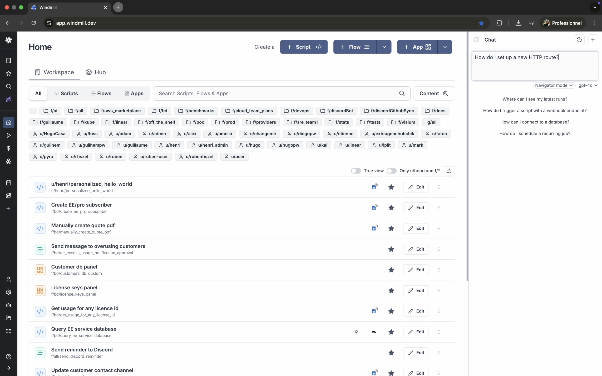
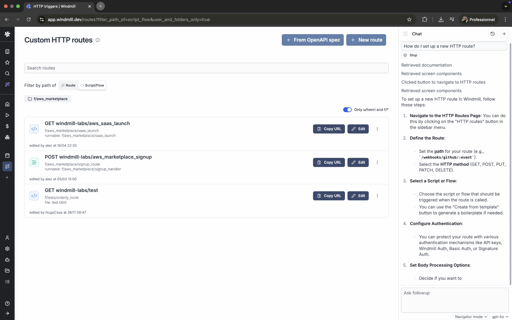
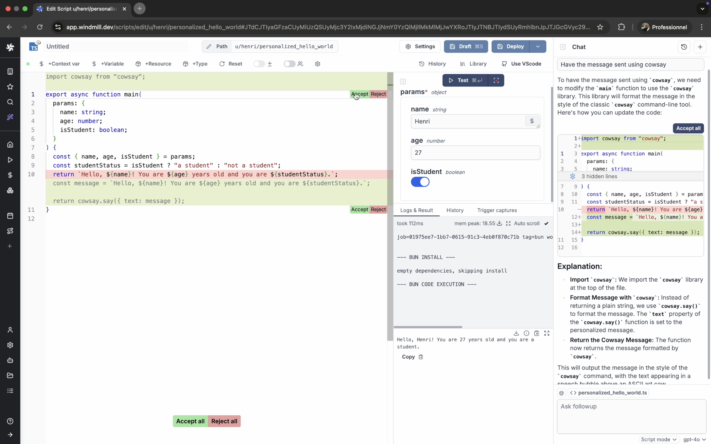

# Windmill AI Chat: Context-aware assistance across the entire platform

AI is becoming a natural part of how we build and automate. With the right context and interface, it can significantly speed up tasks without disrupting your workflow. At [Windmill](/), we've embraced this shift by introducing an AI chat assistant that's deeply integrated across the entire platform.

The assistant is now available on every screen: in the [script editor](/docs/script_editor), [flow editor](/docs/flows/flow_editor), [app editor](/docs/apps/app_editor), and even while [navigating](#navigation-mode). It's always nearby when you need it, yet unobtrusive when you don't.

<iframe
	style={{ aspectRatio: '16/9' }}
	src="https://www.youtube.com/embed/ZAlotkJlQ2c"
	title="Perpetual Scripts"
	frameBorder="0"
	allow="accelerometer; autoplay; clipboard-write; encrypted-media; gyroscope; picture-in-picture; web-share"
	allowFullScreen
	className="border-2 rounded-lg object-cover w-full dark:border-gray-800"
></iframe>

> All of the modes are evidenced in the video above.

## A mode for every task

To make the assistant more effective, we've introduced three specialized modes: [Navigation](#navigation-mode), [Script](#script-mode), and [Flow](#flow-mode). These modes help ensure more relevant responses and better user experiences, tailored to the task at hand.

### Navigation mode

Navigation mode is ideal for discovering Windmill's features and understanding how the platform works. It's especially helpful for new users, providing quick guidance and links to the [docs](/docs/intro).
For more advanced users, it's still useful for uncovering less obvious functionalities without needing to search manually.

### Script mode

In the [script editor](/docs/script_editor), the assistant shines by working with rich context.
You can provide specific context - like referencing a database schema, selecting a few lines of code, or comparing with the latest deployed version - all easily addable using the `@` symbol or through a context dropdown.

Once provided, this context enables a range of quick actions.
For example, if you test a step and it fails, you'll be offered options to fix the error or improve the code right from the chat.
These actions are tuned to the situation, helping you move faster with fewer steps.

You can also choose to apply or discard specific parts of a suggestion.
This granular apply/reject is built directly into the Monaco editor and makes AI suggestions easier to manage - not a flashy feature, just a necessary one.

### Flow mode

[Flow](/docs/flows/flow_editor) mode turns natural language into fully structured workflows.
You can describe your intent in plain English, and the assistant will build a flow step by step, connecting scripts, filling in parameters, and even handling branches and loops.

It pulls from your workspace and [Windmill Hub](https://hub.windmill.dev/), reusing existing components or generating new ones as needed.
Based on the context, it sets inputs, chooses iterator expressions, and configures predicates to match the data structure of your flow.

<iframe
	style={{ aspectRatio: '16/9' }}
	src="https://www.youtube.com/embed/L7JPHDtbSNM"
	title="Perpetual Scripts"
	frameBorder="0"
	allow="accelerometer; autoplay; clipboard-write; encrypted-media; gyroscope; picture-in-picture; web-share"
	allowFullScreen
	className="border-2 rounded-lg object-cover w-full dark:border-gray-800"
></iframe>

## Supported models and interface details

Windmill AI is compatible with a [range of language models](/docs/core_concepts/ai_generation).
While we mostly test and optimize with OpenAI and Claude - and currently see the best results with Claude - the assistant is designed to work well with other configured models too.

You can easily switch between your available models from within the chat interface.
For quick access, use `Cmd + L` to open the assistant at any time, from anywhere in the app. The assistant adapts to the screen you're on and the actions you're taking, aiming to assist without interrupting.

## Looking ahead

We see AI becoming an increasingly central part of the Windmill experience.
We're focused on making it as helpful, flexible, and responsive as possible.

In the near future, expect a more intelligent AI chat, tighter integrations across the platform, and a redesigned autocomplete experience that speeds up scripting.

In addition to the [MCP server we already provide for executing scripts](/docs/core_concepts/mcp) we're also exploring the possibility of exposing a similar capability for creating, editing, deploying, and configuring scripts, flows, triggers, and other Windmill resources - accessible from local tools like Claude or Cursor.

<iframe
	style={{ aspectRatio: '16/9' }}
	src="https://www.youtube.com/embed/De77j1T3gRs"
	title="Perpetual Scripts"
	frameBorder="0"
	allow="accelerometer; autoplay; clipboard-write; encrypted-media; gyroscope; picture-in-picture; web-share"
	allowFullScreen
	className="border-2 rounded-lg object-cover w-full dark:border-gray-800"
></iframe>

 

The AI assistant is now live and available across <a href="https://app.windmill.dev/" rel="nofollow">Windmill cloud</a>, and on all [self-hosted](/docs/advanced/self_host) instances after version [v1.495.0](https://github.com/windmill-labs/windmill/releases/tag/v1.495.0)