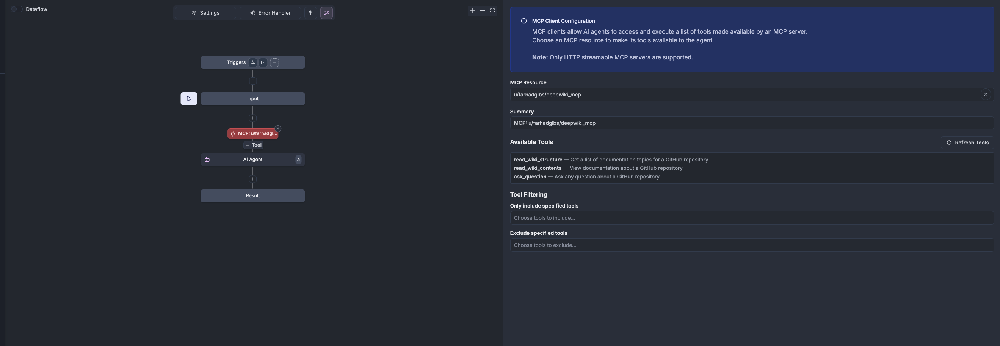

# Building AI agent steps in Windmill flows

AI agent steps in Windmill let you build flows where language models can reason about which tools to use, call scripts dynamically, and handle complex multi-step tasks.{/* truncate */} Instead of hardcoding every path through a workflow, you define the available tools and let the agent orchestrate them based on the user's request.

AI agent steps transform Windmill flows into conversational, decision-making workflows. An AI agent can analyze inputs, choose which tools to use, and orchestrate multiple steps to accomplish a goal.

### Multi-provider support

An AI Agent can be configured with any provider: OpenAI, Anthropic, Azure OpenAI, Mistral, Google AI, Groq, Together AI, OpenRouter, or any custom or local provider you have.

### Tool integration

Any Windmill script can become a tool the AI agent can invoke. This makes the agent able to use [scripts](/docs/getting_started/scripts_quickstart) written in any of the 10+ languages Windmill supports. The agent reasons about which tools to use based on the user's request rather than following a predetermined sequence.

### Streaming

Long-running AI interactions can feel opaque. Streaming shows responses as they're generated. When an agent calls tools, processes results, and formulates responses, users see real-time updates about what's happening.

### Conversation memory

Agents can remember previous messages within a conversation. Configure how much context to maintain, and the agent will recall earlier interactions. This enables conversational workflows where the agent builds on previous exchanges.

### Image support

AI agent steps support images as input and ouput. You can give images to your agent for it to analyze, or ask it to generate them. When agents generate images, those images are automatically stored in your workspace's S3 [bucket](/docs/core_concepts/object_storage_in_windmill) for use in subsequent workflow steps.

### Structured output

Sometimes you need data in a specific format, not just conversational text. JSON schema validation ensures the AI's response conforms to a structure your downstream systems expect.

### MCP integration

Through Model Context Protocol support, agents can connect to external MCP servers: file system browsers, database interfaces, API integrations, and custom business logic servers. Agents aren't limited to Windmill's internal capabilities—they can reach out to any MCP-compatible service.

### Configuration

You can set your system prompt to guide the agent's behavior, adjust temperature for creativity versus consistency, and set a max output token to limit cost.
