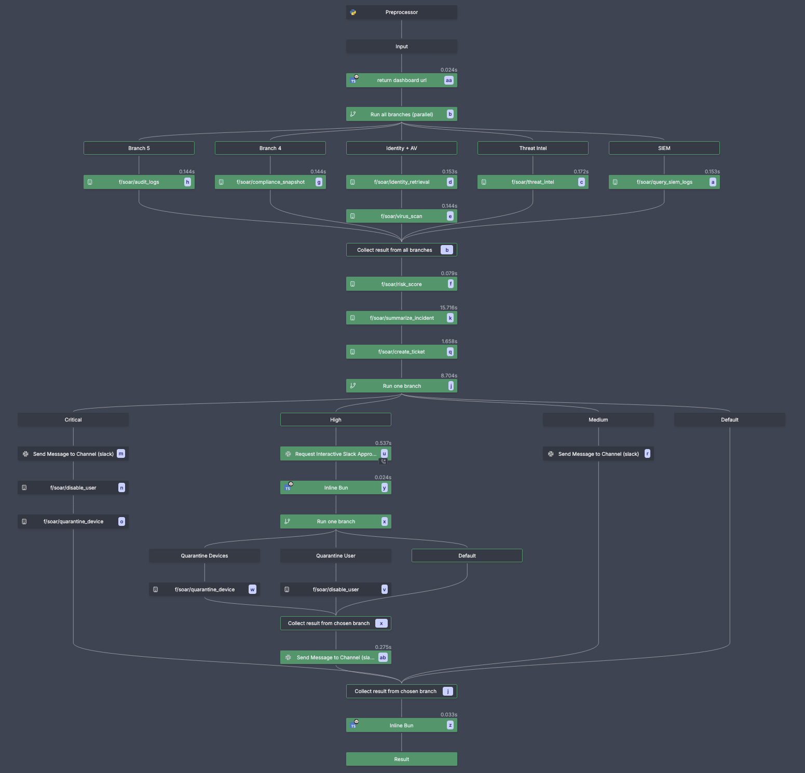
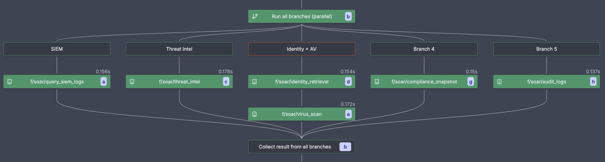
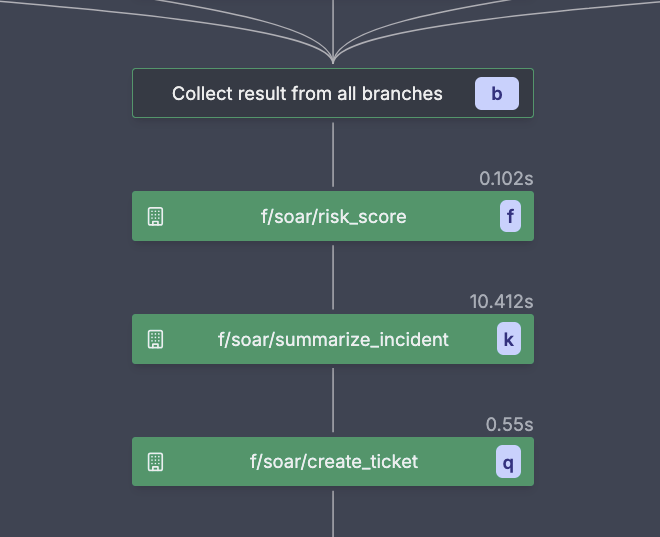
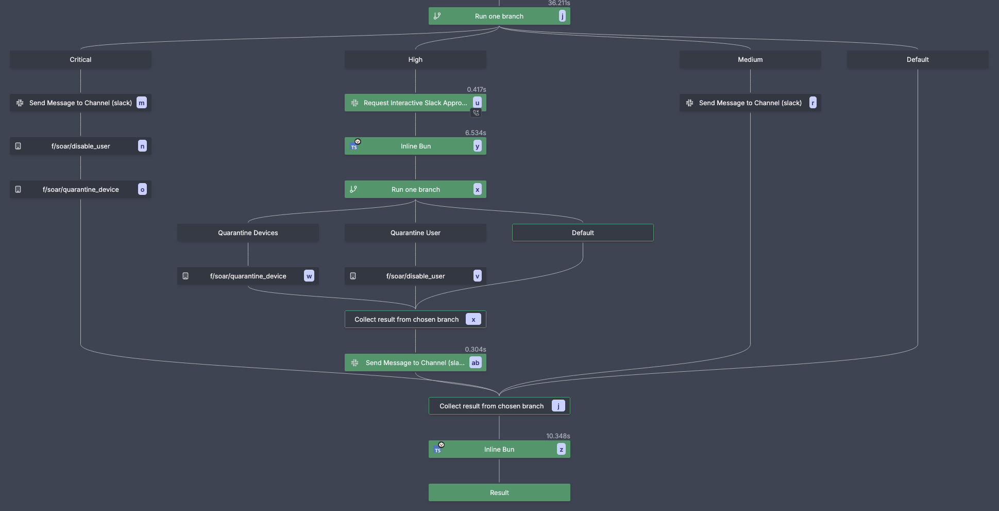
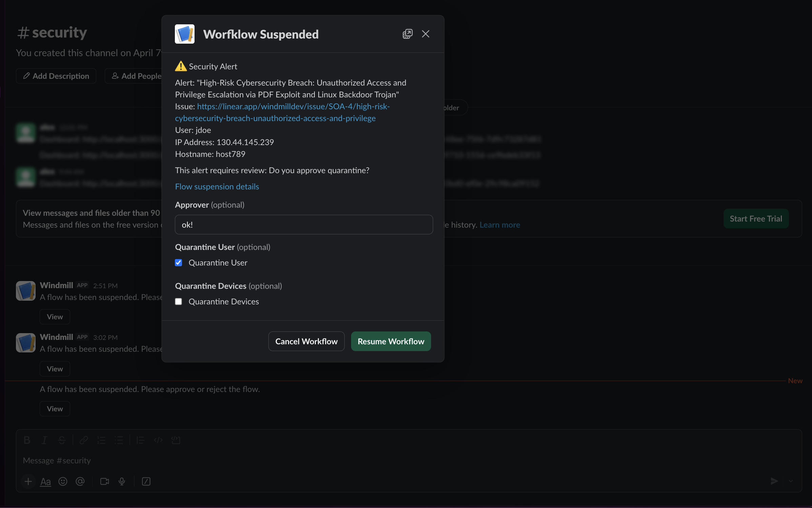
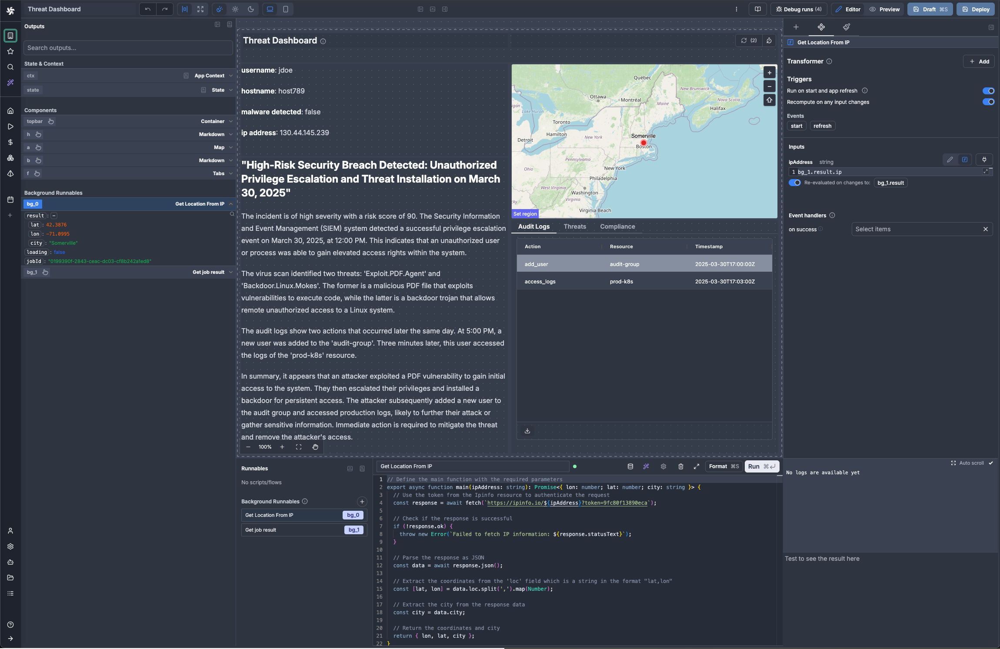

import DocCard from '@site/src/components/DocCard';
import aiFlowVideo from './aiflow.mov';
import { useEffect } from 'react';

# Windmill for SOAR: From Code to Security Operations in Minutes

When major organizations with 10,000+ employees and 50+ person security operations teams move from platforms like Palo Alto Networks, Tines etc. to Windmill for security orchestration, they weren’t just swapping vendors; they adopted a different way to do SOAR. Instead of rigid, pre-built workflows that struggled with their complex environments, they used a platform that lets them write real code, iterate quickly, and automate the processes they actually run.

This case study shows why teams pick Windmill for SOAR and walks through a live demo we presented to FEMA, including an automated incident response flow.

<iframe
    style={{ aspectRatio: '16/9', marginBottom: '1.25rem' }}
    src="https://www.youtube.com/embed/XLgibAuCOJo?enablejsapi=1&rel=0&vq=hd720"
    title="YouTube video player"
    allow="accelerometer; autoplay; clipboard-write; encrypted-media; gyroscope; picture-in-picture; web-share"
    allowFullScreen
    className="border-2 rounded-lg object-cover w-full dark:border-gray-800 my-6"
    id="soarDemo"
></iframe>

export function DemoChapters() {
  const post = (func, args = []) => {
    const iframe = document.getElementById('soarDemo');
    if (!iframe || !iframe.contentWindow) return;
    iframe.contentWindow.postMessage(
      JSON.stringify({ event: 'command', func, args }),
      '*'
    );
  };

  const scrollToPlayer = () => {
    const iframe = document.getElementById('soarDemo');
    if (!iframe) return;
    iframe.scrollIntoView({ behavior: 'smooth', block: 'start' });
    // Nudge 20px higher so the player isn't flush with the top
    setTimeout(() => window.scrollBy({ top: -20, left: 0, behavior: 'smooth' }), 200);
  };

  const ensureHd = () => post('setPlaybackQuality', ['hd720']);

  const seek = (seconds) => {
    scrollToPlayer();
    ensureHd();
    post('seekTo', [seconds, true]);
    post('playVideo');
  };

  useEffect(() => {
    // Try to set quality when the component mounts
    ensureHd();
  }, []);

  return (
    <details className="mt-4 mb-6" style={{ marginTop: '0.75rem', marginBottom: '1.5rem' }}>
      <summary>Jump to parts of the demo video</summary>
      <ul>
        <li><button type="button" onClick={() => seek(0)}>0:00: Introduction</button></li>
        <li><button type="button" onClick={() => seek(497)}>8:17: Demo</button></li>
        <li><button type="button" onClick={() => seek(527)}>8:47: Individual scripts</button></li>
        <li><button type="button" onClick={() => seek(669)}>11:09: AI-supported script generation</button></li>
        <li><button type="button" onClick={() => seek(720)}>12:00: Triggers</button></li>
        <li><button type="button" onClick={() => seek(855)}>14:15: Resources, variables, secrets</button></li>
        <li><button type="button" onClick={() => seek(957)}>15:57: Permissions</button></li>
        <li><button type="button" onClick={() => seek(1020)}>17:00: SSO — Import users using SAML</button></li>
        <li><button type="button" onClick={() => seek(1075)}>17:55: Flows</button></li>
        <li><button type="button" onClick={() => seek(1560)}>26:00: Running a flow</button></li>
        <li><button type="button" onClick={() => seek(1602)}>26:42: Interactive approvals</button></li>
        <li><button type="button" onClick={() => seek(1760)}>29:20: Apps and dashboards</button></li>
        <li><button type="button" onClick={() => seek(2020)}>33:40: Closing notes</button></li>
      </ul>
    </details>
  );
}

export function VideoLink({ seconds, children }) {
  const onClick = (e) => {
    e.preventDefault();
    const iframe = document.getElementById('soarDemo');
    if (!iframe || !iframe.contentWindow) return;
    iframe.scrollIntoView({ behavior: 'smooth', block: 'start' });
    setTimeout(() => window.scrollBy({ top: -200, left: 0, behavior: 'smooth' }), 200);
    const post = (func, args = []) =>
      iframe.contentWindow.postMessage(
        JSON.stringify({ event: 'command', func, args }),
        '*'
      );
    post('setPlaybackQuality', ['hd720']);
    post('seekTo', [seconds, true]);
    post('playVideo');
  };
  return (
    <a href="#soarDemo" onClick={onClick}>{children}</a>
  );
}

<DemoChapters />

## The SOAR Problem and Solution

Having worked in the security industry for 15+ years, including time in SOCs and managed security providers handling security incidents, I've seen the same pattern repeatedly: organizations outgrow managed SOAR platforms as their security infrastructure becomes more complex.

The challenges are consistent across organizations of all sizes:

- **Rigid workflows** that don't map to unique organizational structures and custom internal systems
- **Waiting for vendor features** when you need integration with proprietary or government-specific systems  
- **Limited to pre-built integrations** while your security stack includes custom tools and APIs
- **Complex pricing models** that scale poorly as automation needs grow

As one security engineer noted: "Our workflows got very complex because our infrastructure is complex, and we weren't able to map our playbooks anymore in the managed system."

Windmill addresses these challenges by giving you the flexibility to build exactly what you need:

**Code-first approach**: Write and compose security scripts and workflows in Python, TypeScript, Bash, SQL, and more. Use your existing codebase as-is with no proprietary language or framework lock-in. Import existing scripts directly using the [CLI](/docs/advanced/cli) and develop locally with the [VS Code extension](/docs/cli_local_dev/vscode-extension).

**Performance and control**: Fastest job orchestration and workflow engine with near-zero overhead built on PostgreSQL and Rust. Self-hosted and open-source, so you keep ownership of your automation without waiting on vendors or hitting API limits. See our [benchmarks](/docs/misc/benchmarks/competitors).

**Rapid iteration**: Test and deploy in minutes, not weeks. The built-in IDE, CLI, and AI assistance help engineers build faster. Use any library, any API, and the [integrations](/docs/integrations/integrations_on_windmill) your team already relies on. [Windmill's AI assistant](/docs/core_concepts/ai_generation) helps you write and debug code, compose flows, and helps users that may not be proficient in code to easily build and debug their workflows.

<video
    controls
    autoPlay
    muted
    loop
    playsInline
    onLoadedMetadata={(e) => {
        e.currentTarget.playbackRate = 2;
    }}
    onPlay={(e) => {
        e.currentTarget.playbackRate = 2;
    }}
    className="w-full rounded-lg border-2 dark:border-gray-800 my-4"
>
    <source src={aiFlowVideo} type="video/quicktime" />
    Your browser does not support the video tag. 
    <a href={aiFlowVideo}>Download the video</a>.
</video>

## Building a Complete SOAR Workflow: From Alert to Remediation

Let's see how this works in practice. In SOAR terminology, a "playbook" is a predefined sequence of actions that security teams follow to respond to specific types of incidents.

Common SOAR playbooks include incident response, threat hunting, vulnerability management, compliance reporting, and user provisioning. Windmill can handle all of these and more, from simple alert triage to complex multi-stage investigations. 

The incident response workflow we demonstrated for FEMA's Office of the Chief Information Security Officer (OCISO) during their SOAR capabilities workshop shows Windmill's approach to security automation, from initial detection through complete remediation.



### The Trigger: IDS Alert Webhook

In most SOAR setups, playbooks are kicked off by events coming from SIEM/IDS/IPS, EDR, TIPs, ticketing systems, email parsers, chat-ops, schedulers, or message queues (Kafka/SQS/Pub/Sub). Windmill supports these patterns via [triggers](/docs/getting_started/triggers). In this example, the flow is triggered by a webhook to start the flow and pass an initial alert context. (<VideoLink seconds={720}>watch 12:00</VideoLink>)

E.g. an intrusion detection system detects suspicious activity and sends a webhook to Windmill with:
- Username: `jdoe` 
- IP address: `192.168.1.100`
- Hostname: `workstation-015`
- Timestamp: `2024-01-15T14:30:00Z`

### Phase 1: Data Collection (Parallel Execution)

The first phase is enrichment. Typical SOAR playbooks query sources like SIEM, IAM/HR/CMDB, EDR/NDR/AV, MDM/NAC, and threat intel (IP/domain/hash), plus geo/WHOIS and audit logs to add context and reduce false positives. In Windmill, each enrichment is its own flow step that runs in parallel across multiple workers; failures are isolated and do not block the rest. [Error handling](/docs/core_concepts/error_handling) is built in and can be configured per step.



In this example, Windmill immediately launches five parallel enrichment flow steps:

**SIEM Query**

This script shows the pattern: call your SIEM over its API, then return a small, normalized payload that downstream steps can use. Use any HTTP client or vendor SDK, authenticate with [variables and secrets](/docs/core_concepts/variables_and_secrets), and keep the return shape simple for composition.
```python
def main(username: str, ip: str, hostname: str) -> dict:
    # Query SIEM for related events
    events = siem_client.query(
        f"username:{username} OR ip:{ip} OR hostname:{hostname}",
        time_range="last_24h"
    )
    
    return {
        "events": events,
        "failed_logins": len([e for e in events if e.type == "login" and not e.success])
    }
```

**Threat Intelligence**
- Queries external threat feeds for IP reputation etc.
- Returns risk score (0-100) and malicious indicators

**Identity System**
- Fetches user details: department, role, managed devices
- Critical for determining blast radius and appropriate response

**Virus/Malware Scan**
- Scans all devices associated with the user
- Returns infection status and detected threats

**Compliance & Audit Logs**
- Checks recent permission changes and access requests
- Identifies potential insider threats or compromised credentials

### Phase 2: Analysis & Classification

The analysis phase is where SOAR playbooks combine all the collected signals to determine incident severity and appropriate response. This typically involves scoring models, rule-based logic, or machine learning to produce a severity level and rationale. Some teams plug in external scoring services or ML models, but the interface stays the same: produce a severity and rationale.

In this workflow, the outputs from Phase 1 are combined into a risk score and severity level.



Our example uses a basic heuristic that produces a numeric risk score and severity. It's intentionally simple and transparent: each signal contributes a fixed weight, and thresholds are easy to tune. Teams often start here and later evolve weights or swap in a learned model.

In Windmill, this logic lives in [code and scripts](/docs/getting_started/scripts_quickstart) that are easy to review, test, and version. You can swap it for a model or API without changing the flow structure.

**Risk Scoring Algorithm**
```python
def main(failed_logins: int, threats: List[str], infected: bool, 
         risk_score_ip: int, is_malicious_ip: bool, permissions_ok: bool,
         compliance_risks: List[str], audit_logs: List[dict], department: str):
    
    score = 0
    
    # SIEM analysis
    if failed_logins >= 5:
        score += 20
    
    # Virus scan results  
    if infected:
        score += 40
    if threats:
        score += 10
    
    # Threat intelligence
    if risk_score_ip >= 80:
        score += 30
    elif risk_score_ip >= 50:
        score += 15
    if is_malicious_ip:
        score += 10
    
    # Identity context
    if department.lower() in ["finance", "admin", "security"]:
        score += 10  # Higher risk for privileged departments
    
    # Compliance violations
    if not permissions_ok:
        score += 20
    if compliance_risks:
        score += 10
    
    # Recent suspicious activities
    for entry in audit_logs:
        if entry["action"] in ["request_access", "add_user", "enable_ssh"]:
            score += 10
            break
    
    # Classification
    if score >= 100:
        severity = "critical"
    elif score >= 70:
        severity = "high"
    elif score >= 40:
        severity = "medium"
    else:
        severity = "low"
    
    return {
        "risk_score": score,
        "severity": severity,
        "should_auto_respond": severity in ["high", "critical"]
    }
```

**AI-Powered Incident Summary**

The enrichment outputs are consolidated into a structured prompt for ChatGPT or Claude to generate a concise, human‑readable incident summary. The result includes the key signals, a rationale for the severity, and a prefilled ticket body with recommended next actions.

**Automatic Ticket Creation**

The flow then creates a ticket in Linear or ServiceNow with the generated summary and deep links back to the live dashboard, so analysts can jump directly into the investigation.

### Phase 3: Response Actions

Response covers notification, ticketing, and containment: disable or lock accounts, revoke sessions/keys, quarantine devices, block indicators (firewall/EDR/SWG), reset credentials, and update ACLs. SOAR playbooks often gate destructive actions behind approvals. In Windmill, [flows](/docs/getting_started/flows_quickstart) branch by severity, pause for [approvals](/docs/flows/flow_approval) in [Slack](/docs/integrations/slack) or [Teams](/docs/integrations/teams) when needed, and then fan out actions in parallel with retries and full audit trails.



In this example, based on the calculated risk score, Windmill branches out the remediation steps:

**🟢 Low Severity (Default branch)**: 
- Log incident to SIEM
- No further action needed

**🟡 Medium Severity**: 
- Send Slack alert to `#security` channel
- Create monitoring ticket for analyst review

**🟠 High Severity**: 
- [Interactive approval workflow via Slack](/docs/flows/flow_approval#slack-approval-step)
- Security analyst can approve/deny quarantine actions

**🔴 Critical Severity**:
- Immediate user account disable
- Automatic device quarantine  
- Emergency Slack notification with dashboard link



### Investigation Dashboard: Live Context and Controls

This dashboard gives analysts a single place to review the incident, understand blast radius, and take action without switching tools. It pulls live signals from the workflow and overlays them with user and device context so the next step is obvious. (<VideoLink seconds={1760}>watch 29:20</VideoLink>)

It is built with [Windmill's app builder](/docs/apps/app_editor) and connects directly to flow steps' data, SQL, and REST APIs. Components are bound to the run, which keeps the view in sync as enrichment completes and decisions are made. Actions on the page can trigger scripts and flows with approvals when needed.



**Incident Overview Panel**
The dashboard opens with a live threat summary produced by the AI analysis, paired with a risk score that highlights the main contributing factors. It also surfaces the user and device context pulled from identity systems so analysts immediately see who is impacted and how.

**Geographic Context Map**
A map provides IP geolocation with threat indicators and an at a glance topology view of affected systems, helping analysts understand blast radius and potential lateral movement.

**Interactive Controls**
From the same screen, analysts can trigger manual quarantine actions, request or grant approvals, and launch custom investigation tools without leaving the dashboard.

**Background Data Refresh**
Threat feeds and SIEM data refresh automatically every 60 seconds, and compliance status updates in real time to keep the view accurate throughout an investigation.

## Key Security Features

Windmill takes care of the security plumbing you expect from a platform built for operations. Credentials live in [variables and secrets](/docs/core_concepts/variables_and_secrets), or via [OIDC](/docs/core_concepts/oidc) for external key management such as HashiCorp Vault, AWS KMS, and Azure Key Vault. (<VideoLink seconds={855}>watch 14:15</VideoLink>)

Every run and approval is recorded in [audit logs](/docs/core_concepts/audit_logs) and can be exported to your SIEM when needed. Access is managed with [roles and permissions](/docs/core_concepts/roles_and_permissions), so you can control who runs, edits, or approves. (<VideoLink seconds={957}>watch 15:57</VideoLink>) When actions need human review, [flow approvals](/docs/flows/flow_approval) work from the UI, Slack, or Teams, including on mobile. (<VideoLink seconds={1602}>watch 26:42</VideoLink>)

Apps and assets inherit access from [groups and folders](/docs/core_concepts/groups_and_folders), and you can keep changes safe with separate [staging and production](/docs/advanced/git_sync#git-sync---item-mode-deploy-to-prod-using-a-git-workflow) environments.

## Getting Started with Windmill for SOAR

Security teams need automation that matches the complexity of today's threats. Windmill lets you build the workflows you need, from simple alert handling to full incident response. After years of watching teams struggle with inflexible SOAR platforms, it's clear that the future belongs to platforms that adapt to your processes, not the other way around.

Join 2,000+ organizations already using Windmill for mission-critical automation, including government agencies, financial institutions, and security-first companies.

Start with a [30-day free trial](/pricing) that includes enterprise features like SAML, external secrets management, and dedicated support and deploy Windmill [self-hosted](/docs/advanced/self_host) on your infrastructure with [Kubernetes](https://github.com/windmill-labs/windmill-helm-charts), Docker, or bare metal.
