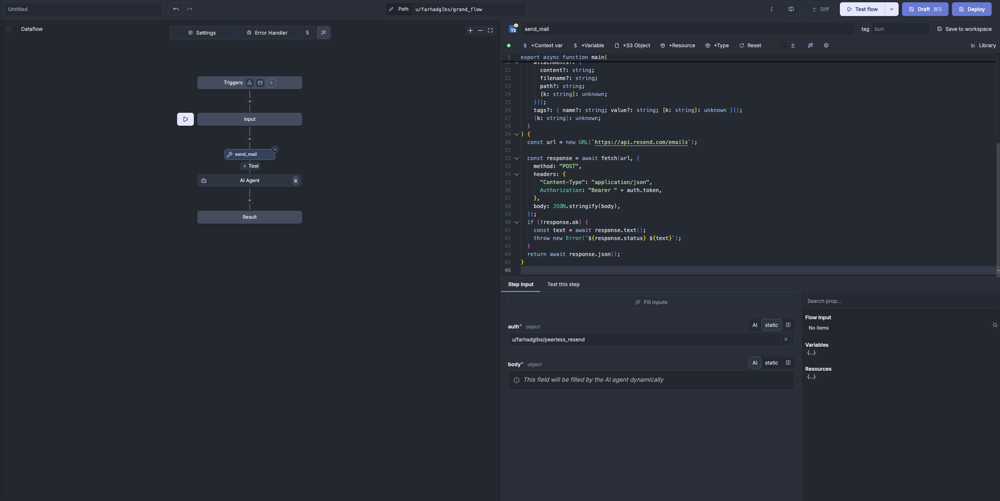
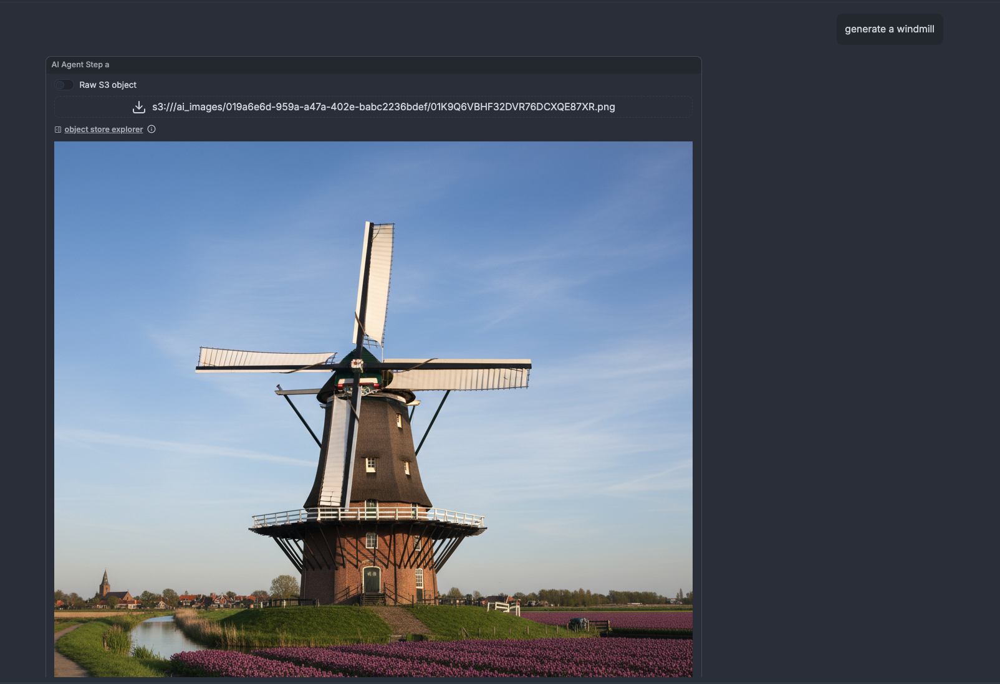

# AI agent steps in Windmill flows

The rise of large language models has created a new paradigm for workflow automation: instead of predefining every branch and decision in your workflows, you can let an AI agent reason about which tools to use and orchestrate them dynamically based on context.

AI agent steps in Windmill bring this capability to your workflows. Define the tools available, a Windmill script, or any tools exposed by an MCP server, and let the agent decide which to call, when to call them, and how to combine their results. The agent becomes a flexible orchestrator that adapts to each request rather than following a rigid script.

This post explores what AI agent steps enable for Windmill users, then dives into two technical challenges we solved: making structured output work consistently across different AI providers, and maintaining MCP protocol compliance as the ecosystem matures.

<!--truncate-->

## What AI agent steps bring to Windmill

### Multi-provider support

Configure your AI agent with any provider: OpenAI, Anthropic, Azure OpenAI, Mistral, Google AI, Groq, Together AI, OpenRouter, or any custom or local endpoint you operate.

### Tool integration

Any Windmill [script](/docs/getting_started/scripts_quickstart) becomes a tool the AI agent can invoke. Write your tools in any of the 10+ languages Windmill supports—Python, TypeScript, Go, Rust, PHP, Bash, SQL, and more. The agent examines each tool's schema, understands its capabilities, and reasons about which tools to use based on the user's request.

### Streaming

Long-running AI interactions can feel like black boxes. Streaming makes the agent's work visible in real-time. As the agent calls tools, processes their results, and formulates its response, users see updates showing exactly what's happening. This transparency is crucial for complex workflows where the agent might call multiple tools sequentially.

### Conversation memory

Agents can maintain conversation history, remembering earlier messages and building on previous exchanges. Configure how much context to preserve, and the agent will recall relevant information from earlier in the conversation. This enables truly conversational workflows where the agent doesn't treat each message in isolation but understands the broader context of what you're trying to accomplish.

### Image support

Modern AI models can both understand and generate images. AI agent steps support both: provide images as input for the agent to analyze, or have the agent generate images in response to your request.
When agents generate images, they're automatically stored in your workspace's S3-compatible [object storage](/docs/core_concepts/object_storage_in_windmill). This means generated images are immediately available for subsequent workflow steps—no manual file handling required. Process them with Python, upload them to a CMS with TypeScript, or include them in notifications, all using standard Windmill workflows.

### Structured output

Conversational text is useful, but sometimes you need data in a specific format that downstream systems can consume reliably. With JSON schema validation, you can ensure the AI's response conforms to a precise structure, returning a standardized object rather than free-form text.

### MCP integration

Through Model Context Protocol support, agents can connect to external MCP servers: file system browsers, database interfaces, API integrations, and custom business logic servers. Agents aren't limited to Windmill's internal capabilities—they can reach out to any MCP-compatible service.

### Configuration

Fine-tune your agent's behavior with configuration options: set system prompts to guide how the agent approaches tasks, adjust temperature to control creativity versus consistency, and set maximum output tokens to manage costs. These parameters let you optimize the agent for your specific use case.

## Technical challenges

Building AI agent steps meant solving real technical challenges. Two stand out: making structured output work consistently across providers with different capabilities, and maintaining protocol compliance in a maturing ecosystem.

### Structured output across providers

Supporting multiple AI providers reveals an ongoing challenge: many providers claim OpenAI compatibility, but real-world differences require effort to handle. Structured output illustrates this well.

Most providers support structured output through a response_format parameter. You specify a JSON schema, and the model ensures its response conforms to that structure. This works straightforwardly for OpenAI, Mistral, Google AI, and several other providers.

Anthropic's models don't support response_format. Rather than limiting functionality for Anthropic users, we implemented a workaround: define a special tool where the tool's input schema matches the desired output structure. The agent calls this tool as its final action, and the tool's arguments become the structured response.

From the user's perspective, structured output works uniformly across all providers. The implementation differs behind the scenes, but the interface remains consistent. This approach lets us support providers with different capabilities while maintaining a unified experience.

### MCP protocol compliance

Windmill uses the official [rmcp](https://github.com/modelcontextprotocol/rust-sdk) Rust crate for MCP support. This is a well-engineered implementation that strictly follows the MCP protocol specification, exactly as it should. Protocol compliance isn't just about following rules; it's about ensuring different implementations can work together reliably.

However, MCP is still a young protocol. As the ecosystem develops, we've encountered servers that don't implement the specification precisely. These aren't malicious implementations, they're often early versions or experimental servers where the authors interpreted certain edge cases differently than the spec intended.

The types of issues that arise typically involve:

- Incorrect HTTP status codes in error responses
- Deviations in how servers signal unsupported features
- Inconsistent handling of optional protocol elements
- Subtle differences in message format expectations

When Windmill connects to a non-compliant server, the strict protocol implementation in rmcp correctly rejects the connection rather than trying to work around the deviation.
This is a bet on the ecosystem's long-term health. Protocols only work when implementations follow them consistently. By maintaining strict compliance, we provide clear error messages about what's wrong and create incentives for servers to fix protocol issues. As the MCP ecosystem matures, these compatibility problems should hopefully diminish.

## A natural fit for workflow orchestration

AI agent steps in Windmill aren't a separate system grafted onto the platform, they're a natural extension of what Windmill already does well. By building on Windmill's existing workflow engine, multi-language support, and schema-first design, we created a feature that feels native because it truly is.

The result is a system where AI agents orchestrate workflows the same way humans do: by calling tools, processing results, and making decisions based on context. The tools happen to be Windmill scripts in any language. The execution happens through the same job queue that runs every other workflow. The storage uses the same S3 integration that handles all large artifacts.

As the AI ecosystem evolves, Windmill's AI agent steps will evolve with it. Not because we're constantly rebuilding, but because we built on solid foundations from the start.