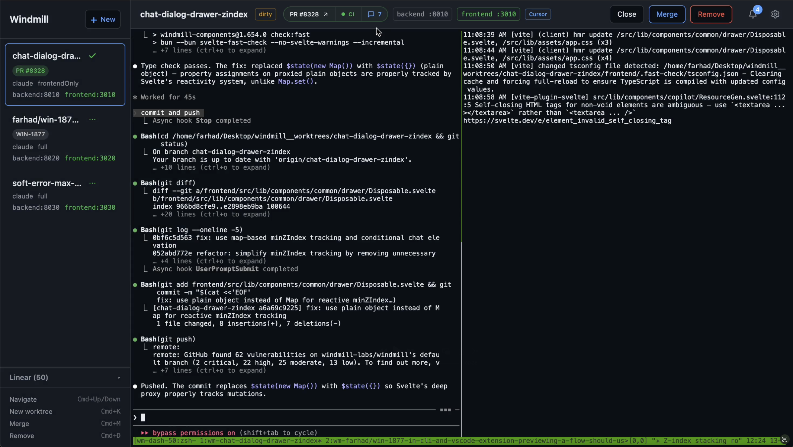
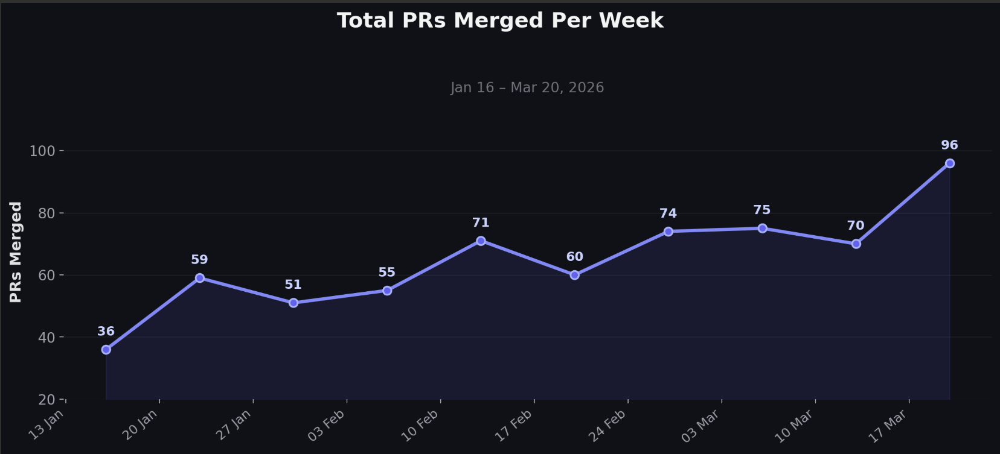

import createVideo from './create.mp4';
import commentsAndCiVideo from './ci.mp4';
import healthVideo from './health.mp4';
import demoVideo from './demo.mp4';
import linearVideo from './linear.mp4';

Every team running AI coding agents in parallel hits the same wall. You have 5 agents going, each in its own git worktree, each with dev servers, each producing PRs. You're alt-tabbing between terminal windows, GitHub tabs, and CI dashboards trying to keep track.

The tooling to manage this is evolving fast. [workmux](https://workmux.raine.dev/) uses the one-worktree-one-tmux-one-agent model. [Cmux](https://cmux.com/) brings Ghostty-based terminal management with notification rings. Others have built internal solutions around tmux scripts, custom CLIs, or IDE extensions. We tried several of these approaches at Windmill, and none fully solved our problem.

On the other hand, writing code has become cheap, so building our own tooling would not take much time. The advantage is complete control over the experience: we implement exactly the features we need, and we iterate fast.

So we built [**Webmux**](https://webmux.dev/), an open-source web dashboard and CLI for creating, monitoring, and managing parallel AI agents. It combines embedded terminals (xterm.js rendering real Claude/Codex sessions), GitHub PR and CI tracking, service health monitoring, and Docker sandboxing in one tool.

Webmux is open-source and MIT licensed. Check it out on [GitHub](https://github.com/windmill-labs/webmux) or visit [webmux.dev](https://webmux.dev/) to get started.

<!--truncate-->

## Why a web UI around a terminal

We started with [workmux](https://workmux.raine.dev/), which nails the core abstraction: one worktree, one tmux session, one agent per task. It's a great tool if you live in the terminal.

But as the number of parallel agents grew, we kept running into friction that no terminal-only tool could fully solve:

- **Switching context** between tmux windows to check agent progress
- **Opening GitHub** in a separate tab to see if a PR was opened, if CI passed, if there were review comments
- **Checking service health** manually (did the dev server in worktree #3 crash again?)
- **Losing track** of which agent was doing what across 5+ concurrent worktrees

The other extreme, building a custom UI per agent using the Claude or Codex SDK, would solve the aggregation problem but create a new one: every upstream release would require us to update our own renderer.

So we went with the hybrid approach: a web dashboard that renders real terminal sessions via xterm.js. You get everything in one browser tab (live terminals, PR status, CI results, service health, notifications) while the terminal stays the source of truth. Anthropic and OpenAI updates show up automatically, and plugging in another CLI like the [Gemini CLI](https://github.com/google-gemini/gemini-cli) or [OpenCode](https://opencode.ai/) is just configuration.

## How it works

### One-click worktree creation

Pick a profile, name a branch, write a prompt. Webmux handles the rest:
1. Creates a [git worktree](https://git-scm.com/docs/git-worktree)
2. Allocates ports for dev servers (backend, frontend, etc.)
3. Spins up a tmux session with the configured pane layout
4. Starts the AI agent (Claude, Codex, or others) with the prompt and environment variables
5. Runs any `postCreate` lifecycle hook (install dependencies, seed data, etc.)

All of this is driven by a single `.webmux.yaml` config file at the root of your project.

<video
    controls
    autoPlay
    loop
    muted
    playsInline
    className="w-full rounded-lg border-2 dark:border-gray-800 my-4"
>
    <source src={createVideo} />
    Your browser does not support the video tag.
    <a href={createVideo}>Download the video</a>.
</video>

### CLI

Everything you can do from the web UI is also available from the command line:

- `webmux create`: create a worktree with a profile and prompt
- `webmux list`: list active worktrees with their status
- `webmux remove`: tear down a worktree and run cleanup hooks
- `webmux attach`: attach to a worktree's tmux session

Since tmux is the source of truth, changes from the CLI and the web UI are always in sync. This also lets the agent spawn new worktrees for subtasks while working on a parent task.

### PR and CI monitoring

Webmux polls GitHub to track PRs for each worktree's branch. When an agent opens a PR, you see it immediately in the dashboard with:
- PR state (open, merged, closed)
- CI check status and details: click through to see failed test logs
- Review comments displayed inline, so you can read code review feedback without leaving the dashboard

<video
    controls
    autoPlay
    loop
    muted
    playsInline
    className="w-full rounded-lg border-2 dark:border-gray-800 my-4"
>
    <source src={commentsAndCiVideo} />
    Your browser does not support the video tag.
    <a href={commentsAndCiVideo}>Download the video</a>.
</video>

### Service health

Each worktree can define services with allocated ports. Webmux periodically checks these ports and displays badges: green if the dev server is up, red if it crashed. At a glance, you know which worktrees have healthy environments and which need attention.

<video
    controls
    autoPlay
    loop
    muted
    playsInline
    className="w-full rounded-lg border-2 dark:border-gray-800 my-4"
>
    <source src={healthVideo} />
    Your browser does not support the video tag.
    <a href={healthVideo}>Download the video</a>.
</video>

### Sandboxed agents

The `sandbox` profile runs agents inside Docker containers instead of on the host. Set `runtime: docker` in your profile and Webmux handles the rest:

- Mounts git credentials (`~/.gitconfig`, `~/.ssh`, `~/.config/gh`) read-only so the agent can push and open PRs
- Mounts AI credentials (`~/.claude`, `~/.claude.json`, `~/.codex`) so Claude Code and Codex work out of the box
- Forwards service ports on loopback (`127.0.0.1`) so dev servers are accessible from the browser without being exposed externally
- Runs as your host UID/GID so file ownership stays consistent across host and container
- Passes environment variables listed in `envPassthrough` (API keys, cloud credentials, etc.)

This gives agents full autonomy (install packages, run servers, execute tests) without risking your host environment.

### Lifecycle hooks

Each worktree can run scripts at key moments in its lifecycle via `postCreate` and `preRemove` hooks defined in `.webmux.yaml`. This is where you wire up environment-specific setup and teardown: provision a database, install dependencies, seed test data, or clean up resources when a worktree is removed.

For example, at Windmill each worktree needs its own isolated Postgres database so agents never collide. The `postCreate` hook provisions a fresh database and runs migrations automatically. Combined with profiles (one that clones an already-seeded database, another that starts from a blank slate), each engineer picks the exact starting point they need through the profile selector, without any manual setup.

### Linear integration

We use [Linear](https://linear.app/) for issue tracking at Windmill, and Webmux brings it right into the dashboard. You can browse your backlog, search by title, preview the full issue details, and hit **Implement** to spin up a worktree for it in one click.

<video
    controls
    autoPlay
    loop
    muted
    playsInline
    className="w-full rounded-lg border-2 dark:border-gray-800 my-4"
>
    <source src={linearVideo} />
    Your browser does not support the video tag.
    <a href={linearVideo}>Download the video</a>.
</video>

### Mobile friendly

The web UI is fully responsive. On a phone you can check which agents are running, read PR comments and CI results, monitor service health, and create or remove worktrees. Combined with a Tailscale setup on a remote machine, you can supervise your agents from anywhere without needing a laptop.

<!-- placeholder: screenshot of webmux on mobile, showing the worktree list with PR status badges -->

## Architecture

The stack is intentionally simple:

- **Backend**: A single [Bun](https://bun.sh/) server that orchestrates git, tmux, Docker, and the GitHub CLI. The codebase follows adapter/service/domain layering: adapters handle I/O (git commands, tmux sessions, Docker containers), services implement business logic (lifecycle management, PR monitoring, reconciliation), and the domain layer holds pure types and policies
- **Frontend**: [Svelte 5](https://svelte.dev/) with xterm.js for terminal rendering

No database. The only external services are GitHub (for PRs and CI) and optionally Linear (for issue tracking). All state is derived from git worktrees and tmux sessions.

Everything is configured through a single `.webmux.yaml` at the root of your project. Key fields include: `services` to declare dev servers with auto-allocated ports, `profiles` to define pane layouts and choose between `runtime: host` or `runtime: docker`, and `lifecycleHooks` (`postCreate`, `preRemove`) to run setup and teardown scripts per worktree.

## How we use it at Windmill

Webmux works fine on a local laptop, but it really shines on a powerful remote machine. Windmill is a large Rust codebase, and each agent compiling in its own worktree is CPU- and memory-intensive. We run Webmux as an always-on service on a beefy remote server behind [Tailscale](https://tailscale.com/), so it's accessible from anywhere.

<video
    controls
    autoPlay
    loop
    muted
    playsInline
    className="w-full rounded-lg border-2 dark:border-gray-800 my-4"
>
    <source src={demoVideo} />
    Your browser does not support the video tag.
    <a href={demoVideo}>Download the video</a>.
</video>

## Impact on our velocity

This is not a controlled experiment, and plenty of other factors are at play, but the trend is hard to ignore. Between mid-January and late March 2026, our weekly merged PRs went from 36 to 96, an all-time high for the team.

Going from "how many things can one person do" to "how many agents can one person supervise" is a real shift, and Webmux is what makes the supervising part practical.
