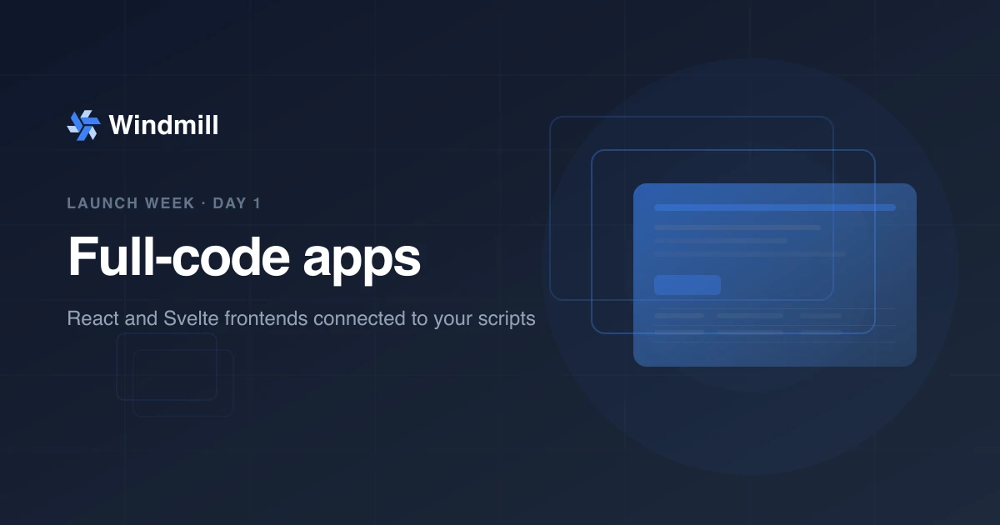

import DocCard from '@site/src/components/DocCard';
import Tabs from '@theme/Tabs';
import TabItem from '@theme/TabItem';

# Full-code apps: React and Svelte on Windmill



**Day 1 of [Windmill launch week](/launch-week-march-2026).** You can now build complete applications with React or Svelte frontends connected to Windmill backend runnables through a typed, auto-generated API.

{/* truncate */}

## The problem

Workflow platforms typically have no UI layer. When they do, it is a low-code builder: great for dashboards and forms, but limiting when you need custom interactions, framework features like hooks and routing, or an existing component library.

Teams end up building separate frontends. That means a separate deployment pipeline, a separate auth system, REST endpoints to define and maintain, and glue code to connect it all. The orchestration layer runs your backend logic but has no opinion about how users interact with it.

For teams that need a custom frontend, we wanted them to build it where they already build the backend.

## Full-code apps: one import, typed calls

A full-code app is a directory containing your frontend code (React or Svelte) and a `backend/` folder with scripts in any Windmill-supported language. Windmill bundles and serves the frontend. An auto-generated `wmill.ts` module provides typed functions to call your backend runnables.

<video
  className="border-2 rounded-lg object-cover w-full h-full dark:border-gray-800 mb-6"
  autoPlay
  loop
  muted
  src="/img/platform/app-builder/platform-app-builder-backend-runnables.webm"
/>
<p className="text-xs text-gray-500 mb-6 text-center">Calling backend runnables from a full-code frontend with a typed API.</p>

<Tabs className="unique-tabs">
<TabItem value="react" label="React" attributes={{className: "text-xs p-4 !mt-0 !ml-0"}}>

```tsx
// App.tsx
import { useState, useEffect } from "react";
import { backend } from "./wmill.ts";

export default function App() {
  const [data, setData] = useState(null);
  const [loading, setLoading] = useState(true);

  useEffect(() => {
    backend.get_failed_payments({ days_back: 7, limit: 100 })
      .then(setData)
      .finally(() => setLoading(false));
  }, []);

  if (loading) return <div>Loading...</div>;

  return (
    <div>
      <h2>Failed payments ({data.failed_payments_count})</h2>
      <p>Total: ${(data.total_failed_amount / 100).toFixed(2)}</p>
      <table>
        <thead>
          <tr><th>ID</th><th>Amount</th><th>Reason</th></tr>
        </thead>
        <tbody>
          {data.failed_payments.map((p) => (
            <tr key={p.id}>
              <td>{p.id}</td>
              <td>${(p.amount / 100).toFixed(2)}</td>
              <td>{p.failure_code}</td>
            </tr>
          ))}
        </tbody>
      </table>
    </div>
  );
}
```

</TabItem>
<TabItem value="svelte" label="Svelte" attributes={{className: "text-xs p-4 !mt-0 !ml-0"}}>

```html
<!-- App.svelte -->
<script lang="ts">
  import { backend } from "./wmill.ts";

  let data = $state(null);
  let loading = $state(true);

  $effect(() => {
    backend.get_failed_payments({ days_back: 7, limit: 100 })
      .then((result) => { data = result; })
      .finally(() => { loading = false; });
  });
</script>

{#if loading}
  <div>Loading...</div>
{:else}
  <div>
    <h2>Failed payments ({data.failed_payments_count})</h2>
    <p>Total: ${(data.total_failed_amount / 100).toFixed(2)}</p>
    <table>
      <thead>
        <tr><th>ID</th><th>Amount</th><th>Reason</th></tr>
      </thead>
      <tbody>
        {#each data.failed_payments as payment}
          <tr>
            <td>{payment.id}</td>
            <td>${(payment.amount / 100).toFixed(2)}</td>
            <td>{payment.failure_code}</td>
          </tr>
        {/each}
      </tbody>
    </table>
  </div>
{/if}
```

</TabItem>
</Tabs>

<!-- TODO: video showing a full-code app in action: creating an app, calling a backend runnable, seeing the result in the UI. Path suggestion: /videos/full_code_apps_demo.webm -->

## The typed backend API

`backend.get_failed_payments` is fully typed. During development, `wmill app dev` watches your `backend/` folder and generates a `wmill.d.ts` file with typed signatures for each runnable. Given this backend script:

```python
# backend/get_failed_payments.py
def main(stripe_ressource: stripe, days_back: int = 7, limit: int = 100):
    # ...
```

The generated types will be:

```typescript
export const backend: {
  get_failed_payments: (v: {
    stripe_ressource: { token: string };
    days_back?: number;
    limit?: number;
  }) => Promise<FailedPaymentsResult>;
};
```

Your frontend gets autocomplete, type checking, and compile-time safety when calling runnables. No manual type definitions, no API contracts to maintain.

<!-- TODO: video showing autocomplete in VS Code when calling backend.get_failed_payments, and type errors when passing wrong arguments. Path suggestion: /videos/full_code_apps_typed_api.webm -->

Beyond synchronous calls, the API supports async patterns for long-running tasks:

```typescript
import { backendAsync, waitJob, streamJob } from "./wmill.ts";

// Start a long-running task, get a job ID immediately
const jobId = await backendAsync.generate_report({ query: "SELECT *" });

// Wait for completion
const result = await waitJob(jobId);

// Or stream results as they come
const finalResult = await streamJob(jobId, (update) => {
  console.log("Streaming chunk:", update.new_result_stream);
});
```

<h2 style={{display: 'flex', alignItems: 'center', justifyContent: 'space-between'}}>Example: AI chatbot with Windmill scripts as tools <a href="https://app.windmill.dev/public/windmill-labs/928711b4b9ac223354f283212d5e7594" target="_blank" rel="noopener noreferrer" style={{fontSize: '14px', fontWeight: 'normal'}}>Open in new tab ↗</a></h2>

export const FullWidthTabsStyle = () => <style>{`.example-tabs ul[role="tablist"] { display: flex; width: 100%; margin: 0 0 20px 0 !important; padding-left: 0 !important; } .example-tabs ul[role="tablist"] li { flex: 1; text-align: center; display: flex; justify-content: center; margin-left: 0 !important; }`}</style>;

<FullWidthTabsStyle />

<div className="example-tabs">
<Tabs>
<TabItem value="frontend" label="Full-code frontend" attributes={{className: "text-sm p-4 !mt-0 !ml-0"}}>

<iframe
  src="https://app.windmill.dev/public/windmill-labs/928711b4b9ac223354f283212d5e7594"
  style={{ width: '100%', height: '800px', border: 'none', borderRadius: '8px' }}
  title="AI Chatbot App"
  allow="clipboard-read; clipboard-write"
/>

</TabItem>
<TabItem value="backend" label="Windmill backend runnables" attributes={{className: "text-sm p-4 !mt-0 !ml-0"}}>

<Tabs className="unique-tabs">
<TabItem value="ai-agent-flow" label="AI Agent flow" attributes={{className: "text-sm p-4 !mt-0 !ml-0"}}>

<p className="mb-4">The orchestration flow that receives a user message, calls an AI model with registered tools, and streams the response back.</p>

<iframe
  src="https://hub.windmill.dev/embed/flow/79/my-summary"
  style={{ width: '100%', height: '600px', border: 'none', borderRadius: '8px', backgroundColor: 'white' }}
  title="AI agent flow"
/>

</TabItem>
<TabItem value="get-marketing-activation" label="Marketing activation" attributes={{className: "text-sm p-4 !mt-0 !ml-0"}}>

<p className="mb-4">A script the AI agent can call to look up marketing activation live data from connected sources.</p>

<iframe
  src="https://hub.windmill.dev/embed/script/28190/get-marketing-activations"
  style={{ width: '100%', height: '600px', border: 'none', borderRadius: '8px', backgroundColor: 'white' }}
  title="Get marketing activations script"
/>

</TabItem>
<TabItem value="get-sales-metrics" label="Sales metrics" attributes={{className: "text-sm p-4 !mt-0 !ml-0"}}>

<p className="mb-4">A script the AI agent can call to query live sales metrics from the database.</p>

<iframe
  src="https://hub.windmill.dev/embed/script/28188/get-sales-metrics-(example)"
  style={{ width: '100%', height: '600px', border: 'none', borderRadius: '8px', backgroundColor: 'white' }}
  title="Get sales metrics script"
/>

</TabItem>
</Tabs>

</TabItem>
</Tabs>
</div>

This app is a full-code app built entirely on Windmill. The frontend is a React chat interface. Behind it, a backend flow calls an AI model and passes Windmill scripts as callable tools.

When a user asks a question, the flow is:

1. The React frontend sends the message to a backend runnable via the typed API.
2. The backend flow calls an AI model with a set of Windmill scripts registered as tools.
3. The AI agent decides which tools to call (e.g. querying sales metrics, looking up marketing activations) and returns a response.
4. The result streams back to the frontend.

The entire app, frontend, backend logic, and AI tools, lives in a single Windmill workspace. No external API layer, no separate deployment for the chat UI.

## Build full-code apps with Claude Code and Codex

The Windmill CLI auto-generates `AGENTS.md` and `DATATABLES.md` context files so AI coding assistants understand your project structure, backend runnables, typed API, and data schema out of the box.

With [Claude Code](https://docs.anthropic.com/en/docs/claude-code) or [Codex](https://openai.com/index/introducing-codex/), you can prompt the app you want to build and get a working full-stack application: frontend, backend scripts, and typed connections between them. The AI agent knows how to create runnables in `backend/`, call them from your React or Svelte frontend via the typed `wmill.ts` API, and preview the result locally.

<video
  className="border-2 rounded-lg object-cover w-full h-full dark:border-gray-800 mb-6"
  autoPlay
  loop
  muted
  src={require('./claude-code-app-demo.mp4').default}
/>
<p className="text-xs text-gray-500 mb-6 text-center">Prompting Claude Code to build a full-code app from scratch.</p>

## Why we built it this way

Three design choices drove the architecture:

**Any language on the backend.** Your frontend is React or Svelte. Your backend can be anything: TypeScript, Python, SQL (PostgreSQL, MySQL, BigQuery, Snowflake, DuckDB), Go, Bash, Rust, PHP, Java, Ruby, C#, and more. Each runnable is a file in `backend/` with the language inferred from the extension. A single app can mix Python data processing with TypeScript API calls and SQL queries.

**Local development first.** `wmill app dev` starts a local dev server with hot module replacement. You use your own editor, your own tools, your own npm packages. The workflow is standard: `npm install`, write code, see changes instantly.

**No separate API layer.** The frontend calls backend runnables directly through Windmill's execution engine via WebSocket. No REST endpoints to define, no API gateway to configure, no OpenAPI specs to maintain. You write a function in `backend/`, and it appears as a typed call in your frontend.

## Example: project structure

Here is what a typical full-code app looks like on disk:

```
my_app.raw_app/
├── frontend/
│   ├── App.tsx                # Main React component
│   ├── index.css
│   ├── index.tsx              # Entry point
│   ├── package.json
│   └── wmill.ts              # Auto-generated typed API to call backend runnables
└── backend/
    ├── sendAiMessage          # Send message to AI agent
    ├── getSalesMetrics        # Get sales metrics
    └── getMarketingActivations # Get marketing activations
```

Each file in `backend/` becomes a callable runnable. The language is detected from the extension: `.ts` for TypeScript, `.py` for Python, `.pg.sql` for PostgreSQL, and so on. No YAML configuration is needed for simple runnables.

<!-- TODO: video showing the project structure in VS Code alongside the running app. Path suggestion: /videos/full_code_apps_project_structure.webm -->

## Full-stack apps on one platform

Full-code apps are designed to work with the rest of Windmill. Combined with [Data Tables](/blog/launch-week-data-tables-ducklake) and backend runnables, you get a complete full-stack setup with no external infrastructure:

- **Frontend**: React or Svelte, served by Windmill.
- **Backend**: scripts in 20+ languages, each running on isolated workers with full CPU and memory.
- **Data**: [Data Tables](/docs/core_concepts/persistent_storage/data_tables) for relational storage, [Ducklake](/docs/core_concepts/persistent_storage/ducklake) for analytics. No connection strings to manage.

<video
  className="border-2 rounded-lg object-cover w-full h-full dark:border-gray-800 mb-6"
  autoPlay
  loop
  muted
  src="/img/platform/datatables/platform-datatables-full-code-apps.webm"
/>
<p className="text-xs text-gray-500 mb-6 text-center">Backend runnables reading and writing to Data Tables from a full-code app.</p>

Your frontend calls backend runnables via the typed API, and those runnables read and write to Data Tables directly. Windmill handles execution, authentication, hosting, and monitoring.

## Getting started

1. Install or update the [Windmill CLI](../docs/advanced/cli).
2. Scaffold a new app:

```bash
wmill app new
```

3. Install dependencies and start the dev server:

```bash
cd f/folder/my_app.raw_app
npm install
wmill app dev
```

4. Deploy to Windmill:

```bash
wmill sync push
```

You can also create full-code apps directly from the Windmill UI by clicking "+ App" and selecting "Full-code App".

<div className="grid grid-cols-2 gap-6 mb-4">
	<DocCard
		title="Full-code apps"
		description="Build custom frontends with React or Svelte connected to backend runnables."
		href="/docs/full_code_apps"
	/>
	<DocCard
		title="Full-code apps quickstart"
		description="Step-by-step guide to build your first full-code app."
		href="/docs/getting_started/full_code_apps_quickstart"
	/>
	<DocCard
		title="Internal tools use case"
		description="See examples of full-stack apps built on Windmill."
		href="/use-cases/internal-tools"
	/>
</div>

## What's next

Tomorrow is Day 2: **Data Tables & Ducklake**. Store and query relational data with managed SQL and an S3-backed data lakehouse. [Follow along](/launch-week-march-2026).
