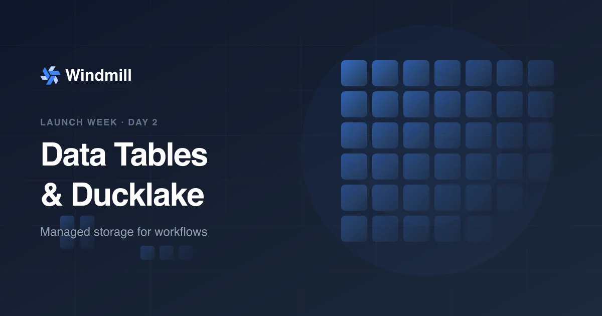

import DocCard from '@site/src/components/DocCard';
import Tabs from '@theme/Tabs';
import TabItem from '@theme/TabItem';

# Data Tables & Ducklake: managed storage for workflows



**Day 2 of [Windmill launch week](/launch-week-march-2026).** We are shipping two new storage primitives: **Data Tables** for relational data with managed SQL, and **Ducklake** for massive datasets backed by S3.

{/* truncate */}

## The problem

Workflow engines typically punt on data storage. You end up managing separate databases, connection strings, credential rotation, and permission models. Your orchestration layer knows how to run code but has no opinion about where results go.

For analytics workloads, the gap is wider. Teams default to managed data warehouses (Snowflake, BigQuery) that charge per query and live entirely outside the orchestration layer. The result: two systems, two permission models, and a lot of glue code to move data between them.

We wanted Windmill users to go from "I have a script" to "I have a script that reads and writes data" without leaving the platform.

## Data Tables: managed SQL with one line

Data Tables give you a workspace-scoped PostgreSQL layer where credentials are managed by Windmill. Users write SQL; they never see connection strings.

<Tabs className="unique-tabs">
<TabItem value="typescript" label="TypeScript" attributes={{className: "text-xs p-4 !mt-0 !ml-0"}}>

```ts
import * as wmill from 'windmill-client';

export async function main(user_id: string) {
	let sql = wmill.datatable();

	// String interpolation is safe: auto-converted to parameterized queries
	let friend = await sql`SELECT * FROM friend WHERE id = ${user_id}`.fetchOne();

	return friend;
}
```

</TabItem>
<TabItem value="python" label="Python" attributes={{className: "text-xs p-4 !mt-0 !ml-0"}}>

```python
import wmill

def main(user_id: str):
    db = wmill.datatable()

    # Positional arguments for safe parameterized queries
    friend = db.query('SELECT * FROM friend WHERE id = $1', user_id).fetch_one()

    return friend
```

</TabItem>
<TabItem value="duckdb" label="DuckDB" attributes={{className: "text-xs p-4 !mt-0 !ml-0"}}>

```sql
-- $user_id (bigint)

ATTACH 'datatable' AS dt;
USE dt;

SELECT * FROM friend WHERE id = $user_id;
```

</TabItem>
</Tabs>

<video
	className="border-2 rounded-lg object-cover w-full h-full dark:border-gray-800"
	autoPlay
	controls
	src="/img/platform/datatables/platform-datatables-query-any-language.webm"
/>

<br />

That's it. One import, one function call, standard SQL. TypeScript uses tagged template literals that are automatically converted to parameterized queries, so string interpolation is safe by default. Python uses positional arguments (`$1`, `$2`). DuckDB uses the native `ATTACH` syntax.

### Why PostgreSQL

We chose PostgreSQL because:

- It is the most widely understood SQL dialect. No new query language to learn.
- Battle-tested ACID guarantees out of the box.
- DuckDB can attach to Postgres natively, so Data Tables and Ducklake share the same query surface.

### Organizing with schemas

We recommend using one or a few Data Tables per workspace and organizing data with schemas:

```ts
let sql = wmill.datatable(':analytics');
await sql`SELECT * FROM events`; // refers to analytics.events
```

This keeps things clean without spinning up separate databases for every project.

## Why we built it this way

Three design choices drove the architecture:

**Workspace scoping.** Data Tables are scoped to a workspace. All members can read and write. This removes the need for database-level user management while keeping workspaces isolated from each other.

**Credential opacity.** Users never see or manage database connection strings. Windmill handles credentials internally. This eliminates a whole class of credential-rotation bugs and accidental leaks.

**Bring your own Postgres.** You attach a workspace Postgres resource to the data table. Windmill manages credentials internally so users never see connection strings. This gives you full control over database hosting while keeping the API simple.

## Asset tracking and data lineage

When you reference a Data Table in a script, Windmill automatically parses your code and detects which tables you read from and write to.

<video
	className="border-2 rounded-lg object-cover w-full h-full dark:border-gray-800"
	autoPlay
	controls
	src="/img/platform/datatables/platform-datatables-asset-tracking.webm"
/>

<br />

Assets appear as nodes in flows, giving you a visual data dependency graph. Click any asset node to open it in the Database Studio and inspect the data directly.

## Ducklake: S3-backed data lakehouse

Data Tables are great for transactional data. But some workloads produce millions of rows that do not belong in a relational database. For those, we built Ducklake support directly into Windmill.

[Ducklake](https://ducklake.select/) stores data as Parquet files in S3 and keeps a metadata catalog in Postgres. You query it with standard SQL through DuckDB.

<video
	className="border-2 rounded-lg object-cover w-full h-full dark:border-gray-800"
	autoPlay
	controls
	src="/videos/ducklake_demo.mp4"
/>

<br />

The API follows the same pattern as Data Tables:

<Tabs className="unique-tabs">
<TabItem value="typescript" label="TypeScript" attributes={{className: "text-xs p-4 !mt-0 !ml-0"}}>

```ts
import * as wmill from 'windmill-client';

export async function main(user_id: string) {
	let sql = wmill.ducklake();

	let friend = await sql`SELECT * FROM friend WHERE id = ${user_id}`.fetchOne();

	return friend;
}
```

</TabItem>
<TabItem value="python" label="Python" attributes={{className: "text-xs p-4 !mt-0 !ml-0"}}>

```python
import wmill

def main(user_id: str):
    dl = wmill.ducklake()

    friend = dl.query('SELECT * FROM friend WHERE id = $id', id=user_id).fetch_one()

    return friend
```

</TabItem>
<TabItem value="duckdb" label="DuckDB" attributes={{className: "text-xs p-4 !mt-0 !ml-0"}}>

```sql
-- $user_id (bigint)

ATTACH 'ducklake' AS dl;
USE dl;

SELECT * FROM friend WHERE id = $user_id;
```

</TabItem>
</Tabs>

### Real-world example: sentiment analysis pipeline

Here is a DuckDB script that receives analyzed messages (e.g., from an LLM sentiment analysis step in a flow) and inserts them into a Ducklake table. Each insert creates a new Parquet file in S3 and updates the catalog metadata.

```sql
-- $messages (json[])

ATTACH 'ducklake://main' AS dl;
USE dl;

CREATE TABLE IF NOT EXISTS messages (
  content STRING NOT NULL,
  author STRING NOT NULL,
  date STRING NOT NULL,
  sentiment STRING
);

CREATE TEMP TABLE new_messages AS
  SELECT
    value->>'content' AS content,
    value->>'author' AS author,
    value->>'date' AS date,
    value->>'sentiment' AS sentiment
  FROM json_each($messages);

INSERT INTO messages
  SELECT * FROM new_messages;
```

Under the hood, TypeScript and Python integrations run DuckDB inline within the same worker. No separate job is spawned, so the overhead is minimal.

## Why Ducklake over a data warehouse

|                    | Ducklake                         | Managed warehouse         |
| ------------------ | -------------------------------- | ------------------------- |
| **Storage format** | Parquet on your S3               | Proprietary               |
| **Query engine**   | DuckDB (single-node, in-process) | Managed cluster           |
| **Catalog**        | Postgres (already in your stack) | Proprietary               |
| **Cost model**     | S3 storage pricing               | Per-query compute pricing |
| **Lock-in**        | None: standard Parquet files     | High                      |

Ducklake gives you a data lakehouse without new infrastructure. Your data stays in an open format on storage you control. The catalog metadata lives in the same Postgres that Windmill already uses. And DuckDB handles analytical queries on a single node without cluster management.

## Database Studio

Both Data Tables and Ducklake are browsable through the Database Studio, a visual interface for inspecting schemas, editing rows, and running SQL.

<video
	className="border-2 rounded-lg object-cover w-full h-full dark:border-gray-800"
	autoPlay
	controls
	src="/img/platform/datatables/platform-datatables-database-studio.webm"
/>

<br />

## Building data pipelines

Data Tables and Ducklake are designed to work with Windmill [flows](/docs/flows/flow_editor). A typical data pipeline looks like this:

1. **Extract**: a script pulls data from an external source (API, webhook, database).
2. **Transform**: one or more steps clean, enrich, or aggregate the data using Python, TypeScript, or SQL.
3. **Load**: the result is written to a Data Table for operational use or to Ducklake for analytical queries.

Because each step is a standalone script, you can mix languages freely. For example, fetch data with TypeScript, run a sentiment analysis in Python, and insert the results with a DuckDB query into Ducklake. Windmill handles the orchestration, retries, error handling, and [data lineage](#asset-tracking-and-data-lineage) tracking.

You can also schedule pipelines with [cron triggers](/docs/core_concepts/scheduling), react to events with [webhooks](/docs/core_concepts/webhooks), or chain them with other flows.

<div className="grid grid-cols-2 gap-6 mb-4">
	<DocCard
		title="Data pipelines docs"
		description="Build ETL and data pipelines on Windmill."
		href="/docs/core_concepts/data_pipelines"
	/>
	<DocCard
		title="Data pipelines use case"
		description="See how teams use Windmill for data pipelines."
		href="/use-cases/data-pipelines"
	/>
</div>

## Getting started

**Data Tables:**

1. Go to workspace settings, then Data Tables.
2. Add your own Postgres resource.
3. Use `wmill.datatable()` in any script.

**Ducklake:**

1. Configure a workspace S3 storage.
2. Go to workspace settings, then Object storage and set up a Ducklake.
3. Use `wmill.ducklake()` in any script.

<div className="grid grid-cols-2 gap-6 mb-4">
	<DocCard
		title="Data Tables"
		description="Store and query relational data with near-zero setup."
		href="/docs/core_concepts/persistent_storage/data_tables"
	/>
	<DocCard
		title="Ducklake"
		description="Store massive datasets in S3 and query with SQL."
		href="/docs/core_concepts/persistent_storage/ducklake"
	/>
</div>

## Benchmark: Windmill + Ducklake vs Airflow + Snowflake

import PipelineBenchmarkChart, {
	PipelineStepComparison
} from '@site/src/components/PipelineBenchmarkChart';

To put numbers behind the architecture, we ran the same data pipeline on both stacks and measured wall-clock time. Both pipelines start from the same pre-ingested ~3 million row dataset ([NYC Yellow Taxi trips, January 2024](https://www.nyc.gov/site/tlc/about/tlc-trip-record-data.page)) and run 5 identical transformation and validation steps.

### Pipeline steps

| Step | Name              | What it does                                                                                                         |
| ---- | ----------------- | -------------------------------------------------------------------------------------------------------------------- |
| 1    | Clean             | Filter out invalid rows (zero passengers, negative fares, zero-distance trips, missing location IDs) → `clean_trips` |
| 2    | Enrich            | Add computed columns: trip duration, speed, time-of-day bucket, weekend flag → `enriched_trips`                      |
| 3    | Aggregate hourly  | Group by hour of day → `hourly_stats` (24 rows)                                                                      |
| 4    | Aggregate by zone | Group by pickup location → `zone_stats`                                                                              |
| 5    | Finalize          | Verify row counts across all tables                                                                                  |

The transformations are semantically identical — same filters, same formulas, same output schemas.

### How each side works

**Windmill + Ducklake** runs as a Windmill flow (TypeScript + native DuckDB SQL steps). Each step is a DuckDB SQL script that attaches to Ducklake and creates each table in sequence. All compute and storage stays on your infrastructure — a single worker container (2 CPUs, 4 GB RAM) + PostgreSQL for Windmill metadata. No data leaves your environment.

**Airflow + Snowflake** runs as an Airflow DAG (Python `@task` functions using `SnowflakeHook`). Each step sends SQL to a remote Snowflake MEDIUM warehouse. Compute is externalized to a third-party cloud service: every query travels over the network to Snowflake's infrastructure, where it is processed outside your control. This adds per-query compute costs (Snowflake bills by the second of warehouse uptime) and raises sovereignty concerns over the compute layer — your queries and intermediate results are executed on infrastructure you do not own.

### Results

export const windmillRun = {
	platform: 'windmill_ducklake',
	label: 'Windmill + Ducklake',
	color: 'rgba(59, 130, 246, 1)',
	total_wall_clock_seconds: 9.981,
	steps: [
		{
			name: 'clean',
			queue_seconds: 0.003,
			execution_seconds: 4.189,
			started_at_relative: 0.0,
			completed_at_relative: 4.189
		},
		{
			name: 'enrich',
			queue_seconds: 0.006,
			execution_seconds: 1.907,
			started_at_relative: 4.203,
			completed_at_relative: 6.11
		},
		{
			name: 'aggregate_hourly',
			queue_seconds: 0.004,
			execution_seconds: 1.08,
			started_at_relative: 6.121,
			completed_at_relative: 7.201
		},
		{
			name: 'aggregate_by_zone',
			queue_seconds: 0.007,
			execution_seconds: 0.901,
			started_at_relative: 7.282,
			completed_at_relative: 8.183
		},
		{
			name: 'finalize',
			queue_seconds: 0.002,
			execution_seconds: 1.788,
			started_at_relative: 8.193,
			completed_at_relative: 9.981
		}
	]
};

export const airflowRun = {
	platform: 'airflow_snowflake',
	label: 'Airflow + Snowflake',
	color: 'rgba(239, 68, 68, 1)',
	total_wall_clock_seconds: 14.736,
	steps: [
		{
			name: 'clean',
			queue_seconds: 0.119,
			execution_seconds: 4.351,
			started_at_relative: 0.0,
			completed_at_relative: 4.351
		},
		{
			name: 'enrich',
			queue_seconds: 0.18,
			execution_seconds: 3.502,
			started_at_relative: 5.094,
			completed_at_relative: 8.596
		},
		{
			name: 'aggregate_hourly',
			queue_seconds: 0.113,
			execution_seconds: 1.452,
			started_at_relative: 9.163,
			completed_at_relative: 10.615
		},
		{
			name: 'aggregate_by_zone',
			queue_seconds: 0.154,
			execution_seconds: 1.493,
			started_at_relative: 11.137,
			completed_at_relative: 12.631
		},
		{
			name: 'finalize',
			queue_seconds: 0.153,
			execution_seconds: 1.531,
			started_at_relative: 13.204,
			completed_at_relative: 14.736
		}
	]
};

Windmill + Ducklake completed the pipeline in **9.98 s** — 1.5× faster than Airflow + Snowflake at **14.74 s**.

<PipelineBenchmarkChart
	runs={[windmillRun, airflowRun]}
	title="Total pipeline execution time"
	xAxisLabel="Duration (seconds)"
/>

<br />

The per-step breakdown shows where the difference comes from:

<PipelineStepComparison
	runs={[windmillRun, airflowRun]}
	title="Per-step execution time"
	xAxisLabel="Duration (seconds)"
/>

<br />

| Step              | Windmill + Ducklake | Airflow + Snowflake |  Speedup |
| ----------------- | ------------------: | ------------------: | -------: |
| Clean             |              4.19 s |              4.35 s |    1.04× |
| Enrich            |              1.91 s |              3.50 s |     1.8× |
| Aggregate hourly  |              1.08 s |              1.45 s |     1.3× |
| Aggregate by zone |              0.90 s |              1.49 s |     1.7× |
| Finalize          |              1.79 s |              1.53 s |    0.86× |
| **Total**         |          **9.98 s** |         **14.74 s** | **1.5×** |

:::note
This benchmark was run on a single node with 24 GB of RAM. Results may vary depending on node compute speed and S3 connectivity speed.
:::

## What's next

Tomorrow is Day 3: **AI sandboxes**. Run Claude Code, Codex, or custom agents in isolated environments with persistent volumes. [Follow along](/launch-week-march-2026).
