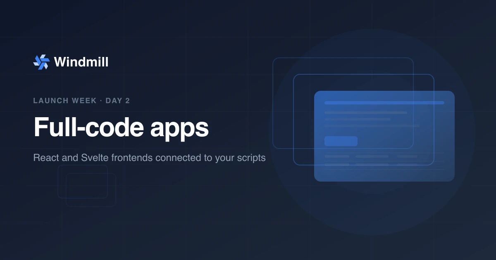

import DocCard from '@site/src/components/DocCard';
import Tabs from '@theme/Tabs';
import TabItem from '@theme/TabItem';

# Full-code apps: React and Svelte on Windmill



**Day 2 of [Windmill launch week](/launch-week-march-2026).** You can now build complete applications with React or Svelte frontends connected to Windmill backend runnables through a typed, auto-generated API.

{/* truncate */}

## The problem

Workflow platforms typically have no UI layer. When they do, it is a low-code builder: great for dashboards and forms, but limiting when you need custom interactions, framework features like hooks and routing, or an existing component library.

Teams end up building separate frontends. That means a separate deployment pipeline, a separate auth system, REST endpoints to define and maintain, and glue code to connect it all. The orchestration layer runs your backend logic but has no opinion about how users interact with it.

For teams that need a custom frontend, we wanted them to build it where they already build the backend.

## Full-code apps: one import, typed calls

A full-code app is a directory containing your frontend code (React or Svelte) and a `backend/` folder with scripts in any Windmill-supported language. Windmill bundles and serves the frontend. An auto-generated `wmill.ts` module provides typed functions to call your backend runnables.

<Tabs className="unique-tabs">
<TabItem value="react" label="React" attributes={{className: "text-xs p-4 !mt-0 !ml-0"}}>

```tsx
// App.tsx
import { useState, useEffect } from "react";
import { backend } from "./wmill.ts";

export default function App() {
  const [users, setUsers] = useState([]);
  const [loading, setLoading] = useState(true);

  useEffect(() => {
    backend.get_users({ limit: 50 })
      .then(setUsers)
      .finally(() => setLoading(false));
  }, []);

  if (loading) return <div>Loading...</div>;

  return (
    <table>
      <thead>
        <tr><th>Name</th><th>Email</th></tr>
      </thead>
      <tbody>
        {users.map((u) => (
          <tr key={u.id}><td>{u.name}</td><td>{u.email}</td></tr>
        ))}
      </tbody>
    </table>
  );
}
```

</TabItem>
<TabItem value="svelte" label="Svelte" attributes={{className: "text-xs p-4 !mt-0 !ml-0"}}>

```html
<!-- App.svelte -->
<script lang="ts">
  import { backend } from "./wmill.ts";

  let users = $state([]);
  let loading = $state(true);

  $effect(() => {
    backend.get_users({ limit: 50 })
      .then((data) => { users = data; })
      .finally(() => { loading = false; });
  });
</script>

{#if loading}
  <div>Loading...</div>
{:else}
  <table>
    <thead>
      <tr><th>Name</th><th>Email</th></tr>
    </thead>
    <tbody>
      {#each users as user}
        <tr><td>{user.name}</td><td>{user.email}</td></tr>
      {/each}
    </tbody>
  </table>
{/if}
```

</TabItem>
</Tabs>

<!-- TODO: video showing a full-code app in action: creating an app, calling a backend runnable, seeing the result in the UI. Path suggestion: /videos/full_code_apps_demo.webm -->

`backend.get_users` is fully typed. The types come from the backend script's function signature, auto-generated into a `wmill.d.ts` file during development.

## The typed backend API

During development, `wmill app dev` watches your `backend/` folder and generates a `wmill.d.ts` file with typed signatures for each runnable. Given this backend script:

```typescript
// backend/get_users.ts
export async function main(limit: number = 10): Promise<User[]> {
  // ...
}
```

The generated types will be:

```typescript
export const backend: {
  get_users: (v: { limit?: number }) => Promise<User[]>;
};
```

Your frontend gets autocomplete, type checking, and compile-time safety when calling runnables. No manual type definitions, no API contracts to maintain.

<!-- TODO: video showing autocomplete in VS Code when calling backend.get_users, and type errors when passing wrong arguments. Path suggestion: /videos/full_code_apps_typed_api.webm -->

Beyond synchronous calls, the API supports async patterns for long-running tasks:

```typescript
import { backendAsync, waitJob, streamJob } from "./wmill.ts";

// Start a long-running task, get a job ID immediately
const jobId = await backendAsync.generate_report({ query: "SELECT *" });

// Wait for completion
const result = await waitJob(jobId);

// Or stream results as they come
const finalResult = await streamJob(jobId, (update) => {
  console.log("Streaming chunk:", update.new_result_stream);
});
```

## Why we built it this way

Three design choices drove the architecture:

**Any language on the backend.** Your frontend is React or Svelte. Your backend can be anything: TypeScript, Python, SQL (PostgreSQL, MySQL, BigQuery, Snowflake, DuckDB), Go, Bash, Rust, PHP, Java, Ruby, C#, and more. Each runnable is a file in `backend/` with the language inferred from the extension. A single app can mix Python data processing with TypeScript API calls and SQL queries.

**Local development first.** `wmill app dev` starts a local dev server with hot module replacement. You use your own editor, your own tools, your own npm packages. The CLI auto-generates an `AGENTS.md` file so AI coding assistants like Claude Code or Codex understand your project structure out of the box. The workflow is standard: `npm install`, write code, see changes instantly.

**No separate API layer.** The frontend calls backend runnables directly through Windmill's execution engine via WebSocket. No REST endpoints to define, no API gateway to configure, no OpenAPI specs to maintain. You write a function in `backend/`, and it appears as a typed call in your frontend.

## Example: project structure

Here is what a typical full-code app looks like on disk:

```
my_app.raw_app/
├── raw_app.yaml           # App metadata, policy, data access
├── package.json
├── index.tsx              # Entry point
├── App.tsx                # Main React component
├── index.css              # Styles (Tailwind, custom CSS, etc.)
├── backend/
│   ├── get_users.ts       # TypeScript runnable
│   ├── run_query.pg.sql   # PostgreSQL runnable
│   └── analyze.py         # Python runnable
└── sql_to_apply/
    └── README.md
```

Each file in `backend/` becomes a callable runnable. The language is detected from the extension: `.ts` for TypeScript, `.py` for Python, `.pg.sql` for PostgreSQL, and so on. No YAML configuration is needed for simple runnables.

<!-- TODO: video showing the project structure in VS Code alongside the running app. Path suggestion: /videos/full_code_apps_project_structure.webm -->

## Full-stack apps on one platform

Full-code apps are designed to work with the rest of Windmill. Combined with [Data Tables](/blog/launch-week-data-tables-ducklake) and backend runnables, you get a complete full-stack setup with no external infrastructure:

- **Frontend**: React or Svelte, served by Windmill.
- **Backend**: scripts in 20+ languages, each running on isolated workers with full CPU and memory.
- **Data**: [Data Tables](/docs/core_concepts/persistent_storage/data_tables) for relational storage, [Ducklake](/docs/core_concepts/persistent_storage/ducklake) for analytics. No connection strings to manage.

There is no API layer to build. Your frontend calls backend runnables via a typed API, and those runnables read and write to Data Tables directly. Windmill handles execution, authentication, hosting, and monitoring.

For AI-assisted development, the CLI generates `AGENTS.md` and `DATATABLES.md` context files so tools like Claude Code or Codex understand your project structure, backend runnables, and data schema out of the box.

## Getting started

1. Install or update the [Windmill CLI](../docs/advanced/cli).
2. Scaffold a new app:

```bash
wmill app new
```

3. Install dependencies and start the dev server:

```bash
cd f/folder/my_app.raw_app
npm install
wmill app dev
```

4. Deploy to Windmill:

```bash
wmill sync push
```

You can also create full-code apps directly from the Windmill UI by clicking "+ App" and selecting "Full-code App".

<div className="grid grid-cols-2 gap-6 mb-4">
	<DocCard
		title="Full-code apps"
		description="Build custom frontends with React or Svelte connected to backend runnables."
		href="/docs/full_code_apps"
	/>
	<DocCard
		title="Full-code apps quickstart"
		description="Step-by-step guide to build your first full-code app."
		href="/docs/getting_started/full_code_apps_quickstart"
	/>
	<DocCard
		title="Internal tools use case"
		description="See examples of full-stack apps built on Windmill."
		href="/use-cases/internal-tools"
	/>
</div>

## What's next

Tomorrow is Day 3: **AI sandboxes**. Run Claude Code, Codex, or custom agents in isolated environments with persistent volumes. [Follow along](/launch-week-march-2026).
