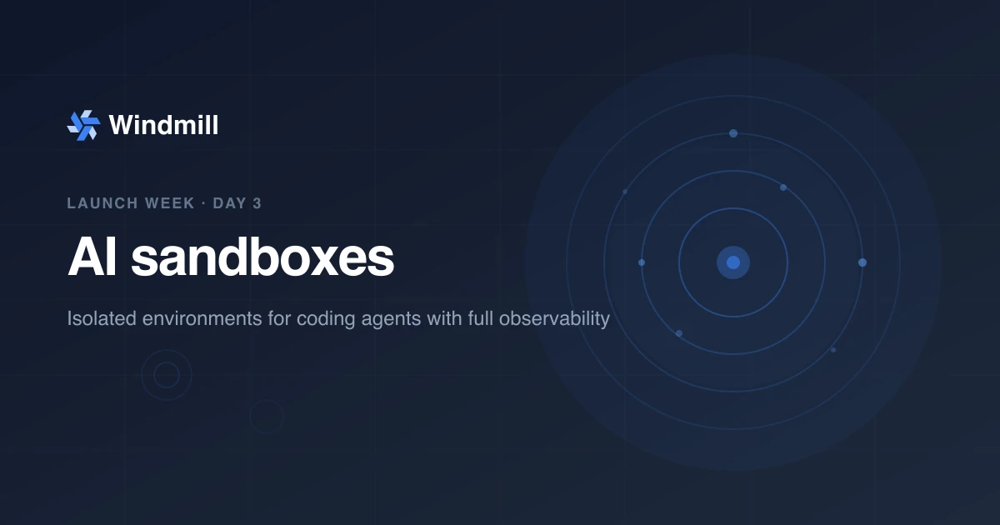

import DocCard from '@site/src/components/DocCard';
import Tabs from '@theme/Tabs';
import TabItem from '@theme/TabItem';

# AI sandboxes & volumes: isolated environments for coding agents



**Day 3 of [Windmill launch week](/launch-week-march-2026).** You can now run AI coding agents like Claude Code or Codex in sandboxed environments with persistent storage, directly from your scripts and flows.

<video className="border-2 rounded-lg object-cover w-full h-full dark:border-dark-border" autoPlay controls src="/videos/claude_code_sandbox_new.mp4" />

{/* truncate */}

## The problem

AI coding agents need two things that are hard to combine: isolation and persistence. You want them sandboxed so they cannot access the host filesystem or network. But you also want them to remember state across runs, produce artifacts, and pick up where they left off.

Teams end up managing Docker containers, mounting volumes manually, and writing wrapper scripts to handle session state. The orchestration layer has no opinion about where the agent runs or how its files persist.

## AI sandboxes: two annotations

An AI sandbox is a regular Windmill script with two annotations: one for isolation, one for storage.

<Tabs className="unique-tabs">
<TabItem value="typescript" label="TypeScript" attributes={{className: "text-xs p-4 !mt-0 !ml-0"}}>

```ts
// sandbox
// volume: agent-state .agent

import Anthropic from '@anthropic-ai/sdk';
import { MessageStream } from '@anthropic-ai/sdk/lib/MessageStream';

export async function main(prompt: string) {
  const client = new Anthropic();
  // The .agent directory persists across runs
  const result = await client.messages.create({
    model: 'claude-opus-4-6-20260401',
    max_tokens: 1024,
    messages: [{ role: 'user', content: prompt }],
  });
  return result;
}
```

</TabItem>
<TabItem value="python" label="Python" attributes={{className: "text-xs p-4 !mt-0 !ml-0"}}>

```python
# sandbox
# volume: agent-state .agent

import anthropic

def main(prompt: str):
    client = anthropic.Anthropic()
    # The .agent directory persists across runs
    result = client.messages.create(
        model="claude-sonnet-4-20250514",
        max_tokens=1024,
        messages=[{"role": "user", "content": prompt}],
    )
    return result
```

</TabItem>
</Tabs>

<!-- TODO: video showing an AI sandbox running in Windmill, with the volume persisting files across runs. Path suggestion: /videos/ai_sandboxes_demo.webm -->

`// sandbox` enables NSJAIL process isolation. `// volume: agent-state .agent` mounts a persistent volume synced to your workspace object storage. That's it.

## Persistent volumes

Agents need to remember state across runs. Volumes handle this by syncing files to your [workspace object storage](/docs/core_concepts/persistent_storage) (S3, Azure Blob, GCS) between executions.

Declaring a volume is a single annotation: `// volume: <name> <mount_path>`. You can attach up to 10 volumes per script.

Each volume goes through three phases per execution:

1. **Before execution**: Windmill acquires an exclusive lease on the volume and downloads files from object storage. A per-worker LRU cache (up to 10 GB) skips the download when files haven't changed (compared by size and MD5).
2. **During execution**: the volume is bind-mounted into the sandbox. The agent reads and writes files normally.
3. **After execution**: changed files are synced back to object storage, metadata is updated, and the lease is released.

The exclusive lease (60-second TTL, auto-renewed every 10 seconds) guarantees that only one job writes to a volume at a time. If another job targets the same volume, it waits for the lease to be released.

Volume names support `$workspace` and `$args[...]` interpolation, so you can scope storage per workspace, per user, or per any input parameter. This makes it straightforward to give each agent session its own isolated storage.

Volumes also have fine-grained [permissions](/docs/core_concepts/volumes): owner, read-only, or read-write access, assignable per user or group. A job with no permission on a volume will fail, so you control exactly which agents can access which data.

<div className="grid grid-cols-2 gap-6 mb-4">
	<DocCard
		title="Volumes"
		description="Persistent file storage synced to object storage."
		href="/docs/core_concepts/volumes"
	/>
</div>

## Process isolation

Without isolation, an agent has access to the host filesystem, environment variables (including credentials), other running jobs, and unrestricted network. Windmill provides two levels of process isolation to prevent this.

**NSJAIL sandboxing** is the strongest option. Each execution runs in its own [NSJAIL](/docs/advanced/security_isolation) sandbox with:

- **Filesystem isolation**: the agent only sees its own working directory and mounted volumes. No access to the host filesystem or other jobs.
- **Network restrictions**: outbound network access can be restricted per sandbox.
- **Resource limits**: CPU, memory, and disk usage are capped per execution.

Enable it per script with the `// sandbox` annotation, or force it instance-wide for all jobs with `DISABLE_NSJAIL=false`.

**PID namespace isolation** is a lighter alternative for workloads where full sandboxing is unnecessary. It uses Linux `unshare` to create separate process namespaces, so each job gets its own process tree and cannot see or signal processes from other jobs. Enable it with `ENABLE_UNSHARE_PID=true`. Lower overhead, but no filesystem or network isolation.

<div className="grid grid-cols-2 gap-6 mb-4">
	<DocCard
		title="Security and isolation"
		description="Process isolation, NSJAIL, and PID namespace isolation."
		href="/docs/advanced/security_isolation"
	/>
</div>

## Works with any agent

Claude Code, Codex, OpenCode, or any custom agent that operates on a local filesystem. Windmill provides the sandbox and the storage; the agent brings its own logic. A built-in Claude Code template handles session persistence and token counting out of the box.

## Built-in Claude Code template

Windmill ships with a ready-to-use Claude Code template. It handles session persistence (the session ID is stored in the volume), agent instructions, skill files, and token counting for cost monitoring.

```ts
// sandbox
// volume: claude-sessions .agent

import { ClaudeCodeAgent } from '@anthropic-ai/claude-agent-sdk';

export async function main(prompt: string) {
  const agent = new ClaudeCodeAgent({
    instructions: "You are a helpful coding assistant.",
  });
  return await agent.run(prompt);
}
```

<!-- TODO: video showing the Claude Code template in action with session persistence. Path suggestion: /videos/ai_sandboxes_claude_code.webm -->

## Observability

Every agent run is a regular Windmill job, which means full [observability](/platform/observability) out of the box: logs, execution history, and token usage for cost monitoring. Set up [alerts](/docs/core_concepts/critical_alerts) on failures or cost thresholds, and audit agent activity across workspaces.

<video className="border-2 rounded-lg object-cover w-full h-full dark:border-dark-border" autoPlay controls src="/videos/sandbox_observability.mp4" />

## Use cases

- **Persistent agent memory**: conversation history and session state survive across runs.
- **Artifact generation**: agents produce reports, code, or data files that persist in the volume.
- **Multi-step workflows**: a flow triggers an agent, waits for results, then passes artifacts to the next step.
- **Safe execution at scale**: resource limits and isolation let you run untrusted agent code without risk.

## Getting started

1. Configure [workspace object storage](/docs/core_concepts/persistent_storage) (S3, Azure Blob, GCS, or filesystem).
2. Add `// sandbox` and `// volume: <name> <path>` annotations to any script.
3. Run it. Files in the volume path persist across executions.

<div className="grid grid-cols-2 gap-6 mb-4">
	<DocCard
		title="AI sandboxes"
		description="Run agents in isolated environments with persistent volumes."
		href="/docs/core_concepts/ai_sandbox"
	/>
	<DocCard
		title="Volumes"
		description="Persistent file storage synced to object storage."
		href="/docs/core_concepts/volumes"
	/>
</div>

## What's next

Tomorrow is Day 4: **Git sync & workspace forks**. Sync with Git, stage workspaces, and deploy via CI/CD. [Follow along](/launch-week-march-2026).
