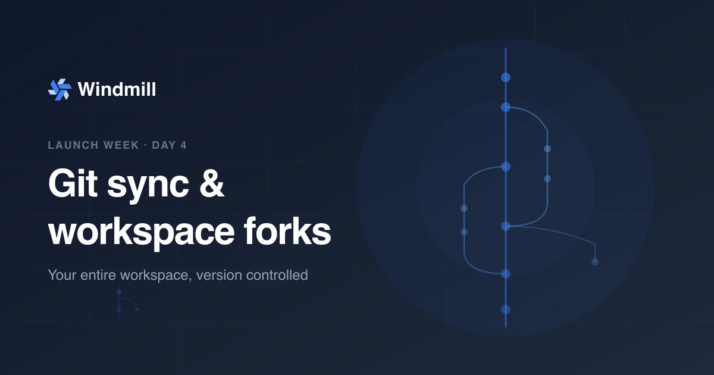
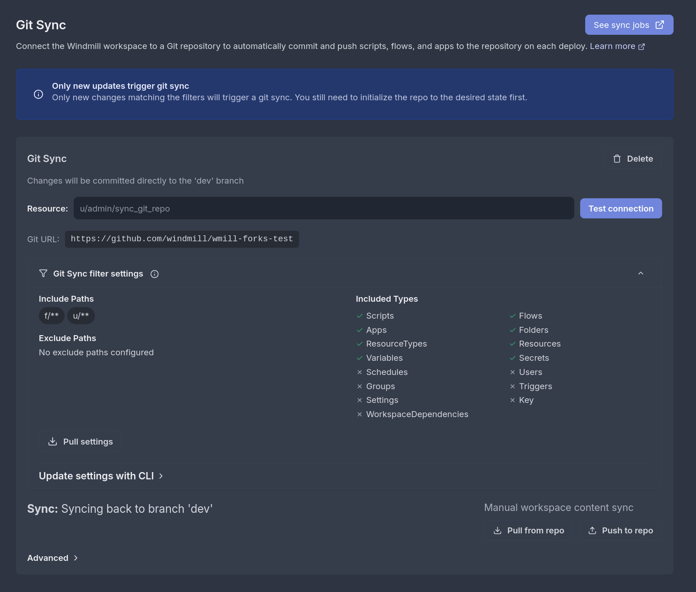
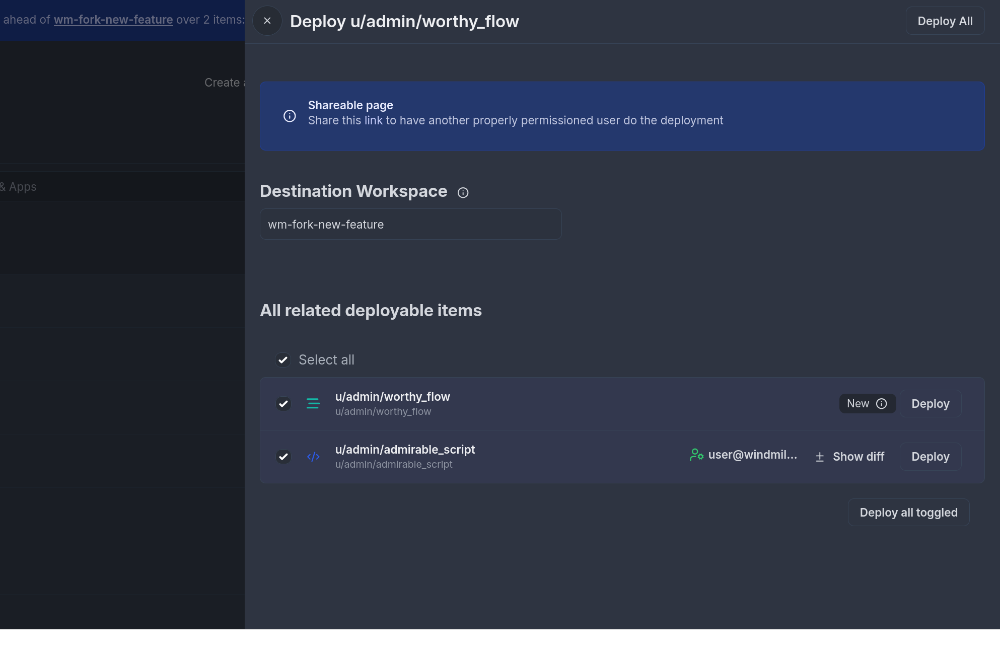
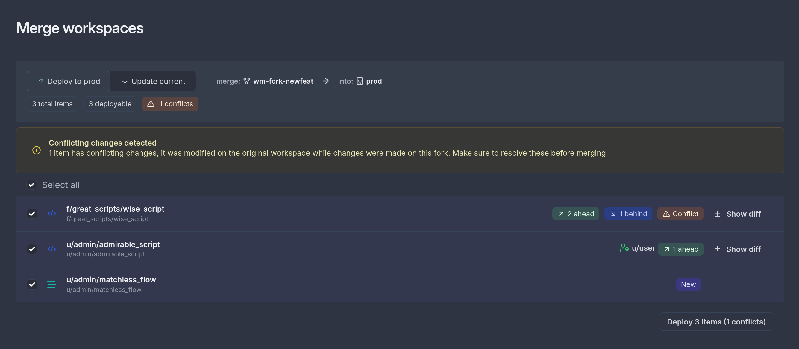
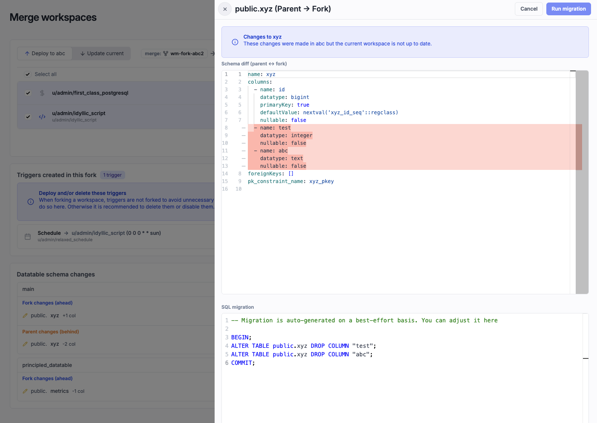

import DocCard from '@site/src/components/DocCard';

# Git sync & workspace forks: your entire workspace, version controlled

**Day 4 of [Windmill launch week](/launch-week-march-2026).** We have reworked Git sync and introduced workspace forks, giving you a full staging-to-production workflow inside Windmill.

{/* truncate */}

## The problem

Windmill workspaces are live environments. You deploy a script, and it runs in production immediately. That works for small teams iterating fast, but as your team grows you need review, staging, and rollback.

Teams had to build custom CI/CD pipelines around Windmill's CLI sync, managing branches manually, and writing their own merge logic. The deploy-to-prod path was functional but required too much glue.

## Git sync: automatic, bidirectional

Every time you deploy an item in Windmill, it automatically commits and pushes to your configured Git repository. Pull from Git to update your workspace. Supports GitHub, GitLab, Bitbucket, and Azure DevOps.

Configure Git sync from workspace settings. Path filters let you sync only what matters. Type filters control which resource types are included.

## Workspace forks: branch your workspace

Workspace forks let you create an independent copy of a workspace for feature development. Changes in the fork do not affect the parent until you merge them back.

When Git sync is enabled, creating a fork automatically creates a corresponding Git branch (`wm-fork/<parent-branch>/<fork-name>`). You get parallel development with full version control.

<!-- TODO: video showing workspace fork creation, making changes, and merging back. Path suggestion: /videos/workspace_forks_demo.webm -->

### Merge workflow

Three ways to bring changes back:

1. **Deploy UI**: deploy individual items from the fork to the parent workspace directly from the Windmill UI.

2. **Merge UI**: merge all changes at once with conflict detection, no Git sync required.

3. **Git merge**: use your preferred Git workflow (PRs, code review) to merge the fork branch.

### Coming soon: data table forking

Workspace forks will soon support [data tables](/docs/core_concepts/data_tables) as well. When forking a workspace, you will be able to clone a data table's schema only or its schema and data, letting you develop against a separate database without affecting upstream workspaces like production.

On merge, Windmill queries the full data table schema, detects differences, and generates SQL migrations automatically.

## Why we built it this way

Three design choices drove the architecture:

**Workspace-level branching.** Forks operate at the workspace level, not the file level. When you fork, you get a complete copy of all scripts, flows, apps, resources, and variables. This means you can test changes end-to-end in an isolated environment before merging.

**Git as the source of truth.** If you need to roll back, reset the branch. If you need to audit, read the commit history. Windmill does not replace your Git workflow; it plugs into it.

**Multiple deployment paths.** Not every team needs the same workflow. Small teams can use the deploy UI. Growing teams can use workspace forks. Enterprise teams can use the full Git promotion workflow with CI/CD and cross-instance deployment.

## Deployment options

| Workflow | Setup | Best for |
|---|---|---|
| **Draft and deploy** | Single workspace | Small teams, fast iteration |
| **Workspace forks** | Fork + merge | Teams that need staging |
| **Git promotion** | Git sync + CI/CD + PRs | Enterprise, cross-instance |
| **Deploy to prod UI** | Multi-workspace | Cloud/EE, quick deployments |

## Getting started

**Git sync:**
1. Create a Git repository.
2. Go to workspace settings, then Git sync.
3. Configure authentication (GitHub App, PAT, or GitHub Enterprise App).
4. Deploy an item and check your repo for the commit.

**Workspace forks:**
1. Enable Git sync (recommended but optional).
2. Create a fork from the workspace settings.
3. Make changes in the fork.
4. Merge back using the deploy UI, merge UI, or Git.

	<DocCard
		title="Git sync"
		description="Sync your workspace to a Git repository."
		href="/docs/advanced/git_sync"
	/>
	<DocCard
		title="Workspace forks"
		description="Fork workspaces for feature development."
		href="/docs/advanced/workspace_forks"
	/>

## What's next

Tomorrow is Day 5: **Workflow-as-code**. Define complex workflows entirely in code with the next generation of our SDK. [Follow along](/launch-week-march-2026).
