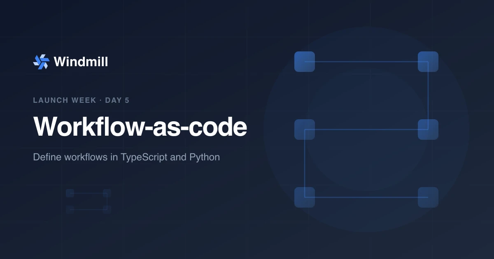

import DocCard from '@site/src/components/DocCard';
import Tabs from '@theme/Tabs';
import TabItem from '@theme/TabItem';

# Workflow-as-code: orchestration in pure code



**Day 5 of [Windmill launch week](/launch-week-march-2026).** You can now define complex workflows entirely in TypeScript or Python. Windmill handles checkpointing, parallelism, and fault tolerance. You write functions.

{/* truncate */}

## The problem

Windmill's [flow editor](/docs/flows/flow_editor) is powerful for visual workflows. But some orchestration logic is easier to express in code: dynamic branching, complex error handling, loops over variable-length data, or workflows that need to live in your codebase alongside the rest of your application.

Other workflow-as-code frameworks (Temporal, Inngest) require dedicated infrastructure, complex SDKs, or proprietary runtimes. We wanted the same capabilities with two annotations and zero new infrastructure.

## Workflow-as-code: functions, not YAML

A workflow is a regular script with `@workflow` and `@task` annotations. Each task runs as a separate Windmill job with its own logs, timeline entry, and retry policy. Between tasks, the workflow fully suspends and releases its worker.

<Tabs className="unique-tabs">
<TabItem value="typescript" label="TypeScript" attributes={{className: "text-xs p-4 !mt-0 !ml-0"}}>

```ts
import { task, workflow, sleep, parallel } from 'windmill-client';

export async function main(urls: string[]) {
  const results = await parallel(urls, async (url) => {
    const data = await task(async () => {
      const res = await fetch(url);
      return res.json();
    });
    return await task(async () => {
      return transform(data);
    });
  }, { concurrency: 5 });

  await sleep(60); // suspend for 60s, release worker

  await task(async () => {
    await saveResults(results);
  });

  return { processed: results.length };
}
```

</TabItem>
<TabItem value="python" label="Python" attributes={{className: "text-xs p-4 !mt-0 !ml-0"}}>

```python
from wmill import task, workflow, sleep, parallel
import requests

def main(urls: list[str]):
    results = parallel(
        urls,
        lambda url: task(lambda: transform(task(lambda: requests.get(url).json()))),
        concurrency=5,
    )

    sleep(60)  # suspend for 60s, release worker

    task(lambda: save_results(results))

    return {"processed": len(results)}
```

</TabItem>
</Tabs>

<video
	className="rounded-xl border border-gray-200 dark:border-gray-700 w-full"
	autoPlay
	loop
	muted
	playsInline
	src="/img/platform/workflow-editor/platform-flow-workflow-as-code.webm"
/>

No YAML, no DSL, no drag-and-drop. Standard TypeScript or Python with full IDE support, type checking, and version control.

## How checkpointing works

Workflow-as-code uses a checkpoint/replay model:

1. The workflow runs until it hits a `task()`, `sleep()`, or `waitForApproval()` call.
2. The script exits and the checkpoint is saved to the database.
3. The worker is released back to the pool. No resources are wasted while waiting.
4. Child jobs run independently on any available worker.
5. On replay, all previously completed steps return cached results instantly.

This means a workflow that sleeps for 24 hours consumes zero worker time during the wait. A workflow with 100 parallel tasks does not hold 100 workers.

## Core primitives

| Primitive | Description |
|---|---|
| `task()` | Run a function as a separate Windmill job |
| `step()` | Run inline, persist the result for replay stability |
| `sleep(seconds)` | Suspend the workflow, release the worker |
| `waitForApproval()` | Suspend until a human approves or rejects |
| `parallel(items, fn)` | Process a list with concurrency control |
| `taskScript(path)` | Dispatch to an existing Windmill script |
| `taskFlow(path)` | Dispatch to an existing Windmill flow |

Each `task()` supports options for timeout, worker tag, cache TTL, priority, and concurrency limits.

## Approval steps in code

`waitForApproval()` suspends the workflow and releases the worker until a human approves or rejects — zero resource usage while waiting. Combined with `getResumeUrls()`, you can send approval links via Slack, email, or any notification channel:

```ts
import { task, step, waitForApproval, getResumeUrls, workflow } from 'windmill-client';

export const main = workflow(async () => {
  await task(async () => runTests());
  await task(async () => deployToStaging());

  const urls = await step('get_urls', () => getResumeUrls());
  await step('notify', () => sendSlackMessage(urls.approvalPage));

  const approval = await waitForApproval({ timeout: 86400 });
  if (!approval.approved) {
    return `Rejected by ${approval.approver}`;
  }

  return await task(async () => deployToProduction());
});
```

The workflow suspends at `waitForApproval()` and the worker is fully freed — a 24-hour timeout costs zero compute. Approvals also support [forms and self-approval controls](/docs/core_concepts/workflows_as_code#approval--human-in-the-loop).

<video
	className="rounded-xl border border-gray-200 dark:border-gray-700 w-full"
	autoPlay
	loop
	muted
	playsInline
	src="/img/platform/workflow-editor/platform-flow-approval-step.webm"
/>

## Why we built it this way

Three design choices drove the architecture:

**Zero worker waste.** When a workflow suspends (sleep, approval, waiting for child jobs), the worker is fully released. Other frameworks hold a thread or container open. Windmill's checkpoint model means you pay only for compute you actually use.

**Standard language, standard tooling.** Workflows are regular TypeScript or Python files. You get IDE autocomplete, type checking, unit testing, and Git diffs. No proprietary DSL to learn.

**Composable with flows.** Workflow-as-code scripts can call existing Windmill scripts and flows via `taskScript()` and `taskFlow()`. You can also use them as steps inside visual flows. The two models are fully interoperable.

## Script modules

For complex workflows, you can split logic into companion modules in a `__mod/` folder:

```
my_workflow.ts
my_workflow__mod/
├── extract.ts
├── transform.ts
└── load.ts
```

Each module has its own dependencies and lock file. Import with relative paths, reference via `taskScript()`.

## When to use workflow-as-code vs flows

| | Workflow-as-code | Visual flows |
|---|---|---|
| **Definition** | TypeScript or Python | Drag-and-drop editor |
| **Best for** | Dynamic logic, complex branching, code-first teams | Linear pipelines, visual overview, low-code users |
| **Version control** | Standard Git diffs | JSON diffs |
| **Local dev** | Full IDE support | Web editor |
| **Interop** | Can call flows via `taskFlow()` | Can include WAC scripts as steps |

## How it compares to other frameworks

Windmill's workflow-as-code supports the same patterns as Temporal, Inngest, Cloudflare Workflows, and Airflow — checkpointing, retries, parallelism, durable sleep — with comparable or better performance (especially compared to Airflow, where task scheduling overhead alone can dwarf actual execution time). The difference: Windmill is easily [self-hostable](/docs/advanced/self_host), ships with an intuitive [web editor](/docs/script_editor) and [visual flow builder](/docs/flows/flow_editor), and includes built-in approval steps and a complete [app builder](/docs/apps/app_editor) — all in one platform.

## Getting started

1. Create a new script in TypeScript or Python.
2. Import `task` and `workflow` from `windmill-client` (TS) or `wmill` (Python).
3. Annotate your main function and wrap each unit of work in `task()`.
4. Run it. Each task appears as a separate job in the Windmill UI.

<div className="grid grid-cols-2 gap-6 mb-4">
	<DocCard
		title="Workflow-as-code"
		description="Define workflows in TypeScript or Python with checkpointing."
		href="/docs/core_concepts/workflows_as_code"
	/>
	<DocCard
		title="TypeScript client"
		description="SDK reference for the TypeScript client."
		href="/docs/advanced/clients/ts_client"
	/>
</div>

## That's a wrap

Thanks for following along this week. Five days, five features: [Data Tables & Ducklake](/blog/launch-week-data-tables-ducklake), [full-code apps](/blog/launch-week-full-code-apps), [AI sandboxes](/blog/launch-week-ai-sandboxes), [Git sync & workspace forks](/blog/launch-week-git-sync), and workflow-as-code. All available now. [Try them out](https://app.windmill.dev/).
