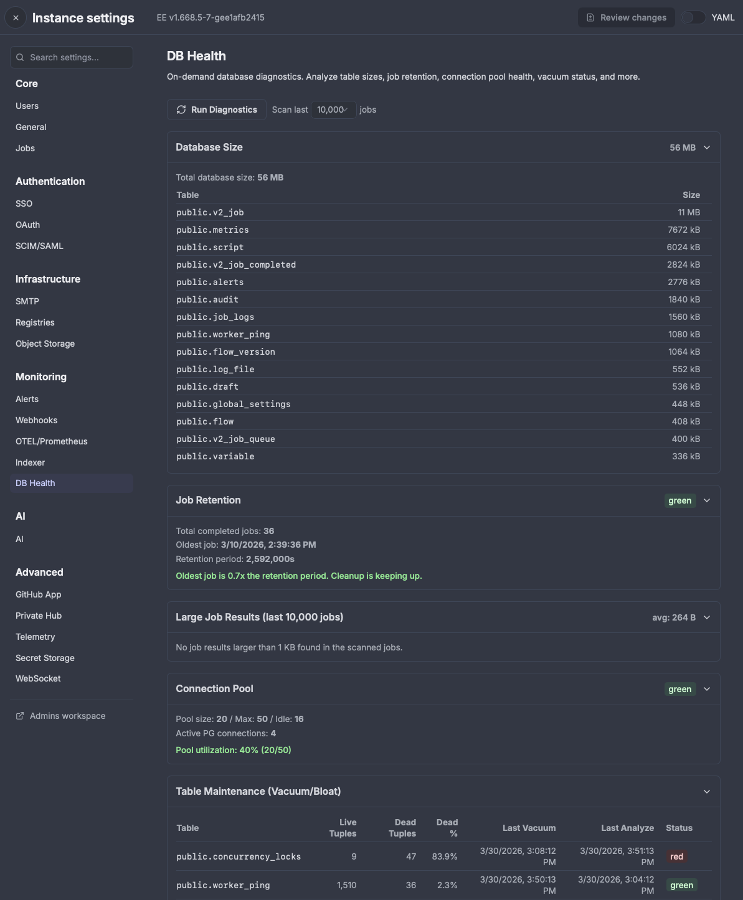

Windmill now includes an on-demand DB health diagnostic dashboard, available to superadmins under **Instance Settings > Monitoring > DB Health**.

Click **Run Diagnostics** to execute lightweight, read-only queries that surface actionable insights about your database. This is particularly useful for diagnosing common issues like databases growing to 1TB+, slow jobs, or connection pool exhaustion.

## Diagnostics

- **Database Size**: Total size and top 15 tables by size
- **Job Retention**: Oldest job age vs retention period, with status indicators when cleanup falls behind
- **Large Job Results**: Top 10 largest result payloads among recent jobs, with configurable scan depth
- **Connection Pool**: Pool utilization, idle connections, and active PostgreSQL connections
- **Table Maintenance**: Dead tuple ratios and vacuum timestamps for the top 15 tables
- **Slow Queries**: Top 10 by mean execution time (requires `pg_stat_statements`)
- **Datatables**: Instance-stored datatable sizes and row count estimates

All queries are read-only and use `LIMIT` clauses to avoid impacting production performance.
