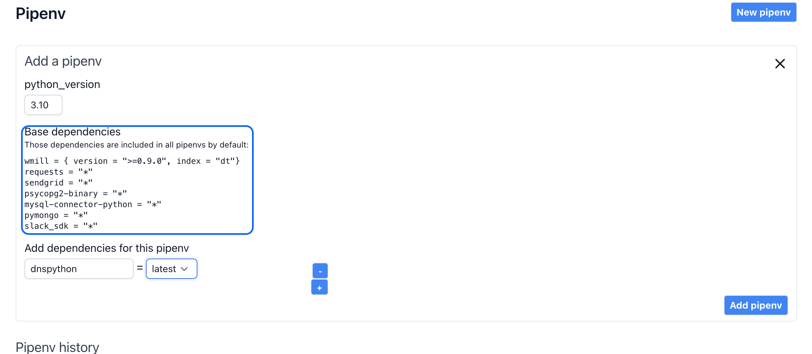
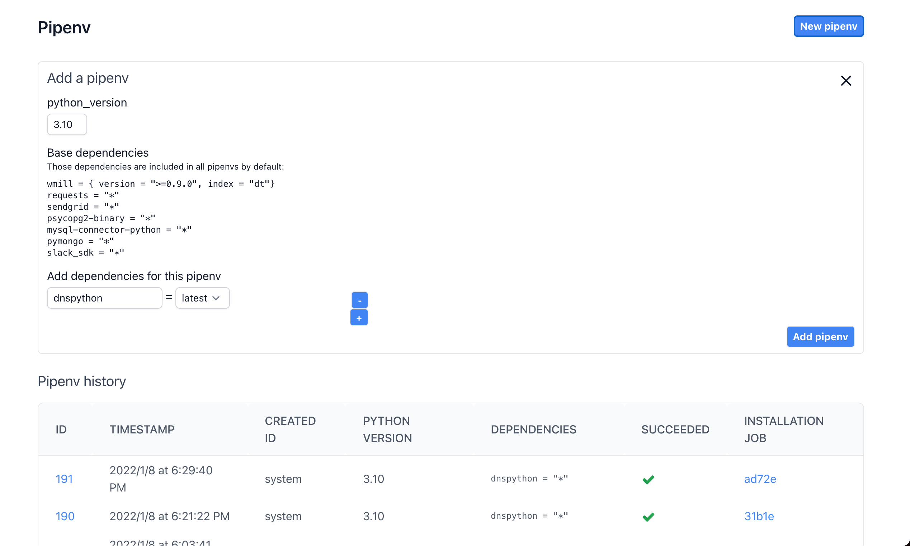

# Dependencies

In the free and team plan, Windmill only has a common python environment shared by all users. It comes with common python dependencies installed. This is a trade-off we made to allow for scripts to start fast (no dependency installation), and to provide a generous free tier. We install reasonable dependencies on a best effort basis, feel free to let us know if you need an additional dependency installed.

You can view an up to date list of all dependencies available in **Python environment**, in base dependencies:

# Adding dependencies

If you are on an Enterprise plan, Windmill will have a python environment dedicated to you. Windmill uses [pipenv](https://pipenv.pypa.io/en/latest/) to manage environments. Admin users can install custom dependencies by going to the **Python Env** page and adding a **New pipenv**.

Adding a new `pipenv` will replace the previous environment. By default, it will include all the dependencies of the previous environment, unless you remove them. Note that all scripts of all users will use the new environment, so be sure to only remove dependencies if you know that this will not impact your users.

When installing a dependency, you can specify the version you need, either explicitly or using `latest`.
