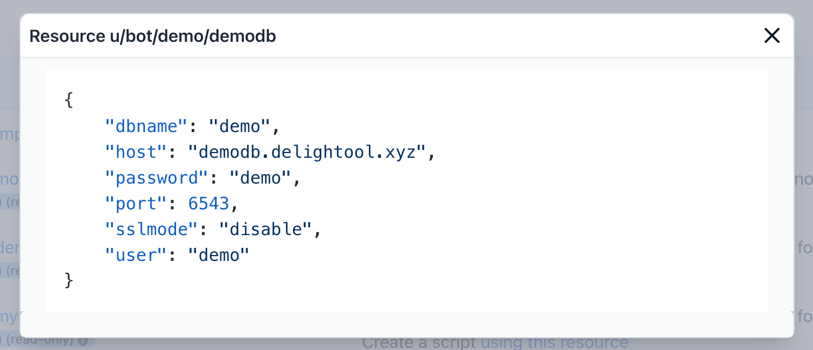

# Use resources

In Windmill, [resources](../reference#resource) represent connections to third
party systems. Resources are a good way to define a connection to a frequently
used third party system such as a database. Think of resources as a structured
way to store configuration and credentials, and access them from scripts.

Each resource has a **resource type** (for example MySQL, MongoDB, Slack, etc),
that defines the schema that any resource of this type needs to implement. To
learn how to define a new resource, see [create_resources.md](create_resources).
For example, a PostgreSQL resource needs to contain a `dbname`, a `username`, a
`host`, etc.



Provided you have the right permissions, you can access resources from scripts
using the Windmill client. For example, to access the `u/bot/demo/demodb`
posgtgres resource we would:

```python
psycopg2 # we want to connect to a PostgreSQL database, so we import the `psycopg2` connector
import wmill # the windmill client, used to access resources


def main():
    client = wmill.Client()
    pg_con = client.get_resource(resource)
	# returns {'dbname': 'demo', 'host': 'demodb.delightool.xyz', 'password': 'demo', 'port': 6543, 'sslmode': 'disable', 'user': 'demo'}

    conn = psycopg2.connect(**pg_con) #unpack the resource and pass it to psycopg2
    cur = conn.cursor() 3 now query the database
    cur.execute(f"{query};")
    if cur.description:
        return cur.fetchall()
    else:
        return None
```

For each resource type that you use, you'll likely rely on a python library
(psycopg2 in this example). Windmill allows you to
[define resource types](create_resources) and use any dependencies.
