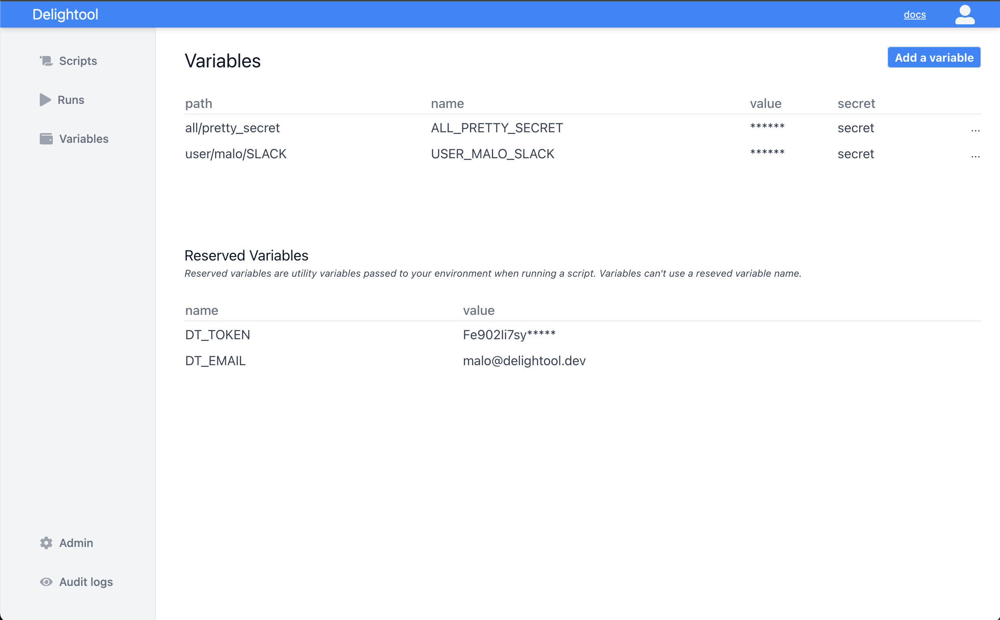
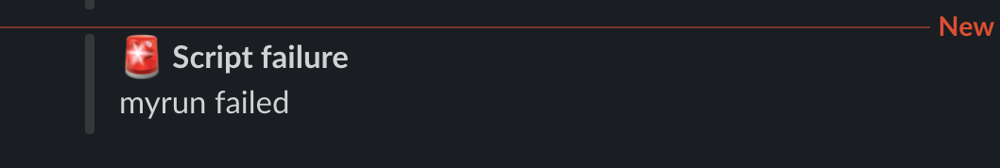

# Sending slack notifications

In this tutorial, we'll add Slack notifications to a script, in order to be
alerted if it fails. We'll use Windmill's **Variables** to store the address of
our Slack webhook in a private way. This should take less than 5 minutes.

Let's start with our base script:

```
def main(cmd:str = "A command" ):
	try:
		raise Exception("Something went wrong!")
	except:
		print("This is a failure")
```

We want to extend this script, so that we're notified in Slack if it fails. This
can be useful as a developer maintaining automation for an ops team: you want to
make sure that what you've built works, and you care specifically about when
something unexpected happens.

#### Step 1: setup incoming webhooks in Slack

First, we need to create an incoming webhook in Slack to listen to messages from
Windmills. Follow the steps in the
[Slack tutorial](https://slack.com/help/articles/115005265063-Incoming-webhooks-for-Slack),
and copy the **Incoming Webhook URL**.

Let's make sure it works and actually send a notification in your workspace:

```bash
curl -X POST https://hooks.slack.com/services/<YOURHOOK>
   -H 'Content-Type: application/json'
   -d  '{
   "username":"DelightBot",
   "icon_emoji":":wave:",
   "attachments":[
      {
         "fields":[
            {
               "title":"Hello",
               "value":"msg",
               "short":"false"
            }
         ]
      }
   ]
}'
```

#### Step 2: store the slack hook URL into a variable

Now let's add our slack webhook URL as a
[variable](../reference#variable) in Windmills. Go to
**Variables**, and select **Add variable**:



Define a new variable, in the `all` namespace (we want to share this with all
script owners), and name it "SLACK_HOOK". Just as a script, a variable is
identified by a [unique path](../reference#path), made of it's owner and its
name. In our case the variable's path will be `ALL_SLACK_HOOK`. This environment
variable will now be set in all our script's environments.

#### Step 3: add slack notifications to our script

Let's add notifications to our script!

```python
import json
import sys
import requests
import os

def main(cmd:str = "A command" ):
	try:
		response = requests.post("http://wwww.fail.com")
	except:
		print("This is a failure")
		if "ALL_SLACK_HOOK" in os.environ:
			send_slack_message(os.environ.get("ALL_SLACK_HOOK"), ":rotating_light: Script failure", cmd + " failed")
		else:
			raise Exception("Slack webhook URL environment variable is not set")

def send_slack_message(hook_url, title, message):
	payload = {
				"username": "DelightBot",
				"attachments": [
					{
						"fields": [
							{
								"title": title,
								"value": message,
								"short": "false",
							}
						]
					}]}
	headers = {'Content-Type': "application/json",
		'Content-Length': str(sys.getsizeof(payload))}
	response = requests.post(
		hook_url, data=json.dumps(payload), headers=headers)
	print(response)
	if response.status_code != 200:
		raise Exception(response.status_code, response.text)
	else:
		raise Exception("Could not send message to slack.")
```

Tadam! We'll now get a slack notification every time a user gets an error with
our script.


