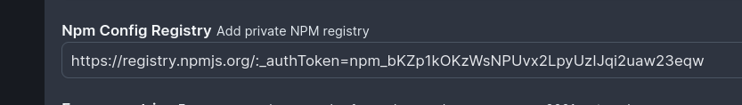

import DocCard from '@site/src/components/DocCard';

# Dependencies in TypeScript

In Windmill, TypeScript scripts and their imports are handled with a streamlined approach that allows developers to manage dependencies directly within their scripts without the need to manage separate dependency files.
For TypeScript, there are two runtime options available: [Bun](https://bun.sh/) and [Deno](https://deno.land/). Both of these runtimes allow you to include dependencies directly in the script, and Windmill automatically handles the resolution and caching of these dependencies to ensure fast and consistent execution.

There are however methods to customize the way dependencies are handled for your TypeScript scripts.

## Standard Mode

Windmill simplifies TypeScript dependency management by automating the import resolution process.

### Automatically resolved imports

In Windmill, you can to run scripts without having to manage a package.json directly. This is achieved by automatically parsing the [imports](../6_imports/index.mdx) and resolving the dependencies.

#### WebIDE

When a script is deployed through its UI, Windmill generates a lockfile to ensure that the same version of a script is always executed with the same versions of its [dependencies](../6_imports/index.mdx). If no version is specified, the latest version is used. Windmill's workers cache dependencies to ensure fast performance without the need to pre-package dependencies - most jobs take under 100ms end-to-end.

When using Bun as the runtime for TypeScript in Windmill, dependencies are resolved directly from the script imports and their imports when using [sharing common logic](../5_sharing_common_logic/index.md). The TypeScript runtime Bun ensures 100% compatibility with Node.js without requiring any code modifications.

```ts
import { toWords } from 'number-to-words@1';
import * as wmill from 'windmill-client@1.147.3';
```

Similarly, for TypeScript scripts using Deno as the runtime, the dependencies and their versions are specified directly in the script, and the resolution is managed by Deno. This method allows for direct use of npm imports and Windmill client imports without requiring any additional configuration for dependency management.

```ts
import { toWords } from 'npm:number-to-words@1';
import * as wmill from 'https://deno.land/x/windmill@v1.84.1/mod.ts';
```

<div className="grid grid-cols-2 gap-6 mb-4">
	<DocCard
		title="Dependency Management & Imports"
		description="Windmill's strength lies in its ability to run scripts without having to manage a package.json directly."
		href="/docs/advanced/imports"
	/>
	<DocCard
		title="TypeScript Client"
		description="The TypeScript client for Windmill allows you to interact with the Windmill platform using TypeScript in Bun / Deno runtime."
		href="/docs/advanced/clients/ts_client"
	/>
</div>

#### Private npm Registry & Private npm Packages

You can use private npm registries and private npm packages in your TypeScript scripts.



On [Enterprise Edition](/pricing), go to `Instance settings -> Core -> NPM Config Registry`.

Set the registry URL: `https://npm.pkg.github.com/OWNER` (replace `OWNER` with your GitHub username or organization name).

**Private npm packages requiring token**

:::caution

Currently, Deno does not support private npm packages requiring tokens (but support private npm registries). Bun however does.

:::

If a token is required, append `:_authToken=<your url>` to the URL.

Combining the two, you can import private packages from npm

```
https://registry.npmjs.org/:_authToken=npm_bKZp1kOKzWsNPUvx2LpyUzIJqi2uaw23eqw
```

If the private registry is exposing custom certificates,`DENO_CERT` and `DENO_TLS_CA_STORE` env variables can be used as well (see [Deno documentaion](https://docs.deno.com/runtime/manual/getting_started/setup_your_environment#environment-variables) for more info on those options).

```dockerfile
windmill_worker:
  ...
  environment:
    ...
    - DENO_CERT=/custom-certs/root-ca.crt
```

<div className="grid grid-cols-2 gap-6 mb-4">
	<DocCard
		title="Private npm Registry & Private npm Packages"
		description="Import private packages from npm in Windmill."
		href="/docs/advanced/imports#private-npm-registry--private-npm-packages"
	/>
</div>

#### Relative Imports

It is common to want to share common logic between your scripts. This can be done easily using [relative imports](../5_sharing_common_logic/index.md) in both Python and Deno.

Note that in both the webeditor and with the CLI, your scripts do not necessarily need to have a main function. If they don't, they are assumed to be shared logic and not runnable scripts.

It works extremely well in combination with [Developing scripts locally](../4_local_development/index.mdx) and you can easily sync your scripts with the [CLI](../3_cli/index.mdx).

It is possible to import directly from other TypeScript scripts. One can simply follow the path layout. For instance,
`import { foo } from "/f/<foldername>/script_name.ts"`. A more verbose example below:

```typescript
import { main as foo, util } from '../my_script_path.ts';
```

Relative imports syntax is much preferred as it will work on [local editors](../4_local_development/index.mdx).

You may also use absolute imports (but won't work on local editors):

```typescript
import { main as foo, util } from '/f/common/my_script_path.ts';

export async function main() {
	await foo();
	util();
}
```

Note that path in Windmill can have as many depth as needed, so you can have paths like this `f/folder/subfolder/my_script_path.ts` and relative imports will work at any level. Hence, it will work exactly the same as on local.

<div className="grid grid-cols-2 gap-6 mb-4">
	<DocCard
		title="Sharing Common Logic"
		description="It is common to want to share common logic between your scripts. This can be done easily using relative imports in both Python and Deno."
		href="/docs/advanced/sharing_common_logic"
	/>
</div>

#### CLI & Local Development

On [local development](../4_local_development/index.mdx), each script gets:
- a content file (`script_path.py`, `script_path.ts`, `script_path.go`, etc.) that contains the code of the script
- a metadata file (`script_path.yaml`) that contains the metadata of the script
- a lockfile (`script_path.lock`) that contains the dependencies of the script.

You can get those 3 files for each script by pulling your workspace with command [`wmill sync pull`](../3_cli/sync.mdx).

Editing a script is as simple as editing its content. The code can be edited freely in your IDE, and there are possibilities to even run it locally if you have the correct development environment setup for the script language.

The lockfile can be generated with [wmill CLI](../3_cli/index.mdx) command [`wmill script generate-metadata`](../3_cli/script.md#re-generating-a-script-metadata-file).

Any lockfile will be overriden by the closest package.json from a parent or current folder if there is one.

<div className="grid grid-cols-2 gap-6 mb-4">
	<DocCard
		title="Command Line Interface (CLI)"
		description="The Windmill CLI, `wmill` allows you to interact with Windmill instances right from your terminal."
		href="/docs/advanced/cli"
	/>
	<DocCard
		title="Local Development"
		description="Develop locally, push to git and deploy automatically to Windmill."
		href="/docs/advanced/local_development"
	/>
</div>

### Overriden by a package.json using the CLI (CLI / Local only)

Although Windmill can [automatically resolve imports](#automatically-resolved-imports). It is possible to override the dependencies by providing a `package.json` file in the same directory as the script as you would do in a standard Node.js project, building and maintaining a package.json to declare dependencies.

Any lockfile will be overriden by the closest package.json from a parent or current folder if there is one.

You can write those package.json manually or through a standar `npm install <X>`.

Several package.json files can therefore coexist, each having authority over the scripts closest to it:

```
windmill_folder
	package.json

	f/foo
		package.json
		script1.ts
		# script1.ts will use the dependencies from windmill_folder/f/foo/package.json
		
		/bar
			package.json
			script2.ts
			# script2.ts will use the dependencies from windmill_folder/f/foo/bar/package.json
	
	f/baz
		script3.ts
		# script3.ts will use the dependencies from windmill_folder/package.json
```

The Windmill [VS Code Extension](../../cli_local_dev/1_vscode-extension/index.mdx) has a toggle "Infer lockfile" / "Use current lockfile".

With this toggle, you can choose to use the metadata lockfile instead of inferring them directly from the script.


<div className="grid grid-cols-2 gap-6 mb-4">
	<DocCard
		title="Local Development"
		description="Develop locally, push to git and deploy automatically to Windmill."
		href="/docs/advanced/local_development"
	/>
  <DocCard
		title="Command Line Interface (CLI)"
		description="The Windmill CLI, `wmill` allows you to interact with Windmill instances right from your terminal."
		href="/docs/advanced/cli"
	/>
	<DocCard
		title="VS Code Extension"
		description="Build scripts and flows in the comfort of your VS Code Editor, while leveraging Windmill UIs for test & flows edition."
		href="/docs/cli_local_dev/vscode-extension"
	/>
</div>

## Codebases & Bundles

This method can only be deployed from the [CLI](../3_cli/index.mdx), on [local development](../4_local_development/index.mdx).

To work with large custom codebases, there is another mode of deployment that relies on the same mechanism as similar services like Lambda or cloud functions: a bundle is built locally by the CLI using [esbuild](https://esbuild.github.io/) and deployed to Windmill.

This bundle contains all the code and dependencies needed to run the script.

On the latest version of the Windmill CLI, it is done automatically on `wmill sync push` for any script that falls in the patterns of includes and excludes as defined by the [wmill.yaml](../../core_concepts/33_codebases_and_bundles/index.mdx#wmillyaml).

<div className="grid grid-cols-2 gap-6 mb-4">
	<DocCard
		title="Codebases & Bundles"
		description="Deploy scripts with any local relative imports as bundles."
		href="/docs/core_concepts/codebases_and_bundles"
	/>
</div>