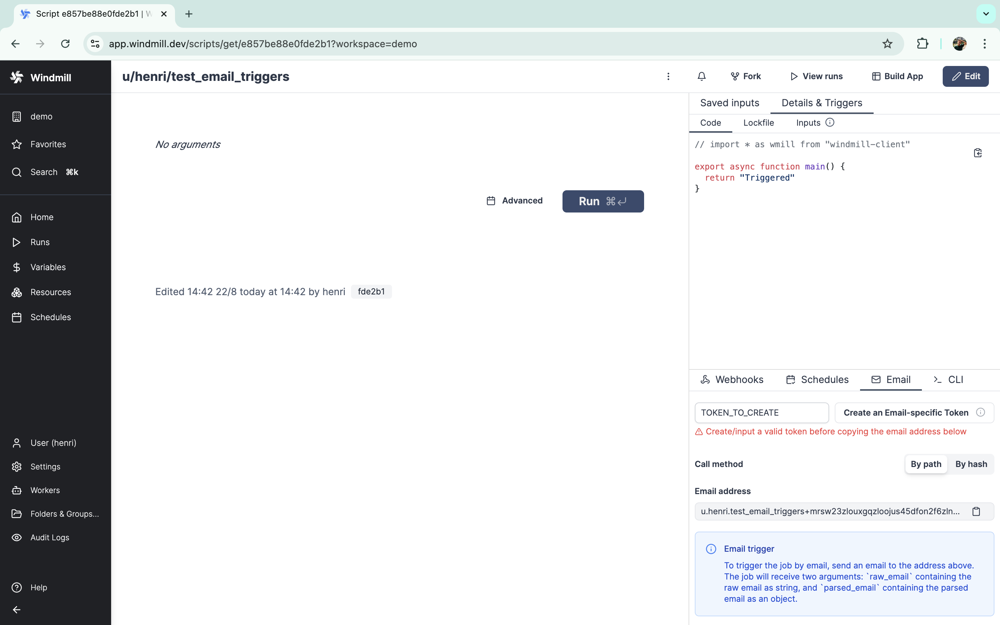
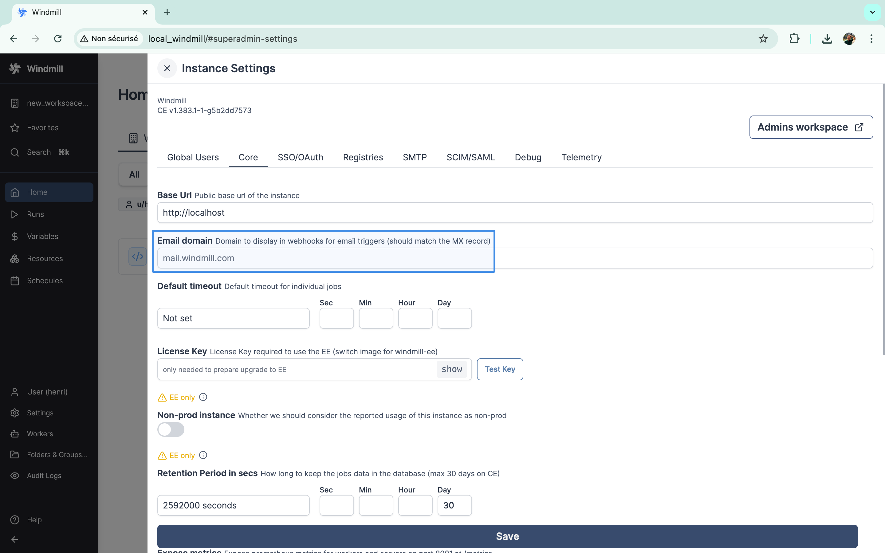
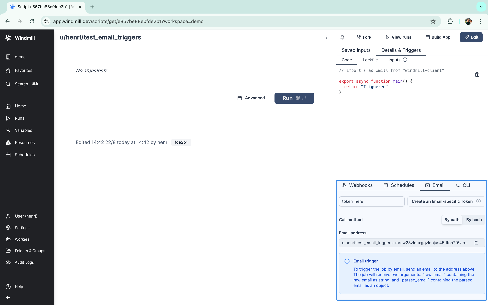

# Email triggers

Scripts and flows can be triggered by email messages sent to a specific email address, leveraging [SMTP](https://www.cloudflare.com/learning/email-security/what-is-smtp/).

Email triggers on Windmill [Community Edition](/pricing) are limited to 100 emails per day.

## Configuration

Email triggers is available on both [cloud](#cloud) and [self-hosted](#self-hosted) instances.

### Cloud

On [cloud](https://app.windmill.dev/) instances, Email triggers is already configured. You can try it from `demo` workspace.



### Self-hosted

First, make sure that the port 25 is exposed either on your instance public IP or a separate IP and that it redirects to the Windmill app on port 2525.
The Caddyfile already contains the necessary configuration for this.
For Kubernetes, you will find example configurations for some providers on the [Windmill helm charts repository](https://github.com/windmill-labs/windmill-helm-charts).

In addition, you will need to create one or two records in your DNS provider depending on your setup.

If the port 25 is exposed on the same IP as the Windmill instance (e.g. [docker-compose](https://github.com/windmill-labs/windmill/blob/main/docker-compose.yml) with Caddy):
  - An MX record from `mail.<instance domain>` to `<instance domain>`.

If the port 25 is exposed through a different IP (e.g. Kubernetes):
  - An A/CNAME record that points to the IP of the Windmill instance with port 25 exposed (for example `mail_server.<instance domain>`).
  - An MX record from `mail.<instance domain>` to the record defined above (`mail_server.<instance domain>` if following the example).

You can choose any email domain, we suggest using `mail.<instance domain>`.
Once you have defined the DNS settings, set the email domain in the [instance settings](../18_instance_settings/index.mdx#email-domain) under the "Core" tab.



## How to use

There are two kind of email triggers: default runnable emails and custom email triggers.

### Default runnable emails

Each script and flow has a default trigger email address. You will find the specific email address to use in the triggers panels.
The email address takes the form `<path/hash>+<workspace+path/hash+token base32 encoded>@<email domain>`.

### Custom email triggers

In addition to default runnable emails, you can also create email triggers with a custom address to trigger a script or flow.
The local part can only contain lowercase letters, numbers, underscores, and dots (no dashes allowed).
Only workspace admins can create custom email triggers or edit the local part of existing ones.

You have the option to prefix the email address with the workspace id. 
This is useful for avoiding conflicts when you have a staging and production workspace and you are deploying between the two (see [Deploy to prod](/docs/advanced/deploy_to_prod)).
The format is `{workspace_id}-{local_part}@yourdomain.com`. 
On Cloud, the option is always enabled.

### Email extra arguments

You can pass additional arguments to your script by adding them to the email address, formatted as query parameters.

**For default runnable emails**, add them after the base32 encoded part, separated by a `+`:
```
<path/hash>+<workspace+path/hash+token base32 encoded>+env=prod&debug=true&region=us-west@<email_domain>
```

**For custom email triggers**, add them before the `@` symbol, separated by a `+`:
```
alerts+env=prod&debug=true&region=us-west@yourdomain.com
```

These extra arguments are available in your script as `email_extra_args`:
```json
{
  "env": "prod",
  "debug": "true",
  "region": "us-west"
}
```
Your script will receive the following arguments:
- `raw_email`: the raw email as a string
- `parsed_email` the parsed email with the following attributes:
  - `headers` a dictionary with the email headers (e.g. `From`, `To`, `Subject`, `Date`)
  - `text_body` the text body of the email (or textified html body if none)
  - `html_body` the html body of the email (or htmlified text body if none)
  - `attachments` list of attachments with the following attributes:
    - `headers` a dictionary with the attachment headers
    - `body` the attachment data
- `email_extra_args`: (optional) a dictionary containing extra arguments from the email address

Attchments are uploaded to the [workspace object storage (s3)](../../core_concepts/38_object_storage_in_windmill/index.mdx#workspace-object-storage) and are replaced in `parsed_email` by s3 objects (`{ s3: "path/to/key" }`).
A workspace object storage is required for attachments to be handled.


Here's an example script:

```TypeScript
export async function main(
  raw_email: string,
  parsed_email: any,
  email_extra_args?: Record<string, string>
) {
  console.log("Email from:", parsed_email.headers["From"][0].address);

  if (email_extra_args) {
    console.log("Environment:", email_extra_args.env);
    console.log("Debug mode:", email_extra_args.debug === "true");
  }

  // do something with the email
}
```

And if you use a [preprocessor](../../core_concepts/43_preprocessors/index.mdx), the script could look like this:

```TypeScript
export async function preprocessor(
  event: {
    kind: "email",
    raw_email: string,
    parsed_email: any,
    email_extra_args?: Record<string, string>,
  }
) {
  if (event.kind !== "email") {
    throw new Error("Expected an email event");
  }

  // Access extra args from the email address
  const environment = event.email_extra_args?.env || "production";
  const debugMode = event.email_extra_args?.debug === "true";

  // return what you want to pass to the main function
  return {
    sender_address: event.parsed_email.headers["From"][0].address,
    email_body: event.parsed_email.text_body,
    environment,
    debug_enabled: debugMode
  }
}

export async function main(
  sender_address: string,
  email_body: string,
  environment: string,
  debug_enabled: boolean
) {
  console.log(`Processing email from ${sender_address} in ${environment} environment`);
  if (debug_enabled) {
    console.log("Debug mode enabled, email body:", email_body);
  }
  // do something with the processed data
}
```

From a script or flow [deployed](../../core_concepts/0_draft_and_deploy/index.mdx) page, you will find on the "Details & Triggers" - "Email" tab the email address to use.



## Error handling

Email triggers support local error handlers that override workspace error handlers for specific triggers. See the [error handling documentation](../../core_concepts/10_error_handling/index.mdx#trigger-error-handlers) for configuration details and examples.
