import DocCard from '@site/src/components/DocCard';
import Tabs from '@theme/Tabs';
import TabItem from '@theme/TabItem';

# Instance settings

Instance settings are accessible to all [superadmins](../../core_concepts/16_roles_and_permissions/index.mdx#superadmin) of your Windmill instance. This is where you manage settings and features across all workspaces. One instance can have several workspaces.

This is from the Instance settings that you can see on which Windmill [version](https://github.com/windmill-labs/windmill/releases) your instance is running.

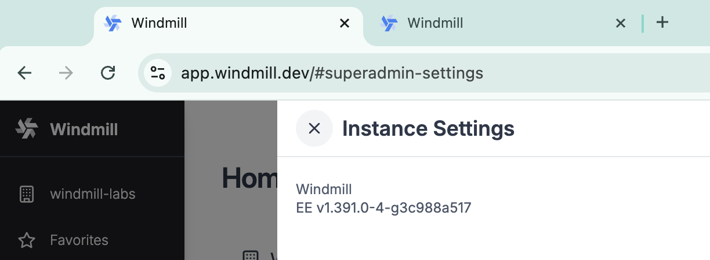

## Admins workspace

The Admins workspace is for [superadmins](../../core_concepts/16_roles_and_permissions/index.mdx#superadmin) only and contains scripts whose purpose is to manage your Windmill instance, such as [keeping resource types up to date](../../core_concepts/3_resources_and_types/index.mdx#sync-resource-types-with-windmillhub) or the New User Setup App.

The [resources types](../../core_concepts/3_resources_and_types/index.mdx) created from the Admins workspace are shared across all workspaces.

You can access it from the list of workspaces or from Instance settings.

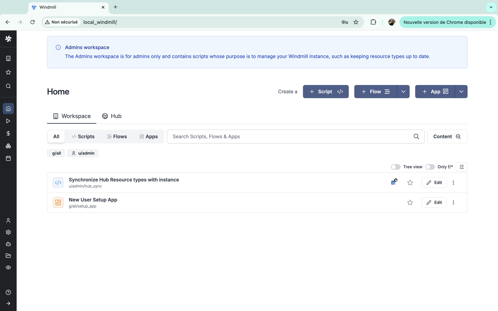

## Global users

Global Users are users of the Windmill instance. They are not associated with any workspace and can be assigned to any workspace (from the workspace settings).

From there you can manually add a user to the instance, giving an email and a password. Users can be set to User, [Devops](../../core_concepts/16_roles_and_permissions/index.mdx#devops) or Superadmin [roles](../../core_concepts/16_roles_and_permissions/index.mdx#superadmin).

You can also enable automatic username creation from emails. Usernames will be shared accross workspaces. We recommend setting it to avoid duplicated usernames.

A more common way to add users is to use [SSO/OAuth](#ssooauth).

For each user, you can see Email, Auth (manually-set password or Auth methods), Name, Kind ([Developer](../../core_concepts/16_roles_and_permissions/index.mdx#developer) or [Operator](../../core_concepts/16_roles_and_permissions/index.mdx#operator)), and Role (User or [Superadmin](../../core_concepts/16_roles_and_permissions/index.mdx#superadmin)).

You can also toggle on 'Show active users only' to show only users who have performed at least one action in the last 30 days. Only those users are counted in our [Pricing](/pricing).

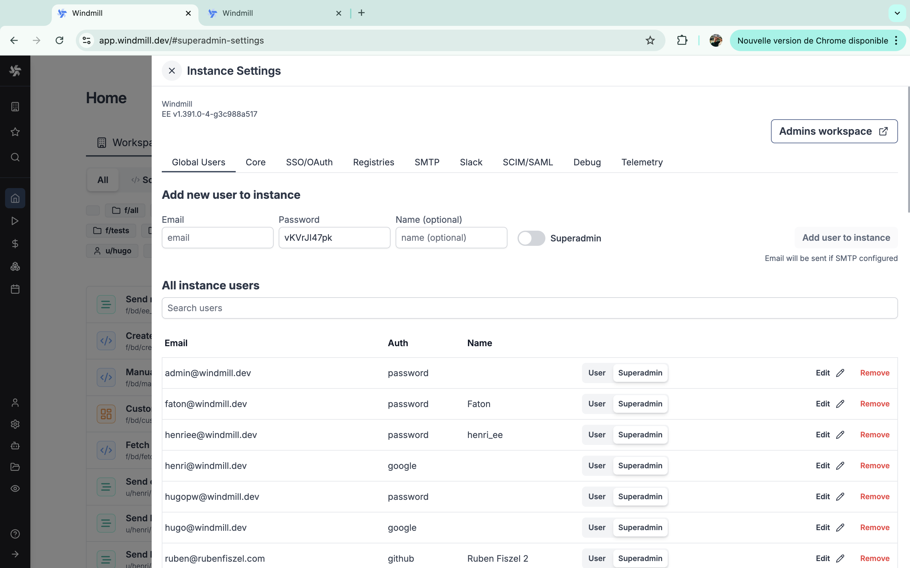

## Core

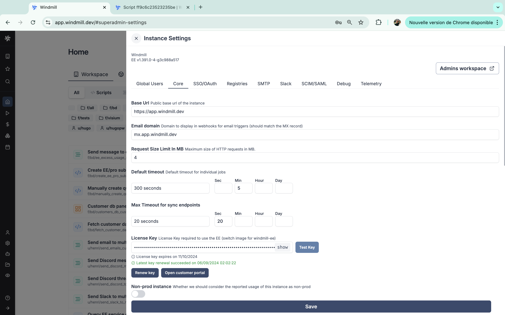

### Base url

The base URL is the public base url of the instance.

If the base URL is not set correctly, some server-side generated URLs like resume URLs will be incorrect. Additionally, [OAuth and SSO](#ssooauth) functionalities will not work properly.

### Email domain

Domain to display in webhooks for [email triggers](../17_email_triggers/index.mdx) (should match the [MX record](https://www.cloudflare.com/learning/dns/dns-records/dns-mx-record/)).

### Request size limit in MB

Maximum size of HTTP requests in MB. Cloud only.

### Default timeout

Default timeout for individual [jobs](../../core_concepts/20_jobs/index.mdx#retention-policy), in seconds.

You will find a helper to convert days, hours, minutes, and seconds to seconds.

Note that you can set a [custom timeout for flow steps](../../flows/9_custom_timeout.md).

### Max timeout for sync endpoints

Maximum amount of time (measured in seconds) that a [sync endpoint](../../core_concepts/4_webhooks/index.mdx) is allowed to run before it is forcibly stopped or timed out.

You will find a helper to convert days, hours, minutes, and seconds to seconds.

### License key

The license key is used to enable [Enterprise Edition](/pricing). You can get one by starting a free trial from the [pricing page](/pricing) or by contacting us at contact@windmill.dev

To see how to upgrade your instance to Enterprise Edition, see the [Upgrade to Enterprise Edition](../../misc/7_plans_details/index.mdx#self-host) docs.

From there you also have two buttons:
- `Renew key`: to renew the license key (as long as you have a valid subscription). Anyway, the key is automatically renewed everyday as long as your subscription is valid.
- `Open customer portal`: the recommended way to access the [Customer portal](../../misc/7_plans_details/index.mdx#windmill-customer-portal) where you can manage your subscription.

If your subscription is active, the key is automatically renewed everyday. A key is typically valid for 35 days.

### Non-prod instance

Whether we should consider the reported usage of this instance as non-prod.

It is useful to avoid [counting the usage](/pricing#worker-reporting) of a non-prod instance in the billing.

This setting is only available on [Enterprise Edition](/pricing).

### Retention period in secs

How long to keep the jobs data (especially the [audit logs](../../core_concepts/14_audit_logs/index.mdx)) in the database (max 30 days on [Community Edition](/pricing)).

You will find a helper to convert days, hours, minutes, and seconds to seconds.

This setting is only available on [Enterprise Edition](/pricing).

### Expose metrics

Expose [Prometheus](https://prometheus.io/) metrics for workers and servers on port 8001 at /metrics.

This setting is only available on [Enterprise Edition](/pricing).

### Instance object storage

[Connect your instance](../../core_concepts/38_object_storage_in_windmill/index.mdx#instance-object-storage) to a S3 bucket to [store large logs](../../core_concepts/20_jobs/index.mdx#large-job-logs-management) and [global cache for Python and Go](../../misc/13_s3_cache/index.mdx).

This feature has no overlap with the [Workspace object storage](../../core_concepts/38_object_storage_in_windmill/index.mdx#workspace-object-storage).

You can choose to use either S3 or Azure Blob Storage. For each you will find a button to test settings from a server or from a worker.


This setting is only available on [Enterprise Edition](/pricing).

### Critical alert channels

Channels to send [critical alerts](../../core_concepts/37_critical_alerts/index.mdx) to. [SMTP](#smtp) must be configured for the email channel. A Slack workspace must be connected to the instance for the Slack channel.

You can add multiple channels between Email and Slack.

Furthermore you can chose to mute [critical alerts in the UI](../../core_concepts/37_critical_alerts/index.mdx) using the "Mute critical alerts in UI" toggle.

This setting is only available on [Enterprise Edition](/pricing).

### Mute critical alerts in UI

Enable to mute critical alerts in the UI.

### Azure OpenAI base path

All [Windmill AI](../../core_concepts/22_ai_generation/index.mdx) features will run on the specified deployed model. Format: `https://{your-resource-name}.openai.azure.com/openai/deployments/{deployment-id}`.

This setting is only available on [Enterprise Edition](/pricing).

### Private Hub base url

Base url of your [private Hub](../../core_concepts/32_private_hub/index.mdx) instance, without trailing slash.

This setting is only available on [Enterprise Edition](/pricing).

## SSO/OAuth

Windmill supports [SSO/OAuth](../../misc/2_setup_oauth/index.mdx) for user authentication. You can enable it from the Instance settings.

<div className="grid grid-cols-2 gap-6 mb-4">
	<DocCard
		title="Setup OAuth and SSO"
		description="Windmill supports Single Sign-On for Microsoft, Google, GitHub, GitLab, Okta, and domain restriction."
		href="/docs/misc/setup_oauth"
	/>
</div>

### Single Sign On

When at least one of the [SSO options](../../misc/2_setup_oauth/index.mdx#sso) is set, users will be able to login to Windmill via their third-party account.

To test SSO, the recommended workflow is to to save the settings and try to login in an incognito window.

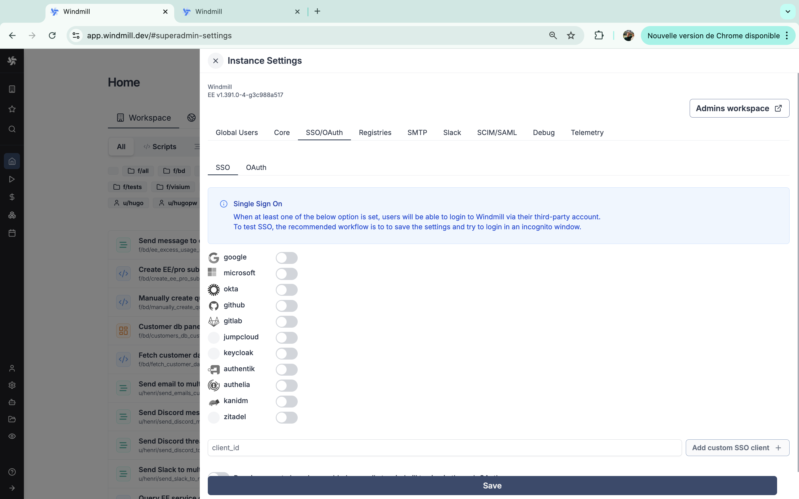

You can add a custom SSO client by providing a client id.

Also, from the instance settings you can enable toggle 'Require users to have been added manually to Windmill to sign in through OAuth'.

Without [Enterprise Edition](/pricing), the number of SSO users is limited to 10.

### OAuth

When one of the [OAuth](../../misc/2_setup_oauth/index.mdx#oauth) options is set, you will be able to create a specific [resource](../../core_concepts/3_resources_and_types/index.mdx) containing a 'token' automatically generated by the third-party provider.
To test it after setting an oauth client, go to the Resources menu and create a new one of the type of your oauth client (i.e. a '[github](https://hub.windmill.dev/integrations/github)' resource if you set GitHub OAuth).

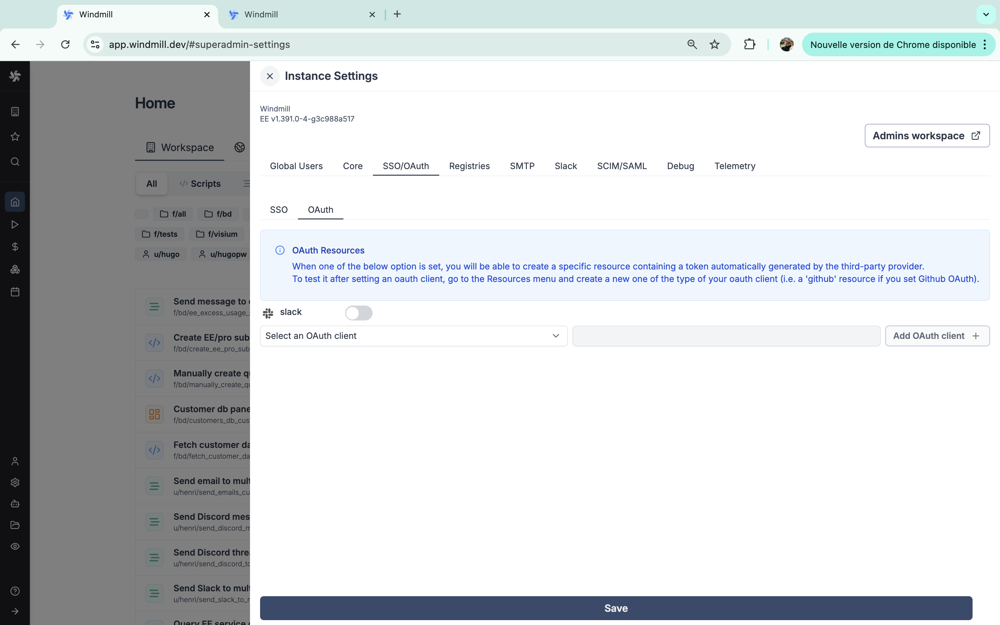

## Registries

Add private registries for [Pip](https://pypi.org/), [Bun](https://bun.sh/) and [npm](https://www.npmjs.com/).

These settings are only available on [Enterprise Edition](/pricing).

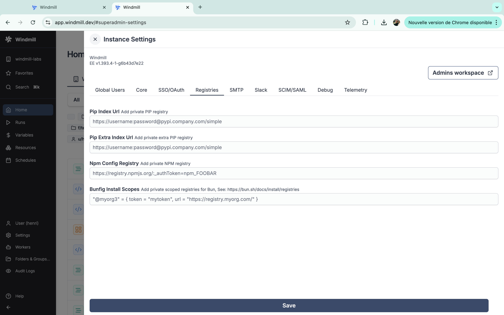

<div className="grid grid-cols-2 gap-6 mb-4">
	<DocCard
		title="Dependency management & imports"
		description="Windmill's strength lies in its ability to run scripts without having to manage a requirements.txt directly."
		href="/docs/advanced/imports"
	/>
	<DocCard
		title="Dependencies in Python"
		description="How to manage dependencies in Python scripts."
		href="/docs/advanced/dependencies_in_python"
	/>
	<DocCard
		title="Dependencies in TypeScript"
		description="How to manage dependencies in TypeScript scripts."
		href="/docs/advanced/dependencies_in_typescript"
	/>
</div>

### Pip index url

Add private PIP registry.

### Pip extra index url

Add private extra PIP registry.

### Npm config registry

Add private NPM registry.

### Bunfig install scopes

Add private scoped registries for Bun, See: https://bun.sh/docs/install/registries.

## SMTP

Setting SMTP unlocks [sending emails upon adding new users](../../core_concepts/15_authentification/index.mdx) to the workspace or the instance and [sending critical alerts](#critical-alert-channels).

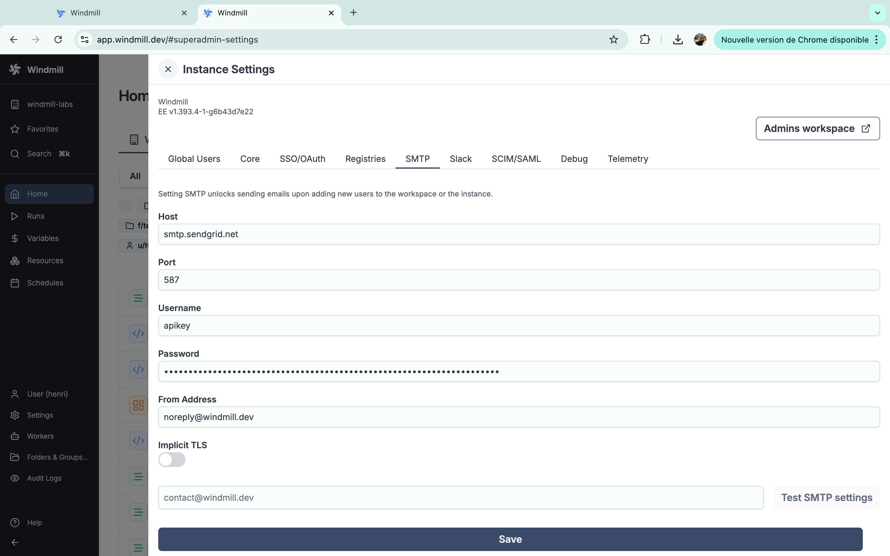

You need to provide the following details:

| Name   |  Type  | Description                                |
| ------ | ---- | -------------------------------------------- |
| Host   | String | SMTP server host                           |
| Port   | Number | SMTP server port                           |
| Username   | String | SMTP server user                       |
| Password   | String | SMTP server password                   |
| From Address  | String | Email address to send emails from   |
| Implicit TLS  | Boolean | Use implicit TLS (default: false)  |

You have another field to test the SMTP settings.

<iframe
	style={{ aspectRatio: '16/9' }}
	src="https://www.youtube.com/embed/Wyq6d0bkuGo"
	title="YouTube video player"
	frameBorder="0"
	allow="accelerometer; autoplay; clipboard-write; encrypted-media; gyroscope; picture-in-picture; web-share"
	allowFullScreen
	className="border-2 rounded-lg object-cover w-full dark:border-gray-800"
></iframe>

<br/>

<details>
  <summary>Set-up SMTP from the `.env` file (depreciated) </summary>

The relevant environment variables are:

```
SMTP_FROM=windmill@domain.com
SMTP_HOST=smtp.gmail.com
SMTP_PORT=587
SMTP_USERNAME=email@domain.com
SMTP_PASSWORD=app_password
```

If you used the [Setup Windmill on localhost](../../advanced/1_self_host/index.mdx#setup-windmill-on-localhost) method, open the `.env` file in any text editor. You can use `nano`, `vim`, or any other editor you're comfortable with.

```bash
nano .env
```

Append the following to the end of your `.env` file:

```
SMTP_FROM=windmill@domain.com
SMTP_HOST=smtp.gmail.com
SMTP_PORT=587
SMTP_USERNAME=your_email@gmail.com
SMTP_PASSWORD=your_app_password
```

Make sure to replace `your_email@gmail.com` with your actual Gmail email address and `your_app_password` with the app password you've generated from Gmail.

{' '}

<br />

> **Note**: If you're using Gmail, you'll need to [generate an App Password](https://support.google.com/accounts/answer/185833?hl=en) to use as `SMTP_PASSWORD`. This is a unique password that Gmail provides for apps and services that want to connect to your account.

<br />

Save and Close the File:

- If using `nano`, press `CTRL + O` to save and then `CTRL + X` to exit.
- If using `vim`, press `Esc`, then type `:wq` and press `Enter`.

Restart your Windmill application:

- Since you've made changes to the `.env` file, you'll need to restart your Windmill application for the changes to take effect.

```bash
docker compose down
docker compose up -d
```

Now, your Windmill instance should use the SMTP settings you've provided to send invites and email to manually added users. Make sure the SMTP details you've provided are correct and that the Gmail account you're using has allowed less secure apps or generated an App Password.

</details>

### Set up auto-invites

When creating a workspace, you have the option to invite automatically everyone on the same domain. That's how you make sure that anyone added to the instance is also added to the workspace.

<video
	className="border-2 rounded-lg object-cover w-full h-full"
	controls
	id="new_workspace"
	src="/videos/new_workspace.mp4"
/>

## Slack

Connecting your instance to a Slack workspace enables [critical alerts](#critical-alert-channels) to be sent to a Slack channel.

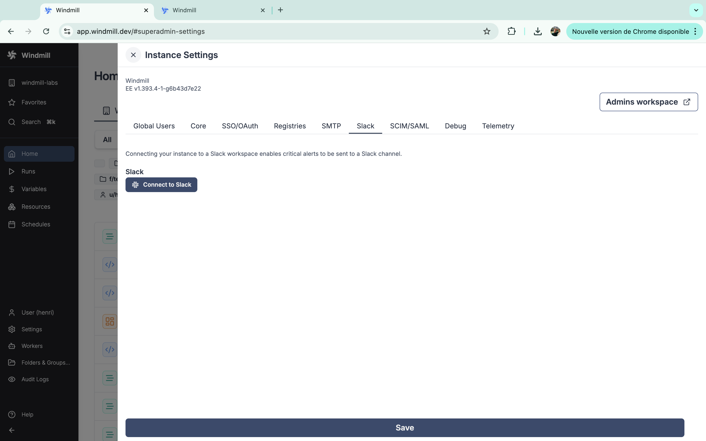

Just click on the 'Connect to Slack' button and follow the instructions from Slack.

This setting is only available on [Enterprise Edition](/pricing).

## SCIM/SAML

Windmill supports [SCIM and SAML](../../misc/14_saml_and_scim/index.md) for user provisioning and [authentication](../../core_concepts/15_authentification/index.mdx).

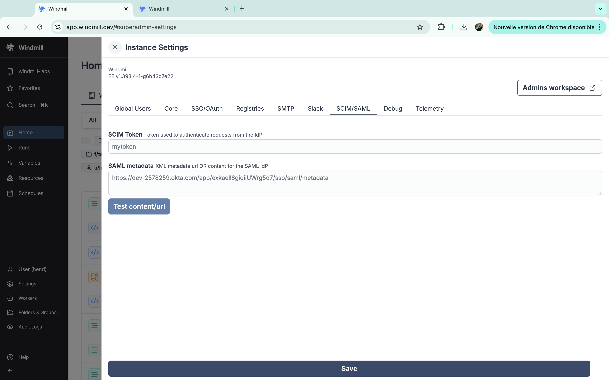

You can test settings with button 'Test content/url'.

These settings are only available on [Enterprise Edition](/pricing).

<div className="grid grid-cols-2 gap-6 mb-4">
	<DocCard
		title="SAML & SCIM"
		description="Configure Okta or Microsoft for both SAML and SCIM."
		href="/docs/misc/saml_and_scim"
	/>
</div>

### SCIM token

Token used to authenticate requests from the IdP.

### SAML metadata

XML metadata url OR content for the SAML IdP.

## Debug

Enable debug mode to see additional logs.

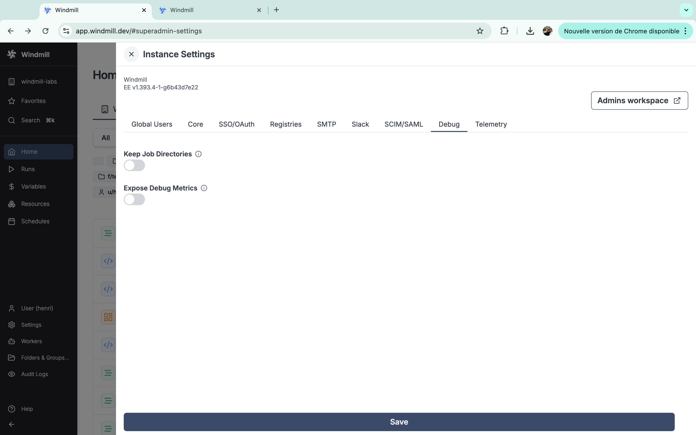

### Keep job directories

Toogle to keep Job directories after execution at `/tmp/windmill/<worker>/<job_id>`.

### Expose debug metrics

Expose additional metrics (require metrics to be enabled).

## Telemetry

Anonymous usage data is collected to help improve Windmill.

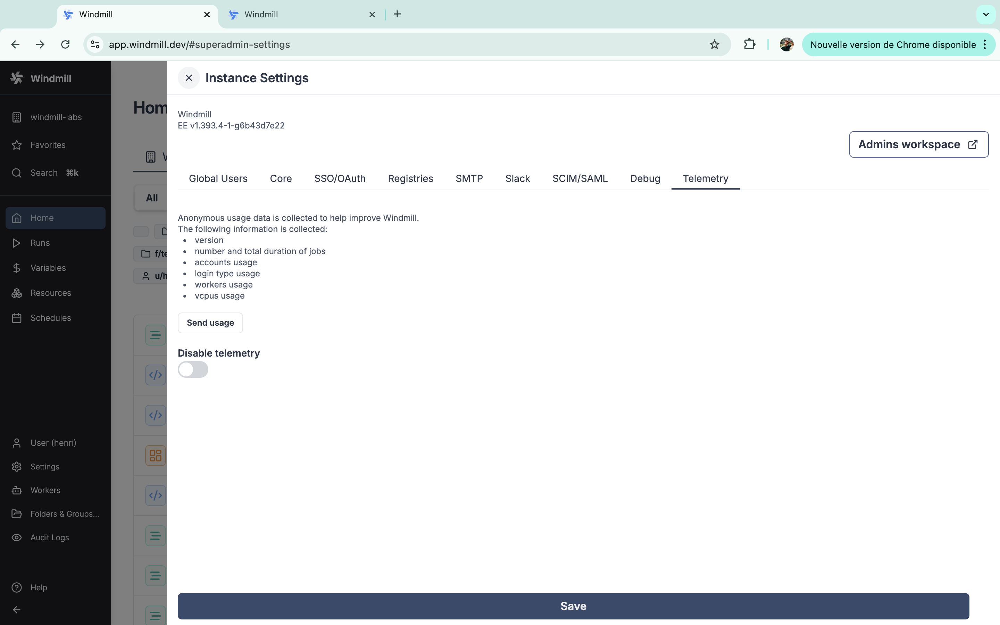

The following information is collected:
- version of your instance
- number and total duration of jobs
- accounts usage
- login type usage
- workers usage
- vCPUs usage
- memory usage

From the instance settings, you can manually send usage or disable telemetry.

Under [Enterprise Edition](/pricing) (self-hosted), telemetry (only on the ) is mandatory to ensure usage correctly matches the subscription.