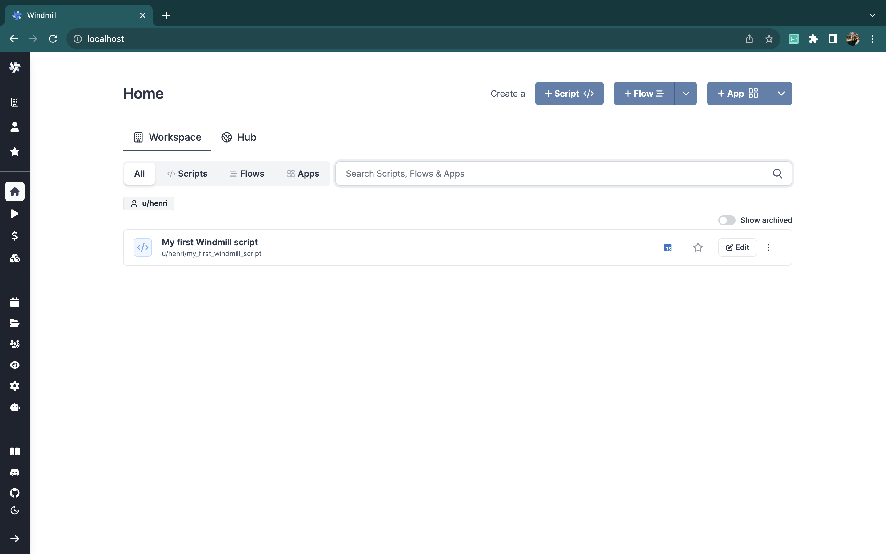
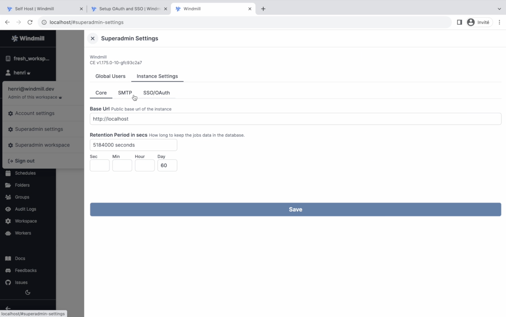
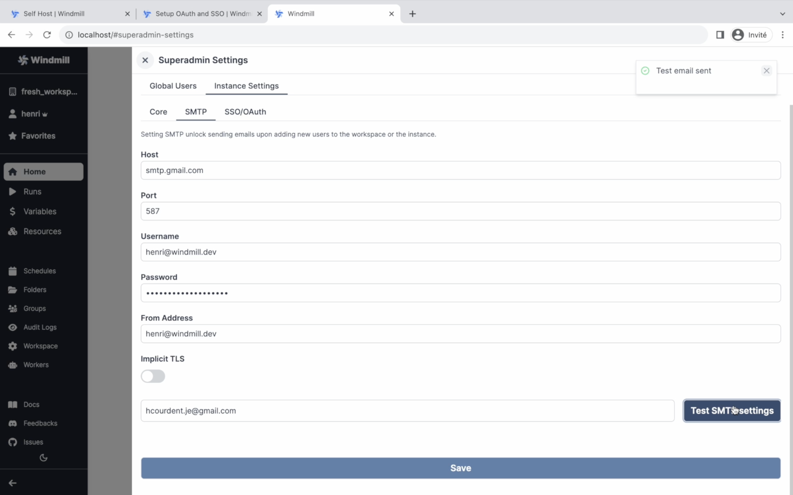

import DocCard from '@site/src/components/DocCard';

# Self Host Windmill

Self-host Windmill on your own infrastructure.

For small setups, use [Docker](#docker) and Docker Compose on a single instance.
For larger and production use-cases, use our [Helm chart](#helm-chart) to deploy on Kubernetes.



Windmill itself just requires 3 elements:

- A Postgres database, which contains the entire state of Windmill, including the job queue.
- The Windmill container run in server mode (and replicated for high availability). It serves both the frontend and the API. It needs to connect to the database and is what is exposed publicly to serve the frontend. It does not need to communicate to the workers directly.
- The Windmill container run in worker mode (and replicated to handle more job throughput). It needs to connect to the database and does not communicate to the servers.

There are 3 optional parts:

- Windmill LSP to provide intellisense on the [Monaco web Editor](../../code_editor/index.mdx).
- Windmill [Multiplayer](../../core_concepts/7_multiplayer/index.md) ([EE only](../../misc/7_plans_details/index.mdx)) to provide real time collaboration.
- A reverse proxy (caddy in our [Docker compose](#docker)) to the Windmill server, LSP and multiplayer in order to expose a single port to the outside world.

The docker-compose [below](#docker) use the 6 parts and we recommend doing TLS termination outside of the provided caddy.

## Cloud provider-specific guides

For instances with specific cloud providers requirements:
- [AWS, GCP, Azure](#aws-gcp-azure-neon)
- [Fly.io](#flyio)
- [Hetzner, Digital Ocean, Linode, Scaleway, Vultr, OVH, ...](#hetzner-digital-ocean-linode-scaleway-vultr-ovh)

If you have no specific requirements, see [Docker](#docker).

### AWS, GCP, Azure, Neon

We recommend using the [Helm chart](#helm-chart) to deploy on managed [Kubernetes](https://kubernetes.io/). But for simplified setup, simply use the docker-compose (see [below](#docker)) on a single large instance and use a high number of replicas for the worker service.

The rule of thumb is 1 worker per 1vCPU and 1/2GB of RAM. Cloud providers have managed load balancer services (ELB, GCLB, ALB) and managed database (RDS, Cloud SQL, Aurora, Postgres on Azure). We recommend disabling the db service in the docker-compose and using an external database by setting according the `DATABASE_URL` in the [.env][windmill-env] file handling environment variables.

Windmill is compatible with [AWS Aurora](https://aws.amazon.com/rds/aurora/), [GCP Cloud SQL](https://cloud.google.com/sql), [Azure](https://azure.microsoft.com/en-us) and [Neon](https://neon.tech/) serverless database.

Use the managed load balancer to point to your instance on the port you have chosen to expose in the caddy section of the docker-compose (by default 80). We recommend doing TLS termination and associating your domain on your managed load balancer. Once the domain name is chosen, set BASE_URL accordingly in `.env`. That is it for a minimal setup. Read about [Worker groups](../../core_concepts/9_worker_groups/index.mdx) to configure more finely your workers on more nodes and with different resources. Once done, be sure to setup [SSO login](../../misc/2_setup_oauth/index.md) with Azure AD, Google Workspace or Github if relevant.

:::tip AWS ECS

To be able to use the AWS APIs within Windmill on ECS containers, just whitelist the following environment variables in .env:
`WHITELIST_ENVS = "AWS_EXECUTION_ENV,AWS_CONTAINER_CREDENTIALS_RELATIVE_URI,AWS_DEFAULT_REGION,AWS_REGION"`
:::

<div class="grid grid-cols-2 gap-6 mb-4">
    <DocCard
    	title="Workers and Worker Groups"
    	description="Worker Groups allow users to run scripts and flows on different machines with varying specifications."
    	href="/docs/core_concepts/worker_groups"
    />
</div>

### Fly.io

<div class="grid grid-cols-2 gap-6 mb-4">
    <DocCard
    	title="Fly.io"
    	description="Fly.io Community-Contributed Guide."
    	href="https://dev.to/singee/deploy-windmill-on-flyio-3ii3"
      target="_blank"
    />
</div>

### Hetzner, Digital Ocean, Linode, Scaleway, Vultr, OVH, ...

Windmill works with those providers using the [Docker containers](#docker) and specific guides are in progress.

## Docker

### Setup Windmill on localhost

Self-host Windmill in less than a minute:

<video 
    className="border-2 rounded-xl object-cover w-full h-full"
    controls
    id="app-text-inline-editor"
    src="/videos/self_host.mp4"
/>

<br/>

Using [Docker](https://www.docker.com/) and [Caddy](https://caddyserver.com/), Windmill can be deployed using 4 files,
([`docker-compose.yml`][windmill-docker-compose],
[`Caddyfile`][windmill-caddyfile]), an [.env][windmill-env] and an empty oauth.json in a single command.

[Caddy][caddy] is the reverse proxy that will redirect traffic to both Windmill (port 8000) and the LSP (the monaco assistant) service (port 3001) and multiplayer service (port 3002).
Postgres holds the entire state of Windmill, the rest is fully stateless, Windmill-LSP provides editor intellisense.

Make sure Docker is started:
- Mac: `open /Applications/Docker.app`
- Windows: `start docker`
- Linux: `sudo systemctl start docker`

and type the following commands:

```
curl https://raw.githubusercontent.com/windmill-labs/windmill/main/docker-compose.yml -o docker-compose.yml
curl https://raw.githubusercontent.com/windmill-labs/windmill/main/Caddyfile -o Caddyfile
curl https://raw.githubusercontent.com/windmill-labs/windmill/main/.env -o .env
echo '{}' > oauth.json

docker compose up -d
```

Go to [http://localhost](http://localhost) et voilà!


Even if you setup oauth, login as `admin@windmill.dev` / `changeme` to setup the instance & accounts and give yourself super-admin privileges. Have them pre-filled at [http://localhost/user/login?email=admin@windmill.dev&password=changeme](http://localhost/user/login?email=admin@windmill.dev&password=changeme).

From there, you can follow the setup app to replace the superadmin account and schedule a sync of resources (by default, everyday).

### Use an external database

For more production use-cases, we recommend using the [Helm-chart](#helm-chart). However, the docker-compose on a big instance is sufficient for many use-cases.

To setup an external database, you need to set DATABASE_URL in the .env file to point your external database. You should also set the number of db replicas to 0.

:::tip

In some exotic setups, you will need to set the initial role manually. You can do so by running the following command:

```bash
curl https://raw.githubusercontent.com/windmill-labs/windmill/main/init-db-as-superuser.sql -o init-db-as-superuser.sql
psql <DATABASE_URL> -f init-db-as-superuser.sql
```

:::

### Set number of replicas accordingly in docker-compose

In the docker-compose, set the number of windmill_worker and windmill_worker_native replicas to your needs.

### Enterprise Edition

To use the [enterprise edition](../../misc/7_plans_details/index.mdx), you need to set the following environment variables in the .env file:

```
WM_LICENSE_KEY=your_license_key
```

You can then set the number of replicas of the multiplayer container to 1 in the docker-compose.

You will be provided a license key when you purchase the enterprise edition. Contact us at contact@windmill.dev to get a trial license key. Pricing is at [https://windmill.dev/pricing](https://windmill.dev/pricing). You will benefit from support, SLA and all the [additional features](../../misc/7_plans_details/index.mdx) of the enterprise edition.

### Configuring Domain and Reverse Proxy

To deploy Windmill to the `windmill.example.com` , edit the `.env` file that is used by the docker-compose file and that you have curled previously.

```bash
# .env
WM_BASE_URL=http://windmill.example.com
```

:::info

Many configuration can be done in the docker-compose.yml file. The [README](https://github.com/windmill-labs/windmill#environment-variables) contains all the variables you can pass to the workers or servers to fully customize windmill to your needs. The .env only contains the most crucial ones.

:::

Setting the `WM_BASE_URL` configures Windmill to use it as its base url. You still need to configure a reverse proxy to hit windmill and windmill-lsp on the right ports. You can use any reverse proxy as long as they behave mostly like the default provided following caddy configuration:

```
:80 {
        bind {$ADDRESS}
        reverse_proxy /ws/* http://lsp:3001
        reverse_proxy /* http://windmill_server:8000
}
```

The default docker-compose file exposes the caddy reverse-proxy on port 80 above, configured by the [caddyfile](https://raw.githubusercontent.com/windmill-labs/windmill/main/Caddyfile) curled above. Configure both the caddyfile and the docker-compose file to fit your needs. The documentation for caddy is available [here](https://caddyserver.com/docs/caddyfile).

#### Use provided Caddy to serve https

For simplicity, we recommend using an external reverse proxy such as Cloudfront or Cloudflare and point to your instance on the port you have chosen (by default, :80). However, you can also set `BASE_URL` in the docker-compose to your domain instead of `:80` and expose the `:443 ports`. See the caddy section in the docker-compose.

#### Traefik configuration

<details>
  <summary>Here is a template of a docker-compose to expose Windmill to Traefik. Code below:</summary>

```yaml
version: '3.7'

services:
windmill_server:
  image: ghcr.io/windmill-labs/windmill:main
  deploy:
    replicas: 1
  restart: unless-stopped
  expose:
    - 8000
  networks:
    - pg_network
    - web
  environment:
    DATABASE_URL: postgres://${PG_USER:-postgres}:${PG_PASS:-secretpgpassword}@${PG_HOST:-postgres}:${PG_PORT:-5432}/${PG_DATABASE:-postgres}?sslmode=disable
    BASE_URL: ${WM_BASE_URL}
    RUST_LOG: info
    ## You can set the number of workers to > 0 and not need any separate worker service
    NUM_WORKERS: 0
    DISABLE_SERVER: false
    METRICS_ADDR: false
  labels:
    - 'traefik.enable=true'
    - 'traefik.docker.network=web'
    - 'traefik.http.routers.windmill.tls=true'
    - 'traefik.http.routers.windmill.service=windmill'
    - 'traefik.http.routers.windmill.rule=Host(`windmill.your-hostname-here.com`) && PathPrefix(`/`)'
    - 'traefik.http.routers.windmill.tls.certresolver=lets-encrypt'
    - 'traefik.http.services.windmill.loadbalancer.server.port=8000'

windmill_worker:
  image: ghcr.io/windmill-labs/windmill:main
  deploy:
    # Rules of thumb, use 1 replica per vCPU. Make sure your postgres can handle 5*worker_replicas + 50*server_replicas max connections.
    replicas: 3
  restart: unless-stopped
  networks:
    - pg_network
    - web
  environment:
    DATABASE_URL: postgres://${PG_USER:-postgres}:${PG_PASS:-secretpgpassword}@${PG_HOST:-postgres}:${PG_PORT:-5432}/${PG_DATABASE:-postgres}?sslmode=disable
    BASE_URL: ${WM_BASE_URL}
    RUST_LOG: info
    NUM_WORKERS: 1
    DISABLE_SERVER: true
    KEEP_JOB_DIR: false
    DENO_PATH: /usr/bin/deno
    PYTHON_PATH: /usr/local/bin/python3
    METRICS_ADDR: false
  volumes:
    - worker_dependency_cache:/tmp/windmill/cache
    - /var/run/docker.sock:/var/run/docker.sock

lsp:
  image: ghcr.io/windmill-labs/windmill-lsp:latest
  restart: unless-stopped
  labels:
    - 'traefik.enable=true'
    - 'traefik.docker.network=web'
    - 'traefik.http.routers.windmill_lsp.tls=true'
    - 'traefik.http.routers.windmill_lsp.service=windmill_lsp'
    - 'traefik.http.routers.windmill_lsp.rule=Host(`windmill.your-hostname-here.com`) && PathPrefix(`/ws`)'
    - 'traefik.http.routers.windmill_lsp.tls.certresolver=lets-encrypt'
    - 'traefik.http.services.windmill_lsp.loadbalancer.server.port=3001'
  expose:
    - 3001

volumes:
worker_dependency_cache:

networks:
pg_network:
  name: pg_network
web:
  name: web
  external: true
```

</details>

### Deployment

Once you have setup your environment for deployment, you can run the following
command:

```bash
docker compose up
```

That's it! Head over to your domain and you should be greeted with the login
screen.

In practice, you want to run the Docker containers in the background so they don't shut down when you disconnect. Do this with the `--detach` or `-d` parameter as follows:

```bash
docker compose up -d
```

:::tip

Default e-mail is `admin@windmill.dev` and the password is `changeme`.

:::

### Update

To update to a newer version of Windmill, all you have to do is run:

```bash
docker compose pull
```

Or in case you wish to update only the Windmill image, run:

```bash
docker compose pull windmill
```

Database volume is persistent, so updating the database image is safe too.

:::tip

It is sufficient to run `docker compose up -d` again if your Docker is already running detached, since it will pull the latest `:main` version and restart the containers.
NOTE: The previous images are not removed automatically, you should also run `docker builder prune` to clear old versions.

:::

### Reset your instance

Windmill stores all of its state in PostgreSQL and it is enough to reset the database to reset the instance.
Hence, in the setup above, to reset your Windmill instance, it is enough to reset the PostgreSQL volumes. Run:

```
docker-compose down --volumes
docker volume rm -f windmill_db_data
```

and then `docker compose up`.

## Helm Chart

We also provide a convenient [Helm Chart](https://helm.sh/docs/topics/charts/)
for Kubernetes-based self-hosted set-up.

Detailed instructions can be found in the [README][helm-readme] file in the
[official repository][helm] of the chart.

:::tip

If you're familiar with Helm and want to jump right in, you can deploy quickly
with the snippet below.

```bash
# add the Windmill helm repo
helm repo add windmill https://windmill-labs.github.io/windmill-helm-charts/
# install chart with default values
helm install windmill-chart windmill/windmill  \
      --namespace=windmill             \
      --create-namespace
```

Detailed instructions in the official [repository][helm].

:::

### Enterprise deployment with Helm

The Enterprise edition of Windmill uses different base images and supports
additional features. One important feature is better caching for dependencies in a
super cache supported by S3.

You need:

- an Enterprise license key
- an AWS account and S3 bucket
- AWS credentials or IAM roles prepared for access from the Windmill worker pods.
  <br/>

See the [Helm Chart repository README][helm] [repository][helm] for more details. The exact setup
for S3 access will vary according to your environment.

## Run Windmill without using a Postgres superuser

Create the database with your non-super user as owner:

```sql
CREATE DATABASE windmill OWNER nonsuperuser
```

As a superuser, create the windmill_user and windmill_admin roles with the
proper privileges, using:

```bash
curl https://raw.githubusercontent.com/windmill-labs/windmill/main/init-db-as-superuser.sql -o init-db-as-superuser.sql
psql <DATABASE_URL> -f init-db-as-superuser.sql
```

where `init-db-as-superuser.sql` is
[this file](https://raw.githubusercontent.com/windmill-labs/windmill/main/init-db-as-superuser.sql).

Then finally, run the following commands:

```sql
GRANT windmill_admin TO nonsuperuser;
GRANT windmill_user TO nonsuperuser;
```

**NOTE: Make sure the roles `windmill_admin` and `windmill_user` have access to the database and the schema:**

You can ensure this by running the following commands as superuser while inside the database. Replace the schema
name `public` with your schema, in case you use a different one:

```sql
GRANT USAGE ON SCHEMA public TO windmill_admin;
GRANT USAGE ON SCHEMA public TO windmill_user;
```

## Self-Hosted Instance Set-up

### Complete New Windmill Set-Up

In the Admin Workspace execute the New User Setup App. This will import the default [resources types](../../core_concepts/3_resources_and_types/index.mdx) from [WindmillHub](https://hub.windmill.dev/) and update the default user credentails

### Authentication and user management

We recommend setting up [SSO with OAuth](../../misc/2_setup_oauth/index.md) if you want to avoid adding users manually.

If not using OAuth SSO, we recommend setting up SMTP to send invites and email to manually added users.

<details>
  <summary>Set-up SMTP from the `.env` file (depreciated) </summary>

The relevant environment variables are:

```
SMTP_FROM=windmill@domain.com
SMTP_HOST=smtp.gmail.com
SMTP_PORT=587
SMTP_USERNAME=email@domain.com
SMTP_PASSWORD=app_password
```

If you used the [Setup Windmill on localhost](#setup-windmill-on-localhost) method, open the `.env` file in any text editor. You can use `nano`, `vim`, or any other editor you're comfortable with.

   ```bash
   nano .env
   ```
   Append the following to the end of your `.env` file:

   ```
   SMTP_FROM=windmill@domain.com
   SMTP_HOST=smtp.gmail.com
   SMTP_PORT=587
   SMTP_USERNAME=your_email@gmail.com
   SMTP_PASSWORD=your_app_password
   ```

   Make sure to replace `your_email@gmail.com` with your actual Gmail email address and `your_app_password` with the app password you've generated from Gmail.

   <br/>

   > **Note**: If you're using Gmail, you'll need to [generate an App Password](https://support.google.com/accounts/answer/185833?hl=en) to use as `SMTP_PASSWORD`. This is a unique password that Gmail provides for apps and services that want to connect to your account.

<br/>

  Save and Close the File:

   - If using `nano`, press `CTRL + O` to save and then `CTRL + X` to exit.
   - If using `vim`, press `Esc`, then type `:wq` and press `Enter`.

Restart your Windmill application:

   - Since you've made changes to the `.env` file, you'll need to restart your Windmill application for the changes to take effect.

   ```bash
   docker compose down
   docker compose up -d
   ```

Now, your Windmill instance should use the SMTP settings you've provided to send invites and email to manually added users. Make sure the SMTP details you've provided are correct and that the Gmail account you're using has allowed less secure apps or generated an App Password.

</details>

#### Set up SMTP from the UI

<iframe
	width="560"
	height="315"
	src="https://www.youtube.com/embed/Wyq6d0bkuGo"
	title="YouTube video player"
	frameborder="0"
	allow="accelerometer; autoplay; clipboard-write; encrypted-media; gyroscope; picture-in-picture; web-share"
	allowfullscreen="true"
></iframe>

<br/>

From your self-hosted instance, click on your username and pick "Superadmin settings" and "SMTP" tab.



Fill your SMTP details.

**Note**: If you're using Gmail, you'll need to [generate an App Password](https://support.google.com/accounts/answer/185833?hl=en) to use as `SMTP_PASSWORD`. This is a unique password that Gmail provides for apps and services that want to connect to your account.

You'll be offered to "Test SMTP settings" & send a blank e-mail to a given adress.



#### Manually add user to instance

<div class="grid grid-cols-2 gap-6 mb-4">
	<DocCard
    	title="Authentification - Manually add user to instance"
    	description="As a superadmin of the instance, you have the ability to manually add users to the Windmill instance."
    	href="/docs/core_concepts/authentification#manually-add-users-to-a-windmill-instance"
    />
</div>

#### Manually add user to workspace

<div class="grid grid-cols-2 gap-6 mb-4">
	<DocCard
    	title="Authentification - Manually add user to workspace"
    	description="As an admin of the workspace, you have the ability to manually add users to the Windmill workspace."
    	href="/docs/core_concepts/authentification#adding-users-to-a-workspace"
    />
</div>

#### Set up Auto-Invites

When creating a workspace, you have the option to invite automatically everyone on the same domain. That's how you make sure that anyone added to the instance is also added to the workspace.

<video 
    className="border-2 rounded-xl object-cover w-full h-full"
    controls
    id="new_workspace"
    src="/videos/new_workspace.mp4"
/>

<br/>

> _Create a new workspace._

<br/>

<div class="grid grid-cols-2 gap-6 mb-4">
	<DocCard
    	title="Authentification - Set up auto-invite"
    	description="You can send auto-invites to the workspace to users from your domain."
    	href="/docs/core_concepts/authentification#auto-invite"
    />
</div>

### Admins Workspace

What distinguishes the admin workspace from other workspaces is that its [resource types](../../core_concepts/3_resources_and_types/index.mdx) are shared with all workspaces.

If you skipped the instance setup or need to sync resource types, you can go to the admins workspace and run the _Synchronize Hub Resource types with instance_ script, or [schedule](../../core_concepts/1_scheduling/index.md) it.


<br/>

For more advanced setups, see [Helm Chart](#helm-chart).

<!-- Resources -->

[caddy]: https://caddyserver.com/
[windmill-gh]: https://github.com/windmill-labs/windmill
[windmill-gh-frontend]: https://github.com/windmill-labs/windmill/tree/main/frontend
[windmill-gh-backend]: https://github.com/windmill-labs/windmill/tree/main/backend
[windmill-docker-compose]: https://github.com/windmill-labs/windmill/blob/main/docker-compose.yml
[windmill-caddyfile]: https://github.com/windmill-labs/windmill/blob/main/Caddyfile
[windmill-env]: https://github.com/windmill-labs/windmill/blob/main/.env
[helm]: https://github.com/windmill-labs/windmill-helm-charts
[helm-readme]: https://github.com/windmill-labs/windmill-helm-charts/blob/main/README.md