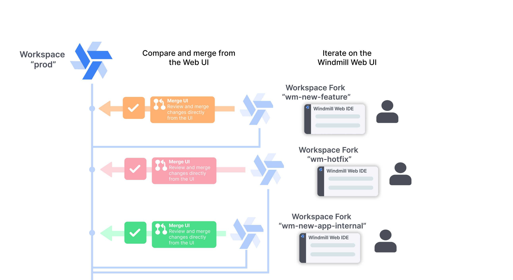
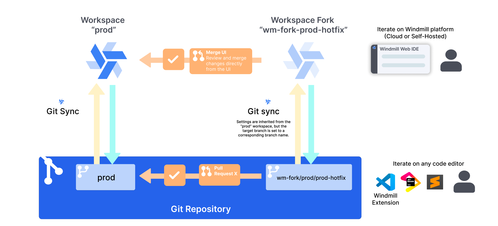

import DocCard from '@site/src/components/DocCard';

# Canonical deployment setups

This page describes three recommended deployment setups for Windmill, ordered from simplest to most advanced. These are opinionated models that provide a clear path for teams to deploy changes safely. You can follow these setups exactly or adapt them to your needs.

All setups are designed for teams that want to:
- Protect production from accidental changes
- Have a clear review process for deployments
- Enable developers to work independently without affecting production

:::info Enterprise Edition

These setups rely on features such as [Git Sync](../11_git_sync/index.mdx), [Workspace Forks](../20_workspace_forks/index.mdx), and [Protection Rulesets](../../core_concepts/56_protection_rulesets/index.mdx), which are [Cloud plans or Enterprise Self-Hosted](/pricing) features. These canonical setups might be limited for users on Community Edition.

:::

## Setup 1: UI only (simplest)

This setup keeps everything within the Windmill UI, without requiring Git. It uses a single production workspace with protection rules, and developers create forks to make changes.

<!-- Placeholder image: Diagram showing single prod workspace with fork arrows pointing to multiple developer forks, and merge arrows pointing back to prod. Show the wm_deployer group as the gatekeeper for merges. -->

### Architecture

- One production workspace (`prod`)
- [Protection rulesets](../../core_concepts/56_protection_rulesets/index.mdx) enabled to block direct edits
- A `wm_deployer` group with bypass permissions
- Developers create [workspace forks](../20_workspace_forks/index.mdx) to develop features
- Changes are merged back using the [merge UI](../20_workspace_forks/index.mdx#merge-workspaces-from-the-ui-merge-ui)

### Step-by-step setup

#### 1. Create the production workspace

Create a workspace that will serve as your production environment. Name it something clear like `prod` or `production`.

#### 2. Create the wm_deployer group

1. Navigate to the workspace settings
2. Go to the Groups section
3. Create a new group called `wm_deployer`
4. Add users who should have deployment permissions to this group

<!-- Placeholder image: Screenshot of Groups settings page showing the wm_deployer group with a few members added -->

#### 3. Enable protection rulesets

1. Navigate to **Workspace Settings** > **Protection Rulesets**
2. Click **Add Rule**
3. Enable **Disable Direct Deployment**
4. In the bypass permissions, add the `wm_deployer` group
5. Save the rule

<!-- Placeholder image: Screenshot of Protection Rulesets settings showing the "Disable Direct Deployment" rule enabled with wm_deployer group in bypass permissions -->

This configuration prevents all users from directly deploying changes, except those in the `wm_deployer` group.

### Developer workflow

1. A developer wants to make changes to a script, flow, or app
2. From the prod workspace, they create a [workspace fork](../20_workspace_forks/index.mdx) via the workspace menu
3. They make and test their changes in the forked workspace
4. When ready, they navigate to the fork's home page where a banner shows the diff with the parent workspace
5. They click **Review & Deploy Changes** to open the merge UI
6. A member of the `wm_deployer` group reviews and approves the merge

<!-- Placeholder image: Screenshot of the merge UI showing a diff between fork and parent workspace, with the "Review & Deploy Changes" button highlighted -->

### Deployer workflow

Members of the `wm_deployer` group can:

1. Review incoming changes from forks using the merge UI
2. Check the diff to understand what changed
3. Handle any conflicts (items that changed in both fork and parent)
4. Deploy the changes to the production workspace
5. Optionally, bypass protection rules to make direct emergency fixes (the bypass checkbox becomes available to them)

### Advantages

- No Git required
- Simple setup with minimal configuration
- Visual diff review in the UI
- Developers can work independently in forks
- Clear separation between development and production

### Considerations

- No external audit trail outside of Windmill
- Deployment history is tracked within Windmill only
- Less flexibility compared to Git-based workflows

	<DocCard
		title="Workspace forks"
		description="Create workspace forks for parallel development workflows"
		href="/docs/advanced/workspace_forks"
	/>
	<DocCard
		title="Protection Rulesets"
		description="Enforce governance policies that control how changes can be made"
		href="/docs/core_concepts/protection_rulesets"
	/>

## Setup 2: Git sync, 1 workspace + forks

This setup adds [Git Sync](../11_git_sync/index.mdx) to the UI-only workflow. It uses a single production workspace with forks for development, but syncs all changes to a Git repository for version control and audit trails.

<!-- Placeholder image: Diagram showing single prod workspace connected to a Git repo. Fork arrows pointing to developer forks, merge arrows back to prod, and Git sync arrows between prod and the repo. -->

### Architecture

- One production workspace (`prod`)
- [Git Sync](../11_git_sync/index.mdx) enabled to sync workspace to a Git repository
- [Protection rulesets](../../core_concepts/56_protection_rulesets/index.mdx) enabled to block direct edits
- A `wm_deployer` group with bypass permissions
- Developers create [workspace forks](../20_workspace_forks/index.mdx) to develop features
- Changes are merged back using the [merge UI](../20_workspace_forks/index.mdx#merge-workspaces-from-the-ui-merge-ui)

### Step-by-step setup

#### 1. Create the production workspace

Create a workspace that will serve as your production environment. Name it something clear like `prod` or `production`.

#### 2. Create the Git repository

Create a Git repository (GitHub, GitLab, etc.) with a `main` branch that will store your workspace content.

#### 3. Set up Git sync

Configure [Git Sync](../11_git_sync/index.mdx) for the production workspace:

1. Navigate to **Workspace Settings** > **Git Sync**
2. Click **+ Add connection**
3. Create a [git_repository](../../integrations/git_repository.mdx) resource pointing to your repository and the `main` branch
4. Save the configuration

<!-- Placeholder image: Screenshot of Git Sync settings showing the connection configured -->

#### 4. Set up CI/CD actions

Add the required GitHub Actions (or equivalent for other platforms) to enable bi-directional sync. See the [Git Sync CI/CD setup](../11_git_sync/index.mdx#setup---cicd-from-git-repository) for the required workflow files:

- `push-on-merge.yaml` - Syncs merged changes back to the workspace

#### 5. Create the wm_deployer group

1. Navigate to the workspace settings
2. Go to the Groups section
3. Create a new group called `wm_deployer`
4. Add users who should have deployment permissions to this group

#### 6. Enable protection rulesets

1. Navigate to **Workspace Settings** > **Protection Rulesets**
2. Click **Add Rule**
3. Enable **Disable Direct Deployment**
4. In the bypass permissions, add the `wm_deployer` group
5. Save the rule

### Developer workflow

1. A developer creates a [workspace fork](../20_workspace_forks/index.mdx) from the prod workspace
2. They make and test their changes in the forked workspace
3. When ready, they navigate to the fork's home page and click **Review & Deploy Changes**
4. A member of the `wm_deployer` group reviews and approves the merge
5. Changes are deployed to prod and automatically synced to Git

### Advantages

- Full Git history and audit trail
- Simple single-workspace setup
- Visual diff review in the Windmill UI
- Developers work independently in forks
- Git provides backup and version control

### Considerations

- Code review happens in Windmill UI, not Git PRs
- Single environment (no staging)
- Requires Git infrastructure and CI/CD setup

	<DocCard
		title="Git sync"
		description="Connect a Windmill workspace to a Git repository for automatic synchronization"
		href="/docs/advanced/git_sync"
	/>
	<DocCard
		title="Workspace forks"
		description="Create workspace forks for parallel development workflows"
		href="/docs/advanced/workspace_forks"
	/>

## Setup 3: Git sync, 2 workspaces + promotion (most advanced)

This setup uses Git as the source of truth with two workspaces: dev and prod. Developers use forks on the dev workspace, and changes flow to prod via Git Promotion and pull requests.

<!-- Placeholder image: Diagram showing two workspaces (dev, prod) connected to a Git repo with two branches. Dev workspace has forks. Arrows showing Git Promotion from dev branch to prod branch. CI/CD syncs changes back to workspaces. -->

### Architecture

- Two workspaces: `dev` and `prod`
- Each workspace synced to a corresponding Git branch via [Git Sync](../11_git_sync/index.mdx)
- [Git Promotion](../9_deploy_gh_gl/index.mdx) configured: `dev` promotes to `prod` branch
- Developers create [workspace forks](../20_workspace_forks/index.mdx) on the `dev` workspace
- CI/CD actions sync merged changes back to workspaces

| Workspace | Git Branch | Promotes To |
|-----------|------------|-------------|
| dev       | dev        | prod        |
| prod      | prod       | -           |

### Step-by-step setup

#### 1. Create the Git repository

Create a Git repository (GitHub, GitLab, etc.) with two branches:
- `main` or `prod` (production)
- `dev`

#### 2. Create the workspaces

Create two workspaces in Windmill:
- `prod` - Production environment
- `dev` - Development environment

#### 3. Set up Git sync for each workspace

For each workspace, configure [Git Sync](../11_git_sync/index.mdx):

1. Navigate to **Workspace Settings** > **Git Sync**
2. Click **+ Add connection**
3. Create a [git_repository](../../integrations/git_repository.mdx) resource pointing to your repository and the corresponding branch:
   - For `prod` workspace: create a resource targeting the `prod` branch
   - For `dev` workspace: create a resource targeting the `dev` branch
4. Save the configuration

<!-- Placeholder image: Screenshot of Git Sync settings showing the connection configured with the branch name matching the workspace -->

#### 4. Set up CI/CD actions

Add the required GitHub Actions (or equivalent for other platforms) to enable bi-directional sync. See the [Git Sync CI/CD setup](../11_git_sync/index.mdx#setup---cicd-from-git-repository) for the required workflow files:

- `push-on-merge.yaml` - Syncs merged changes back to the workspace
- `open-pr-on-promotion-commit.yaml` - Creates PRs for promotion branches

#### 5. Configure Git Promotion

Set up promotion targets so changes can flow from dev to prod. The promotion target requires creating a **new** [git_repository](../../integrations/git_repository.mdx) resource that points to the target branch.

For the `dev` workspace:
1. Navigate to **Workspace Settings** > **Git Sync**
2. Under the Git sync connection, click **Add promotion target**
3. Create a **new** `git_repository` resource that targets the `prod` branch (this is separate from the resource used for Git Sync)
4. Save the promotion target configuration

<!-- Placeholder image: Screenshot of Git Sync settings showing the promotion target configuration with a separate git_repository resource pointing to the prod branch -->

:::caution Separate resources required

The promotion target requires its own `git_repository` resource, distinct from the one used for Git Sync. This is because Git Sync syncs to the workspace's own branch, while Git Promotion pushes to a different branch (the target environment's branch).

:::

#### 6. Optional: Add protection rulesets

For additional safety, enable [protection rulesets](../../core_concepts/56_protection_rulesets/index.mdx) on the `prod` workspace to prevent accidental direct changes:

1. Navigate to **Workspace Settings** > **Protection Rulesets**
2. Enable **Disable Direct Deployment**
3. Add bypass permissions for a `wm_deployer` group if needed

### Developer workflow

1. A developer creates a [workspace fork](../20_workspace_forks/index.mdx) from the `dev` workspace
2. They make and test their changes in the forked workspace
3. When ready, they merge changes back to the `dev` workspace using the merge UI
4. Changes are synced to the `dev` Git branch
5. To deploy to production, they use Git Promotion from the `dev` workspace
6. A branch `wm_deploy/dev/path/to/item` is created off the `prod` branch
7. A PR is automatically created via CI/CD
8. The team reviews and merges the PR
9. CI/CD syncs the change to the `prod` workspace

### Advantages

- Full Git history and audit trail
- PR-based code review with your existing tools
- Separate dev and prod environments
- Works across Windmill instances
- Per-workspace configurations via [workspace-specific items](../3_cli/environment-specific-items.mdx)
- Developers can work independently in forks
- Maximum flexibility for development workflows

### Considerations

- Requires Git infrastructure and CI/CD setup
- More initial configuration than simpler setups
- Team needs familiarity with Git workflows

	<DocCard
		title="Git sync"
		description="Connect a Windmill workspace to a Git repository for automatic synchronization"
		href="/docs/advanced/git_sync"
	/>
	<DocCard
		title="Git Promotion workflow"
		description="Deploy across workspaces using Git branches and pull requests"
		href="/docs/advanced/deploy_gh_gl"
	/>

## Choosing between setups

| Consideration | Setup 1: UI only | Setup 2: Git sync, 1 workspace | Setup 3: Git sync, 2 workspaces |
|---------------|------------------|-------------------------------|--------------------------------|
| Complexity | Low | Medium | High |
| Git required | No | Yes | Yes |
| Environments | 1 (prod + forks) | 1 (prod + forks) | 2 (dev + prod) |
| Code review | In Windmill UI | In Windmill UI | In Git (PRs) |
| Audit trail | Windmill only | Git + Windmill | Git + Windmill |
| Multi-instance | No | No | Yes |

Choose **Setup 1: UI only** if:
- Your team prefers a simpler setup without Git
- You don't need an external audit trail
- You want to get started quickly with minimal configuration

Choose **Setup 2: Git sync, 1 workspace** if:
- You want Git version control and audit trails
- You prefer code review in the Windmill UI
- A single environment is sufficient

Choose **Setup 3: Git sync, 2 workspaces** if:
- You want maximum flexibility in your development workflow
- Your team is already using Git for code review
- You need separate dev and prod environments
- You require PR-based code review for compliance
- You're deploying across multiple Windmill instances

## Related documentation

	<DocCard
		title="Deploy to prod"
		description="Overview of all deployment methods in Windmill"
		href="/docs/advanced/deploy_to_prod"
	/>
	<DocCard
		title="Workspace forks"
		description="Create workspace forks for parallel development workflows"
		href="/docs/advanced/workspace_forks"
	/>

	<DocCard
		title="Git sync"
		description="Connect a Windmill workspace to a Git repository"
		href="/docs/advanced/git_sync"
	/>
	<DocCard
		title="Protection Rulesets"
		description="Enforce governance policies for workspace changes"
		href="/docs/core_concepts/protection_rulesets"
	/>

