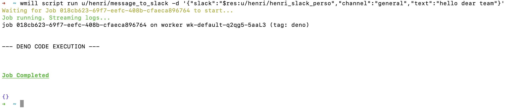

# Flows

## Listing flows

The `wmill flow` list command is used to list all flows in the remote workspace.

```bash
wmill flow
```

## Pushing a flow

Pushing a flow to a Windmill instance is done using the `wmill flow push` command.

```bash
wmill flow push <file_path> <remote_path>
```

### Arguments

| Argument      | Description                                                    |
| ------------- | -------------------------------------------------------------- |
| `file_path`   | The path to the flow file to push.                             |
| `remote_path` | The remote path where the flow specification should be pushed. |

### Examples

1. Push the flow located at `path/to/local/flow.yaml` to the remote path `f/flows/test`.

```bash
wmill flow push path/to/local/flow.yaml f/flows/test
```

## Creating a new flow

The wmill flow bootstrap command is used to create a new flow locally.

```bash
wmill flow bootstrap [--summary <summary>] [--description <description>] <path>
```

### Arguments

| Argument   | Description                          |
| ---------- | ------------------------------------ |
| `path`     | The path of the flow to be created.  |

### Examples

1. Create a new flow `f/flows/flashy_flow`

```bash
wmill flow bootstrap f/flows/flashy_flow
```

## Running a flow

Running a flow by its path s done using the `wmill flow run` command.

```bash
wmill flow run <remote_path> [options]
```

### Arguments

| Argument      | Description                     |
| ------------- | ------------------------------- |
| `remote_path` | The path of the flow to be run. |

### Options

| Option         | Parameters | Description                                                                   |
| -------------- | ---------- | ----------------------------------------------------------------------------- |
| `-d, --data`   | `data`     | Inputs specified as a JSON string or a file using @filename or stdin using @- . Resources and variables must be passed using "$res:..." or "$var:..." For example `wmill flow run u/henri/message_to_slack -d '{"slack":"$res:u/henri/henri_slack_perso","channel":"general","text":"hello dear team"}'` |
| `-s, --silent` |            | Do not ouput anything other then the final output. Useful for scripting.      |



## Update flow inline scripts lockfile

Flows inline script [lockfiles](../6_imports/index.mdx) can be also updated locally in the same way as [`wmill script generate-metadata --lock-only`](./script.md#re-generating-a-script-metadata-file) but for flows' inline scripts:

```bash
wmill flow generate-locks
```

## Flow specification

You can find the definition of the flow file structure [here](../../openflow/index.mdx).

## Remote path format

```js
<u|g|f>/<username|group|folder>/...
```
