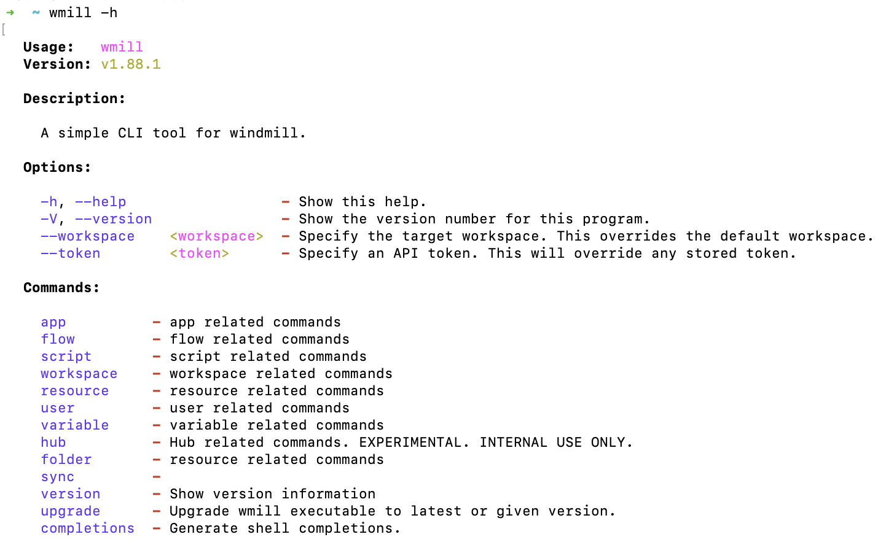

# Workspace Management

The wmill CLI is capable of handling working with many remotes & workspaces.
Each combination of remote & workspace is registered with together with a name
locally using `wmill workspace add`.

## List workspaces

`wmill workspace` will print a table of all the locally known workspaces, the
currently [selected workspace](#selected-workspace) is <ins>underlined</ins>.

## Adding a workspace

Either use the dialog using just `wmill workspace add`, or use
`wmill workspace add <name> <workspace_id> <remote_url>` or even provide a token
using `--token` to entirely skip the dialogue.

The new workspace will automatically be [switched](#switching-selection) to.

## Selected Workspace

The currently selected workspace will be used for all operations. This workspace
is <ins>underlined</ins> in the [list of workspaces](#list-workspaces).

### Switching Selection

`wmill workspace switch <name>` can be used to switch the currently selected
workspace.

## Removing a workspace

`wmill remove <name>` can be used to delete a workspace from the list of
workspaces.

:::tip Get help

At any point you can ask help with the command `-h` after a given instruction to see the list of options & commands.

Example here just using `windmill -h`:

 

:::

## Running Flows & Scripts

Run a script or flow using `wmill flow/script run u/username/path/to/script` and
pass any inputs using `--data` +  Inputs specified as a JSON string or a file using `@ <filename>` or stdin using @-.

Curl-style syntax using `-d @-` for stdin or `-d @<filename>` is also supported.

Flow Steps and Logs will be streamed during execution automatically.

## Pushing Resources, Scripts & More

The CLI can push specifications to a windmill instance. See the
[examples/](https://github.com/windmill-labs/windmill/tree/main/cli/examples) folder for formats.

## Listing

All commands support listing by just not providing a subcommand, ie
`wmill script` will result in a list of scripts. Some allow additional options,
learn about this by specifying `--help`.

## User Management

You can add & remove users via `wmill user add/remove`, and list them using
`wmill user`.