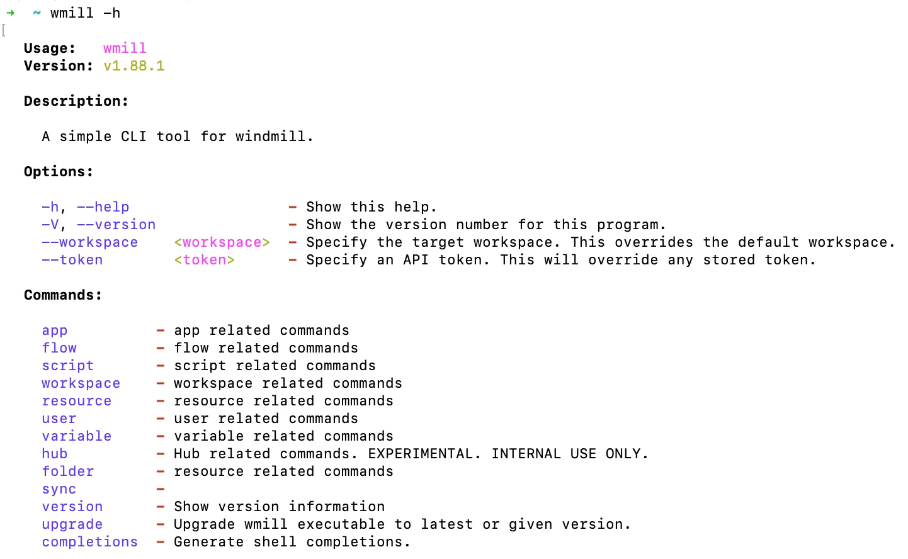

# Workspace management

Windmill CLI can be used on several workspaces from several instances.

## List workspaces

You can list all the workspaces you have access to using:

```bash
wmill workspace
```

The currently selected workspace will be <ins>underlined</ins>.

## Adding a workspace

<video
    className="border-2 rounded-xl object-cover w-full h-full"
    autoPlay
    muted
    src="/videos/cli_add_workspace.mp4"
    controls
/>
<br/>

The wmill CLI is capable of handling working with many remotes & workspaces.
Each combination of remote & workspace is registered with together with a name
locally using:

```bash
wmill workspace add [workspace_name] [workspace_id] [remote]
```

You can login to the workspace with a token or directly from browser.

The new workspace will automatically be [switched](#switch-workspaces) to.

### Arguments

| Argument         | Description                                                                                                                                                 |
| ---------------- | ----------------------------------------------------------------------------------------------------------------------------------------------------------- |
| `workspace_name` | The name of the workspace. Note: This is a name used to refer this workspace locally on your machine. It can be same or different from your remote instance |
| `workspace_id`   | The ID of the workspace.remote. The workspace ID is displayed in the switch workspace menu.                                                                 |
| `remote`         | The base URL of the Windmill installation (e.g., https://app.windmill.dev or https://your-windmill-instance.com).                                          |

### Options

| Option                    | parameter          | Description                                                                                                                                            |
| ------------------------- | ------------------ | ------------------------------------------------------------------------------------------------------------------------------------------------------ |
| `-c`, `--create`          | None               | Create the workspace if it does not exist.                                                                                                             |
| `--create-workspace-name` | `<workspace_name>` | Specify the workspace name. Ignored if `--create` is not specified or the workspace already exists. Defaults to the workspace ID.                      |
| `--create-username`       | `<username>`       | Specify your own username in the newly created workspace. Ignored if `--create` is not specified or the workspace already exists. Defaults to "admin". |

### Examples

1. Prompts for the workspace name, ID, and remote URL.

```bash
wmill workspace add
```

2. Adds a workspace with the name "MyWorkspace", ID "workspace123", and base URL of the Windmill installation "https://example.com".

```bash
wmill workspace add MyWorkspace workspace123 https://example.com
```

1. This command creates a workspace with the name "MyWorkspace2," using the provided username "john.doe."

```bash
wmill workspace add --create --create-workspace-name MyWorkspace2 --create-username john.doe
```

## Switch workspaces

The wmill workspace switch command allows you to switch to another workspace. It requires specifying the target workspace as a positional argument and performs the necessary operations to switch to that workspace. Here is the documentation for the wmill workspace switch command:

```bash
wmill workspace switch <workspace_name>
```

### Arguments

| Argument         | Description                             |
| ---------------- | --------------------------------------- |
| `workspace_name` | The name of the workspace to switch to. |

### Examples

1. Switch to the workspace named "MyWorkspace".

```bash
 wmill workspace switch MyWorkspace
```

## Selected workspace

The currently selected workspace will be used for all operations. This workspace
is <ins>underlined</ins> in the [list of workspaces](#list-workspaces).

## Removing a workspace

The `wmill workspace remove` command allows you to remove a workspace from the CLI.

```bash
wmill workspace remove <workspace_name>
```

### Arguments

| Argument         | Description                          |
| ---------------- | ------------------------------------ |
| `workspace_name` | The name of the workspace to remove. |

### Examples

1. Remove the workspace named "MyWorkspace".

```bash
wmill workspace remove MyWorkspace
```

:::tip Get help

At any point you can ask help with the command `-h` after a given instruction to see the list of options & commands.

Example here just using `windmill -h`:

<br/>



:::

## whoami

The wmill workspace whoami command allows you to display the currently active user and the active workspace.

```bash
wmill workspace whoami
```

## Managing encryption keys

All [secrets](../../core_concepts/2_variables_and_secrets/index.mdx#secrets) of a workspace are [encrypted](../../core_concepts/30_workspace_secret_encryption/index.mdx) with a symmetric key unique to that workspace. This key is generated when the workspace is created and is stored in the database in the workspace_settings.

### Encryption key during instance sync

The workspace encryption key is migrated along with the workspace. During the [push process](./sync.mdx#pushing-an-instance), you will be prompted to decide whether to re-encrypt the secrets of the workspace on the remote instance. In the case of instance migration, it is recommended to select "no" as the secrets are already encrypted with the correct key.

### Encryption key during workspace sync

When [synchronizing workspaces](./sync.mdx), the `--include-key` option should be used to ensure the encryption key is also included in the sync process. This is essential for maintaining the security and integrity of encrypted data as it moves between environments.

This option prompts you to confirm if the encryption key should be replaced or retained. Make an informed choice based on whether the destination environment requires a new key or should continue using the existing key.